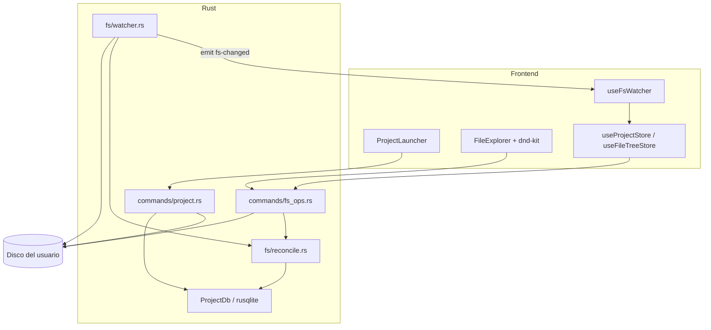
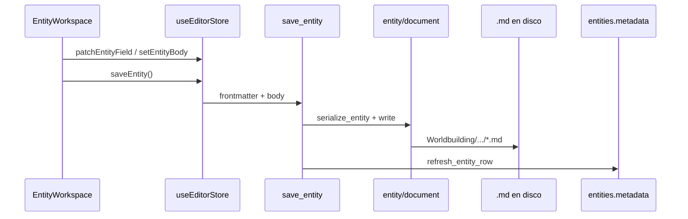
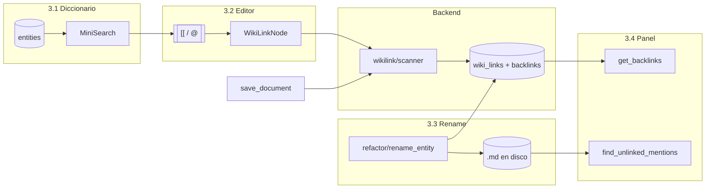
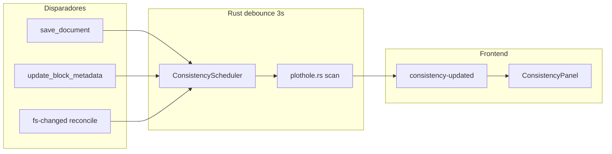
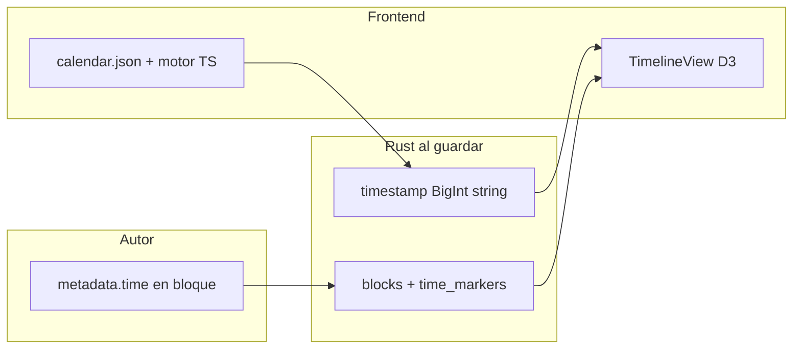
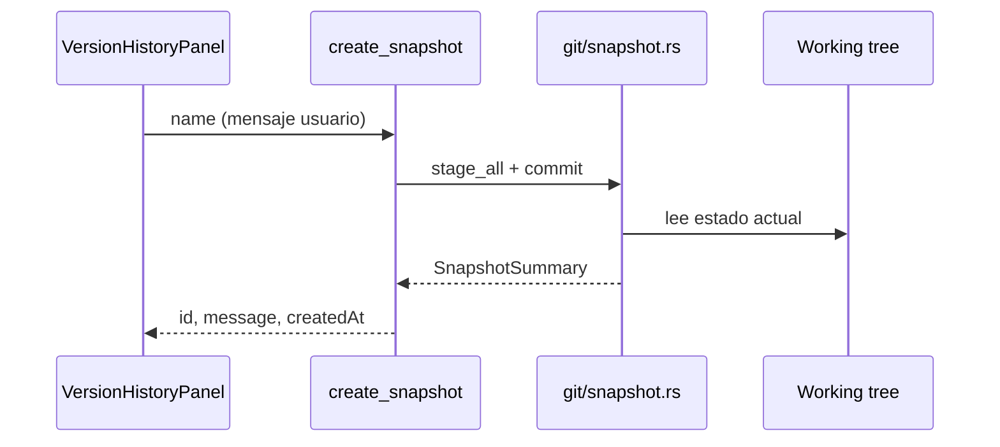
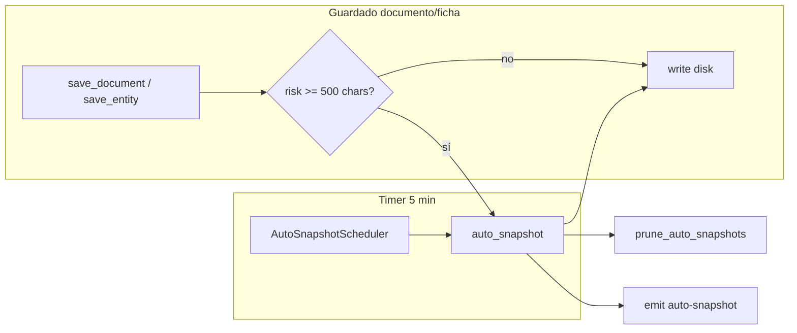
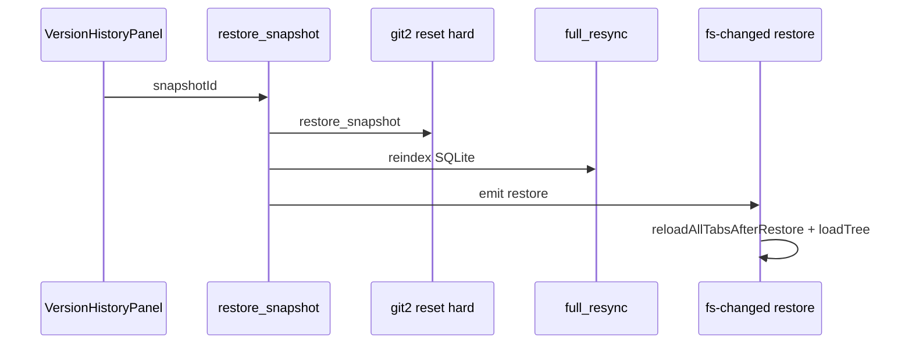
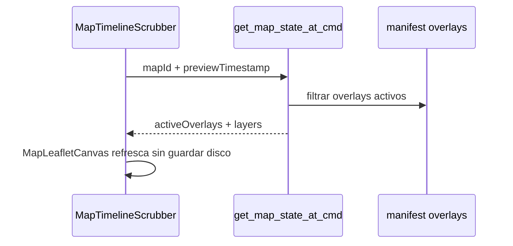

# 🏗️ Arquitectura y Estructura del Proyecto

## 📖 Propósito de este Documento
Mapa oficial del repositorio: directorios, archivos clave y responsabilidad de cada módulo.

> 🛑 Actualizar este archivo al añadir carpetas o módulos estructurales.

---

## 📂 Árbol de Directorios Principal

```
NarraLith/
├── _docs/                    # Planificación (excluido del binario vía .taurignore)
├── src/                      # Frontend React + TypeScript
│   ├── components/
│   │   ├── ui/               # Componentes Shadcn/UI (button, …)
│   │   └── workspace-ui/     # UI presentacional reutilizable (paneles, filtros, calendario)
│   │       ├── tokens.ts     # Clases Tailwind de paneles laterales
│   │       ├── calendar/     # Leyenda, rejilla de meses, cabecera de año
│   │       └── index.ts      # Barrel: @/components/workspace-ui
│   ├── hooks/
│   │   └── useFsWatcher.ts   # listen('fs-changed') → useFileTreeStore
│   ├── i18n/
│   │   ├── config.ts         # Instancia i18next (dev: es, prod fallback: en)
│   │   ├── en/global.json
│   │   ├── en/project.json
│   │   ├── en/explorer.json
│   │   ├── es/global.json
│   │   ├── es/project.json
│   │   └── es/explorer.json
│   ├── lib/
│   │   ├── ipc.ts            # invoke + AppError
│   │   ├── types/
│   │   │   ├── models.ts     # Contratos TS (IPC ↔ Rust)
│   │   │   ├── project.ts
│   │   │   ├── fs.ts         # FileTreeNode, FsChangeEvent, ExplorerViewMode
│   │   │   ├── editor.ts     # ParsedDocument, ParsedBlock, BlockMetadata
│   │   │   └── index.ts
│   │   └── utils.ts          # cn() — utilidades Shadcn
│   ├── modules/
│   │   ├── calendar/         # CalendarWorkspace (lógica); UI en workspace-ui
│   │   ├── editor/           # EditorCanvas, Lexical, plugins, MetadataInspector
│   │   ├── explorer/         # FileExplorer, FileTreeItem, menú y diálogos CRUD
│   │   ├── layout/           # WorkspaceShell, GlobalNav
│   │   ├── timeline/         # TimelineView; filtros vía TimelineFiltersSection
│   │   └── project/          # ProjectLauncher, CreateProjectDialog
│   ├── stores/
│   │   ├── useAppStore.ts    # Estado global base (Zustand)
│   │   ├── useProjectStore.ts
│   │   ├── useFileTreeStore.ts
│   │   ├── useEditorStore.ts
│   │   └── index.ts
│   ├── lib/editor/
│   │   └── documentSync.ts   # hydrate / extract bloques Lexical
│   ├── styles/
│   │   └── globals.css       # Tema oscuro + Tailwind + Shadcn
│   ├── App.tsx
│   └── main.tsx
├── src-tauri/                # Backend Rust / Tauri
│   ├── .taurignore           # Excluye _docs/ del empaquetado
│   ├── capabilities/
│   │   └── default.json      # Permisos: core, opener, sql
│   ├── src/
│   │   ├── commands/
│   │   │   ├── project.rs    # create/open/close + recents
│   │   │   ├── fs_ops.rs     # list_dir_tree + CRUD explorador
│   │   │   ├── editor.rs     # read/parse/save_document
│   │   │   └── mod.rs
│   │   ├── editor/           # risk.rs (stub snapshots Fase 5)
│   │   │   └── mod.rs
│   │   ├── db/
│   │   │   ├── blocks.rs     # persistencia blocks / time_markers
│   │   │   ├── connection.rs # ProjectDb (rusqlite por proyecto)
│   │   │   ├── migrations/
│   │   │   ├── mod.rs
│   │   │   └── schema.sql    # DDL v1
│   │   ├── fs/
│   │   │   ├── adopt.rs      # Proyecto adoptado sin .narralith
│   │   │   ├── crud.rs       # create/rename/move/delete (validación bajo root)
│   │   │   ├── paths.rs      # resolve_under_root, validate_name
│   │   │   ├── reconcile.rs  # FS → SQLite (ghost, rename, upsert)
│   │   │   ├── tree.rs       # list_dir_tree + filtros de vista
│   │   │   ├── taxonomy.rs   # taxonomy.json → colores de carpetas
│   │   │   ├── watcher.rs    # notify + debounce → fs-changed
│   │   │   ├── indexer.rs    # Indexación ligera .md → entities
│   │   │   ├── recents.rs    # recents.json en AppData
│   │   │   ├── scaffold.rs
│   │   │   ├── templates.rs
│   │   │   └── mod.rs
│   │   ├── parser/           # split +++ , YAML, serialize (Fase 2.1)
│   │   │   ├── block_splitter.rs
│   │   │   ├── frontmatter.rs
│   │   │   ├── serializer.rs
│   │   │   ├── document.rs
│   │   │   └── types.rs
│   │   ├── git/init.rs       # git init oculto (Fase 1)
│   │   ├── state/project.rs  # ProjectState (sesión activa)
│   │   ├── models/
│   │   ├── error.rs
│   │   ├── lib.rs
│   │   └── main.rs
│   ├── resources/
│   │   ├── templates/        # standard.json, blank.json
│   │   └── defaults/         # taxonomy.json, gitignore.txt
│   ├── Cargo.toml
│   └── tauri.conf.json
├── components.json           # Configuración Shadcn/UI
├── eslint.config.js
├── tailwind.config.js
├── vite.config.ts            # Alias `@/` → `./src`
└── package.json
```

---

## UI del workspace (`src/components/workspace-ui/`)

Capa **presentacional** (sin stores ni IPC). Los módulos de features (`modules/calendar`, `modules/timeline`, …) conservan la lógica y componen estos bloques.

| Export | Uso |
|--------|-----|
| `tokens` (`panelSectionClass`, `panelInputClass`, `panelTextareaClass`, …) | Formularios de paneles laterales (calendario, manuscrito) |
| `WorkspaceRightPanel` | Shell del panel derecho (280px, header/scroll/footer) |
| `TimelineFiltersSection` | Filtros manuscrito/eventos/anuales — **única** implementación (calendario + línea de tiempo) |
| `PanelSectionHeader`, `PanelIconToggle` | Secciones colapsables del editor de calendario |
| `PanelAccordionTrigger`, `PanelDraftFooter` | Acordeón «Editar calendario» y acciones Guardar/Descartar |
| `calendar/*` | `CalendarLegend`, `MonthOverviewCard`, `MonthDayCell`, `CalendarYearHeader`, `YearJumpStrip`, … |
| `manuscript/ManuscriptEventCard` | Tarjeta placeholder de etiqueta de evento (panel lateral del editor) |

**Editor — panel lateral manuscrito:** `EditorSidePanel` → `SideEventSection` (eventos, placeholder) + `SideTimeSection` (calendario / tiempo) en `src/modules/editor/sidePanel/`.

Import: `import { … } from "@/components/workspace-ui"`.

---

## 🔄 Flujo de Datos (Fase 1)



- El frontend **no** accede a SQLite ni al FS directamente (ni `std::fs` vía plugins).
- Los errores Rust devuelven `AppError { key }` para traducción en UI (`explorer.error.fs.*`).
- **FS = fuente de verdad**; SQLite en `.narralith/index.db` es caché.
- Cambios externos en disco: watcher → reconciliación → evento `fs-changed` → `loadTree()`.
- CRUD y drag & drop del explorador: siempre `move_path` / demás comandos en `fs_ops.rs`.

---

## 🗄️ Esquema SQLite (v2)

Ubicación por proyecto: `{proyecto}/.narralith/index.db`.  
Gestor: `src-tauri/src/db/connection.rs` (`ProjectDb` + `rusqlite`).  
Migraciones: `schema.sql` (v1) + `migrations/002_entity_status.sql` (columna `entities.status`).

| Tabla | Propósito |
|-------|-----------|
| `project_meta` | Clave-valor de metadatos del proyecto |
| `entities` | Diccionario interno (nombre, ruta, categoría, aliases) |
| `blocks` | Bloques `+++` parseados por archivo |
| `wiki_links` | Enlaces `[[ ]]` origen → destino |
| `backlinks` | Menciones inversas hacia una entidad |
| `time_markers` | Marcas temporales de bloques/entidades |
| `graph_edges` | Aristas del grafo de conocimiento |

DDL completo: `src-tauri/src/db/schema.sql`.

---

## 📦 Contratos IPC (TypeScript ↔ Rust)

| TypeScript (`src/lib/types/models.ts`) | Rust (`src-tauri/src/models/`) |
|----------------------------------------|--------------------------------|
| `ProjectMeta` | `project::ProjectMeta` |
| `Entity`, `EntityCategory` | `entity::Entity`, `EntityCategory` |
| `Block` | `block::Block` |
| `ParsedDocument`, `ParsedBlock` | `parser::types` |
| `WikiLink` | `wiki_link::WikiLink` |
| `TimeMarker` | `time_marker::TimeMarker` |
| `GraphNode`, `GraphEdge` | `graph::GraphNode`, `GraphEdge` |

Serialización: `#[serde(rename_all = "camelCase")]` en Rust.

---

## 🌐 Internacionalización

| Entorno | Locale activo | Fallback |
|---------|---------------|----------|
| Desarrollo (`import.meta.env.DEV`) | `es` | `en` |
| Producción | `en` | — |

Namespaces: `global`, `project`, `explorer`, `editor`, `settings`, `references`, `worldbuilding` (`src/i18n/{en,es}/*.json`). Preferencias de editor en `localStorage` (`useSettingsStore`).

### Comandos IPC — Proyecto (Fase 1.1)

| Comando | Descripción |
|---------|-------------|
| `create_project` | Scaffold + sesión + recents |
| `open_project` | Abre/adopta carpeta + indexación + recents + watcher |
| `close_project` | Cierra DB, watcher y sesión |
| `get_active_project` | `ProjectMeta` o `null` |
| `list_recent_projects` | Rutas en AppData (máx. 10) |
| `remove_recent_project` | Quita entrada de recents |

### Comandos IPC — Explorador (Fase 1.3)

| Comando | Args (camelCase) | Descripción |
|---------|------------------|-------------|
| `list_dir_tree` | `filterMode`: `all` \| `manuscript` \| `worldbuilding` | Árbol recursivo con colores taxonómicos. `manuscript` → solo `Manuscrito/`; `worldbuilding` → solo `Worldbuilding/`; `all` → raíz completa (incluye `Imagenes/`) |
| `get_taxonomy_colors` | — | Mapa ruta → color desde `.narralith/taxonomy.json` |
| `create_folder` | `parentPath`, `name` | Carpeta bajo proyecto |
| `create_file` | `parentPath`, `name` | `.md` con frontmatter vacío + `entities` |
| `rename_path` | `path`, `newName` | Renombrar archivo/carpeta |
| `move_path` | `sourcePath`, `destParentPath` | Mover (drag & drop) |
| `delete_path` | `path`, `force` | Borrar; carpetas no vacías exigen `force: true` |

Evento Tauri: `fs-changed` — payload `{ kind, paths[] }` (ver `src/lib/types/fs.ts`).

### Comandos IPC — Referencias / Diccionario (Fase 3.1)

| Comando | Args (camelCase) | Descripción |
|---------|------------------|-------------|
| `list_entities_for_search` | — | Lista `entities` activas (`id`, `name`, `path`, `category`, `aliases`) para MiniSearch |
| `get_backlinks` | `entityPath` | Filas `backlinks` por `entity_path` (snippet, bloque, origen) |
| `find_unlinked_mentions` | `entityName`, `entityPath`, `limit?` | Menciones en texto plano (case-insensitive), excluye `[[…]]` |
| `convert_unlinked_mention` | `sourcePath`, `blockIndex`, `start`, `end`, `entityName` | Envuelve mención en `[[nombre]]` y reindexa |

**Frontend:** `useEntitySearchStore`, `useEntitySearch`, `lib/search/entityIndex.ts`. Reindexa al abrir proyecto y en `fs-changed`.

**Panel referencias (Fase 3.4):** `EditorSidePanel` pestañas Metadatos | Referencias; `BacklinksPanel` + `useReferencesData` (refresco al guardar / cambiar archivo).

**Aliases en disco:** frontmatter de archivo (bloque inicial `---`), campo YAML `aliases` (array o lista separada por comas). Indexado en `fs/entity_aliases.rs` al escanear `.md`.

### Fichas de entidad (Fase 4.1)

| Capa | Módulos |
|------|---------|
| **Plantillas** | `src-tauri/resources/entity_templates/*.yaml`, `.narralith/template_map.json`, overrides `.narralith/entity_templates/` |
| **Rust** | `src-tauri/src/entity/` (`template`, `registry`, `document`, `metadata_index`, `path_rules`), `commands/entity.rs` |
| **Frontend** | `modules/worldbuilding/` (`EntityFormRenderer`, `EntityWorkspace`, `CreateEntityDialog`), `useEditorStore` pestañas `kind: manuscript \| entity` |

**Formato en disco:** un frontmatter YAML de documento + cuerpo libre (sin `+++`). Manuscrito sigue usando bloques `+++` y Lexical.

| Comando | Descripción |
|---------|-------------|
| `list_entity_templates` | Resumen de plantillas bundled |
| `get_entity_template` | Schema YAML por `templateId` |
| `resolve_template_for_path` | `templateId` por ruta relativa |
| `read_entity` / `save_entity` | Cargar / persistir ficha |
| `create_entity` | Crear `.md` con frontmatter inicial bajo `Worldbuilding/` |
| `get_entity_timeline` | Menciones en manuscrito con `time` (`entity/timeline.rs`) |
| `get_location_inhabitants` | Entidades que referencian una ubicación (`entity/inhabitants.rs`) |

Migración DB v3: columna `entities.metadata` (JSON).

**Plantillas Fase 4.2–4.3:** `features: [timeline]` (personaje) e `[inhabitants]` (ubicación). Tipos de campo: `select`, `keyValue`, `nested`, `relation` con `multiple: true`. Preferencias UI por plantilla: `useTemplatePrefsStore` (localStorage, ámbito proyecto).

| Carpeta (scaffold estándar) | `templateId` | YAML |
|-----------------------------|--------------|------|
| `Worldbuilding/Personajes/**` | `character` | `character.yaml` |
| `Worldbuilding/Ubicaciones/**` | `location` | `location.yaml` |
| `Worldbuilding/Lore_y_Mitos/**` | `lore` | `lore.yaml` |
| `Worldbuilding/Facciones/**` | `faction` | `faction.yaml` |
| `Worldbuilding/Sistemas_de_Poder/**` | `power_system` | `power_system.yaml` |
| `Naturaleza/Bestiario_y_Fauna/**` | `creature` | `creature.yaml` |
| `Naturaleza/Flora_y_Hongos/**` | `flora` | `flora.yaml` |
| `Naturaleza/Fenomenos_y_Clima/**` | `phenomenon` | `phenomenon.yaml` |
| `Naturaleza/Geologia_y_Minerales/**` | `geology` | `geology.yaml` |
| `Naturaleza/Cosmologia_y_Astros/**` | `cosmology` | `cosmology.yaml` |
| `Naturaleza/Materiales_Naturales_y_Derivados/**` | `material` | `material.yaml` |
| `Naturaleza/Biomas_y_Ecosistemas/**` | `biome` | `biome.yaml` |
| `Naturaleza/**` (resto) | `nature` | `nature.yaml` |
| `Objetos…/Reliquias…/**` | `artifact` | `artifact.yaml` |
| `Objetos…/Armas…/**` | `weapon` | `weapon.yaml` |
| `Objetos…/Vehiculos…/**` | `vehicle` | `vehicle.yaml` |
| `Objetos…/Consumibles…/**` | `consumable` | `consumable.yaml` |
| `Objetos…/**` | `object` | `object.yaml` |
| `Sociedad…/Civilizaciones…/**` | `civilization` | `civilization.yaml` |
| `…/Sistemas_Politicos…/**` | `politics` | `politics.yaml` |
| `…/Economia…/**` | `economy` | `economy.yaml` |
| `…/Religiones…/**` | `religion` | `religion.yaml` |
| `…/Idiomas…/**` | `language` | `language.yaml` |
| `Sociedad…/Cultura_Diaria/**` | `culture` | `culture.yaml` |
| `Sociedad…/**` | `society` | `society.yaml` |
| Sin regla | `custom` | `custom.yaml` |

Reglas en `resources/defaults/template_map.json` (copiado al scaffold como `.narralith/template_map.json`).

### Vista de tarjetas y metadatos de carpeta (Fase 4.4)

| Capa | Módulos |
|------|---------|
| **Backend** | `src-tauri/src/fs/folder_meta.rs` — `.folder.md` (frontmatter + cuerpo) |
| **Frontend** | `modules/explorer/CardView.tsx`, `FolderCard.tsx`, `FolderDescriptionDialog.tsx` |
| **Estado** | `useFileTreeStore`: `explorerLayout` (`tree` \| `cards`), `cardPath`; persistencia layout en `localStorage` |

| Comando | Descripción |
|---------|-------------|
| `get_folder_meta` | Lee `{dir}/.folder.md` → `description`, `imagePath?`, `title?` |
| `set_folder_description` | Crea/actualiza `.folder.md`; emite `fs-changed` |
| `count_entities_in_tree` | Fichas activas bajo prefijo (recursivo, SQLite `entities.path LIKE`) |

El archivo `.folder.md` está en `HIDDEN_NAMES` del árbol (`fs/tree.rs`). Conteo recursivo para badge en tarjeta; sin caché aparte — se invalida con `revision` del explorador tras `fs-changed`.

**Toggle:** solo en `viewMode === worldbuilding` (Manuscrito mantiene árbol).

### Flujo guardado de ficha (Fase 4)



### Wiki-links (Fase 3.2)

| Capa | Módulos |
|------|---------|
| **Disco** | Sintaxis `[[target]]` / `[[target\|alias]]` en cuerpos de bloque (sin cambio de formato) |
| **Lexical** | `WikiLinkNode`, `wikiLinkHydrate.ts`, `documentSync.ts` (round-trip) |
| **UI** | `WikiLinkTypeaheadPlugin` (`[[`, `@`), `WikiLinkClickPlugin` → `requestOpenDocument` |
| **Rust** | `wikilink/scanner.rs`, `db/wiki_links.rs` — `sync_wiki_links_for_file` en `parse_file_and_persist` / watcher |

Resolución de `target_path`: nombre o alias contra `entities` activas. `target_path` NULL en SQLite = link no resuelto; en UI clase `narra-wikilink-unresolved`.

### Auto-refactor al renombrar entidad (Fase 3.3)

Al renombrar un `.md` cuyo **stem** cambia (`rename_path` o watcher `Rename`):

1. `refactor/rename_entity.rs` — escaneo paralelo (`rayon`) de todos los `.md`; sustituye `[[NombreAntiguo]]` y `[[NombreAntiguo|alias]]`.
2. Escritura atómica (`.nombre.md.narralith-tmp` + `rename`); rollback si falla.
3. `reconcile::rename_paths` actualiza `entities`, `wiki_links` (source/target), `backlinks`.
4. `emit_fs_changed` (`rename`, `paths[0]` = ruta nueva, `fromPath`) → editor remapea pestaña y recarga contenido.

El nombre canónico de entidad es el **stem del archivo** (coherente con `01-REQUIREMENTS` § auto-refactorización).

### Flujo de referencias (Fase 3)



**Errores IPC (referencias):** `error.references.*`, `error.refactor.invalid_path` — namespace i18n `references` (`normalizeReferencesErrorKey`).

### Comandos IPC — Editor / Parser (Fase 2.1)

| Comando | Args (camelCase) | Descripción |
|---------|------------------|-------------|
| `read_document` | `filePath` | Lee `.md`, parsea `+++`/YAML, persiste `blocks` + `time_markers`, devuelve `ParsedDocument` |
| `parse_document` | `filePath` | Igual que `read_document` en 2.1 (reparseo bajo demanda) |
| `save_document` | `filePath`, `blocks[]` | Serializa `+++`/YAML, escribe disco, reindexa SQLite |
| `update_block_metadata` | `filePath`, `blockIndex`, `metadata` | Actualiza solo frontmatter del bloque; cuerpos intactos; reindexa SQLite |

**Formato en disco:** bloque 0 con frontmatter opcional; bloques siguientes precedidos de línea `+++`. Ver `parser/mod.rs` y `01-REQUIREMENTS.md` § Estructura narrativa granular.

**Inspector (Fase 2.3):** `MetadataInspector` edita `time`, `location`, `event`, `characters`, `tags` con debounce 300 ms. Si `isDirty`, guarda el cuerpo antes de `update_block_metadata`. Cambios solo en metadata no re-hidratan Lexical; recarga externa (`fs-changed`) usa `documentSyncKey` + diálogo si hay cambios locales.

**UI editor (Fase 2.2+):** Pestañas multi-archivo (`EditorTabBar`), guardado manual (Ctrl+S), autoguardado desactivado por defecto (`SettingsDialog` + `useSettingsStore`). Estado sucio por huella de contenido, no por foco/selección.

**Errores IPC:** `error.editor.*`, `error.parser.invalid_yaml` (por bloque → `parseErrorKey` en el nodo); referencias → ver § Flujo de referencias.

### Comandos IPC — Versiones (Fase 5.1–5.3)

| Comando | Args (camelCase) | Descripción |
|---------|------------------|-------------|
| `create_snapshot` | `name` | Snapshot manual con mensaje del usuario; devuelve `SnapshotSummary` |
| `list_snapshots` | `includeAuto?`, `limit?` | Historial descendente; oculta `narralith:init` y autos salvo `includeAuto: true` |
| `restore_snapshot` | `snapshotId` | Restaura árbol al OID (`reset --hard`); `full_resync` SQLite; emite `fs-changed` `{ kind: "restore" }` |
| `auto_snapshot` | — | Snapshot automático si hay cambios; poda según `autoRetention`; devuelve `null` si limpio |
| `get_file_diff` | `relativePath`, `snapshotIdA?`, `snapshotIdB?` | Diff por palabras (`similar`); A = versión antigua, B omitido = disco actual; máx. 10k palabras |
| `get_versioning_config` / `set_versioning_config` | `config` | Lee/escribe `.narralith/versioning.json` |

**Config:** `{ "autoRetention": 50, "autoIntervalMinutes": 5 }` — creada en scaffold/adopt/open.

**Backend:** `git/snapshot.rs` (manual + auto + poda por replay de árboles), `git/diff.rs`, `git/auto_scheduler.rs` (hilo en `ProjectState::open_session`), `editor/risk.rs` (umbral 500 chars → `auto_snapshot_if_risky_delete` en save).

**Eventos:** `auto-snapshot` `{ createdAt }` tras backup periódico; `useAutoSnapshotIndicator` en barra del workspace.

**Frontend:** `VersionHistoryPanel` (comparar / restaurar / toggle autos), `DiffViewer` (chunks equal/add/remove, copiar texto eliminado, enlace a restaurar proyecto completo).

**Errores IPC:** `error.snapshot.*`, `error.git.*` — namespace i18n `versions` (`versionErrorKey`); mensajes de usuario sin jerga Git.

---

## 📅 Fase 6 — Motor temporal (v0.7.0 — en curso)

> Detalle de tareas: `04-TASK.md`. Requisitos: `01-REQUIREMENTS.md`. Stack: `02-TECH_STACK.md` §11.

### Formato de fecha MVP (`metadata.time`)

| Formato | Ejemplo | Notas |
|---------|---------|--------|
| `día.mes.año` | `14.3.1024` | Mes **1-indexado**; año puede ser negativo |
| Etiquetas especiales | `mythic`, `unknown`, `?` | Ordenan al final (`MYTHIC_SORT_KEY` / `UNKNOWN_SORT_KEY`) |

El motor TypeScript (`src/lib/calendar/engine.ts`) convierte fechas válidas a `BigInt` absoluto desde `epoch` en `calendar.json`. Rust **no** parsea calendario: el frontend envía `timeTimestamp` (string decimal) en `save_document` / `update_block_metadata`.

### Datos existentes

| Fuente | Uso en Fase 6 |
|--------|----------------|
| `blocks.metadata.time` | Texto libre del autor en YAML del bloque |
| `time_markers` | `raw_time` + `timestamp` (BigInt serializado como string) |
| `get_entity_timeline` | Timeline **por ficha** — orden numérico por `timestamp` |
| `get_timeline_events` | Timeline **global** del proyecto |
| `Manuscrito/Escenas_Paralelas/` | Flag `isParallel` en consultas globales |

### Módulos implementados (6.1–6.2)

| Capa | Ruta / comando |
|------|----------------|
| Config | `.narralith/calendar.json`, `get_calendar_config`, `set_calendar_config` |
| FS | `src-tauri/src/fs/calendar_config.rs`, default `resources/defaults/calendar.json` |
| Motor | `src/lib/calendar/*` (TypeScript + BigInt, Vitest) |
| Store | `useCalendarStore`, sección en `SettingsDialog` |
| Timeline global | `get_timeline_events`, `src/modules/timeline/TimelineView.tsx` (D3) |
| Plothole | `checker/plothole.rs`, `ConsistencyScheduler`, `ConsistencyPanel`, evento `consistency-updated` |
| Inspector | `MiniTimelinePreview` en `MetadataInspector` |
| Descartes | `.narralith/dismissed_issues.json` |

### Matriz `raw_time` vs `timestamp`

| Campo | Uso |
|-------|-----|
| `raw_time` | Texto del autor en YAML (`metadata.time`); etiqueta visible en UI |
| `timestamp` | Orden global: string decimal del BigInt calculado en frontend al guardar |

### Flujo — plothole en background



*Comandos IPC Fase 6:* `get_calendar_config`, `set_calendar_config`, `get_timeline_events`, `get_consistency_issues`, `dismiss_consistency_issue`.

### Flujo previsto — de metadata a línea de tiempo



*Tareas 6.1–6.4 archivadas en `04-TASK.md`. Comandos IPC y diagramas: ver sección inferior.*

**Visibilidad `.git`:** el explorador y el indexador omiten `.git` (`HIDDEN_NAMES` en `fs/tree.rs`, `SKIP_DIRS` en `fs/indexer.rs` y `fs/reconcile.rs`, `FORBIDDEN_SEGMENTS` en `fs/paths.rs`). La UI no expone rutas bajo `.git/`.

#### Flujo — guardar versión manual



#### Flujo — autoguardado y borrado masivo



#### Flujo — restaurar versión completa



---

## Fase 7 — Mapas interactivos (v0.8.0)

> **Estado:** ✅ cerrada — tareas en **`05-CHANGELOG.md` § v0.8.0**.

### Árbol en disco

```
.narralith/maps/
  index.json
  {mapId}/
    manifest.json       # imagen base, overlays temporales
    layers.json         # capas + features (pin | polygon)
    sketches/
      default.excalidraw.json
Imagenes/Mapas_y_Geografia/   # imágenes importadas
```

### IPC

| Comando | Rol |
|---------|-----|
| `list_project_maps` | Catálogo de mapas |
| `get_map_data_cmd` | Manifest + layers |
| `save_map_data_cmd` | Persistir geometría y overlays |
| `create_map_cmd` | Nuevo mapa con imagen |
| `import_map_image_cmd` | Reemplazar imagen base |
| `import_overlay_image_cmd` | Imagen para capa histórica |
| `get_map_state_at_cmd` | Vista mergeada en un timestamp |
| `get_map_sketch_cmd` | Cargar boceto Excalidraw |
| `save_map_sketch_cmd` | Guardar boceto (no indexa en SQLite) |

### Módulos frontend

| Ruta | Rol |
|------|-----|
| `src/modules/maps/MapWorkspace.tsx` | Orquestación vista mapa |
| `MapLeafletCanvas.tsx` | Leaflet `CRS.Simple` |
| `MapLayerPanel.tsx` | Capas + entidades + toggle bocetos |
| `MapSketchPanel.tsx` | Excalidraw (lazy) |
| `MapTimelineScrubber.tsx` | Evolución temporal |
| `useMapProject.ts` | Carga/guardado IPC |

### Coordenadas

- Bounds del mapa: `[[0,0], [height, width]]` en `CRS.Simple`.
- Cada vértice o pin: `[y, x]` (lat = vertical, lng = horizontal en espacio imagen).
- Timestamps de overlays: strings decimales BigInt (mismo contrato que Fase 6).

### Flujo temporal en mapa



### Dependencia Fase 6

Overlays y scrubber usan `time_markers.timestamp`; el motor de calendario solo en frontend para etiquetas.

### Licencias

Excalidraw (MIT) documentado en `THIRD_PARTY_NOTICES.md`. Los bocetos no alimentan `graph_edges` (Fase 8).

---

## Fase 8 (implementada) — Grafo de conocimiento

> **Versión:** v0.9.0 · detalle en **`05-CHANGELOG.md`**.

### Flujo


### IPC

| Comando | Rol |
|---------|-----|
| `rebuild_graph_index_cmd` | Reindexar aristas desde wiki_links + relaciones en fichas |
| `rebuild_graph_index_async_cmd` | Rebuild en background + evento `graph-index-updated` |
| `get_graph_data_cmd` | Nodos (color, degree, path) y enlaces filtrados por categoría |

### Cuándo se reconstruye el índice

| Disparador | Comportamiento |
|------------|----------------|
| Botón «Actualizar índice» en GraphView | Síncrono |
| Toggle Configuración «al abrir vista» | Una vez por sesión al entrar al grafo |
| Apertura del proyecto | **No** (por diseño) |

### Módulos

| Ruta | Responsabilidad |
|------|-----------------|
| `src-tauri/src/graph/indexer.rs` | Población `graph_edges` |
| `src-tauri/src/graph/query.rs` | Consulta con filtros y colores |
| `src-tauri/src/graph/scheduler.rs` | Rebuild async |
| `src-tauri/src/commands/graph.rs` | IPC |
| `src/modules/graph/GraphView.tsx` | Simulación D3 + canvas |
| `src/modules/graph/GraphFilterPanel.tsx` | Filtros taxonómicos |
| `src/hooks/useGraphSimulation.ts` | Force layout + render |

### Rendimiento (MVP)

`charge −140`, `linkDistance 90`, `alphaDecay 0.028`, límite 2000 nodos. Etiquetas solo en hover.

- Grafo **no** se calcula al abrir proyecto (toggle opcional).
- Objetivo documentado: ~500 nodos sin congelar UI (`02-TECH_STACK.md` §7).
