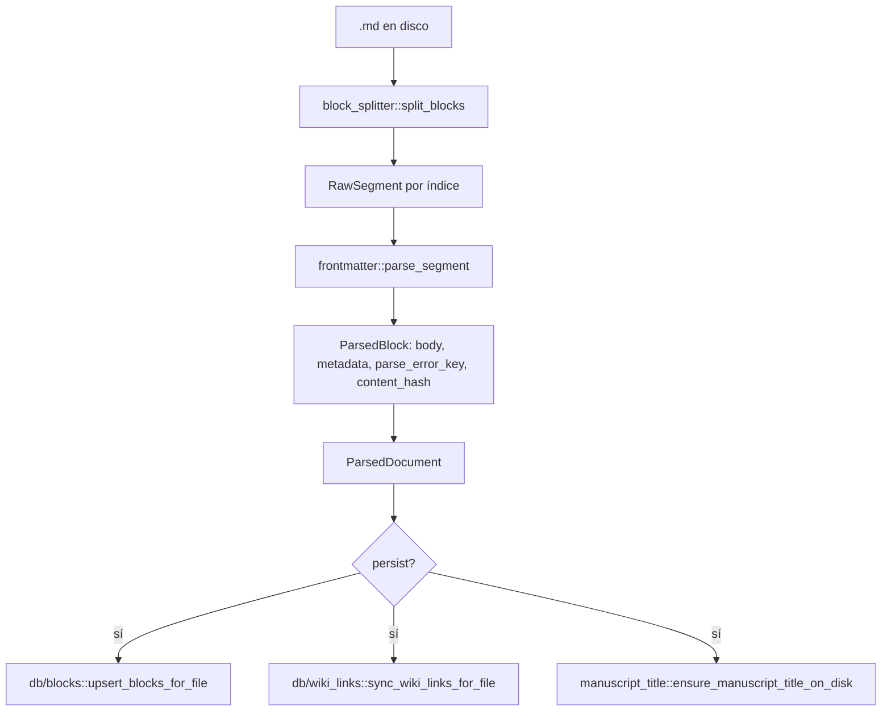
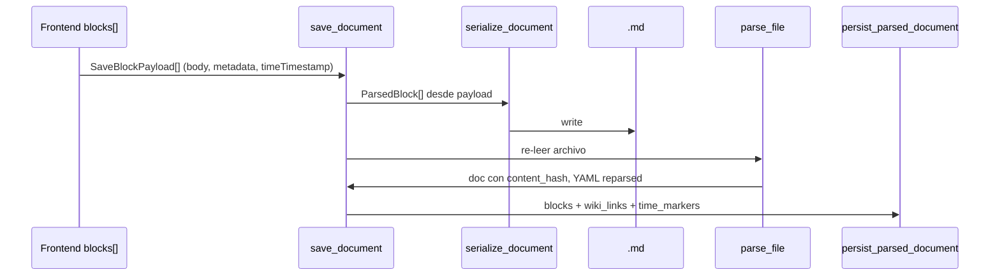

# Plan de actualización — Parser de manuscrito

> **Documento vivo.** Aquí se registra **todo** lo implicado en el cambio grande del parser de manuscrito: estado actual, dependencias, pasos, riesgos y decisiones.  
> **Uso:** tú describes cada decisión o cambio en el chat; este archivo se actualiza en consecuencia. No implementar código hasta que el plan esté cerrado o el paso esté marcado como listo.

| Campo | Valor |
|-------|--------|
| **Estado del plan** | 🟢 **Diseño §1 cerrado** · 🟢 **Fase 0 decisiones cerradas** (2026-06-05) · **Go Fase 1** |
| **Última actualización** | 2026-06-05 (Fase 0 — D1–D6 documentadas) |
| **Hallazgos críticos** | §11 describe código **actual** (baseline); el diseño §1 lo reemplaza |
| **Ámbito** | Manuscrito + **fichas Evento** en `Worldbuilding/`. Bloque 0 + `title` ↔ nombre de archivo. |
| **Referencia visual** | Cuaderno (esquinas `┌ ┐ └ ┘`) + panel EVENTOS |
| **Intentos previos** | Descartados — restauraste a versión anterior; **nada** de esos cambios está en el repo |

---

## 1. Objetivo del cambio — Evento como bloque, etiquetas inline

### 1.0 Motivación

Hoy coexisten **bloques por `+++`** (barra `BLOQUE N` + chip de tiempo) y un panel **EVENTOS** que es placeholder. La única etiqueta funcional es **Tiempo**. El refactor centra el manuscrito en **eventos narrativos**: un bloque existe **solo** al crear un evento; tiempo y futuras etiquetas van **inline** en el cursor dentro del evento.

### 1.1 Filosofía — el usuario decide (cerrado)

**Nada automático en etiquetas ni en timeline.** El sistema no infiere, no rellena, no impone tiempos ni ubicaciones.

| Principio | Implicación |
|-----------|-------------|
| **Opt-in explícito** | Cada etiqueta existe **solo** si el usuario la añadió y confirmó (panel → “Añadir etiqueta al documento”, o 🏷️+ inline en cursor). |
| **Evento sin etiquetas** | Válido y habitual: bloque `+++event` con nombre/descripción y **sin** `barTags` (o lista vacía). La barra muestra solo `[Evento]: nombre`. |
| **Sin tiempo = sin punto en timeline** | Si no hay `barTags` de tiempo ni `{{time:…}}` inline, el evento **no aparece** en la línea de tiempo (ni se inventa un ancla). |
| **Sin defaults** | No crear `barTags` con `location: ""`, no duplicar el primer inline al origen, no copiar tiempo del panel si el usuario no lo confirmó en staging. |
| **Guardado manual** | Commit de etiqueta = RAM/Lexical; disco solo cuando el usuario guarda (§1.3.1). |

Esta regla aplica al flujo normal de edición. La **migración legacy** (§1.11) es un caso aparte: conversión de proyectos viejos, no comportamiento del editor día a día.

### 1.2 Decisiones cerradas

| Pregunta | Decisión |
|----------|----------|
| ¿Qué problema resuelve? | Evento = unidad narrativa; tiempo inline; prosa libre fuera de eventos; UI alineada al cuaderno; evento referenciable como entidad. |
| ¿Cambia el formato en disco? | **Sí** (§1.4). **Mantiene** bloque 0 + `title` ↔ nombre de archivo. |
| ¿Rompe proyectos existentes? | **Sí** — migración §1.11. |
| ¿Contrato IPC / Lexical? | **Sí** — §1.8–1.9. |
| ¿Evento en Worldbuilding? | **Sí** — cada evento crea/actualiza ficha `.md` referenciable con `[[nombre]]` (§1.10). |

### 1.3 Modelo visual (etiquetas ON vs OFF)

Con **“Mostrar etiquetas” ON**, el lienzo se entiende así (notación del cuaderno; **no** es lo que el autor escribe a mano):

```text
[bloque 0 obligatorio — título siempre sincronizado al nombre de archivo]

texto cualquiera fuera del bloque blablabla

┌ [Evento]: guerra de nosequé | [10.1.0] [etiqueta2]  🏷️+ ─────────┐
│  texto del bloque blablabla [10.1.0] …                             │
│  al día siguiente [11.1.0]                                           │
└────────────────────────────────────────────────────────────────────┘
  ↑ barra en una línea; marco solo esquinas (sin línea “BLOQUE N”)
  ↑ si al crear el bloque había etiquetas en el panel, aparecen junto al evento en la barra

texto fuera del bloque blablabla
```

**Barra de etiquetas (ON):** una sola línea dentro del bloque:

`[Evento]: [Nombre] | [etiqueta de tiempo] [etiqueta 2] …`

- **Evento siempre primero.** Solo si el usuario **añadió** etiquetas al staging del panel antes de pulsar **“Añadir etiqueta al documento”**, aparecen en la barra junto al evento. Si solo confirmó el nombre del evento, la barra queda sin chips de tiempo (§1.1).
- Siempre visible: control **🏷️+** para añadir etiquetas que no se incluyeron al crear el bloque; muestra las opciones disponibles.
- Las etiquetas de la **barra** (solo si el usuario las confirmó en staging) se **persisten en disco** dentro del YAML de `+++event` (§1.5) — ancla de **origen** del evento.
- Las marcas **inline en el cuerpo** (p. ej. un segundo tiempo más abajo) son la **evolución** narrativa — se insertan en la posición del cursor vía 🏷️+ o panel; en disco son `{{time:…}}` en el texto.

**Ubicación y mapas:** **fuera de alcance** en este refactor (código roto / ignorar por ahora). No reservar `{{location:}}` en MVP salvo que el parser lo tolere sin UI.

Con **etiquetas OFF:** desaparecen barra, chips, 🏷️+ y esquinas; **no queda hueco vacío** — solo fluye el texto plano.

### 1.3.1 Reglas de etiquetas

| Regla | Detalle |
|-------|---------|
| **Crear bloque evento** | Escribir nombre (y opcionalmente descripción) en panel → **“Añadir etiqueta al documento”**. Eso **abre** el bloque en el cursor. **`[+]` no crea eventos.** |
| **Commit al documento** | Si hay **evento** en el panel → bloque + evento. **Solo** las etiquetas que el usuario dejó en staging van a barra/YAML (`barTags`); si el staging solo tiene nombre (y descripción), **no** se escriben etiquetas. Si **no** hay evento editado → solo la etiqueta editada en cursor (sin abrir bloque). |
| **Staging** | Todo lo del panel va primero al **borrador temporal** (RAM). **Nunca** guardar disco al añadir etiqueta; guardado **siempre manual** (usuario; sin autoguardado ni persistencia forzada por el sistema al commit de etiqueta). |
| **Evento existente** | Cursor dentro de un evento → panel muestra nombre y descripción (**bidireccional**). El evento **no se modifica** al añadir otras etiquetas salvo **cambio manual** en nombre o descripción. |
| **Inserción inline** | Etiquetas en el **cuerpo** (tiempo, etc.) → posición del **cursor** vía 🏷️+ / panel. |
| **`[-]`** | Dentro de evento **abierto** (sin cierre en esa posición): inserta cierre en el cursor (`+++end-event`). |
| **`[+]`** | Visible **solo** sobre un bloque **cerrado** (cursor dentro del tramo del evento ya delimitado por esquinas). **No crea** evento. **Expande** el límite de cierre: el tramo del evento pasa a incluir desde el inicio del evento hasta el cursor (o hasta el inicio del próximo evento), para poder marcar un nuevo cierre con `[-]`. Útil si se escribió prosa **después** de un cierre previo que debe volver a formar parte del mismo evento. **Escribir dentro de un bloque ya cerrado** no requiere `[+]` — basta con escribir dentro del marco (esquinas). |
| **Tiempo** | Inline; **no** crea `+++` ni parte el manuscrito. |
| **Ubicación / mapas** | Ignorar en este refactor. |

### 1.4 Formato en disco (lo que procesa la máquina)

Capas separadas: **vista** (§1.3) vs **disco** (aquí). El autor no edita `+++` ni YAML crudo en el lienzo.

```markdown
---
title: Escena 1
---
texto cualquiera fuera del bloque blablabla

+++event
---
event: guerra de nosequé
description: La coalición ataca al amanecer.
entity: Worldbuilding/Eventos/guerra de nosequé.md
barTags:
  - type: time
    value: "10.1.0"
---
texto del bloque blablabla {{time:10.1.0}}
al día siguiente {{time:11.1.0}}

+++end-event

texto fuera del bloque blablabla

+++event
---
event: otro evento
description:
entity: Worldbuilding/Eventos/otro evento.md
---
solo prosa — el autor no quiso etiquetas de origen; no hay entrada en timeline por tiempo

+++end-event

+++event
---
event: tercer evento
description:
entity: Worldbuilding/Eventos/tercer evento.md
barTags:
  - type: time
    value: "18.1.0"
---
a la semana siguiente {{time:18.1.0}}
```

| Token | Rol |
|-------|-----|
| Bloque 0 `title` | Obligatorio en manuscrito; sync ↔ stem del archivo (sin cambio) |
| Texto sin `+++event` | Prosa libre (antes, entre o después de eventos) |
| `+++event` | Apertura — **solo** al confirmar evento vía **“Añadir etiqueta al documento”**; nunca por `[+]` ni por insertar tiempo solo |
| `event` | Nombre mostrado en barra `[Evento: …]` |
| `description` | Panel lateral; también volca a ficha Worldbuilding |
| `entity` | Ruta relativa de la ficha (§1.10) |
| `barTags` | **Opcional.** Etiquetas de origen que el usuario confirmó al crear el bloque; omitir clave o `[]` si no hubo ninguna — ver §1.5 |
| `{{time:…}}` en cuerpo | Marcas **inline** de evolución narrativa (evita colisión con `[[wiki]]`) |
| `+++end-event` | Cierre en posición del `[-]`; puede renegociarse con `[+]` sobre bloque cerrado |

#### 1.5 Barra (YAML) vs inline (cuerpo) — **cerrado**

Dos capas de etiquetas de tiempo (y futuras) con roles distintos:

| Capa | Dónde en disco | Dónde en UI | Rol |
|------|----------------|-------------|-----|
| **Barra / origen** | Lista `barTags:` en el YAML **entre** `+++event` y el cuerpo (mismo bloque `---`) | Línea `[Evento]: nombre \| [10.1.0] [tag2]` | Marca el **momento y contexto de origen** del evento — ancla para trazar evolución en timeline y (futuro) mapa |
| **Inline / evolución** | Tokens `{{time:…}}` (etc.) **en el texto** del cuerpo | Chips en prosa en posición del cursor | Avance narrativo **desde el origen** hacia adelante; cada marca suma un punto en la trayectoria del evento |

**Correspondencia UI ↔ disco (barra):** cada chip de la barra al crear el bloque → una entrada en `barTags`:

```yaml
barTags:
  - type: time      # solo si el usuario la añadió al staging
    value: "10.1.0"
  # - type: location  # otro tipo — solo si el usuario lo añade; sin UI MVP
```

**Timeline / ficha Worldbuilding:** indexar **solo** lo que el usuario dejó explícitamente: entradas en `barTags` con `type: time` **y** cada `{{time:…}}` del cuerpo, en orden. Sin ninguna → el evento **no** genera puntos en timeline. La ficha tipo 1 (§1.10.0) muestra evolución **solo** si hay marcas.

**Reglas (§1.1 — usuario decide):**
- **Nunca** insertar etiquetas sin acción explícita del usuario.
- Crear evento **sin** tiempo en panel → `barTags` ausente o vacío; timeline sin ancla de origen para ese evento.
- Tiempos nuevos mientras escribe → el usuario elige 🏷️+ inline en cuerpo; el sistema **no** los promueve a barra ni duplica al origen.
- Añadir etiquetas a la barra **después** de creado el bloque: solo edición manual acordada (no inferida del cuerpo).
- `location` en `barTags`: solo si el usuario la añade; sin UI en este refactor.

**Abandonar en el diseño nuevo:** splits arbitrarios con `+++`; metadata `time` solo en YAML de cabecera de segmento; `commitTimeTag` → `insertBlockAtCursorLocal` (§11 A3); autoguardado / `saveDocument` forzado al commit de etiqueta.

### 1.6 Criterios de aceptación MVP

- [ ] `title` ↔ rename archivo (bloque 0).
- [ ] Crear evento → solo nombre → “Añadir etiqueta al documento” → bloque + barra sin chips de tiempo + marco (sin `barTags` en disco).
- [ ] Crear evento con tiempo en staging → barra y `barTags` **solo** con lo que el usuario confirmó.
- [ ] Commit de etiqueta **sin** guardar disco; guardado solo manual.
- [ ] `[-]` cierra en cursor; `[+]` solo en bloque cerrado y **expande** tramo (no crea evento).
- [ ] Escribir dentro de evento cerrado sin `[+]`.
- [ ] Evento sin etiquetas → ausente en timeline por tiempo; con `barTags` + inline → trayectoria solo de marcas explícitas.
- [ ] Tiempo inline en cursor; evolución narrativa en cuerpo.
- [ ] Toggle etiquetas: OFF = sin barra, esquinas ni espacio muerto.
- [ ] Marco solo esquinas; sin línea `BLOQUE N`.
- [ ] Al guardar evento → ficha Worldbuilding + referenciable `[[nombre]]`.
- [ ] Migración legacy §1.11.
- [ ] Ubicación / mapas fuera de alcance (ignorar).

### 1.7 Lexical (previsto)

| Quitar / sustituir | Añadir |
|--------------------|--------|
| `BlockSeparatorNode`, `BLOQUE N`, chips por índice | `EventTagBar` (Evento primero), marco esquinas |
| `InsertBlockSeparatorPlugin` (split mecánico) | Commit evento desde panel; `[-]` cierre; `[+]` expandir tramo cerrado; inline tag en cursor |
| `ActiveBlockPlugin` por índice `+++` | Contexto: ¿dentro de qué `eventId`? ¿evento abierto o cerrado? |

### 1.8 Rust + SQLite + timeline

- Parser: segmentos `fileHeader | freeText | event(open|closed)` con `barTags[]` opcional en YAML + `inlineTags[]` con offset en cuerpo.
- Indexar en `time_markers` / timeline **únicamente** marcas explícitas (`barTags` con `type: time` + cada `{{time:…}}` inline). Lista vacía → cero filas para ese evento.
- Repensar `blocks` vs tabla `inline_markers` (detalle en implementación).

### 1.9 IPC (borrador)

```text
ParsedManuscript {
  fileHeader: { title, body }
  segments: (FreeText | Event {
    id, name, description, entityPath,
    barTags[], body, inlineTags[], closed: bool
  })[]
}
```

Comandos nuevos o extendidos: `create_event_at_cursor`, `close_event_at_cursor`, `insert_inline_tag`, `sync_event_entity`.

### 1.10 Evento ↔ Worldbuilding (referencias `[[ ]]`)

Dos **tipos** de evento en Worldbuilding. Comparten carpeta/plantilla (§1.10.1) y son referenciables con `[[nombre]]`.

#### 1.10.0 Tipo 1 — Evento extraído del manuscrito

Creado al confirmar evento en el panel (“Añadir etiqueta al documento”) y al guardar manualmente el manuscrito.

| Campo ficha `.md` | Contenido |
|-------------------|-----------|
| **Nombre de archivo** | = nombre del evento (stem) |
| **Cuerpo / descripción** | Descripción del panel |
| **`sourcePath`** (o equivalente YAML) | Ruta al `.md` del manuscrito de origen |
| **`entity` en manuscrito** | Ruta relativa a esta ficha (`Worldbuilding/.../nombre.md`) |
| **Etiquetas / evolución** | Solo si el usuario etiquetó: `barTags` (origen) + inline del bloque — mini línea de tiempo en ficha; sin marcas → sin trayectoria (§1.5) |
| **Vista previa del bloque** | Extracto del **contenido del bloque** en el manuscrito (no el archivo completo). **Deseable;** si no es viable en MVP, omitir sin bloquear el resto |

Sincronización: renombrar evento en panel → ficha + `entity` + wikilinks. Cambios manuales en nombre/descripción del evento activo actualizan ficha al **guardar** manuscrito (no al commit de etiqueta en RAM).

#### 1.10.0b Tipo 2 — Evento de escritura libre (Worldbuilding)

Ficha creada **directamente** en Worldbuilding, sin manuscrito (ej. guerra 500 años antes de la historia). Bloque narrativo independiente fuera del manuscrito; admite etiquetas y estructura similar. **Refactor de etiquetas en todo Worldbuilding:** fase posterior; este plan solo deja el tipo definido y la plantilla base.

| Aspecto | Tipo 1 (manuscrito) | Tipo 2 (libre) |
|---------|---------------------|----------------|
| Origen | Panel manuscrito + commit | Crear ficha en explorador WB |
| `sourcePath` | Sí | No |
| Preview bloque | Opcional | N/A |
| Etiquetas WB globales | Evolución en ficha | Fase posterior |

#### 1.10.0c Enlaces y resolución

| Aspecto | Decisión |
|---------|----------|
| Wikilinks | `[[nombre]]` → misma resolución que otras entidades |
| Renombrar (tipo 1) | `rename_path` + `refactor/rename_entity.rs` + actualizar `entity` en manuscrito |

#### 1.10.1 Decisión pendiente — carpeta y plantilla (§13.1)

El plan asumía `Worldbuilding/Eventos/`. **El repo hoy no la tiene.**

| Opción | Ruta scaffold actual | Plantilla | Pros / contras |
|--------|----------------------|-----------|----------------|
| **A (preferida UX §1)** | Crear **`Worldbuilding/Eventos/`** nueva en `standard.json` | Nueva **`event.yaml`** + `EntityCategory::Event` | Clara separación evento narrativo ↔ lore; requiere scaffold + taxonomía + i18n |
| **B (reutilizar scaffold)** | `Worldbuilding/Lore_y_Mitos/Eras_y_Edades/Eventos_Historicos_Clave/` | `lore.yaml` (`era`, `date`, `location`, `participants`) | Ya existe en plantilla estándar; mezcla evento de escena con evento histórico de lore |
| **C (híbrida)** | `Worldbuilding/Eventos/` + plantilla `event.yaml` distinta de `lore` | Nueva plantilla | Mismo coste que A; alinea con §1 sin confundir con Lore |

**Tensiones documentadas:** `01-REQUIREMENTS.md` describe `Eventos_Historicos_Clave` bajo Lore; §1.10 pide entidad referenciable por escena.

**✅ Decisión cerrada (2026-06-05):** **Opción A** — `Worldbuilding/Eventos/` + `event.yaml` + `EntityCategory::Event`.

#### 1.10.2 Riesgo: colisión de nombres en `EntityResolver`

`entity/resolver.rs` indexa **todos** los `.md` (incl. manuscritos con `category: manuscript`). Un evento `Escena_1` y una escena homónima compiten al resolver `[[…]]`. El refactor debe definir prioridad o namespace (p. ej. eventos solo bajo `Worldbuilding/Eventos/`).

### 1.11 Migración desde `+++` legacy

| Origen | Destino |
|--------|---------|
| Bloque 0 con `title` | Sin cambio |
| Segmento `+++` con `event` en YAML | Un `+++event` + cuerpo; crear ficha si falta |
| `time` en YAML de segmento legacy | Volcar a `barTags` (origen) y/o primera `{{time:…}}` inline en cuerpo |
| Varios `+++` sin evento | Agrupar heurísticamente o tratar como prosa libre + eventos manuales (definir en Paso 7) |

---

<!-- §12 consolidado en §1.7–1.11 -->

## 2. Estado actual (baseline) — NO modificar sin acordar

### 2.1 Formato en disco hoy

| Regla | Implementación |
|-------|----------------|
| Separador de bloques | Línea sola `+++` (`(?m)^\+\+\+\s*$` en `block_splitter.rs`) |
| Bloque 0 | Primer segmento tras split; puede llevar YAML `---` … `---` + cuerpo |
| Bloques 1..N | Tras cada `+++`, mismo esquema por segmento |
| Sin `+++` | Un solo bloque (índice 0) con todo el texto |
| Serialización | `serializer.rs`: entre bloques `i>0` emite `+++\n` + frontmatter opcional + `body` |
| Título de archivo (manuscrito) | `metadata.title` en bloque 0; auto desde stem si falta (`manuscript_title.rs`) |

**Ejemplo válido hoy:**

```markdown
---
title: Escena 1
time: "14.3.1024"
---
Primer párrafo.

+++
---
time: "15.3.1024"
event: Batalla
---
Segundo bloque con [[Personaje]].
```

### 2.2 Pipeline Rust (lectura)



| Función | Archivo | Persiste SQLite | Escribe disco |
|---------|---------|-----------------|---------------|
| `parse_document_str` | `parser/document.rs` | No | No |
| `parse_file` | `parser/document.rs` | No | No |
| `parse_file_and_persist` | `parser/document.rs` | Sí | Sí (solo si falta `title`) |
| `parse_full_path_and_persist` | `parser/document.rs` | Sí | Sí (title) |
| `update_block_metadata` | `parser/document.rs` | Sí | Sí (reserializa archivo) |
| `persist_parsed_document` | `parser/document.rs` | Sí | No |

**ID estable de bloque:** `{filePath}::{blockIndex}` (`ParsedDocument::stable_block_id`).

### 2.3 Pipeline Rust (escritura — `save_document`)



> **Punto frágil #1:** Tras guardar, el backend **no confía** en el payload: **re-parsea** el archivo. Cualquier divergencia serialize ↔ parse (o Lexical ↔ índices) produce bloques/metadata incorrectos o conteos distintos.

### 2.4 Pipeline frontend (Lexical)

| Paso | Módulo | Notas |
|------|--------|-------|
| IPC `read_document` | `useEditorStore.openDocument` | `parse_file_and_persist` en backend |
| Hidratar | `documentSync.hydrateLexicalDocument` | Por bloque: `BlockSeparator` (si index>0) + `BlockMetadataNode` (si index>0) + párrafos |
| Bloque 0 especial | `manuscriptBlocks.isFileTitleBlock` | Sin chip de metadata inline en UI |
| Extraer al guardar | `extractBlockBodiesFromEditor` | Solo cuenta `BlockSeparatorNode` + párrafos; ignora nodos metadata |
| Guardar | `saveDocument` → `save_document` | Metadata viene de `document.blocks`, cuerpos de Lexical |
| Timestamp | `resolveTimeTimestampForMetadata` | Solo en frontend; Rust recibe `timeTimestamp` en save |

**Punto frágil #2:** El número de bloques en memoria debe coincidir con separadores Lexical + 1. Insertar/borrar separadores sin actualizar `document.blocks` rompe índices.

**Punto frágil #3:** `extractBlockBodies` asigna índices 0..N por orden de flush; si falta un separador en Lexical, los índices se desalinean respecto a `document.blocks`.

### 2.5 Contrato IPC actual

**TypeScript** (`src/lib/types/editor.ts`):

```ts
interface ParsedBlock {
  id: string;
  index: number;
  body: string;
  metadata: Record<string, unknown>;
  contentHash?: string;
  parseErrorKey?: string;
  // timeTimestamp: NO en TS de lectura; se envía solo en save/update metadata
}
interface ParsedDocument {
  filePath: string;
  blocks: ParsedBlock[];
}
```

**Rust** (`src-tauri/src/parser/types.rs`): igual + `time_timestamp: Option<String>` (no serializado en lectura habitual; usado al persistir).

**Comandos Tauri** (`lib.rs`):

| Comando | Entrada clave | Salida |
|---------|---------------|--------|
| `read_document` | `filePath` | `ParsedDocument` |
| `parse_document` | `filePath` | `ParsedDocument` (hoy = read + persist) |
| `save_document` | `filePath`, `blocks[]` | `ParsedDocument` |
| `update_block_metadata` | `filePath`, `blockIndex`, `metadata`, `timeTimestamp?` | `ParsedDocument` |

**Payload guardado** (`SaveBlockPayload`): `index`, `body`, `metadata`, `timeTimestamp?`.

### 2.6 Metadatos de bloque (resumen)

Detalle exhaustivo en **§2.7–§2.11**. Resumen: YAML por bloque vía `parse_segment`; MVP cinco campos + claves libres; `time_markers` derivado de `time` + `timeTimestamp` (frontend).

---

## 2.7 Terminología — no mezclar conceptos

| Término | Qué es en el código hoy | Dónde vive |
|---------|-------------------------|------------|
| **Bloque narrativo** | Segmento entre líneas `+++` (índice 0..N) | `block_splitter` → `ParsedBlock` |
| **Metadatos / etiquetas de bloque** | Objeto YAML (`metadata` JSON) por bloque | Frontmatter del segmento en `.md` |
| **Etiqueta de tiempo (`time`)** | Campo `metadata.time` (texto libre; UI prioriza `d.m.aaaa`) | `dateTags.ts`, `TimeTagDialog`, chips inline |
| **`metadata.tags`** | Lista de strings (referencias/tags libres, separadas por comas en formulario) | Solo UI/formulario; **Rust no interpreta** el campo |
| **Taxonomía del explorador** | Carpeta = categoría de entidad (`entities.category`) | `fs/taxonomy`, **no** es `metadata.tags` del manuscrito |
| **Wiki-link `[[ ]]`** | Enlace en el **cuerpo** del bloque, no en YAML | `wikilink/scanner`, tabla `wiki_links` |
| **Evento en timeline** | Fila derivada de bloque con `time` en `time_markers` | `timeline/project.rs`; título UI ≈ `metadata.event` |
| **Tarjeta “Eventos” lateral** | UI placeholder (`ManuscriptEventCard`) | **Sin persistencia** al parser hoy |

---

## 2.8 Catálogo de campos YAML por bloque (manuscrito)

### 2.8.1 Campos con contrato explícito en TypeScript

Definidos en `src/lib/types/blockMetadata.ts` y mapeados en `lib/editor/blockMetadata.ts` (`metadataToFormValues` / `formValuesToMetadata`):

| Clave YAML | Tipo en disco (típico) | UI principal | Consumido en Rust/SQLite |
|-----------|------------------------|--------------|---------------------------|
| `title` | string | _(solo bloque 0; no chip inline)_ | Auto en `manuscript_title.rs`; no en `time_markers` |
| `time` | string | `TimeTagDialog`, chip inline, `SideTimeSection` | `time_markers.raw_time`; orden vía `time_timestamp` |
| `location` | string | `MetadataInspector` / `EditorQuickTagPanel` _(huérfanos)_ | Plothole (`checker/plothole.rs`); timeline `location` |
| `event` | string | Igual | Timeline `title`/`snippet`; `time_markers.label` (fallback tras `event`) |
| `characters` | string[] o string (CSV en UI) | Igual | Plothole (conflictos dual-location); timeline `characters` |
| `tags` | string[] o string (CSV en UI) | Igual | Solo almacenado en `blocks.metadata` JSON |

### 2.8.2 Campos usados sin estar en `BlockMetadata` (TS)

| Clave | Origen | Uso |
|-------|--------|-----|
| `timeHour` | Escrito por `commitTimeTag` / `TimeTagDialog` | `timeline/project.rs` lee `metadata.timeHour` (u32) para hora en línea de tiempo |
| Cualquier otra clave | YAML libre del autor | Persiste en JSON; `sanitize_metadata` no la borra si tiene valor |

### 2.8.3 Reglas de persistencia (`db/blocks.rs`)

Por cada bloque tras `upsert_blocks_for_file`:

1. Fila en `blocks`: `id`, `file_path`, `block_index`, `content_hash`, `metadata` (JSON string).
2. Si `metadata.time` no vacío → fila en `time_markers`:
   - `id` = `{blockId}::time`
   - `raw_time` = texto de `metadata.time`
   - `timestamp` = `ParsedBlock.time_timestamp` (solo si el frontend lo envió en el último `save_document` / `update_block_metadata`)
   - `label` = primer no vacío entre `metadata.event`, `metadata.location`
   - `persisted_at` = now (ms)

**Importante:** `metadata.tags`, `characters`, `event` (salvo label) **no** tienen tablas propias; todo va en el JSON de `blocks`.

### 2.8.4 Sanitización al guardar

`metadata_util::sanitize_metadata` (Rust) y `formValuesToMetadata` (TS) omiten claves vacías. El parser **no valida** semántica de `time` (formato `d.m.aaaa` es convención de UI/calendario).

---

## 2.9 Modelo Lexical ↔ bloques ↔ etiquetas

### 2.9.1 Árbol Lexical por documento hidratado

Orden por cada bloque `index` en `ParsedDocument.blocks`:

| index | Nodos Lexical | Metadata en store |
|-------|---------------|-------------------|
| `0` | _(sin `BlockMetadataNode`)_ + párrafos del cuerpo | `metadata` incl. `title` habitual |
| `≥1` | `BlockSeparatorNode` + `BlockMetadataNode` + párrafos | `metadata` completo del bloque |

Implementación: `documentSync.hydrateLexicalDocument`, `isFileTitleBlock` (`index === 0`).

### 2.9.2 Extracción al guardar (`extractBlockBodiesFromEditor`)

- Recorre hijos del root en orden.
- Cada `BlockSeparatorNode` → cierra un bloque y empieza el siguiente.
- Solo párrafos aportan texto; **`BlockMetadataNode` no se serializa** (decorador puro).
- Los **índices** del array extraído deben alinearse con `document.blocks[].index`.

### 2.9.3 Inserción de bloque (`InsertBlockSeparatorPlugin`)

Al partir el documento en el cursor:

1. Inserta `BlockSeparatorNode` + `BlockMetadataNode` + párrafo vacío.
2. Devuelve índice del bloque nuevo.
3. `insertBlockAtCursor` → opcionalmente `saveDocument()` (persiste `+++` en disco).
4. `insertBlockAtCursorLocal` + `reconcileDocumentBlocksFromEditor` → alinea `document.blocks` **sin** disco (usado por `commitTimeTag`).

**Riesgo:** Tras insertar, `document.blocks` puede tener **más entradas** que antes; metadata del bloque nuevo es `{}` hasta que el usuario etiquete.

### 2.9.4 Bloque activo

`ActiveBlockPlugin` → `getBlockIndexAtTopLevel` → `useEditorStore.activeBlockIndex`.  
Toda la UI lateral (tiempo, formularios) usa este índice para leer/escribir `document.blocks[activeBlockIndex].metadata`.

### 2.9.5 Chips inline (“Etiquetas en el documento”)

`BlockMetadataChips` (dentro de `BlockMetadataNode`):

- Visible si `useLayoutStore.inlineMetadataVisible` (botón “Etiquetas” en `EditorSidePanel`).
- **Oculto en bloque 0** (`isFileTitleBlock`).
- Hoy solo muestra chip de **`time`** (o botón “añadir tiempo”); **no** renderiza `location`, `event`, `characters`, `tags`.

---

## 2.10 Capas de UI — etiquetas y bloques (estado real)

### 2.10.1 Montado en producción (árbol activo)

| Componente | Ruta | Función | Persistencia |
|------------|------|---------|--------------|
| Panel lateral manuscrito | `EditorSidePanel.tsx` | Toolbar: mostrar chips, guardar todo, tiempo | — |
| Sección tiempo | `sidePanel/SideTimeSection.tsx` | Última fecha doc/proyecto, mini-calendario, abrir diálogo | vía metadata |
| Diálogo tiempo | `sidePanel/TimeTagDialog.tsx` | Fecha/hora ficticia, preview timeline, guardar | `applyBlockMetadataLocal` o commit |
| Commit etiqueta pendiente | `useManuscriptLabelDraftStore` + botón “Añadir etiqueta al documento” | Staging antes de aplicar al bloque | `commitTimeTag.ts` |
| Chips inline | `BlockMetadataChips.tsx` | Atajo visual a `time` | Igual que diálogo |
| Sección eventos | `sidePanel/SideEventSection.tsx` | `ManuscriptEventCard` | **Ninguna** (estado React local) |
| Plugins Lexical | `Hydrate`, `Extract`, `Insert`, `ActiveBlock`, `DirtyState` | Ciclo bloque/cuerpo | `save_document` |

### 2.10.2 Código presente pero **no importado** en la UI activa

| Componente | Ruta | Estado |
|------------|------|--------|
| `MetadataInspector` | `MetadataInspector.tsx` | Formulario completo 5 campos + debounce 300 ms → `update_block_metadata` / local — **sin referencia en `App`/`EditorSidePanel`/`EditorShell`** |
| `EditorQuickTagPanel` | `EditorQuickTagPanel.tsx` | Herramientas rápidas (`useMetadataToolStore`) — **huérfano** |
| `BacklinksPanel` | `references/BacklinksPanel.tsx` | Panel referencias Fase 3 — **huérfano** |

> Al rediseñar el parser, decidir si se **reconecta** el inspector o se **elimina/mueve** lógica al panel lateral para no duplicar caminos de guardado (`applyBlockMetadata` vs `save_document`).

### 2.10.3 Stores implicados

| Store | Rol en etiquetas/bloques |
|-------|---------------------------|
| `useEditorStore` | `document`, `activeBlockIndex`, `saveDocument`, `applyBlockMetadata` / `Local`, `insertBlock*`, `reconcileDocumentBlocksFromEditor` |
| `useLayoutStore` | `inlineMetadataVisible` (localStorage layout) |
| `useTimeTagDialogStore` | Diálogo flotante: `filePath`, `blockIndex`, `draft`, `commitOnSave` |
| `useManuscriptLabelDraftStore` | Borrador de tiempo antes del commit al documento |
| `useMetadataToolStore` | Tool activo quick panel (**huérfano**) |
| `useCalendarStore` | `resolveTimeTimestampForMetadata` al guardar |

---

## 2.11 Flujos de datos — etiquetas ↔ parser

### 2.11.1 Editar solo metadata (documento sin cambios locales)

```mermaid
sequenceDiagram
  participant UI as MetadataInspector o TimeTag
  participant Store as useEditorStore
  participant IPC as update_block_metadata
  participant Rust as document.rs
  participant FS as .md

  alt isDirty === false
    UI->>Store: applyBlockMetadata(index, meta)
    Store->>IPC: metadata + timeTimestamp
    IPC->>Rust: parse_file + patch block + serialize
    Rust->>FS: write YAML
    IPC->>Store: ParsedDocument
  else isDirty === true
    UI->>Store: applyBlockMetadataLocal
    Note over Store: metadata en RAM; cuerpo en Lexical
    UI->>Store: saveDocument() luego
    Store->>IPC: save_document blocks[]
  end
```

### 2.11.2 Etiqueta de tiempo con panel colapsado (`commitOnSave`)

`openTimeTagForBlock` (chips + icono calendario con panel colapsado) pasa `commitOnSave: rightPanelCollapsed`.

**Matiz auditado:** `SideTimeSection.handleAddTime` abre el diálogo con `openDialog` **directamente** (`commitOnSave` implícito **false**) → en panel **expandido** el tiempo queda en **staging** (`useManuscriptLabelDraftStore`) hasta pulsar “Agregar etiqueta al documento”. Ese footer **siempre** ejecuta `commitTimeTag` → A3.

`commitTimeTag` (confirmado en código):

1. `insertBlockAtCursorLocal()` — **siempre** inserta separador.
2. `reconcileDocumentBlocksFromEditor()`.
3. `applyBlockMetadataLocal` con `time` + `timeHour`.

**Autoguardado** (`useEditorAutoSave`) y `saveDocument` **no** persisten el borrador staged hasta el commit.

### 2.11.3 Guardar cuerpo + conservar metadata

`saveDocument`:

1. `extractBlocksFn()` → cuerpos por índice.
2. Para cada índice, **metadata se toma de `document.blocks` existente**, no del Lexical.
3. `resolveTimeTimestampForMetadata` recalcula `timeTimestamp` por bloque.
4. Rust serializa → re-parsea → `upsert_blocks` + `time_markers`.

**Punto crítico para el parser nuevo:** si el split cambia el número de bloques, los índices en `document.blocks` y en Lexical deben reconciliarse **antes** del save o se asignará metadata al bloque equivocado.

### 2.11.4 Lectura / indexación

| Evento | Efecto en etiquetas |
|--------|---------------------|
| `read_document` | Parsea YAML → `document.blocks[].metadata`; puede escribir `title` en disco |
| `fs-changed` | `useEditorFsSync` puede forzar reload; metadata desde disco reemplaza RAM |
| `parse_full_path_and_persist` (watcher) | SQLite actualizado; editor abierto puede mostrar diálogo reload |

### 2.11.5 Downstream que leen metadata de bloques (sin re-parsear .md)

| Feature | Campos usados | Archivo |
|---------|---------------|---------|
| Timeline global | `time`, `event`, `characters`, `location`, `timeHour` | `timeline/project.rs` |
| Calendario workspace | eventos → `buildCalendarTimeEntries` | `calendarEntries.ts` |
| Plothole | `characters`, `location`, `timestamp` | `checker/plothole.rs` |
| Última fecha en doc | `time` por bloque (orden aparición) | `dateTags.findLastAddedTimeInDocument` |
| Última fecha en proyecto | `time_markers` + eventos | `lastProjectTime.ts` |
| Mini timeline / marcadores | `historyMarkedDaysForYear` (calendario + eventos) | `TimeTagDialog`, `calendarMarkers` |
| Entity timeline | Menciones manuscrito con `time` en bloques | `entity/timeline.rs` |
| Exportación futura (Fase 9) | Todos los metadatos por bloque | _planificado_ |

**`metadata.tags` hoy:** ningún consumidor Rust/TS fuera del formulario y almacenamiento JSON.

---

## 2.12 Requisitos de producto vs implementación (etiquetas)

Extracto de `01-REQUIREMENTS.md` relevante al parser:

| Requisito | Implementado hoy | Gap |
|-----------|------------------|-----|
| Bloques `+++` + YAML por bloque | Sí | — |
| Usuario no ve `+++`/YAML en lienzo | Sí (Lexical) | Chips solo muestran `time` |
| Marcar evento desde selección de texto | Parcial / diferido | Evento = bloque entero; inline tags en cursor (§1) |
| Etiquetas intra-párrafo (tiempo, ubicación) | No (baseline) | **Objetivo §1** — marcas inline `{{time:…}}`, no rangos CRDT |
| Taxonomía por carpetas | Sí (explorador) | Independiente de `metadata.tags` |
| Línea de tiempo auto desde marcas `time` | Sí | Depende de `time_timestamp` calculado en frontend al guardar |
| Plothole no prohibitivo | Sí | Solo regla dual-location + `characters` |

---

## 2.13 Impacto previsto del cambio de parser en etiquetas/bloques

> Respuestas alineadas con **§1** (diseño objetivo).

| Pregunta | Decisión |
|----------|----------|
| Índices de bloque (0..N) | **Cabecera 0** + **eventos** (no un índice por cada `+++` arbitrario). Inline tags con offset en cuerpo del evento. |
| Separador | **`+++event` / `+++end-event`** sustituyen splits mecánicos; tiempo **no** abre bloque. |
| Metadata | YAML apertura: `event`, `description`, `entity`, `barTags` opcional (origen); cuerpo: `{{time:…}}` inline (evolución) — §1.5. Ubicación/mapas: fuera de alcance. |
| `title` | **Sí**, solo bloque 0; sync nombre archivo (sin cambio). |
| `timeHour` | Parte de marca inline o subcampo de `{{time:…}}` — definir en implementación. |
| `metadata.tags` | Fuera de MVP; terreno para taxonomía. |
| UI | Barra `[Evento]: nombre \| tags` + 🏷️+; commit vía “Añadir etiqueta al documento”; `[-]` cierre; `[+]` solo cerrado (expandir). |
| `ManuscriptEventCard` | Cablear a evento activo + Worldbuilding (§1.10). |
| `time_markers` | Filas por cada `barTags` (origen) + cada inline en cuerpo; orden = trayectoria. |
| Worldbuilding | Cada evento → ficha `Worldbuilding/Eventos/…` referenciable `[[ ]]`. |

---

## 3. Matriz de dependencias (todo lo que toca el parser)

Leyenda: **🔴** rompe si cambia formato/índices · **🟠** requiere adaptación · **🟢** probablemente intacto

### 3.1 Backend Rust — núcleo parser

| Módulo / archivo | Dependencia de | Riesgo | Notas |
|------------------|----------------|--------|-------|
| `parser/block_splitter.rs` | regex `+++` | 🔴 | Punto de entrada del split |
| `parser/frontmatter.rs` | `---` fences por segmento | 🔴 | Compartido con entidades y `.folder.md` |
| `parser/serializer.rs` | orden bloques, YAML | 🔴 | Round-trip tests aquí |
| `parser/document.rs` | split + segment + persist | 🔴 | Orquestación |
| `parser/types.rs` | contrato IPC | 🔴 | |
| `parser/metadata_util.rs` | claves metadata | 🟠 | |
| `parser/manuscript_title.rs` | bloque 0, `title` | 🔴 | Escribe disco en `read` |
| `parser/mod.rs` | reexports | 🟠 | |
| `commands/editor.rs` | serialize + re-parse | 🔴 | Flujo save |
| `db/blocks.rs` | `ParsedDocument`, índices | 🔴 | DELETE+INSERT por archivo |
| `db/wiki_links.rs` | cuerpos por `(index, body)` | 🔴 | Tras cada persist |
| `wikilink/scanner.rs` | cuerpo de bloque | 🟠 | Regex `[[ ]]` |
| `references/unlinked.rs` | `parse_file` por .md | 🟠 | Escaneo paralelo |
| `references/convert.rs` | `parse_file`, `serialize_document` | 🔴 | Convierte mención → wiki-link |
| `fs/reconcile.rs` | `parse_full_path_and_persist` | 🔴 | Watcher / adopción |
| `fs/crud.rs` | `parse_file`, títulos al crear | 🟠 | `create_file` manuscrito |
| `refactor/rename_entity.rs` | `parse_full_path_and_persist` | 🟠 | Tras rename masivo |
| `timeline/project.rs` | SQL `blocks` + `time_markers` | 🟠 | No parsea .md directo |
| `entity/timeline.rs` | bloques manuscrito en tests | 🟠 | |
| `checker/plothole.rs` | metadata JSON en SQLite | 🟠 | |
| `fs/folder_meta.rs` | `parse_segment` solo | 🟢 | No usa `+++` |
| `commands/entity.rs` | `create_entity`, indexación | 🔴 | Fichas Evento al crear evento manuscrito (§1.10) |
| `entity/registry.rs`, plantillas | categoría Evento | 🔴 | Nueva plantilla `event.yaml` |
| `graph/indexer.rs` | fichas WB + wiki-links manuscrito | 🟠 | Incluir eventos en grafo |
| `wikilink/replace.rs` | refactor rename entidad | 🔴 | Round-trip `+++event` en refactor masivo |
| `entity/resolver.rs` | resolución `[[ ]]` | 🔴 | Colisiones manuscrito vs evento (§1.10.2) |
| `entity/metadata_index.rs` | `refresh_entity_row` | 🟠 | Tras crear ficha evento |
| `db/backlinks.rs` | derivado wiki_links | 🟠 | |
| `commands/consistency.rs` | plothole tras save | 🟠 | Asume metadata por bloque hoy |
| `checker/scheduler.rs` | debounce 3 s | 🟠 | |
| `fs/crud.rs` | move/delete/rename | 🔴 | **A21/A22** — ver §11.12 |
| `parser/inline_scanner` _(nuevo)_ | `{{time:…}}` en cuerpo | 🔴 | No existe; distinto de `wikilink/scanner.rs` |

### 3.2 Backend — comandos y eventos indirectos

| Consumidor | Trigger | Riesgo |
|------------|---------|--------|
| `save_document` | Ctrl+S, autoguardado | 🔴 |
| `update_block_metadata` | Inspector (debounce) | 🔴 |
| `read_document` / `parse_document` | Abrir pestaña | 🔴 |
| `fs-changed` → `useFsWatcher` → `loadTree` + editor reload | Externo | 🔴 |
| `get_timeline_events` | Vista timeline | 🟠 |
| `get_entity_timeline` | Ficha personaje | 🟠 |
| `get_backlinks` / `find_unlinked_mentions` | Panel referencias | 🟠 |
| `convert_unlinked_mention` | Panel referencias | 🔴 |
| `ConsistencyScheduler` | Tras save / metadata / reconcile | 🟠 |
| `graph/indexer.rs` | Fichas WB; eventos manuscrito vía ficha §1.10 | 🟠 |

### 3.3 Frontend — editor y stores

| Archivo | Riesgo | Notas |
|---------|--------|-------|
| `lib/editor/documentSync.ts` | 🔴 | hydrate / extract / índices |
| `lib/editor/manuscriptBlocks.ts` | 🔴 | bloque 0 = título |
| `lib/editor/wikiLinkHydrate.ts` | 🟠 | cuerpo por párrafo |
| `lib/editor/resolveBlockTime.ts` | 🟠 | `timeTimestamp` al guardar |
| `lib/editor/blockMetadata.ts` | 🟠 | |
| `stores/useEditorStore.ts` | 🔴 | save, insert block, metadata local |
| `modules/editor/plugins/HydrateDocumentPlugin.tsx` | 🔴 | |
| `modules/editor/plugins/ExtractBlocksPlugin.tsx` | 🔴 | Nombre real (plan decía “Extract”) |
| `modules/editor/plugins/InsertBlockSeparatorPlugin.tsx` | 🔴 | creación de bloques |
| `modules/editor/plugins/ActiveBlockPlugin.tsx` | 🟠 | |
| `modules/editor/nodes/BlockSeparatorNode.ts` | 🔴 | |
| `modules/editor/nodes/BlockMetadataNode.tsx` | 🔴 | Extensión `.tsx` |
| `modules/editor/MetadataInspector.tsx` | 🟠 | **Huérfano** — ver §2.10.2 |
| `modules/editor/EditorQuickTagPanel.tsx` | 🟠 | **Huérfano** — ver §2.10.2 |
| `modules/editor/components/BlockMetadataChips.tsx` | 🔴 | Solo UI `time`; índice dinámico |
| `modules/editor/commitTimeTag.ts` | 🔴 | Inserta bloque + metadata local |
| `modules/editor/sidePanel/SideEventSection.tsx` | 🟢 | Placeholder sin parser |
| `components/workspace-ui/manuscript/ManuscriptEventCard.tsx` | 🟢 | Placeholder sin parser |
| `modules/editor/sidePanel/*TimeTag*` | 🔴 | Calendario + `time`/`timeHour` |
| `stores/useTimeTagDialogStore.ts` | 🟠 | |
| `stores/useManuscriptLabelDraftStore.ts` | 🟠 | Staging commit tiempo |
| `stores/useMetadataToolStore.ts` | 🟢 | Solo quick panel huérfano |
| `stores/useLayoutStore.ts` | 🟠 | `inlineMetadataVisible` |
| `hooks/useEditorFsSync.ts` | 🔴 | reload si `fs-changed` |
| `hooks/useEditorAutoSave.ts` | 🔴 | |
| `lib/calendar/dateTags.ts` | 🟠 | escanea `ParsedDocument` |
| `lib/calendar/lastProjectTime.ts` | 🟠 | |
| `lib/calendar/calendarEntries.ts` | 🟠 | |

### 3.4 i18n y errores

| Clave / namespace | Uso |
|-------------------|-----|
| `error.parser.invalid_yaml` | `parseErrorKey` por bloque |
| `error.editor.*` | not_found, block_not_found, not_md |
| `editor.json` (es/en) | UI editor |
| `references.json` | convert / backlinks |

### 3.5 Documentación a actualizar tras implementar

| Archivo | Sección |
|---------|---------|
| `06-ARCHITECTURE.md` | Parser, IPC editor, flujo guardado |
| `05-CHANGELOG.md` | Entrada de versión |
| `04-TASK.md` | Si hay tarea formal |
| `01-REQUIREMENTS.md` | Solo si cambia requisito de formato |

### 3.6 Compartido con entidades (no confundir)

| Sistema | Parser | Formato |
|---------|--------|---------|
| Manuscrito | `parser/document.rs` + `+++` | Multi-bloque |
| Ficha worldbuilding | `entity/document.rs` | `parse_segment` × 1 |
| `.folder.md` | `fs/folder_meta.rs` | `parse_segment` × 1 |

Cambiar `frontmatter.rs` **afecta a los tres**. Cambiar `block_splitter` **solo manuscrito**.

### 3.7 Etiquetas y bloques de manuscrito (matriz dedicada)

| Pieza | Depende de | Si cambia parser/bloques | Riesgo |
|-------|------------|---------------------------|--------|
| Split `+++` | `block_splitter` | Cambia conteo de bloques | 🔴 |
| YAML por segmento | `frontmatter` | Cambia forma de leer etiquetas | 🔴 |
| `metadata` en IPC | `ParsedBlock.metadata` | Contrato JSON | 🔴 |
| `time_timestamp` | Save payload + `blocks.rs` | Orden timeline/plothole | 🔴 |
| Chips inline | Índice Lexical = `block.index` | Desincronización visual | 🔴 |
| `commitTimeTag` | insert + reconcile + metadata local | Bloque nuevo sin `+++` en disco hasta save | 🔴 |
| `update_block_metadata` | serialize un bloque | Round-trip YAML | 🔴 |
| `time_markers` | `metadata.time` + timestamp | Timeline vacía o desordenada | 🔴 |
| Plothole | `characters` + `location` + timestamp | Falsos positivos/negativos | 🟠 |
| `parseTimeTag` | Formato string `time` | UI calendario rota si cambia convención | 🟠 |
| `metadata.tags` | Ningún consumidor | Solo compatibilidad YAML | 🟢 |
| `ManuscriptEventCard` | Tras §1.10 | 🔴 | Sync evento + ficha WB + `[-]`/`[+]` |
| `MetadataInspector` | `applyBlockMetadata` | Código muerto hasta re-montar | 🟠 |

**Doble vía de guardado metadata (hoy):**

| Vía | Cuándo | Comando |
|-----|--------|---------|
| A | Documento limpio (`!isDirty`) | `update_block_metadata` |
| B | Documento sucio o tras editar cuerpo | `save_document` (metadata desde store) |
| C | Diálogo tiempo / commit pendiente | `applyBlockMetadataLocal` → luego B |

Cualquier cambio de parser debe probar **las tres vías**.

---

## 4. Puntos frágiles del código actual (baseline)

> Lista de riesgos al refactorizar **desde el repo restaurado**. Los intentos fallidos previos **no aplican** — restauraste a versión anterior (§8).

| # | Síntoma probable | Causa raíz | Dónde verificar |
|---|------------------|------------|-----------------|
| F1 | Bloques duplicados / metadata en bloque equivocado | Desfase índice Lexical ↔ `document.blocks` | `extractBlockBodies`, `insertBlockAtCursor` |
| F2 | Guardar pierde metadata o tiempo | `save_document` re-parsea; metadata solo del store, no del YAML en disco intermedio | `commands/editor.rs` |
| F3 | Tras guardar, `content_hash` o markers incorrectos | `time_timestamp` no viaja en `parse_file` post-write | `types.rs`, `blocks.rs` |
| F4 | Abrir archivo modifica disco sin querer | `ensure_manuscript_title_on_disk` en cada `read` | `parse_file_and_persist` |
| F5 | Watcher / reload sobrescribe editor | `fs-changed` + `useEditorFsSync` vs dirty state | hooks editor |
| F6 | Round-trip YAML distinto | `serde_yaml` serializa distinto al autor | tests `serializer.rs` |
| F7 | Un solo bloque pasa a N bloques (o al revés) | Cambio en regex `+++` o líneas vacías | `block_splitter` tests |
| F8 | Wiki-links desindexados | `sync_wiki_links` usa índices post-reorden | `db/wiki_links.rs` |
| F9 | Tests Rust pasan, UI falla | Contrato TS sin `timeTimestamp` / campos nuevos | `editor.ts` vs `types.rs` |
| F10 | Chip inline muestra tiempo de otro bloque | `BlockMetadataChips` calcula índice contando separadores; desfase con `document.blocks` | `BlockMetadataChips.tsx` |
| F11 | Timeline sin orden o eventos faltantes | `time_timestamp` no enviado en save; `time` con formato no parseable | `resolveBlockTime.ts`, `save_document` |
| F12 | `timeHour` se pierde al guardar | Campo no en `formValuesToMetadata`; solo en commit local / YAML manual | `commitTimeTag.ts`, round-trip |
| F13 | Metadata de bloque nuevo vacía tras split | `reconcileDocumentBlocksFromEditor` conserva metadata por índice; índices rotos | `useEditorStore` |
| F14 | Inspector “no hace nada” | Componente no montado; usuario edita solo vía flujos laterales | §2.10.2 |
| F15 | Etiqueta `event` en tarjeta lateral no persiste | `ManuscriptEventCard` sin enlace a store/parser | `SideEventSection.tsx` |
| F16 | Cada commit de tiempo parte el documento | **Confirmado en código:** `commitTimeTag` → `insertBlockAtCursorLocal` siempre | §11.3.3 A3 |
| F17 | Historial de versiones falla siempre | IPC no registrado + i18n `versions` ausente | §11.2 A1–A2, A6 |

---

## 5. Plan de implementación por pasos (plantilla)

> Cada paso: definir → implementar → probar aisladamente → integrar. No saltar orden sin marcar dependencias.

### Paso 0 — Diseño cerrado

- [x] Comportamiento UX (§1.3–1.3.1)
- [x] Filosofía usuario decide (§1.1)
- [x] Formato en disco (§1.4)
- [x] Arquitectura §1.7–1.9
- [x] Evento ↔ Worldbuilding (§1.10 — carpeta §1.10.1 → **opción A**)
- [x] Auditoría final código (§13)
- [x] Decisión §1.10.1 (carpeta/plantilla evento) — **A**
- [x] Decisión §13.3 (schema inline) — **ampliar `time_markers`**
- [x] Decisión migración §1.11 — **sin legacy** (solo formato nuevo)

**Estado:** ✅ Fase 0 cerrada — autorizado Paso 1

---

### Paso 1 — Parser Rust (split + segment + serialize)

| Tarea | Archivos | Hecho |
|-------|----------|-------|
| _Definir según tu cambio_ | `block_splitter.rs`, `frontmatter.rs`, `serializer.rs`, `document.rs` | ⬜ |

**Tests obligatorios existentes a mantener/actualizar:**

- `block_splitter.rs` — `#[cfg(test)]`
- `frontmatter.rs` — tests
- `serializer.rs` — round-trip
- `document.rs` — 3 bloques, `update_metadata_only`
- `manuscript_title.rs` — título bloque 0
- `db/blocks.rs` — persistencia markers

**Dependencias comprometidas:** todo §3.1 núcleo  
**Estado:** ⬜ Pendiente

---

### Paso 2 — Persistencia SQLite + wiki-links

| Tarea | Archivos | Hecho |
|-------|----------|-------|
| _Pendiente_ | `db/blocks.rs`, `db/wiki_links.rs` | ⬜ |

**Dependencias comprometidas:** timeline, plothole, referencias  
**Estado:** ⬜ Pendiente

---

### Paso 3 — Comandos IPC + contratos TS

| Tarea | Archivos | Hecho |
|-------|----------|-------|
| _Pendiente_ | `commands/editor.rs`, `parser/types.rs`, `lib/types/editor.ts`, `lib/types/models.ts` | ⬜ |

**Dependencias comprometidas:** todo el frontend que invoca IPC  
**Estado:** ⬜ Pendiente

---

### Paso 4 — Lexical (hydrate / extract / eventos / inline)

| Tarea | Archivos | Hecho |
|-------|----------|-------|
| Nodos: `EventTagBar`, marco esquinas, `InlineTimeTagNode` | `modules/editor/nodes/*` | ⬜ |
| Plugins: abrir/cerrar evento, insertar inline tag | Sustituir `InsertBlockSeparatorPlugin` | ⬜ |
| `ActiveEventContextPlugin` (reemplaza índice `+++`) | `ActiveBlockPlugin` → nuevo | ⬜ |
| Extract/hydrate **segmentos** + offsets inline | `documentSync.ts`, plugins Hydrate/Extract | ⬜ |
| Toggle OFF: ocultar barra/esquinas/chips sin hueco | `BlockMetadataChips`, layout store | ⬜ |
| Eliminar pipeline `commitTimeTag` + staging | `commitTimeTag.ts`, `useManuscriptLabelDraftStore` | ⬜ |

**Dependencias:** Paso 3 (`ParsedManuscript` / segmentos)  
**Estado:** ⬜ Pendiente

---

### Paso 5 — UI metadata, timeline, referencias, Worldbuilding

| Tarea | Archivos | Hecho |
|-------|----------|-------|
| Panel EVENTOS: staging, “Añadir etiqueta al documento”, sync cursor | `ManuscriptEventCard`, `SideEventSection`, draft store | ⬜ |
| `[-]` cierre / `[+]` expandir (solo bloque cerrado; **no** crea evento) | `ManuscriptEventCard` | ⬜ |
| Commit sin `saveDocument`; guardado solo manual; revisar `useEditorAutoSave` | `useEditorStore`, `useEditorAutoSave` | ⬜ |
| Tiempo inline (sin split) | `SideTimeSection`, `TimeTagDialog`, eliminar `commitTimeTag` | ⬜ |
| Barra `[Evento]: … \| …` + 🏷️+ | `EventTagBar` / chips | ⬜ |
| Calendario / última fecha desde marcas inline | `dateTags.ts`, `lastProjectTime.ts`, `resolveBlockTime.ts` | ⬜ |
| Scaffold + plantilla evento (§1.10.1) | `standard.json`, `event.yaml`, `template_map.json`, categoría | ⬜ |
| IPC `ensure_event_entity` / sync | `commands/entity.rs` o `commands/editor.rs` | ⬜ |
| Timeline / plothole desde inline + YAML evento | `timeline/project.rs`, `checker/plothole.rs` | ⬜ |
| Huérfanos: montar o eliminar | `MetadataInspector`, `EditorQuickTagPanel`, `BacklinksPanel` | ⬜ |
| i18n `versions` (paralelo opcional) | `i18n/config.ts` | ⬜ |

**Nota flujo tiempo hoy:** `SideTimeSection` usa `openDialog` **sin** `commitOnSave` → staging; el footer siempre llama `commitTimeTag` (A3).  
**Estado:** ⬜ Pendiente

---

### Paso 6 — Integración FS (watcher, CRUD, rename, convert)

| Tarea | Archivos | Hecho |
|-------|----------|-------|
| **Fix A21:** `move_path` → `blocks::rename_file_path` | `fs/crud.rs` | ⬜ |
| **Fix A22:** `delete_path` → `blocks::delete_blocks_for_file` | `fs/crud.rs` | ⬜ |
| Gate watcher: parser manuscrito solo `Manuscrito/**` (A23) | `reconcile.rs`, `document.rs` | ⬜ |
| Round-trip nuevo formato en refactor wiki | `wikilink/replace.rs`, `refactor/rename_entity.rs` | ⬜ |
| Watcher, adopt, convert | `reconcile.rs`, `crud.rs`, `convert.rs` | ⬜ |

**Estado:** ⬜ Pendiente

---

### Paso 7 — Migración y QA manual

Ver §6.

**Estado:** ⬜ Pendiente

---

## 6. Plan de pruebas

### 6.1 Automatizadas (Rust)

```bash
cd src-tauri && cargo test parser:: -- --nocapture
cd src-tauri && cargo test blocks:: -- --nocapture
```

| Caso | Comando / test |
|------|----------------|
| Archivo vacío → 1 bloque | `block_splitter` / `document` |
| 3 bloques metadata independiente | `document::three_blocks_metadata_independent` |
| Round-trip serialize | `serializer` |
| update_metadata no toca otros cuerpos | `document::update_metadata_only` |
| Título auto manuscrito | `manuscript_title` |
| time_marker con `time` | `blocks::time_marker_created` |
| `time_markers.label` desde `event` | extender test en `blocks.rs` o integration |
| `metadata` con `characters` array | plothole / timeline extract |

### 6.2 Automatizadas (frontend)

```bash
npm test
```

| Área | Archivo test |
|------|----------------|
| Calendario + documento | `lib/calendar/*.test.ts`, `dateTags.test.ts` |
| Explorer DnD manuscrito | `manuscriptDropCollision.test.ts` |
| Última fecha en documento | `lastProjectTime.test.ts` |

### 6.3 Manual (checklist mínimo)

- [ ] Crear escena nueva en `Manuscrito/` → título en bloque 0
- [ ] Escribir, insertar separador (nuevo bloque), metadata distinta por bloque
- [ ] Guardar, cerrar pestaña, reabrir → mismo contenido y metadata
- [ ] Wiki-link `[[Entidad]]` → backlinks y grafo (rebuild)
- [ ] Editar solo metadata en inspector (documento limpio) → no re-hidrata cuerpo
- [ ] Cambio externo en disco → diálogo reload
- [ ] Timeline muestra eventos con `time` correctos
- [ ] `convert_unlinked_mention` en manuscrito multi-bloque
- [ ] Renombrar archivo en explorador → pestaña y contenido OK

### 6.4 Manual — eventos, etiquetas inline y Worldbuilding

- [ ] Toggle etiquetas OFF → sin barra, esquinas ni hueco; ON → barra con Evento primero
- [ ] Crear evento → bloque + ficha `Worldbuilding/Eventos/…`; campo `entity` en disco
- [ ] Cursor dentro de evento → panel muestra nombre y descripción correctos
- [ ] Crear evento solo vía panel + “Añadir etiqueta al documento” (no `[+]`)
- [ ] `[-]` cierra; `[+]` solo en cerrado y expande tramo (no crea evento)
- [ ] Commit etiqueta no guarda disco; guardado manual
- [ ] `+ Añadir tiempo` inserta marca inline en cursor **sin** `+++` espurio
- [ ] Evento sin etiquetas → sin `barTags`; con tiempo en staging → `barTags` solo lo confirmado; round-trip §1.4
- [ ] Varias marcas `{{time:…}}` en cuerpo + origen en `barTags` → timeline con trayectoria completa
- [ ] `[[nombre evento]]` resuelve a la ficha Worldbuilding
- [ ] Renombrar evento en panel → ficha y wikilinks actualizados
- [ ] Guardar → reabrir → round-trip §1.4
- [ ] Migración legacy (§1.11) en proyecto con `+++` antiguo

---

## 7. Migración y compatibilidad hacia atrás

| Escenario | Estrategia | Estado |
|-----------|------------|--------|
| Proyectos existentes con `+++` legacy | **N/A** — sin proyectos v1 en uso; solo formato nuevo (2026-06-05) | ✅ |
| Bloque 0 sin `title` | Hoy se auto-escribe en read | ⬜ |
| SQLite con markers antiguos | `upsert` reemplaza por archivo | ⬜ |
| Fichas Evento nuevas | Crear carpeta/plantilla en scaffold | ⬜ |
| Archivos worldbuilding | No pasan por parser manuscrito | ⬜ |

---

## 8. Registro de intentos fallidos

> **Cerrado — N/A.** Hubo intentos previos de refactor; restauraste a versión anterior. **Ningún cambio de esos intentos está en el repo.** No hay lecciones que registrar aquí; el diseño válido es §1.

| # | Estado |
|---|--------|
| 1–2 | Descartados (restore a baseline) |

---

## 9. Log de decisiones (actualizar en cada mensaje tuyo)

| Fecha | Decisión | Impacto en plan |
|-------|----------|-----------------|
| 2026-06-02 | Creación del plan; baseline inventariado | §2–§4 completos; §1 y pasos 1–7 pendientes de tu especificación |
| 2026-06-02 | Análisis exhaustivo **etiquetas + bloques** | §2.7–§2.13, §3.7, F10–F15, §6.4, Paso 5 ampliado |
| 2026-06-02 | **Auditoría completa** (código vs docs vs runtime) | §11; nuevos ítems A1–A28; prioridad de reparación §11.4 |
| 2026-06-02 | **Especificación UX** (cuaderno): evento = bloque; tiempo inline; esquinas; toggle; `[-]`/`[+]` | §1, §2.13 |
| 2026-06-02 | **Intentos fallidos descartados** — restore a baseline; diseño §1 es la fuente de verdad | §8 N/A; §4 reencuadrado |
| 2026-06-02 | **Auditoría final código** — A21–A28, drift scaffold, schema inline, gaps Paso 4–6 | §11.11–§13; §1.8.1; §3 ampliado |
| 2026-06-02 | **Corrección Parte B:** `[+]` expande (no crea); evento vía “Añadir etiqueta al documento”; staging sin autoguardado; barra `Evento \| tags` + 🏷️+; dos tipos evento WB | §1.2–1.2.1, §1.8, §1.4, Paso 5 |
| 2026-06-02 | **Barra vs inline cerrado:** `barTags` en YAML de `+++event` = origen; `{{time:…}}` en cuerpo = evolución; timeline desde ancla | §1.5, §1.8, §2.13 |
| 2026-06-02 | **Filosofía §1.1:** etiquetas y timeline solo por opt-in explícito; evento sin marcas = sin puntos en timeline | §1.1, §1.3.1, §1.5, §1.6 |
| 2026-06-05 | **D1 — Opción A:** `Worldbuilding/Eventos/` + `event.yaml` + `EntityCategory::Event` | §1.10.1, scaffold, §1.4 `entity:` |
| 2026-06-05 | **D2 — Ampliar `time_markers`:** columnas `segment_id`, `tag_kind` (`bar`/`inline`), `char_offset` (nullable en barra); id ya no `{blockId}::time` único | §13.3, §1.8, migración SQL 005 |
| 2026-06-05 | **D3 — Sin migración legacy:** no hay proyectos v1 en uso; solo formato `+++event` en adelante; Fase 7 = QA sin conversor | §1.11, §7 |
| 2026-06-05 | **D4 — Pre-vuelo:** fix A21/A22 en Fase 0b antes del parser | `fs/crud.rs` |
| 2026-06-05 | **D5 — Versiones diferidas:** Git/IPC roto hasta tras parser principal; UI Historial sigue visible | A1/A2/A6 en backlog |
| 2026-06-05 | **D6 — Go Fase 1** confirmado por usuario | Pasos 1–4 autorizados tras 0b |

---

## 11. AUDITORÍA COMPLETA (código vs documentación vs runtime)

> Revisión en profundidad del repo (jun 2026). Clasificación: **🔴 Crítico** (rompe funcionalidad o datos) · **🟠 Alto** (feature documentada ausente / incoherencia grave) · **🟡 Medio** (deuda técnica, confusión UX) · **🟢 Bajo** (limpieza, warnings).

### 11.1 Resumen ejecutivo — lo que está “mal” de verdad

| # | Severidad | Hallazgo en una línea |
|---|-----------|------------------------|
| A1 | 🔴 | **Fase 5 (versiones) rota:** UI llama IPC que **no existe** en `lib.rs` |
| A2 | 🔴 | **`git/snapshot.rs` y `git/diff.rs` son código muerto** (no están en `git/mod.rs`) |
| A3 | 🔴 | **`commitTimeTag` siempre llama `insertBlockAtCursorLocal()`** → inserta un `+++` extra al aplicar tiempo |
| A4 | 🔴 | **`applyExtractedBodies` no crea/elimina bloques** — solo actualiza cuerpos de índices ya existentes |
| A5 | 🟠 | **`MetadataInspector`, `EditorQuickTagPanel`, `BacklinksPanel` no montados** en ningún árbol React |
| A6 | 🟠 | **Namespace i18n `versions` no registrado** en `src/i18n/config.ts` |
| A7 | 🟠 | **`06-ARCHITECTURE` / changelog** describen inspector y referencias en panel que **no está cableado** |
| A8 | 🟠 | **`ManuscriptEventCard` es placeholder** — no escribe `metadata.event` |
| A9 | 🟠 | **Restaurar versión** no recarga pestañas ni explorador (aunque existiera IPC) |
| A10 | 🟠 | **`editor/risk.rs` y snapshots automáticos** no enlazados a `save_document` |
| A11 | 🟡 | Cualquier `.md` fuera de `Worldbuilding/` usa parser `+++` (no solo `Manuscrito/`) |
| A12 | 🟡 | **`timeHour` en YAML** sin tipo en `BlockMetadata` TS; timeline Rust sí lo lee |
| A13 | 🟡 | **Chips inline** solo muestran `time`; resto de metadata sin UI activa |
| A14 | 🟡 | **`metadata.tags`** no consumido por ningún motor |
| A15 | 🟢 | `cargo check` OK con warnings dead_code / unused |
| A16 | 🟠 | `reconcileDocumentBlocksFromEditor` vs rutas que solo `applyExtractedBodies` |
| A17 | 🟠 | `insertBlockAtCursor` persiste disco inmediatamente |
| A18 | 🟡 | `getBlockIndexAtTopLevel` ignora clic en `BlockMetadataNode` |
| A19 | 🟡 | `save_document`: hash vía re-parse |
| A20 | 🟡 | `ensure_manuscript_title_on_disk` muta disco en `read_document` |
| A21 | 🔴 | **`move_path` no llama `blocks::rename_file_path`** (sí `rename_path`) → SQLite obsoleto |
| A22 | 🔴 | **`delete_path` no borra filas `blocks`** (solo `mark_path_removed`; watcher sí borra) |
| A23 | 🟠 | **`parse_full_path_and_persist` en watcher** indexa **todos** los `.md` con parser `+++`, incl. Worldbuilding |
| A24 | 🟠 | **`EntityCategory::Event` no existe**; scaffold sin `Worldbuilding/Eventos/` (§1.10.1) |
| A25 | 🟠 | **`time_markers` = 1 fila/bloque** — incompatible con N marcas inline §1.8 |
| A26 | 🟠 | **`EntityResolver` indexa manuscritos** — colisión nombres evento vs escena |
| A27 | 🟡 | **`VersionHistoryPanel` montado** en `WorkspaceShell` pero IPC + i18n `versions` rotos |
| A28 | 🟡 | **`ManuscriptEventCard` `[-]` sin handler** — ni siquiera UI local |

---

### 11.2 Fase 5 — Control de versiones (documentado ✅, runtime ❌)

**Documentación:** `05-CHANGELOG.md`, `06-ARCHITECTURE.md` § comandos `create_snapshot`, `list_snapshots`, `restore_snapshot`, `get_file_diff`, `auto_snapshot`, evento `auto-snapshot`.

**Código real:**

| Pieza | Estado verificado |
|-------|-------------------|
| `src-tauri/src/git/mod.rs` | Solo `mod init` + `init_repository` |
| `src-tauri/src/git/snapshot.rs` | Existe (~450 líneas) pero **no compilado** (no hay `mod snapshot`) |
| `src-tauri/src/git/diff.rs` | Igual — **no compilado** |
| `src-tauri/src/commands/versioning.rs` | **No existe** |
| `src-tauri/src/lib.rs` `invoke_handler` | **Sin** comandos de versión |
| `src/modules/versions/*` | UI completa (`VersionHistoryPanel`, `DiffViewer`, `SaveSnapshotDialog`) |
| `useAutoSnapshotIndicator` | Escucha `auto-snapshot` — **nunca emitido** sin backend |
| `src/i18n/en|es/versions.json` | Existe pero **no cargado** en `i18n/config.ts` |

**Síntoma usuario:** Historial de versiones, guardar versión, diff y restaurar → error IPC / claves i18n crudas (`versions:history.title`).

**Nota:** `git/init.rs` **sí** se usa en `scaffold.rs` y `adopt.rs` — el repo `.git` puede existir, pero **no hay commits gestionados** desde la app.

---

### 11.3 Manuscrito — parser y persistencia

#### 11.3.1 Pipeline Rust (núcleo) — coherente entre sí

| Componente | Estado |
|------------|--------|
| `block_splitter` / `frontmatter` / `serializer` / `document` | Compilan y tienen tests |
| `parse_file_and_persist` | Indexa `blocks`, `wiki_links`, auto-`title` manuscrito |
| `save_document` | Serializa → escribe → **re-parsea** → fusiona `time_timestamp` → persist |

**Riesgo de diseño (no bug de compilación):** doble fuente de verdad en un solo guardado (payload frontend + parseo disco).

#### 11.3.2 Clasificación de archivos `.md` al abrir

| Ruta | `TabKind` | Parser |
|------|-----------|--------|
| `Worldbuilding/**/*.md` (no `.folder.md`) | `entity` | `read_entity` — un frontmatter, **sin** `+++` |
| **Cualquier otro** `*.md` | `manuscript` | `read_document` — bloques `+++` |

Implicación (A11): un `.md` suelto en la raíz del proyecto o bajo `Imagenes/` se abre con editor de manuscrito y `+++`. Solo `manuscript_title.rs` exige prefijo `Manuscrito/` para auto-título, no para abrir.

#### 11.3.3 Bugs y huecos lógicos (bloques + etiquetas)

| ID | Severidad | Descripción | Archivos |
|----|-----------|-------------|----------|
| A3 | 🔴 | `commitTimeTag` **siempre** ejecuta `insertBlockAtCursorLocal()` antes de aplicar `time`. Si el usuario solo quería **editar** la fecha del bloque activo, igualmente **parte el texto** en el cursor y crea un bloque nuevo. Flujos afectados: `TimeTagDialog` con `commitOnSave`, botón “Añadir etiqueta al documento” en `EditorSidePanel`. | `commitTimeTag.ts` |
| A4 | 🔴 | `applyExtractedBodies` hace `document.blocks.map` — si Lexical tiene **más** bloques que `document.blocks` hasta llamar a `reconcileDocumentBlocksFromEditor`, los cuerpos nuevos **no existen** en el mapa. | `documentSync.ts`, `useEditorStore` |
| A16 | 🟠 | `reconcileDocumentBlocksFromEditor` **sí** reconstruye el array completo desde `extracted` — bien; pero rutas que solo llaman `applyExtractedBodies` (sin reconcile) quedan inconsistentes. | `useEditorStore` |
| A17 | 🟠 | `insertBlockAtCursor` (async) inserta separador **y** llama `saveDocument()` inmediatamente — efectos secundarios fuertes (disco + re-parse) en cada split. | `useEditorStore` |
| A18 | 🟡 | `getBlockIndexAtTopLevel` no contempla clic en `BlockMetadataNode` — cursor en chip puede resolver índice incorrecto si el ancla no es párrafo. | `documentSync.ts`, `ActiveBlockPlugin` |
| A19 | 🟡 | `save_document` pone `content_hash: None` en payload temporal; el hash correcto viene del re-parse — OK si re-parse fiable. | `commands/editor.rs` |
| A20 | 🟡 | `ensure_manuscript_title_on_disk` en cada `read_document` puede **mutar disco** al abrir (side effect). | `document.rs` |

---

### 11.4 Etiquetas / metadata — UI vs disco vs SQLite

#### 11.4.1 Tres vías de guardado (todas deben probarse tras cambio parser)

| Vía | Condición | IPC | Riesgo auditado |
|-----|-----------|-----|-----------------|
| A | `!isDirty` | `update_block_metadata` | Inspector **no montado** → vía casi inaccesible en UI |
| B | Cuerpo sucio o Ctrl+S | `save_document` | Depende de `extract` + metadata en store |
| C | Tiempo pendiente / diálogo | `applyBlockMetadataLocal` → B | **A3** inserta bloque de más |

#### 11.4.2 UI activa vs código huérfano

| Componente | Montado | Persiste metadata |
|----------|---------|-------------------|
| `BlockMetadataChips` | Sí (toggle layout) | Abre diálogo `time` |
| `TimeTagDialog` + `SideTimeSection` | Sí | A3 / staging / local |
| `EditorSidePanel` | Sí | Commit pendiente |
| `MetadataInspector` | **No** | Debounce → `applyBlockMetadata` (código listo) |
| `EditorQuickTagPanel` | **No** | Herramientas `time`/`location`/…/ `tags` |
| `BacklinksPanel` + `useReferencesData` | **No** | IPC referencias existe; panel no montado |
| `ManuscriptEventCard` | Sí (`SideEventSection`) | **Ninguna** — estado local; `[-]` sin handler (A28) |
| `VersionHistoryPanel` | **Sí** (`WorkspaceShell`) | IPC inexistente (A1); i18n roto (A6) |

#### 11.4.3 Campos metadata — consumo real

| Campo | YAML | UI activa | SQLite / motores |
|-------|------|-----------|------------------|
| `title` | Sí | Bloque 0 (sin chip) | Auto título; no `time_markers` |
| `time` | Sí | Diálogo + chips | `time_markers` + timeline |
| `timeHour` | Sí (commit) | Diálogo hora | `timeline/project.rs` |
| `location` | Sí | Solo inspector huérfano | Plothole + timeline |
| `event` | Sí | Inspector huérfano; card fake | Timeline título |
| `characters` | Sí | Inspector / quick panel huérfanos | Plothole + timeline |
| `tags` | Sí | Inspector / quick panel huérfanos | **Solo JSON en `blocks`** |

#### 11.4.4 i18n roto o incompleto (manuscrito / versiones)

| Namespace | Archivos `es`/`en` | En `i18n/config.ts` |
|-----------|-------------------|---------------------|
| `versions` | ✅ | ❌ **Falta** |
| `editor` | ✅ | ✅ |
| `references` | ✅ | ✅ (panel no montado) |

---

### 11.5 Documentación desactualizada (drift)

| Documento | Afirma | Realidad |
|-----------|--------|----------|
| `06-ARCHITECTURE.md` | `MetadataInspector` en flujo editor; pestañas Referencias | Inspector y `BacklinksPanel` **no montados**; panel lateral = tiempo + evento placeholder |
| `06-ARCHITECTURE.md` | Comandos IPC versiones | **No registrados** |
| `04-TASK.md` | Fases 0–8 completadas | Fase 5 **UI sin backend** conectado |
| `05-CHANGELOG.md` | v0.5.0 versiones completas | Código snapshot **fuera del árbol de módulos** |
| `01-REQUIREMENTS.md` | Marcar evento desde selección | No implementado (rangos); solo metadata por bloque entero |

---

### 11.6 Backend auxiliar — declarado en changelog, desconectado

| Módulo | Estado |
|--------|--------|
| `editor/risk.rs` | Constantes/funciones **sin uso** en `save_document` |
| `git/auto_scheduler` (docs) | **No existe** en `src-tauri/src` |
| `commands/versioning.rs` (docs) | **No existe** |
| `graph/scheduler` | Existe; grafo OK |
| `checker/scheduler` | Existe; plothole OK |

---

### 11.7 Coherencia “¿compila?” vs “¿funciona?”

| Verificación | Resultado |
|--------------|-----------|
| `cargo check` (src-tauri) | ✅ Compila; 26 warnings dead_code / unused |
| IPC manuscrito (`read_document`, `save_document`, …) | ✅ Registrados |
| IPC versiones | ❌ No registrados |
| Flujo etiqueta tiempo vía panel colapsado | 🔴 Inserta bloque extra (A3) |
| Historial versiones en `WorkspaceShell` | 🔴 IPC + i18n rotos |
| Referencias wiki en editor | ✅ Plugins Lexical; panel backlinks ausente |

---

### 11.8 Mapa de prioridad para reparar (antes del parser nuevo)

> Con el diseño §1, **A3 deja de ser el fix correcto** (parche del modelo viejo). El refactor **elimina** `insertBlockAtCursorLocal` en el flujo de tiempo. Parches mínimos en código legacy solo si necesitas QA estable antes del refactor.

Orden sugerido:

1. **Refactor parser + Lexical** (§5 pasos 1–4) según §1.7–1.9.
2. **Worldbuilding Evento** (§1.10): plantilla, categoría, `ensure_event_entity`.
3. **Migración** §1.11 + §6.4.
4. **Paralelo (opcional):** **A1/A2/A6** — versiones IPC **o** ocultar UI.
5. **No parchear A3** en baseline — el refactor lo sustituye.

---

### 11.9 Checklist auditoría — etiquetas y bloques (regresión)

Usar tras cada fix o tras refactor parser:

- [ ] Abrir escena `Manuscrito/…` — N bloques; YAML en disco correcto
- [ ] Editar `time` en bloque **existente** sin insertar `+++` espurio (regresión A3)
- [ ] Insertar separador a mitad de párrafo — N+1 bloques; metadata no se mezcla
- [ ] Guardar → reabrir → `time` / `timeHour` / `characters` intactos
- [ ] Timeline y plothole reflejan cambios
- [ ] Historial versiones: crear / listar / diff / restaurar **o** UI oculta
- [ ] Referencias: panel o flujo alternativo para backlinks
- [ ] Worldbuilding `.md` no pasa por `save_document` con `+++`
- [ ] `read_document` no corrompe archivo sin `title` en bloque 0 (decisión producto)

---

### 11.10 Intentos fallidos previos

**N/A** — restore a baseline; §8 cerrado.

### 11.11 Indexación watcher vs apertura UI (A23)

| Camino | Parser | Auto-`title` | Indexa `blocks` |
|--------|--------|--------------|-----------------|
| IPC `read_document` | `+++` manuscrito | Sí (`ensure_manuscript_title_on_disk`) | Sí |
| Watcher `parse_full_path_and_persist` | **`+++` en cualquier `.md`** | No | Sí |

Riesgo: ficha Worldbuilding con línea `+++` accidental → filas espurias en SQLite. Refactor: **gate** parser manuscrito a `Manuscrito/**` (decisión producto A11).

### 11.12 Integridad FS ↔ SQLite (A21, A22)

| Operación | `blocks` SQLite | Código |
|-----------|-----------------|--------|
| `rename_path` (.md) | ✅ `blocks::rename_file_path` | `fs/crud.rs` ~L112 |
| `move_path` | ❌ **No actualiza** | Solo `reconcile::rename_paths` |
| `delete_path` | ❌ **No borra** | Solo `mark_path_removed` |
| Watcher Remove/Rename | ✅ `delete_blocks_for_file` / `rename_file_path` | `fs/reconcile.rs` |

**Síntoma:** mover/borrar manuscrito desde explorador deja timeline/backlinks inconsistentes hasta re-parse manual.

---

## 10. Próximo input esperado

**Fase 0 cerrada (2026-06-05).** Siguiente orden de trabajo (`plan_roadmap.md`):

1. **Fase 0b** — Fix A21/A22 en `fs/crud.rs` (pre-vuelo).
2. **Fase 1** — Parser Rust `+++event` / `inline_scanner` (autorizado).
3. Versiones Git — **diferidas** hasta tras parser principal.

---

## 13. Auditoría final (código vs plan — jun 2026)

> Revisión exhaustiva del repo tras cerrar §1. Objetivo: validar que el plan es **implementable** y el baseline es **exacto**.

### 13.1 Veredicto ejecutivo

| Área | Plan | Código | ¿Listo para refactor? |
|------|------|--------|------------------------|
| Diseño UX §1 | Cerrado | No implementado | ✅ Como spec |
| Baseline §2 / §11 A1–A20 | Preciso | Confirmado | ✅ |
| §1.10 Worldbuilding | Asume infra inexistente | Sin `Eventos/`, sin `event.yaml`, sin categoría Event | 🟡 Decisión §1.10.1 |
| SQLite / timeline | Anticipado §1.8 | 1 marker/bloque; sin offset | 🟡 Migración schema §13.3 |
| FS CRUD ↔ SQLite | No documentado | Bugs A21/A22 | 🔴 Fix en Paso 6 o pre-refactor |
| Frontend Lexical | Dirección §1.7 | 100% modelo `+++` index-based | ✅ Baseline claro |
| IPC | 4 comandos editor listados | **58** registrados en `lib.rs`; 0 de versiones | ✅ §13.5 |

**Conclusión:** el plan es **correcto como mapa de refactor**, pero **subestimaba** integridad FS/SQLite, scaffold Evento, schema multi-marker, y detalle Paso 4–5 frontend. No empezar Paso 1 sin cerrar §1.10.1 y §13.3.

### 13.2 Baseline confirmado (muestreo verificado)

| Afirmación plan | Verificación |
|-----------------|--------------|
| Split `(?m)^\+\+\+\s*$` | `block_splitter.rs` |
| `save_document` → serialize → write → re-parse → persist | `commands/editor.rs` |
| A3 `commitTimeTag` siempre inserta bloque | `commitTimeTag.ts` L25–26 |
| Huérfanos: `MetadataInspector`, `EditorQuickTagPanel`, `BacklinksPanel` | Sin import en `App`/`WorkspaceShell`/`EditorSidePanel` |
| `VersionHistoryPanel` **sí montado** | `WorkspaceShell.tsx` |
| i18n `versions` ausente | `config.ts` sin namespace; JSON existen |
| Git snapshot/diff no compilados | `git/mod.rs` solo `init` |
| TabKind: WB → `read_entity`, resto → `read_document` | `useEditorStore.ts` + `entityPath.ts` |
| Chips solo `time`; bloque 0 sin chip | `BlockMetadataChips`, `isFileTitleBlock` |
| 18 tests `parser::` + 2 `blocks::` | `cargo test` (listado §6.1) |

### 13.3 Schema e inline tags (decisión bloqueante)

**Hoy** (`db/blocks.rs`): `time_markers.id = {blockId}::time` — máximo **una** fila por bloque con `metadata.time` en YAML.

**Objetivo §1:** `barTags` opcional (origen, solo opt-in) + N marcas `{{time:…}}` inline (evolución) por evento; sin marcas → sin timeline.

| Opción | Cambio | Impacto |
|--------|--------|---------|
| **Ampliar `time_markers`** | Quitar unicidad 1:1; añadir `char_offset`, `tag_kind`, `segment_id` | Timeline, plothole, `entity/timeline.rs`, tests |
| **Nueva `inline_markers`** | FK a segmento/evento | Migración SQL; `upsert_blocks_for_file` reescrito |

`schema.sql` base **desactualizado** vs migraciones 002–004 (`entities.metadata`, `time_markers.persisted_at`). Implementación debe leer esquema **efectivo** post-migraciones.

### 13.4 Orden de implementación recomendado (post-auditoría)

1. **Pre-vuelo (opcional pero recomendado):** A21/A22 en `fs/crud.rs`; ocultar UI versiones si no se repara A1.
2. **Decisions:** §1.10.1 carpeta evento + §13.3 schema.
3. **Paso 1–3:** Parser `+++event` / inline scanner / IPC `ParsedManuscript` / migración SQL.
4. **Paso 4–5:** Lexical segmentos + panel evento + eliminar `commitTimeTag`.
5. **Paso 5 (WB):** `event.yaml`, scaffold, `ensure_event_entity`.
6. **Paso 6:** Watcher gate (A23), refactor wiki round-trip.
7. **Paso 7:** Migración legacy §1.11 + §6.4 + §11.9 actualizado.

### 13.5 IPC registrados (`lib.rs`) — referencia

**Manuscrito:** `read_document`, `parse_document`, `save_document`, `update_block_metadata`.

**Referencias:** `list_entities_for_search`, `get_backlinks`, `find_unlinked_mentions`, `convert_unlinked_mention`.

**Entidades:** `list_entity_templates`, `get_entity_template`, `resolve_template_for_path`, `read_entity`, `save_entity`, `create_entity`, `get_entity_timeline`, `get_location_inhabitants`.

**Otros (intactos salvo reindex):** project×6, fs_ops×10, calendar×3, timeline×2, consistency×2, maps×14, graph×3.

**Ausentes (A1):** `create_snapshot`, `list_snapshots`, `restore_snapshot`, `get_file_diff`, `auto_snapshot`.

### 13.6 Dependencias no listadas originalmente en §3

| Módulo | Por qué importa al refactor |
|--------|------------------------------|
| `wikilink/replace.rs` | Refactor masivo de `[[ ]]` tras rename entidad |
| `entity/resolver.rs` | Colisiones nombre evento / manuscrito |
| `entity/metadata_index.rs` | Indexar ficha evento nueva |
| `fs/indexer.rs` / `infer_category` | Categoría taxonómica evento |
| `parse_full_path_and_persist` | Watcher ≠ `read_document` (auto-`title` solo IPC) |
| `ProjectState::request_consistency_check` | Plothole tras cada save |
| `resources/defaults/template_map.json` | Plantilla por ruta WB |

### 13.7 Imprecisiones corregidas en esta auditoría

| Antes | Ahora |
|-------|-------|
| §9 citaba A1–A28 sin A21–A28 definidos | A21–A28 añadidos §11.1 |
| §3.7 `ManuscriptEventCard` 🟢 | 🔴 tras §1.10 |
| `BlockMetadataNode.ts` | `.tsx` |
| Plugin “Extract” | `ExtractBlocksPlugin.tsx` |
| §1.10 ruta Eventos “casi cerrada” | §1.10.1 opciones A/B/C explícitas |
| §11 solo 15 ítems resumen | A16–A28 documentados |

### 13.8 Checklist pre-Paso 1

- [x] Elegir carpeta/plantilla evento (§1.10.1) → **A**
- [x] Elegir schema inline (§13.3) → **ampliar `time_markers`**
- [x] Elegir estrategia migración (§1.11) → **sin legacy / solo formato nuevo**
- [x] Decidir fix A21/A22 antes o durante refactor → **pre-vuelo (Fase 0b)**
- [x] Decidir versiones: reparar vs ocultar UI → **diferir reparación** (UI visible, rota)
- [x] Go explícito del usuario → **sí**