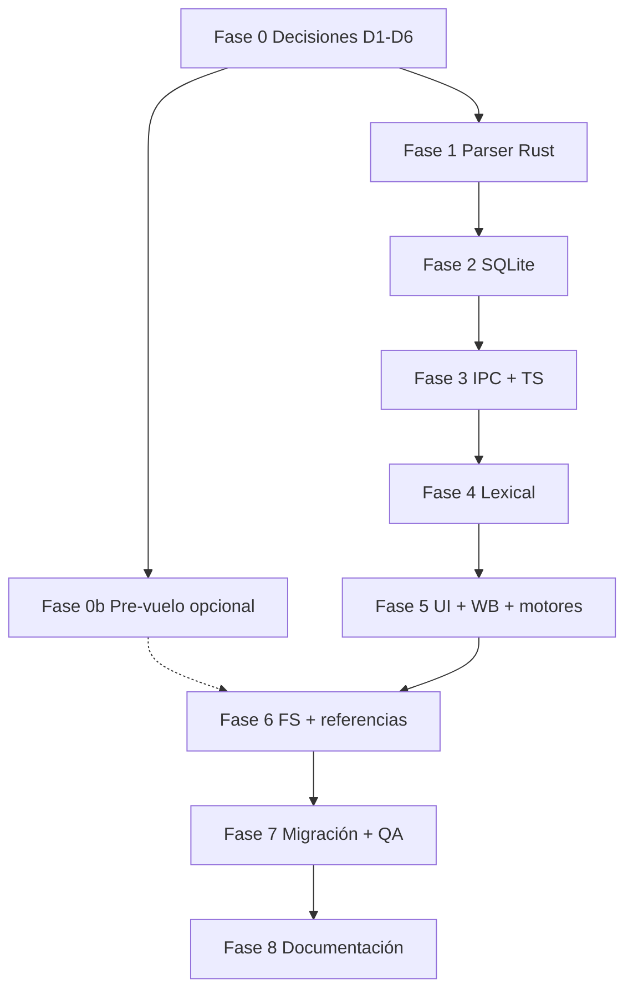

# Roadmap de implementación — Refactor parser de manuscrito

> **Documento de ejecución.** Guía paso a paso para implementar el diseño definido en [`plan.md`](plan.md) §1.  
> **No sustituye** `plan.md`: ese archivo conserva el baseline (§2), la auditoría (§11–§13), riesgos y decisiones. Aquí solo vive el **orden de trabajo** y los entregables por fase.  
> **Estado global:** 🟢 Fase 0 cerrada (2026-06-05) · **Go Fase 1** tras Fase 0b  
> **Última sincronización con `plan.md`:** 2026-06-05 (decisiones D1–D6 registradas)

---

## Resumen del objetivo

Reemplazar el modelo actual de manuscrito (**bloques arbitrarios separados por `+++`**, metadata YAML por segmento, `commitTimeTag` que inserta separadores) por un modelo centrado en **eventos narrativos**:

- Prosa libre fuera de eventos.
- Eventos delimitados por `+++event` / `+++end-event` con marco visual tipo cuaderno.
- Etiquetas en dos capas: **`barTags`** (origen, YAML) + **`{{time:…}}`** inline (evolución, cuerpo).
- Cada evento sincroniza una ficha Worldbuilding referenciable con `[[nombre]]`.
- Filosofía **opt-in explícito** (§1.1): sin inferencias, sin timeline sin marcas, guardado manual al disco.

**Fuera de alcance MVP:** ubicación, mapas, refactor de etiquetas en todo Worldbuilding (tipo 2 libre), Fase 9 exportación.

---

## Convenciones de este roadmap

| Símbolo | Significado |
|---------|-------------|
| ⬜ | Pendiente |
| 🔄 | En curso |
| ✅ | Completado |
| 🔴 | Bloqueante — no avanzar sin resolver |
| 🟡 | Decisión de producto requerida |

Cada fase termina con **criterio de salida** (tests + checklist manual mínimo). No saltar fases sin cumplir dependencias.

**Regla del plan:** no parchear **A3** (`commitTimeTag` → `insertBlockAtCursorLocal`) en el baseline; el refactor lo elimina (§11.8).

---

## Fase 0 — Decisiones bloqueantes (pre-código)

> **No iniciar Fase 1** hasta cerrar los ítems 🔴. Referencia: `plan.md` §13.8.

| # | Decisión | Resolución (2026-06-05) | Impacto | Estado |
|---|----------|-------------------------|---------|--------|
| D1 | Carpeta y plantilla evento WB | **A:** `Worldbuilding/Eventos/` + `event.yaml` + `EntityCategory::Event` | Scaffold, taxonomía, `template_map.json`, i18n, rutas §1.4 | ✅ |
| D2 | Schema multi-marca temporal | **Ampliar `time_markers`** — `segment_id`, `tag_kind` (`bar`/`inline`), `char_offset` (NULL en barra) | Migración SQL 005+, `timeline/project.rs`, plothole | ✅ |
| D3 | Migración proyectos legacy | **Sin legacy:** no hay proyectos v1; solo formato nuevo; Fase 7 = QA sin conversor | §1.11 simplificado | ✅ |
| D4 | Integridad FS antes del refactor | **Pre-vuelo (Fase 0b)** — fix A21/A22 antes del parser | `fs/crud.rs` | ✅ |
| D5 | Versiones (paralelo) | **Diferir reparación** — Git roto hasta tras parser; UI Historial visible | A1/A2/A6 en backlog | ✅ |
| D6 | Go explícito de implementación | **Sí** — autorizado Fase 1 tras Fase 0b | — | ✅ |

**D2 — por qué ampliar `time_markers` y no tabla nueva:** `timeline/project.rs`, `entity/timeline.rs` y plothole ya leen `time_markers`; una sola tabla con `tag_kind` + `char_offset` evita JOINs y duplicar lógica de orden/trayectoria (§1.5).

### Criterio de salida Fase 0

- [x] **D1 y D2** cerradas antes de Fase 1 (`plan.md` §13.1).
- [x] **D3** cerrada (sin migración legacy).
- [x] D1–D3 documentadas en `plan.md` §9.
- [x] D4 y D5 decididas (pre-vuelo / versiones diferidas).
- [x] D6 confirmada.

---

## Fase 0b — Pre-vuelo opcional (recomendado)

> Independiente del parser; mejora QA y reduce falsos positivos durante el refactor. Referencia: `plan.md` §13.4 paso 1.

### 0b.1 Integridad FS ↔ SQLite (A21, A22)

| Tarea | Archivo | Detalle |
|-------|---------|---------|
| `move_path` actualiza `blocks` | `src-tauri/src/fs/crud.rs` | Llamar `blocks::rename_file_path` (hoy solo `rename_path` lo hace; `move_path` no) |
| `delete_path` borra `blocks` | `src-tauri/src/fs/crud.rs` | Llamar `blocks::delete_blocks_for_file` (hoy solo `mark_path_removed`; watcher sí borra vía `reconcile.rs`) |

**Verificación:** mover y borrar un `.md` en `Manuscrito/` → timeline/backlinks coherentes sin esperar al watcher.

### 0b.2 Versiones — reparar o ocultar (A1, A2, A6, A27)

Si se elige **reparar** (track paralelo, no bloquea parser):

| Tarea | Archivo |
|-------|---------|
| Declarar `mod snapshot`, `mod diff` | `src-tauri/src/git/mod.rs` |
| Crear `commands/versioning.rs` | `src-tauri/src/commands/mod.rs`, `lib.rs` |
| Registrar IPC: `create_snapshot`, `list_snapshots`, `restore_snapshot`, `get_file_diff` | `src-tauri/src/lib.rs` |
| Resolver `versioning_config.rs` referenciado en `snapshot.rs` | `src-tauri/src/git/` |
| Registrar namespace `versions` | `src/i18n/config.ts` |

Si se elige **ocultar:** quitar o deshabilitar entrada en `GlobalNav` / `WorkspaceShell` hasta reparar.

**Estado Fase 0b:** ✅ (0b.1 hecho 2026-06-05; 0b.2 diferido por **D5** — versiones Git tras parser)

---

## Fase 1 — Parser Rust: split, segmentos, serialización

> Sustituye `block_splitter` basado en `(?m)^\+\+\+\s*$` por segmentos `fileHeader | freeText | event`.  
> Dependencias: Fase 0 — **D1 y D2 obligatorias** (`plan.md` §13.1: no iniciar parser sin carpeta/plantilla evento ni schema inline).

### 1.1 Tipos y contrato interno ✅ (2026-06-05)

| Tarea | Archivo | Entregable |
|-------|---------|------------|
| Definir `ParsedManuscript`, `ManuscriptSegment`, `EventSegment`, `BarTag`, `InlineTag` | `src-tauri/src/parser/types.rs` | Contrato §1.9 |
| Mantener compatibilidad temporal o flag de formato | `parser/mod.rs`, `parser/format.rs` | **D3:** coexistencia sin conversor — `ManuscriptFormat` + `detect_manuscript_format`; IPC editor sigue en `ParsedDocument` hasta Fase 3+ |
| Tipos TS espejo | `src/lib/types/manuscript.ts` | IPC futuro |

Estructura objetivo (§1.9):

```text
ParsedManuscript {
  fileHeader: { title, body }
  segments: (FreeText | Event {
    id, name, description, entityPath,
    barTags[], body, inlineTags[], closed: bool
  })[]
}
```

### 1.2 Split y parseo ✅ (2026-06-05)

| Tarea | Archivo | Detalle |
|-------|---------|---------|
| Reemplazar split `+++` genérico | `src-tauri/src/parser/block_splitter.rs` | `split_manuscript` + `split_blocks` legacy; `+++event` / `+++end-event` |
| Parser YAML apertura evento | `src-tauri/src/parser/frontmatter.rs` | `parse_event_opening` → `event`, `description`, `entity`, `barTags` |
| Scanner tokens inline | `src-tauri/src/parser/inline_scanner.rs` | `{{type:value}}` con offset UTF-8 |
| Orquestación read/write | `src-tauri/src/parser/document.rs` | `parse_manuscript_str`, routing `detect_manuscript_format`, adaptador IPC |
| Serialización round-trip | `src-tauri/src/parser/serializer.rs` | `serialize_manuscript` §1.4 |
| Título bloque 0 | `src-tauri/src/parser/manuscript_title.rs` | `serialize_manuscript` en Manuscrito; `title` ↔ stem |

### 1.2b Puente IPC — guardado seguro ✅ (2026-06-05)

> Hallazgo de auditoría post-1.2: `save_document` serializaba siempre con `serialize_document` (legacy `+++`), corrompiendo archivos §1.4 al guardar desde el editor.

| Tarea | Archivo | Detalle |
|-------|---------|---------|
| Adaptador inverso bloques → manuscrito | `src-tauri/src/parser/document.rs` | `document_to_manuscript`: bloque 0 → `fileHeader`; bloques con `metadata.event` → `EventSegment`; resto → `FreeText`. Preserva `closed` y `barTags` del parse previo en disco. |
| Routing de serialización | `document.rs` | `serialize_blocks_to_disk`: `detect_manuscript_format(raw_on_disk)` → `serialize_manuscript` o `serialize_document`. |
| `save_document` | `src-tauri/src/commands/editor.rs` | Lee `raw_on_disk` antes de escribir; usa `serialize_blocks_to_disk`. |
| Wiki-link convert | `src-tauri/src/references/convert.rs` | Mismo routing (evita reescritura legacy en manuscritos §1.4). |
| Tests `blocks::` desactualizados | `src-tauri/src/db/blocks.rs` | `parse_legacy_document_str` en fixtures que prueban `metadata.time` (hasta Fase 2 / D2). |
| Tests round-trip puente | `document.rs` | `document_to_manuscript_round_trip_preserves_closed_state`, `serialize_blocks_to_disk_uses_event_format_when_on_disk`. |

**Deuda explícita (Fase 3+, no bloquea Fase 2):**

- El adaptador IPC (`manuscript_to_document`) no expone `closed`, `inline_tags` estructurados ni IDs `::seg::` al frontend.
- `update_block_metadata` sigue rechazando manuscritos §1.4 (`error.parser.unsupported_format`).
- `time_markers` desde `barTags` / inline §1.4 queda para Fase 2 (D2).

```bash
cd src-tauri && cargo test parser::document:: -- --nocapture
cd src-tauri && cargo test blocks:: -- --nocapture
```

### 1.3 Tests obligatorios ✅ (2026-06-05)

```bash
cd src-tauri && cargo test parser:: -- --nocapture
```

| Caso | Referencia actual |
|------|-------------------|
| Round-trip serialize ↔ parse | `serializer.rs` tests |
| Archivo vacío → solo `fileHeader` | Adaptar `block_splitter` / `document` |
| Evento abierto vs cerrado | Nuevo |
| `barTags` opcional ausente vs vacío | §1.5 |
| Múltiples `{{time:…}}` en cuerpo | `inline_scanner` |
| Bloque 0 `title` | `manuscript_title.rs` |
| Prosa libre antes/después/entre eventos | Nuevo |

### Criterio de salida Fase 1

- [x] `cargo test parser::` verde con casos nuevos (47 tests).
- [x] Round-trip ejemplo §1.4 (`serializer::manuscript_round_trip_plan_example`).
- [x] `frontmatter.rs` tests legacy intactos (entidades / `.folder.md` sin cambio de API).

**Estado Fase 1:** ✅

---

## Fase 2 — SQLite, wiki-links e indexación temporal

> Dependencias: Fase 1 + decisión **D2**. Leer esquema **efectivo** post-migraciones 002–004, no solo `schema.sql` base (§13.3).

### 2.1 Migración SQL ✅ (2026-06-05)

| Tarea | Archivo | Detalle |
|-------|---------|---------|
| Migración 005 según D2 | `src-tauri/src/db/migrations/005_time_marker_multi_mark.sql` | `segment_id`, `tag_kind` (`bar`/`inline`), `char_offset` (NULL en barra) |
| Runner v5 | `src-tauri/src/db/migrations/mod.rs` | `CURRENT_SCHEMA_VERSION = 5`; idempotente vía `pragma_table_info` |
| `schema.sql` de referencia | `src-tauri/src/db/schema.sql` | Columnas + índices `idx_time_markers_segment_id`, `idx_time_markers_segment_trajectory` |
| Modelo Rust | `src-tauri/src/models/time_marker.rs` | `TimeMarkerTagKind`, campos nuevos en `TimeMarker` |

**Gaps 2.1 resueltos (2026-06-05):**

| Gap | Resolución |
|-----|------------|
| `schema.sql` sin `entities.status`/`metadata` | Añadidos; migraciones 002–003 ahora idempotentes (`pragma_table_info`) |
| `TimeMarker` sin `persisted_at` | Campo añadido en modelo Rust |
| `char_offset` u32 vs i32 | `TimeMarker.char_offset: Option<u32>` alineado con `InlineTag` |
| Test `CHECK (tag_kind)` | `migration_005_rejects_invalid_tag_kind` |
| Sin `marker_index` SQL | Orden vía sufijo `id` (`{segmentId}::bar::{n}`) — ver 2.2 |
| Sin FK en `segment_id` | Aceptado (identificador lógico §1.9) |

### 2.2 Persistencia y enlaces ✅ (2026-06-05)

| Tarea | Archivo | Detalle |
|-------|---------|---------|
| Upsert multi-marca por evento | `src-tauri/src/db/blocks.rs` | `barTags` time + `scan_inline_tags`; IDs `{segmentId}::bar::{n}` / `::inline::{offset}`; legacy `{blockId}::time` si `metadata.time` |
| Delete/rename `segment_id` | `blocks.rs` | Borrado por prefijo `{file}::seg::%`; `rewrite_segment_ids_for_file` en move/rename |
| Wiki-links en cuerpo de evento | `src-tauri/src/db/wiki_links.rs` | Sin cambio de API: `block_index` IPC = posición de segmento; test `sync_indexes_wikilink_in_event_block_body` |
| Sanitización metadata evento | `src-tauri/src/parser/metadata_util.rs` | Quita `time` de YAML cuando hay `event` (§1.4) |

**Reglas de routing `time_markers`:**

- Bloque con `metadata.event` + marcas indexables (`barTags` time o `{{time:…}}` inline) → N filas con `segment_id`.
- Bloque evento sin marcas → 0 filas (§1.1).
- Bloque legacy con `metadata.time` (aunque tenga `event`) → 1 fila `{blockId}::time`, `segment_id` NULL.

**Fuera de alcance 2.2** (siguiente fase):

| Ítem | Fase | Motivo |
|------|------|--------|
| Consultas timeline ordenadas por trayectoria | **Fase 5** | `timeline/project.rs` sigue `JOIN blocks`; usar `segment_id`/`char_offset` en SQL |
| `entity/timeline.rs`, `checker/plothole.rs` | **Fase 5** | Misma deuda de lectura |
| Tipos TS `TimeMarker` | **3.2** | `src/lib/types/models.ts` sin campos D2 |
| Columna `segment_index` en `wiki_links` | **3+** | `block_index` IPC suficiente por ahora |

### 2.3 Tests ✅ (2026-06-05)

```bash
cd src-tauri && cargo test blocks:: -- --nocapture
cd src-tauri && cargo test db::wiki_links:: -- --nocapture
```

| Caso | Test |
|------|------|
| Evento sin marcas → 0 `time_markers` | `event_without_marks_creates_zero_time_markers` |
| `barTags` + 2 inline → 3 filas ordenadas | `event_bar_tag_and_inline_tags_create_ordered_markers` |
| Wiki-links en cuerpo de evento | `sync_indexes_wikilink_in_event_block_body` |
| Legacy `metadata.time` intacto | `time_marker_created_when_time_present` |
| Rename actualiza `segment_id` | `rename_updates_segment_id_for_event_markers` |

### Criterio de salida Fase 2

- [x] `cargo test blocks::` verde (7 tests).
- [x] Tests 2.3 (marcas + wiki-links evento).
- [ ] `get_timeline_events` coherente con fixture §1.4 — **Fase 5** (lectura SQL timeline).

**Estado Fase 2:** ✅ (persistencia/indexación; timeline UI diferida a Fase 5)

---

## Fase 3 — IPC y contratos TypeScript

> Dependencias: Fases 1–2.

### 3.1 Comandos editor (extender o reemplazar)

**Estrategia:** API manuscript en **paralelo**; comandos legacy intactos hasta Fase 4 (Lexical).

| Comando legacy | Estado Fase 3 |
|----------------|---------------|
| `read_document` | Sin cambio (`ParsedDocument` vía adaptador) |
| `parse_document` | Sin cambio |
| `save_document` | Sin cambio (`serialize_blocks_to_disk` §1.4) |
| `update_block_metadata` | Sin cambio (inspector por índice) |

| Comando nuevo (§1.9) | Rol |
|---------------------|-----|
| `read_manuscript` | `ParsedManuscript` desde disco |
| `parse_manuscript` | Re-parsea y persiste |
| `save_manuscript` | Payload por segmentos; write → re-parse → persist |
| `update_event_metadata` | `barTags` / apertura de evento por `segmentIndex` |
| `create_event_at_cursor` | Inserta `+++event` tras segmento indicado |
| `close_event_at_cursor` | Cierra evento con `+++end-event` |
| `insert_inline_tag` | Inserta `{{time:…}}` en offset UTF-8 |
| `sync_event_entity` / `ensure_event_entity` | **Fase 5** |

| Archivo | Tarea |
|---------|-------|
| `src-tauri/src/commands/editor.rs` | Comandos legacy + manuscript |
| `src-tauri/src/lib.rs` | Registrar 7 comandos nuevos |
| `src-tauri/src/parser/document.rs` | `save_manuscript_and_persist`, CRUD segmentos |

**Punto frágil a preservar:** `save_manuscript` re-parsea disco tras escribir; tests `save_manuscript_round_trip_persists_markers` e `insert_inline_tag_and_close_event` validan round-trip.

### 3.2 Contratos frontend

| Archivo | Tarea |
|---------|-------|
| `src/lib/types/editor.ts` | `ParsedManuscript`, segmentos, `InlineTag` |
| `src/lib/types/models.ts` | Re-export si aplica |
| `src/lib/types/blockMetadata.ts` | Deprecar o adaptar campos legacy (`time` por bloque) |
| `src/lib/ipc.ts` | Sin cambio estructural; nuevos comandos |

### Criterio de salida Fase 3

- [x] Comandos `read_manuscript` / `save_manuscript` / CRUD evento registrados y testeados en Rust.
- [x] Comandos legacy (`read_document` / `save_document`) sin regresión.
- [x] Tipos TS (`manuscript.ts`, `editor.ts`, `models.ts`, `blockMetadata.ts`) alineados con Rust.
- [ ] Cableado frontend a manuscript — **Fase 4**.

**Estado Fase 3:** ✅

---

## Fase 4 — Lexical: nodos, plugins, hydrate/extract

> Dependencias: Fase 3. El frontend hoy es **100% modelo `+++` por índice** (`BlockSeparatorNode`, `ActiveBlockPlugin`).

### 4.1 Nodos Lexical (nuevos)

| Nodo | Rol | Sustituye |
|------|-----|-----------|
| `EventTagBar` | Barra `[Evento]: nombre \| chips` + 🏷️+ | `BlockMetadataNode` + `BLOQUE N` |
| Marco esquinas (`EventFrameNode` o decoradores) | `┌ ┐ └ ┘` sin hueco en OFF | `BlockSeparatorNode` visual |
| `InlineTimeTagNode` | Chip `{{time:…}}` en prosa | Chip único `time` por bloque |

| Archivo | Acción |
|---------|--------|
| `src/modules/editor/nodes/BlockSeparatorNode.ts` | Eliminar o dejar solo migración |
| `src/modules/editor/nodes/BlockMetadataNode.tsx` | Sustituir por `EventTagBar` |
| `src/modules/editor/nodes/*` | Añadir nodos nuevos |
| `src/modules/editor/EditorShell.tsx` | Registrar nodos y plugins |

**Estado 4.1:** ✅ Nodos `EventTagBarNode`, `EventFrameBottomNode`, `InlineTimeTagNode` + componentes UI; legacy (`BlockSeparatorNode`, `BlockMetadataNode`) registrados en paralelo hasta 4.2–4.3.

### 4.2 Plugins (nuevos / sustituir)

| Plugin | Rol |
|--------|-----|
| Commit evento desde panel | Abre evento en cursor; **no** usa `[+]` |
| Cierre `[-]` | Inserta `+++end-event` lógico en cursor |
| Expansión `[+]` | Solo en evento **cerrado**; expande tramo |
| Insertar inline tag | Tiempo en cursor **sin** `+++` |
| `ActiveEventContextPlugin` | Reemplaza `ActiveBlockPlugin`: `eventId`, abierto/cerrado |
| `HydrateDocumentPlugin` | Hidratar segmentos + offsets inline |
| `ExtractBlocksPlugin` | Extraer segmentos para save |

| Archivo | Acción |
|---------|--------|
| `src/modules/editor/plugins/InsertBlockSeparatorPlugin.tsx` | **Eliminar** ✅ |
| `src/modules/editor/plugins/ActiveBlockPlugin.tsx` | **Reemplazar** ✅ → `ActiveEventContextPlugin` |
| `src/lib/editor/documentSync.ts` | Reescribir hydrate/extract por segmentos ✅ |
| `src/lib/editor/manuscriptBlocks.ts` | Adaptar `isFileTitleBlock` → `fileHeader` ✅ |

**Estado 4.2:** ✅ Plugins `ActiveEventContextPlugin`, `InsertInlineTagPlugin`, `ManuscriptEventCommandsPlugin`; `HydrateDocumentPlugin` / `ExtractBlocksPlugin` por segmentos; store `read_manuscript` / `save_manuscript`; `EditorShell` sin legacy `ActiveBlock` / `InsertBlockSeparator`. Marco visual: **solo esquinas** (`┌ ┐ └ ┘`), sin bordes laterales `│`.

### 4.3 Eliminar pipeline legacy de tiempo

| Archivo | Acción |
|---------|--------|
| `src/modules/editor/commitTimeTag.ts` | **Eliminar** ✅ → `commitManuscriptLabel.ts` |
| `src/stores/useManuscriptLabelDraftStore.ts` | Replantear staging evento+etiquetas ✅ |
| `src/modules/editor/components/BlockMetadataChips.tsx` | Adaptar a inline + toggle OFF sin hueco ✅ |
| `src/stores/useLayoutStore.ts` | `inlineMetadataVisible`: OFF = texto plano puro ✅ |

**Estado 4.3:** ✅ Tiempo vía `insertInlineTagAtCursor` / `appendBarTimeToActiveEvent`; sin `+++` ni `insertBlockAtCursorLocal`. Toggle OFF: clase `narra-tags-off` oculta marco y chips.

### 4.4 Store editor

| Archivo | Cambios clave |
|---------|---------------|
| `src/stores/useEditorStore.ts` | Documento por segmentos; eliminar `insertBlockAtCursor` / `insertBlockAtCursorLocal` ✅; `activeEventContext` + adaptador `activeBlockIndex`; commit RAM sin `saveDocument` ✅ |

**Estado 4.4:** ✅ `updateEventAtCursor`, `appendBarTimeToActiveEvent`; `ManuscriptEventCard` cableado a staging y `[-]`.

### Criterio de salida Fase 4

- [x] Abrir documento legacy **falla gracefully** (`read_manuscript` → `error.parser.unsupported_format`; reservado Fase 7).
- [x] Hidratar ejemplo §1.4 → marcos + barra + inline visibles con toggle ON.
- [x] Toggle OFF → sin barra, esquinas ni espacio muerto (§1.3).
- [x] Guardar (Ctrl+S) produce archivo §1.4 en disco (`save_manuscript`).
- [x] **No** queda llamada a `insertBlockAtCursorLocal` en flujo de tiempo.

**Estado Fase 4:** ✅

### Auditoría Fase 4 (2026-06-04)

**Verificado en código**

| Ítem | Resultado |
|------|-----------|
| IPC editor manuscrito | `read_manuscript` / `save_manuscript` en `useEditorStore`; `saveDocument` extrae vía `ExtractBlocksPlugin` |
| Plugins activos | `HydrateDocumentPlugin`, `ExtractBlocksPlugin`, `ActiveEventContextPlugin`, `InsertInlineTagPlugin`, `ManuscriptEventCommandsPlugin` |
| Legacy eliminado del flujo | Sin `commitTimeTag`, `InsertBlockSeparatorPlugin`, `ActiveBlockPlugin`, `insertBlockAtCursor*` |
| Commit RAM | `commitManuscriptLabel` → inline / barra / evento; plugins reconcilian store |
| Toggle OFF | `narra-tags-off` oculta decoradores; inline como texto plano |
| Legacy en disco | `read_manuscript` → `error.parser.unsupported_format` (D3 → Fase 7) |
| Build TS | `npm run build` ✅ |

**Corregido en auditoría**

| Hallazgo | Fix |
|----------|-----|
| Panel tiempo leía solo `metadata.time` | `timeTagFromBlockMetadata` + `barTags` → `metadata.time` en adaptador; `findLastAddedTimeInDocument` incluye inline `{{time:…}}` |
| `commitManuscriptLabel` reconciliaba dos veces | Eliminado reconcile redundante (ya en plugins) |
| `EditorShell.tsx` formato roto | Reescrito |

**Pendiente — fuera de alcance Fase 4 (tareas Fase 5+)**

| Tarea | Fase | Notas |
|-------|------|-------|
| ~~`timeHour` en timeline / `barTags`~~ | 5.x | ✅ `BarTag.hour` + `metadata.timeHour` al guardar |
| ~~`sync_event_entity` rename al guardar~~ | 5.2 | ✅ `sync_manuscript_event_entities` |
| Eliminar nodos legacy del registro Lexical | 7 | `BlockSeparatorNode`, `BlockMetadataNode` registrados pero no hidratados |
| ~~Eliminar archivos huérfanos~~ | 5.4 | ✅ Hecho — ver §5.4 |
| ~~`applyBlockMetadataLocal` sin sync Lexical~~ | 5.4 | ✅ Eliminado con inspector/quick panel |
| Migración proyectos `+++` legacy | 7 | D3 |
| Actualizar `plan.md` §2 baseline | 8 | Sigue describiendo código pre-refactor |

---

## Fase 5 — UI panel, Worldbuilding, motores downstream

> Dependencias: Fases 3–4 + decisión **D1**.

### 5.1 Panel EVENTOS y flujo de commit

| Componente | Archivo | Entregable |
|------------|---------|------------|
| Tarjeta evento | `src/components/workspace-ui/manuscript/ManuscriptEventCard.tsx` | staging + `[-]`/`[+]` ✅ |
| Sección lateral | `src/modules/editor/sidePanel/SideEventSection.tsx` | Staging + sync cursor↔card (`eventSegmentIndex`) ✅ |
| Panel lateral | `src/modules/editor/EditorSidePanel.tsx` | Botón “Añadir etiqueta al documento”; commit **sin** `saveDocument` ✅ |
| Diálogo tiempo | `src/modules/editor/sidePanel/TimeTagDialog.tsx` | Inline en cursor; sin split ✅ |
| Sección tiempo | `src/modules/editor/sidePanel/SideTimeSection.tsx` | ~~`commitTimeTag`~~ ✅ `commitManuscriptLabel` + adaptador `barTags` |
| Autoguardado | `src/hooks/useEditorAutoSave.ts` | No persistir al commit de etiqueta (§1.3.1) ✅ |

**Reglas UX obligatorias (§1.3.1):**

- Crear evento **solo** vía panel + “Añadir etiqueta al documento”.
- `[+]` **no** crea eventos; solo expande tramo en bloque cerrado.
- `[-]` cierra en cursor.
- Escribir dentro de evento cerrado **no** requiere `[+]`.

### 5.2 Worldbuilding — ficha evento (tipo 1)

| Tarea | Archivo | Detalle |
|-------|---------|---------|
| Plantilla `event.yaml` | `src-tauri/resources/entity_templates/` | ✅ D1 |
| Carpeta en scaffold | `src-tauri/resources/templates/standard.json` | ✅ `Worldbuilding/Eventos/` (Lore legacy intacto) |
| Categoría taxonómica | `src-tauri/src/fs/indexer.rs`, `models/entity.rs`, `registry.rs` | ✅ `EntityCategory::Event` + color `Eventos` en taxonomy |
| Mapeo plantilla | `src-tauri/resources/defaults/template_map.json` | ✅ `Worldbuilding/Eventos/**` → `event` |
| IPC crear/sincronizar ficha | `commands/entity.rs`, `entity/sync_event.rs` | ✅ `ensure_event_entity` + `entityPath` commit; ✅ sync al guardar |
| Resolver colisiones `[[ ]]` | `src-tauri/src/entity/resolver.rs` | ✅ prioridad `Worldbuilding/Eventos/` sobre `Manuscrito/` |
| Indexación | `metadata_index.rs` + `upsert_file` | ✅ `refresh_entity_row` tras crear/actualizar ficha |

Sincronización (§1.10.0): renombrar evento en panel → ficha + `entity` + wikilinks; cambios en nombre/descripción al **guardar** manuscrito, no al commit RAM.

### 5.3 Timeline, calendario, plothole

| Módulo | Archivo | Cambio |
|--------|---------|--------|
| Timeline global | `src-tauri/src/timeline/project.rs` | ✅ trayectoria + campos `segmentId`/`tagKind`/`charOffset` en IPC |
| Timeline por entidad | `src-tauri/src/entity/timeline.rs` | ✅ `time_markers` por `entity_path` en orden trayectoria |
| Plothole | `src-tauri/src/checker/plothole.rs` | ✅ una fila por marca; ubicación sigue en metadata bloque (MVP) |
| Última fecha doc | `src/lib/calendar/dateTags.ts` | ✅ `barTags` + inline (`timeTagFromBlockMetadata`) |
| Última fecha proyecto | `src/lib/calendar/lastProjectTime.ts` | ✅ `findLastAddedTimeInDocument` + `timelineMarkerId` |
| Timestamp al guardar | `src/lib/editor/resolveBlockTime.ts` | ✅ `resolveTimeTimestampForBlock` (barTags + inline) |
| Entradas calendario | `src/lib/calendar/calendarEntries.ts` | ✅ id por marca (`timeMarks.ts`) |
| Mini-calendario / marcadores | `src/lib/calendar/calendarMarkers.ts` | ✅ consume `TimelineEvent[]` multi-marca del backend |
| Grafo | `src-tauri/src/graph/indexer.rs` | ✅ arista `sourcePath` ficha evento → manuscrito |

### 5.4 Componentes huérfanos (decisión en implementación)

| Componente | Archivo | Decisión |
|------------|---------|----------|
| Inspector metadata | ~~`MetadataInspector.tsx`~~ | ✅ **Eliminado** — sustituido por `SideEventSection` + `SideTimeSection` (§1.4) |
| Quick tag panel | ~~`EditorQuickTagPanel.tsx`~~ | ✅ **Eliminado** — flujo legacy `metadata.time` / `commitTimeTag` |
| Backlinks | `BacklinksPanel.tsx` → `SideReferencesSection.tsx` | ✅ **Montado** en `EditorSidePanel` (pestaña Referencias) |
| Store quick tools | ~~`useMetadataToolStore.ts`~~ | ✅ Eliminado con quick panel |

Pestañas laterales: **Evento y tiempo** (manuscrito) | **Referencias** (cualquier `.md` activo).

### 5.5 i18n

| Namespace | Acción | Estado |
|-----------|--------|--------|
| `editor` | `panel.event*` (`[-]`/`[+]`), `addTagToDocument`, barra (`addBarTag`, `metadata.event`/`time`), inline (`timeDialog*`, `timeInsert`) | ✅ `es/en/editor.json` |
| `worldbuilding` | `templates.event`, `fields.sourcePath`, `fields.eventLocation`, `fields.participants` | ✅ `es/en/worldbuilding.json` + `event.yaml` `labelKey` |
| `versions` | Namespace historial Git | ⬜ N/A — D5 diferido; A6 sin reparar (Fase 0b) |

### Criterio de salida Fase 5

Checklist §1.6 (ítems aplicables a Fase 5; verificado en código/tests):

- [x] `title` ↔ rename archivo — rename→title en `crud::rename_path` + `ensure_manuscript_title_on_disk` (`manuscript_title.rs` tests).
- [x] Evento solo nombre → barra sin chips; sin `barTags` en disco — `serializer.rs::event_without_bar_tags_serializes_without_key`.
- [x] Evento con tiempo en staging → `barTags` solo lo confirmado — staging en `useManuscriptLabelDraftStore`; commit vía `commitManuscriptLabel`.
- [x] Commit etiqueta sin disco; guardado manual — `runLabelCommitAsync` + `autosaveSuppressUntil`; sin `saveDocument` en commit.
- [x] `[-]` / `[+]` según §1.3.1.
- [x] Evento sin etiquetas → ausente en timeline — `blocks.rs::event_without_marks_creates_zero_time_markers`.
- [x] Trayectoria con `barTags` + inline — `entity/timeline.rs::timeline_lists_markers_by_entity_path_in_trajectory_order` + `blocks.rs::event_bar_tag_and_inline_tags_create_ordered_markers`.
- [x] Toggle etiquetas ON/OFF — `inlineMetadataVisible` + `.narra-tags-off` oculta barra, marco e inline.
- [x] Commit evento → ficha WB + `entityPath` en RAM.
- [x] Guardar → sync ficha WB (`sync_manuscript_event_entities`).
- [x] Renombrar evento al guardar → ficha + `entity` + wikilinks (`rename_path` + refactor).

**Fuera de alcance Fase 5 (otras fases):** migración legacy `+++` (Fase 7, D3); `title` en bloque 0 → rename archivo inverso (Fase 6); namespace `versions` (Fase 0b/D5).

**Estado Fase 5:** ✅ (5.1–5.5 completas; checklist §1.6 aplicable cubierto)

---

## Fase 6 — Integración filesystem y referencias

> Dependencias: Fases 1–5. Incluye fixes A21/A22 si no se hicieron en Fase 0b.

### 6.1 CRUD explorador

| Tarea | Archivo | ID auditoría |
|-------|---------|--------------|
| `move_path` → `blocks::rename_file_path` | `src-tauri/src/fs/crud.rs` | ✅ A21 — archivo: `rename_file_path`; carpeta: `rename_blocks_after_move` |
| `delete_path` → `blocks::delete_blocks_for_file` | `src-tauri/src/fs/crud.rs` | ✅ A22 — archivo: `delete_blocks_for_file`; carpeta: `delete_blocks_under_path` |
| Gate parser manuscrito | `parser/document.rs` (`should_parse_as_manuscript`) | ✅ A23 — solo `Manuscrito/**` para parser `+++event` |
| Crear archivo manuscrito | `src-tauri/src/fs/crud.rs` | ✅ `manuscript_initial_file_content` (§1.4, sin `+++`) |

### 6.2 Referencias y refactor

| Tarea | Archivo |
|-------|---------|
| Round-trip `+++event` en conversión mención | `references/convert.rs` | ✅ `serialize_blocks_to_disk` + gate A23; test multi-evento |
| Refactor rename con nuevo formato | `wikilink/replace.rs`, `refactor/rename_entity.rs` | ✅ test `+++event` preservado |
| Watcher / adopt | `fs/reconcile.rs` | ✅ `full_resync` → `resync_all_blocks` con gate A23 |
| Categoría taxonómica al indexar | `fs/indexer.rs` | ✅ `infer_category` → `event` en `Worldbuilding/Eventos/` |
| Plothole tras save | `commands/references.rs` | ✅ `request_consistency_check` en `convert_unlinked_mention` |

### 6.3 Sincronización editor ↔ disco externo

| Hook | Archivo | Detalle |
|------|---------|---------|
| Reload externo | `src/hooks/useEditorFsSync.ts` | ✅ dirty → diálogo; `remove` cierra tabs; `restore` recarga todas; rename con prefijo |
| Watcher | `src/hooks/useFsWatcher.ts` | ✅ `loadTree` + rebuild índice; incluye `restore` |
| Emisión CRUD | `src-tauri/src/commands/fs_ops.rs` | ✅ `fs-changed` en `create_file`, `move_path`, `delete_path` |
| Lógica rutas | `src/lib/editor/fsSync.ts` | ✅ tests `fsSync.test.ts` |

Validar: `fs-changed` con `kind: "restore"` — hook listo; backend versiones (D5) aún sin `restore_snapshot` IPC.

### Criterio de salida Fase 6

- [x] Mover/borrar manuscrito desde explorador → SQLite coherente (6.1 — tests `move_path` / `delete_path`).
- [x] Ficha WB con `+++` accidental **no** indexada como manuscrito (gate A23 — test `worldbuilding_event_markers_do_not_use_manuscript_parser`).
- [x] `convert_unlinked_mention` en manuscrito con varios eventos (6.2 — test `convert_in_second_event_preserves_event_markers`).
- [x] Renombrar entidad evento → wikilinks en manuscrito actualizados (6.2 — test `preserves_event_markers_when_renaming_wikilinks_in_manuscript`).

**Estado Fase 6:** ✅

---

## Fase 7 — Migración legacy y regresión completa

> Dependencias: Fases 1–6 + decisión **D3**.

### 7.1 Migración legacy (§1.11) — **simplificado por D3**

> **Decisión 2026-06-05:** no hay proyectos v1 en uso. **No** implementar conversor legacy. Fase 7 = QA round-trip del formato nuevo únicamente.

| Tarea | Detalle |
|-------|---------|
| ~~Conversor `+++` → `+++event`~~ | **Omitido** (D3) |
| QA round-trip §1.4 | Obligatorio |
| Opcional futuro | Si aparecen proyectos legacy, añadir `migrate_legacy.rs` entonces |

### 7.2 QA automatizada

```bash
cd src-tauri && cargo test parser:: blocks:: -- --nocapture
npm test
```

Actualizar tests frontend afectados:

- `src/lib/calendar/*.test.ts`
- `src/lib/calendar/dateTags.test.ts` (si existe)
- `src/lib/calendar/lastProjectTime.test.ts`
- `src/lib/explorer/manuscriptDropCollision.test.ts`

### 7.3 QA manual — checklist completo

#### Baseline regresión (§11.9)

- [ ] Abrir escena `Manuscrito/…` — estructura correcta en disco
- [ ] Editar tiempo **sin** `+++` espurio (regresión A3)
- [ ] Guardar → reabrir → marcas intactas
- [ ] Timeline y plothole reflejan cambios
- [ ] WB `.md` no pasa por `save_document` con `+++event`
- [ ] Historial versiones funciona **o** UI oculta (D5)
- [ ] Tres vías de guardado metadata probadas (§3.7): A `update_block_metadata` · B `save_document` · C staging → local → B

#### Eventos y Worldbuilding (§6.4 plan)

- [ ] Toggle etiquetas OFF/ON
- [ ] Crear evento → ficha `Worldbuilding/...` + `entity` en disco
- [ ] Panel bidireccional con cursor en evento
- [ ] `[-]` / `[+]` según reglas
- [ ] Commit sin disco; guardado manual
- [ ] Tiempo inline sin `+++` espurio
- [ ] `barTags` / inline / timeline trayectoria
- [ ] `[[nombre evento]]` resuelve
- [ ] Renombrar evento → ficha + wikilinks
- [ ] Round-trip §1.4 tras reabrir
- [ ] ~~Migración proyecto con `+++` antiguo~~ — **N/A** (D3: sin legacy)

### Criterio de salida Fase 7

- [ ] Todos los ítems §1.6 cumplidos.
- [ ] Migración D3 ejecutada y verificada en proyecto de prueba legacy.
- [ ] Sin regresiones en mapas, grafo, calendario-vista, consistencia (smoke test).

**Estado Fase 7:** ⬜

---

## Fase 8 — Documentación y cierre de versión

> No sustituye actualizar `plan.md`; cierra el ciclo §07-GUIDELINES-LLMs.

| Archivo | Contenido a actualizar |
|---------|------------------------|
| `06-ARCHITECTURE.md` | Parser `+++event`, IPC, flujo guardado, schema D2 |
| `05-CHANGELOG.md` | Entrada de versión (p. ej. v0.10.x o la que corresponda) |
| `04-TASK.md` | Marcar tarea parser; reencauzar Fase 9 exportación si aplica |
| `01-REQUIREMENTS.md` | Solo si cambia requisito de formato o carpeta eventos (D1) |
| `plan.md` §9 | Log final de decisiones D1–D6 |

### Criterio de salida Fase 8

- [ ] Documentación alineada con código implementado.
- [ ] Este roadmap: todas las fases marcadas ✅ o canceladas con motivo.

**Estado Fase 8:** ⬜

---

## Diagrama de dependencias entre fases



---

## Mapa rápido: baseline → objetivo

| Área | Código hoy (verificado) | Tras roadmap |
|------|-------------------------|--------------|
| Split manuscrito | `(?m)^\+\+\+\s*$` en `block_splitter.rs` | `+++event` / `+++end-event` + prosa libre |
| Lexical | `BlockSeparatorNode`, índice bloque | `EventTagBar`, marco, `InlineTimeTagNode` |
| Tiempo | `metadata.time` YAML + `commitTimeTag` inserta `+++` (A3) | `barTags` + `{{time:…}}` inline |
| Panel EVENTOS | `ManuscriptEventCard` placeholder | Cableado + WB sync |
| `time_markers` | 1 fila/bloque (`{blockId}::time`) | N filas por evento (D2) |
| WB eventos | Sin `Eventos/` ni `event.yaml` | Según D1 |
| `move_path` / `delete_path` | SQLite desincronizado (A21/A22) | Fix Fase 0b o 6 |
| Watcher | Parser `+++` en cualquier `.md` (A23) | Gate `Manuscrito/**` |
| Versiones | UI montada; IPC ausente (A1) | Fase 0b paralelo u ocultar |

---

## Control de progreso (resumen)

| Fase | Nombre | Estado |
|------|--------|--------|
| 0 | Decisiones bloqueantes | ✅ |
| 0b | Pre-vuelo opcional | ⬜ |
| 1 | Parser Rust | ⬜ |
| 2 | SQLite + wiki-links | ⬜ |
| 3 | IPC + contratos TS | ⬜ |
| 4 | Lexical | ⬜ |
| 5 | UI + Worldbuilding + motores | ⬜ |
| 6 | FS + referencias | ⬜ |
| 7 | Migración + QA | ⬜ |
| 8 | Documentación | ⬜ |

---

## Referencias cruzadas

| Necesitas… | Consulta en `plan.md` |
|------------|----------------------|
| Diseño UX y formato disco | §1 |
| Baseline código actual | §2, §2.7–§2.13 |
| Matriz de archivos afectados | §3 |
| Puntos frágiles F1–F17 | §4 |
| Auditoría A1–A28 | §11 |
| Schema inline D2 | §13.3 |
| Criterios MVP completos | §1.6 |
| Tests detallados | §6 |

---

## Auditoría de consistencia (2026-06-05, 2.ª pasada)

> Comparación `plan.md` ↔ `plan_roadmap.md` ↔ código en repo. Sin cambios de código de aplicación; solo verificación documental.

### Veredicto global

| Documento | Estado |
|-----------|--------|
| `plan.md` §1 (diseño) | Spec cerrada; no implementada en código |
| `plan.md` §2 / §11 (baseline) | **Precisa** — hallazgos reproducibles en repo |
| `plan_roadmap.md` | **Alineado** tras correcciones de esta auditoría (D1/D2 bloqueantes Fase 1, D3→Fase 7, módulos §13.6) |

### Hallazgos del código — confirmados ✅

| ID / tema | Afirmación `plan.md` | Verificación en repo |
|-----------|----------------------|----------------------|
| Split legacy | `(?m)^\+\+\+\s*$` en `block_splitter.rs` | ✅ L15 `Regex::new(r"(?m)^\+\+\+\s*$")` |
| A3 | ~~`commitTimeTag` siempre inserta bloque~~ | ✅ **Resuelto Fase 4** — eliminado; `commitManuscriptLabel` |
| A4 | ~~`applyExtractedBodies` no crea/elimina bloques~~ | ✅ **Resuelto Fase 4** — `applyExtractedManuscript` por segmentos |
| A1/A2 | Git snapshot/diff no compilados | ✅ `git/mod.rs` solo `mod init` |
| A6 | i18n `versions` no registrado | ✅ `i18n/config.ts` sin namespace; existen `en/es/versions.json` |
| A8/A28 | ~~`ManuscriptEventCard` placeholder~~ | ✅ **Resuelto Fase 5.1** — staging + `[-]`/`[+]` |
| A21 | `move_path` no actualiza `blocks` | ✅ `crud.rs` L174–180 — solo `reconcile::rename_paths` |
| A22 | `delete_path` no borra `blocks` | ✅ `crud.rs` L209 — solo `mark_path_removed` |
| A21 fix parcial | `rename_path` sí actualiza `blocks` | ✅ `crud.rs` L112–113 `blocks::rename_file_path` |
| A25 | 1 `time_marker` por bloque | ✅ `blocks.rs` L115 `format!("{}::time", block.id)` |
| A24 | ~~Sin `EntityCategory::Event`~~ | ✅ Resuelto Fase 5.2 — `EntityCategory::Event` |
| A24 | ~~Sin `event.yaml`~~ | ✅ `resources/entity_templates/event.yaml` |
| Scaffold | `Eventos_Historicos_Clave` bajo Lore | ✅ `standard.json` |
| Huérfanos UI | Inspector/QuickTag eliminados; Backlinks en pestaña Referencias | ✅ Fase 5.4 |
| A27 | `VersionHistoryPanel` montado | ✅ `WorkspaceShell.tsx` |
| Tests parser | Tests en módulos parser | ✅ **21** tests `parser::` (`cargo test --list`, jun 2025) |
| `inline_scanner` | No existe | ✅ ausente en `src-tauri/src/parser/` |
| `commands/versioning.rs` | No existe | ✅ ausente |
| IPC versiones | Ausentes en `lib.rs` | ✅ 58 comandos; 0 de versiones |
| A10 | `editor/risk.rs` sin uso en save | ✅ `commands/editor.rs` sin referencia a `risk` |
| A11 | Cualquier `.md` ≠ WB → manuscrito | ✅ `entityPath.ts` `isEntityPath`; `useEditorStore` L596 |
| A16 | ~~`reconcileDocumentBlocksFromEditor`~~ | ✅ **Resuelto Fase 4** — `reconcileManuscriptFromEditor` |
| A17 | ~~`insertBlockAtCursor` persiste disco~~ | ✅ **Resuelto Fase 4** — eliminado del store |
| A18 | ~~`getBlockIndexAtTopLevel`~~ | ✅ **Resuelto Fase 4** — `getEventContextAtTopLevel` + `ActiveEventContextPlugin` |
| A23 | Watcher parsea todo `.md` con parser `+++` | ✅ `reconcile.rs` L66–68, L158 |
| Diseño §1 en frontend | `ParsedManuscript` / `barTags` / nodos §1.4 | ✅ Fases 3–4; Rust + TS alineados |
| `cargo check` | Compila con warnings | ✅ 26 warnings (jun 2025) |
| Tests `blocks::` | 2 tests en `blocks.rs` | ✅ `time_marker_created` + otro |

### Inconsistencias corregidas en `plan_roadmap.md`

| Antes | Corrección |
|-------|------------|
| D3 apuntaba a “Paso 8” | → **Fase 7** (migración; `plan.md` Paso 7) |
| D4 “durante Fase 7” | → **Fase 6** (FS; alineado con §5 Paso 6) |
| Fase 1: “D1 no obligatoria” | → **D1 y D2 obligatorias** (§13.1) |
| Fase 4: legacy en “Fase 8” | → **Fase 7** |
| Faltaban módulos §13.6 | Añadidos `graph/indexer`, `calendarMarkers`, `fs/indexer`, plothole scheduler |
| Faltaban 3 vías guardado metadata | Añadido en checklist Fase 7 (§3.7) |
| Fase 1.1 “legacy hasta Fase 8” | → **Fase 7** (Fase 8 = solo documentación) |

### Gaps menores (no bloqueantes; ya cubiertos o diferidos)

| Tema | Notas |
|------|-------|
| `plan.md` cita 18 tests `parser::` | Repo tiene **21** — drift menor en conteo del plan |
| `timeHour` en diseño nuevo | §2.13: “definir en implementación” — roadmap no detalla; coherente con plan |
| Tipo 2 evento WB libre | Fuera de MVP en ambos documentos |
| `editor/risk.rs` / auto-snapshot | A10 — paralelo opcional Fase 0b; no en camino crítico parser |
| §6.3 manual legacy (separador mecánico) | Obsoleto tras refactor; Fase 7 usa §6.4 — roadmap correcto |

### Orden de fases: `plan.md` §5 vs `plan_roadmap.md`

| `plan.md` Paso | `plan_roadmap.md` | ¿Equivalente? |
|----------------|-------------------|---------------|
| Paso 0 (diseño) | Fase 0 | ✅ |
| Pre-vuelo §13.4.1 | Fase 0b | ✅ |
| Pasos 1–7 | Fases 1–7 | ✅ |
| Docs §3.5 | Fase 8 | ✅ (roadmap añade fase explícita) |

### Conclusión

El roadmap es **ejecutable y consistente** con `plan.md` tras las correcciones de esta revisión. El código coincide con el baseline §2/§11 del plan; **ningún ítem del diseño §1 está implementado aún**. Prerrequisito real para escribir código: cerrar **D1**, **D2** y **D6**; **D3** antes de Fase 7.
