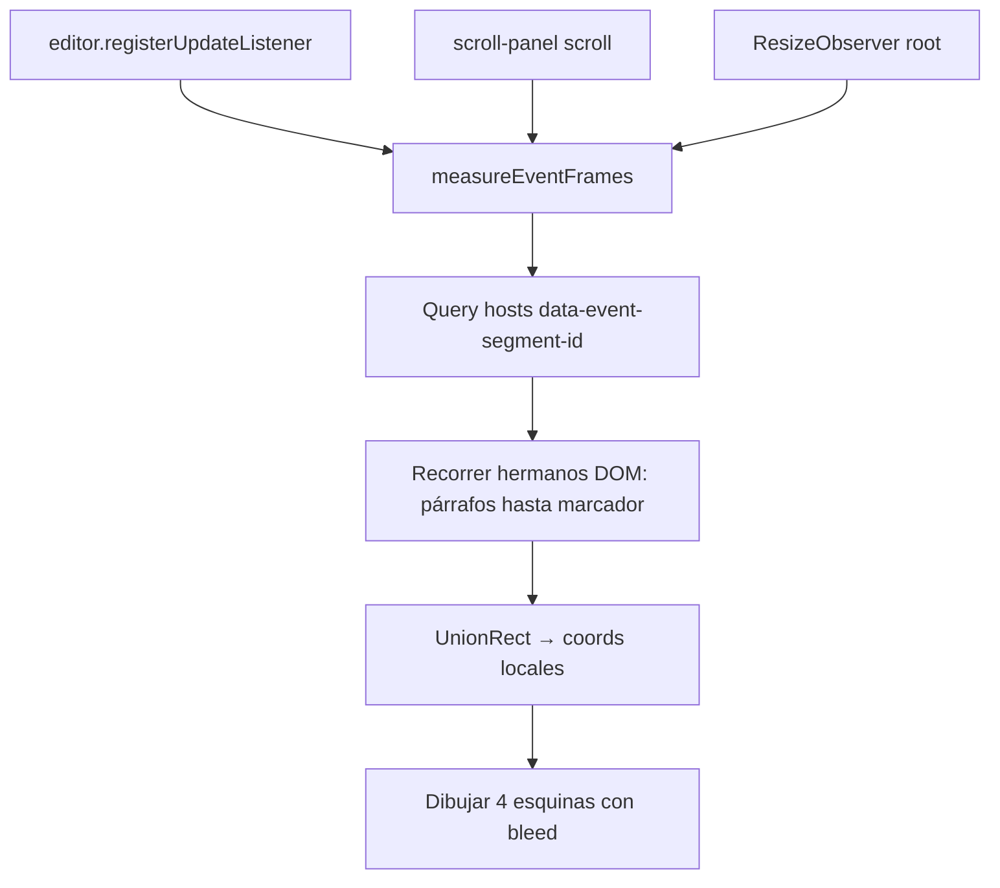

# FIX-006 — Rediseño marco de evento (chips + esquinas overlay)

> Plan de implementación detallado. Spec origen: [`fix-backlog.md` §7](../fix-backlog.md).  
> **Estado:** 🔄 Implementado · **QA manual §9 pendiente**

---

## 1. Problema y objetivo

**Problema:** El marco de evento actual mezcla en un solo bloque Lexical: esquinas, líneas horizontales, chips desiguales y texto `[Evento]:`. No coincide con el boceto del usuario. Una implementación anterior falló por mezclar demasiados cambios sin separar **contenido editable**, **chips** y **decoración de esquinas**.

**Boceto del usuario (jun 2026):**

```text
Texto de prueba                    ← prosa (fuera o dentro del evento según contexto)

[eventTest]  [2026-01-17]  [🏷️+]   ← fila de chips (cajas rojas/morado = posición, no color)

┌                                  ┐   ← SOLO esquinas, sin líneas horizontales
│  prosa del evento…               │      dibujadas SOBRE el editor (overlay)
│  {{time:…}} inline               │
└                                  ┘

textotexto|                        ← prosa libre tras evento cerrado
```

**Objetivo FIX-006:**

| # | Entregable |
|---|------------|
| 1 | **Chips unificados** — evento y tiempo mismo estilo pill (`ManuscriptTagChip`) |
| 2 | **Fecha ISO en UI** — `AAAA-MM-DD` o `AAAA-MM-DD / HH:00` (disco sigue `d.m.aaaa`) |
| 3 | **Fila de chips encima del marco** — sin esquinas en la misma fila; botón `+` agrupado a la izquierda |
| 4 | **Esquinas fuera de Lexical** — overlay absoluto **sobre** el área de prosa, no nodos en el flujo |
| 5 | **Solo esquinas** — sin `border-t` / `border-b` |
| 6 | **Esquinas siempre visibles** — toggle etiquetas OFF oculta chips, **no** esquinas |
| 7 | **Comportamiento funcional igual** — extract, `[-]`/`[+`, cerrar/abrir evento, panel lateral |

**Fuera de alcance:**

| Tema | Por qué |
|------|---------|
| FIX-005 | Ya implementado |
| FIX-007 | Borrador sucio al cerrar |
| ERAII-001 | Adaptador `ParsedDocument` |
| Wire completo del botón `🏷️+` en barra | Hoy solo `stopPropagation`; añadir en sub-PR opcional |
| `BlockSeparatorNode` entre bloques libres | Queja principal es marco de evento; tratar aparte si QA lo pide |
| Cambios en disco / parser Rust | Solo presentación UI |

---

## 2. Por qué falló el enfoque anterior (lección)

El plan en [`fix-backlog.md` §7](../fix-backlog.md) proponía **seguir metiendo esquinas dentro de `EventTagBar` / `EventFrameBottom`** como DecoratorNodes Lexical, solo reordenando filas y CSS.

Eso choca con lo que pides ahora:

| Enfoque backlog §7 | Lo que pides |
|--------------------|--------------|
| Esquinas en `EventTagBar` (misma fila o fila 2) **dentro** del árbol Lexical | Esquinas **fuera**, **sobre** el editor |
| `EventFrameBottomNode` renderiza `└ ┘` en flujo del documento | Pie del marco = overlay, no bloque en flujo |
| Toggle OFF oculta hosts enteros (`.narra-tags-off`) | OFF = sin chips; esquinas siguen |

**Anti-patrón a evitar:** refactorizar chips + mover esquinas + cambiar toggle + ISO dates **en un solo diff** sin capas ni plugin de overlay.

**Regla de oro:** Lexical conserva **datos y prosa**; la **decoración del marco** (┌ ┐ └ ┘) vive en una capa React **hermana** del `ContentEditable`, posicionada con `getBoundingClientRect`.

---

## 3. Auditoría del código actual

### 3.1 Árbol Lexical por evento (hoy)

```text
EventTagBarNode          ← DecoratorNode; DOM: .narra-event-tag-bar
  └─ EventTagBar         ← ┌ chips+border+┐ en UNA fila
ParagraphNode × N        ← cuerpo editable
EventFrameBottomNode?    ← DecoratorNode; DOM: .narra-event-frame-bottom-host
  └─ EventFrameBottom    ← └ border-b ┘
```

Registrado en [`EditorShell.tsx`](../../src/modules/editor/EditorShell.tsx) L58–78.

### 3.2 Archivos implicados

| Archivo | Rol hoy | Cambio FIX-006 |
|---------|---------|----------------|
| [`EventTagBar.tsx`](../../src/modules/editor/components/EventTagBar.tsx) | Esquinas + `[Evento]:` + chips + `ml-auto` + `border-t` | Solo fila chips; sin esquinas ni bordes |
| [`EventFrameBottom.tsx`](../../src/modules/editor/components/EventFrameBottom.tsx) | Pie visual con bordes | **Eliminar UI** → marcador invisible |
| [`EventTagBarNode.tsx`](../../src/modules/editor/nodes/EventTagBarNode.tsx) | Host decorador barra | + `data-segment-id` en host DOM |
| [`EventFrameBottomNode.tsx`](../../src/modules/editor/nodes/EventFrameBottomNode.tsx) | Host decorador pie | Marcador cero altura; `decorate()` vacío |
| [`TimeTagChip.tsx`](../../src/modules/editor/components/TimeTagChip.tsx) | Muestra `value` crudo | ISO vía `formatTimeTagDisplay` |
| [`InlineTimeTagNode.tsx`](../../src/modules/editor/nodes/InlineTimeTagNode.tsx) | Chip inline | Reutilizar `TimeTagChip` con ISO |
| [`globals.css`](../../src/styles/globals.css) L264–277 | OFF oculta barra **y** pie enteros | OFF solo chips + inline |
| [`EditorShell.tsx`](../../src/modules/editor/EditorShell.tsx) | `narra-tags-off` en wrapper | + contenedor overlay + plugin |
| [`documentSync.ts`](../../src/lib/editor/documentSync.ts) | hydrate/extract/close/expand | **Sin cambio de lógica** (mantener nodos) |
| [`focusEditorAtEnd.ts`](../../src/lib/editor/focusEditorAtEnd.ts) | Ignora decoradores | Sin cambio |
| [`manuscript-design.md`](../manuscript-design.md) §2 | OFF = sin esquinas | Actualizar tras implementar |

### 3.3 Lo que NO se toca

- `extractManuscriptFromEditor` / `hydrateLexicalManuscript` — siguen usando `EventTagBarNode` + `EventFrameBottomNode` como delimitadores lógicos.
- `$closeEventAtParagraph` / `$expandEventAtParagraph` — siguen insertando/eliminando `EventFrameBottomNode`.
- Parser Rust, `save_manuscript`, `barTags` en disco.
- Panel lateral (`EditorSidePanel`) — flujo de commit evento/tiempo igual.

---

## 4. Arquitectura objetivo

### 4.1 Separación de capas

```text
.narra-editor (relative)
├── .narra-editor-surface (relative flex-1 flex-col min-h-full)   ← NUEVO wrapper
│   ├── ContentEditable (.narra-editor-input)   ← solo prosa + chips row hosts + marcadores
│   └── EventFrameOverlayLayer                ← absolute inset-0, pointer-events-none, z-10
│         └── EventFrameCorner × 4 por evento (┌ ┐ └ ┘)
└── plugins Lexical (null render)
```

### 4.2 Qué queda dentro de Lexical (flujo documento)

| Nodo | Visible | Propósito |
|------|---------|-----------|
| `EventTagBarNode` | Fila chips (toggle OFF → host vacío / sin chips) | Metadata evento en RAM; ancla overlay |
| `ParagraphNode` | Prosa | Edición |
| `EventFrameBottomNode` | **Marcador invisible** (altura 0) | Delimita cierre `+++end-event` en extract; ancla esquina inferior |

### 4.3 Qué sale de Lexical (overlay)

| Elemento | Comportamiento |
|----------|----------------|
| Esquinas `┌ ┐ └ ┘` | Posicionadas con `position: absolute` respecto a `.narra-editor-surface` |
| Sin líneas entre esquinas | Solo glifos en las cuatro esquinas (o dos si evento abierto) |
| Bleed horizontal | Esquinas ligeramente fuera del margen del texto (`--narra-event-frame-bleed`, p. ej. 12px) |
| `pointer-events: none` | Clics pasan al editor (FIX-004 intacto) |
| Siempre visible | No depende de `inlineMetadataVisible` |

### 4.4 Evento abierto vs cerrado

| Estado | Marcador Lexical | Overlay |
|--------|------------------|---------|
| **Cerrado** | `EventFrameBottomNode` presente | ┌ ┐ arriba del cuerpo + └ ┘ abajo del cuerpo |
| **Abierto** | Sin `EventFrameBottomNode` | Solo ┌ ┐ arriba del cuerpo (sin pie) |

Cuerpo = unión de `getBoundingClientRect` de todos los `ParagraphNode` entre barra y marcador (o hasta siguiente barra / fin).

### 4.5 Diagrama flujo medición overlay



---

## 5. Estrategia en cuatro fases (orden obligatorio)

| Fase | Qué | PR / commit lógico | Riesgo |
|------|-----|-------------------|--------|
| **A** | `ManuscriptTagChip` + ISO en barra e inline | Solo UI chips; esquinas legacy aún visibles | Bajo |
| **B** | `EventTagBar` solo chips; quitar bordes/texto `[Evento]:`; CSS toggle parcial | Mejora fila superior | Bajo |
| **C** | Overlay plugin + marcador invisible + quitar esquinas de componentes Lexical | **Núcleo del boceto** | Medio–Alto |
| **D** | Spec `manuscript-design.md` + QA manual | Cierre | Bajo |

**No saltar fase C** pensando que mover esquinas dentro de `EventTagBar` basta — eso reproduce el enredo.

---

## 6. Cambios por archivo

### 6.1 Fase A — Chips unificados + ISO

#### Nuevo: `src/modules/editor/components/ManuscriptTagChip.tsx`

```tsx
interface ManuscriptTagChipProps {
  icon: LucideIcon;
  label: string;
  title?: string;
  visible?: boolean;
  variant?: "default" | "dashed"; // dashed solo para botón +
}
```

Estilo base (extraído de [`TimeTagChip.tsx`](../../src/modules/editor/components/TimeTagChip.tsx) L17–18): pill, `rounded-full`, `border-border/60`, `text-[11px]`.

#### Refactor: `TimeTagChip.tsx`

- Props: `value: string`, `hour?: number | null`, `visible?`
- Usar `useCalendarStore` → `calendar.hoursEnabled !== false` para `includeHour`
- `label = parseTimeTag(value)` → `formatTimeTagDisplay(parts, { hour, includeHour })` ; fallback: raw + clase error (preparación FIX-010)

#### Nuevo: `EventTagChip.tsx` (o inline en EventTagBar)

- Icono `Bookmark` o `Tag`
- `label = eventName.trim() || placeholder i18n`

#### `InlineTimeTagNode.tsx`

- Pasar `hour={null}` a `TimeTagChip` (inline sin hora en disco hoy)

#### Tests Vitest (opcional fase A)

- Extender [`dateTags.test.ts`](../../src/lib/calendar/dateTags.test.ts) si hace falta; no duplicar tests de `formatTimeTagDisplay`.

---

### 6.2 Fase B — Barra solo chips

#### `EventTagBar.tsx`

**Eliminar:**

- Spans `┌` `┐`
- `border-t`, `narra-event-tag-bar-inner` con borde
- Texto `[{t("metadata.event")}]: {displayName}`
- `ml-auto` del botón `+`

**Dejar:**

```tsx
<div className="narra-event-tags-row flex flex-wrap items-center gap-1.5 py-1" data-event-segment-id={segmentId}>
  <EventTagChip … />
  {timeTags.map(… => <TimeTagChip key=… value=… hour={tag.hour} />)}
  <button type="button" className="… border-dashed …">🏷️+</button>
</div>
```

**Toggle:** si `!inlineMetadataVisible` → `return null` (igual que hoy).

#### `globals.css` — primer paso toggle

```css
/* Sustituir regla que oculta hosts enteros */
.narra-tags-off .narra-event-tags-row,
.narra-tags-off .narra-inline-time-tag-host {
  display: none !important;
}
/* NO ocultar .narra-event-frame-bottom-host todavía (fase C lo vuelve invisible siempre) */
```

---

### 6.3 Fase C — Overlay (núcleo)

#### Nuevo: `src/lib/editor/measureEventFrames.ts`

Tipos y función pura (testeable):

```typescript
export interface EventFrameRect {
  segmentId: string;
  closed: boolean;
  top: number;
  left: number;
  width: number;
  height: number;
}

/** Dado rootElement del ContentEditable, devuelve rects en coords locales del surface. */
export function measureEventFrames(rootElement: HTMLElement): EventFrameRect[]
```

Algoritmo DOM:

1. `rootElement.querySelectorAll('[data-event-segment-id]')` en hosts de barra **o** query `[data-event-tag-bar]` hosts.
2. Por cada `segmentId`:
   - `barHost` = `.narra-event-tag-bar` cuyo descendiente tiene `data-event-segment-id`
   - Recorrer `nextElementSibling` desde `barHost`:
     - Si `[data-event-frame-bottom]` con mismo segmentId → `closed=true`, parar
     - Si otro `[data-event-tag-bar]` → parar (evento abierto hasta ahí)
     - Si `p` / `.narra-editor-input > *` párrafo → acumular rect
   - `unionRect(paragraphs)` ; expandir horizontalmente por `bleed`
   - `top` = top del primer párrafo ; `height` = bottom último párrafo − top

3. Si no hay párrafos (evento vacío), usar rect mínimo bajo la barra (altura ~1 línea).

#### Nuevo: `src/modules/editor/components/EventFrameOverlayLayer.tsx`

```tsx
export function EventFrameOverlayLayer({ frames }: { frames: EventFrameRect[] }) {
  return (
    <div className="narra-event-frame-overlay pointer-events-none absolute inset-0 z-10" aria-hidden>
      {frames.map(f => (
        <EventFrameCorners key={f.segmentId} rect={f} closed={f.closed} />
      ))}
    </div>
  );
}
```

`EventFrameCorners`: cuatro `<span className="narra-event-corner absolute font-mono text-xs text-muted-foreground">` en `top/left`, `top/right`, `bottom/left`, `bottom/right` con transform para bleed.

#### Nuevo: `src/modules/editor/plugins/EventFrameOverlayPlugin.tsx`

- `useLexicalComposerContext`
- Estado `frames: EventFrameRect[]`
- `scheduleMeasure()` con `requestAnimationFrame` debounce
- `editor.registerUpdateListener` → schedule
- `editor.registerRootListener` → attach scroll listener on `.scroll-panel` ancestor + `ResizeObserver`
- Leer `rootElement` del ContentEditable

#### `EditorShell.tsx`

```tsx
<div className="narra-editor relative flex …">
  <div className="narra-editor-surface relative flex min-h-full flex-1 flex-col">
    <RichTextPlugin contentEditable={…} />
    <EventFrameOverlayPlugin />
  </div>
  …plugins
</div>
```

#### `EventTagBarNode.tsx` — host DOM

```typescript
createDOM() {
  el.className = "narra-event-tag-bar";
  el.dataset.eventSegmentId = this.__segmentId; // facilitar query
  …
}
```

#### `EventFrameBottomNode.tsx` — marcador invisible

```typescript
createDOM() {
  el.className = "narra-event-frame-marker";
  el.dataset.eventFrameBottom = "true";
  el.dataset.eventSegmentId = this.__segmentId;
  el.style.height = "0";
  el.style.overflow = "hidden";
  el.style.margin = "0";
  el.style.padding = "0";
  …
}

decorate() {
  return null; // sin UI Lexical
}
```

**Eliminar** [`EventFrameBottom.tsx`](../../src/modules/editor/components/EventFrameBottom.tsx) (componente) o dejar stub vacío.

#### `globals.css` — estado final

```css
:root {
  --narra-event-frame-bleed: 0.75rem;
}

.narra-event-frame-marker {
  height: 0;
  overflow: hidden;
  margin: 0;
  padding: 0;
  border: 0;
}

.narra-event-tag-bar:empty {
  /* chips OFF: sin altura, pero overlay no depende de esto */
  min-height: 0;
}

.narra-tags-off .narra-event-tags-row,
.narra-tags-off .narra-inline-time-tag-host {
  display: none !important;
}

/* ELIMINAR bloque que oculta .narra-event-tag-bar y .narra-event-frame-bottom-host entero */
```

---

### 6.4 Fase D — Documentación

| Archivo | Cambio |
|---------|--------|
| [`manuscript-design.md`](../manuscript-design.md) §2 | Diagrama: chips encima; esquinas siempre; OFF = sin chips |
| [`fix-backlog.md`](../fix-backlog.md) §7 | Nota «supersedido por FIX-006 plan overlay» |
| [`implementation-plan.md`](../implementation-plan.md) | Enlace + estado |

---

## 7. Qué NO hacer

| Prohibido | Por qué |
|-----------|---------|
| Poner esquinas otra vez en `EventTagBar` / `EventFrameBottom` | Contradice boceto overlay |
| Eliminar `EventFrameBottomNode` del árbol Lexical | Rompe extract, `[-]`/`[+]` |
| Medir esquinas solo con nodos Lexical sin DOM | Overlay necesita rects de párrafos renderizados |
| Ocultar overlay con `narra-tags-off` | Esquinas siempre visibles |
| Cambiar `documentSync` extract en la misma PR | Scope UI |
| `pointer-events: auto` en overlay | Rompe clic/foco editor |
| Un solo PR sin fases A→C | Repite fallo anterior |

---

## 8. Pasos de implementación (checklist)

```
[ ] A.1 ManuscriptTagChip + EventTagChip
[ ] A.2 TimeTagChip ISO + InlineTimeTagNode
[ ] A.3 npm run build
[ ] B.1 EventTagBar solo chips (sin esquinas/bordes)
[ ] B.2 CSS toggle parcial (solo chips)
[ ] B.3 Smoke visual barra
[ ] C.1 measureEventFrames.ts (+ tests Vitest mínimos)
[ ] C.2 EventFrameOverlayLayer + EventFrameOverlayPlugin
[ ] C.3 EditorShell wrapper surface
[ ] C.4 EventFrameBottomNode marcador invisible; quitar EventFrameBottom UI
[ ] C.5 Quitar esquinas de EventTagBar (si quedaba algo fase B)
[ ] C.6 globals.css final
[ ] C.7 npm run build && npm test
[ ] D.1 QA manual §9
[ ] D.2 Actualizar manuscript-design §2
[ ] D.3 Marcar FIX-006 ✅ en implementation-plan + fix-backlog
```

---

## 9. Verificación manual (obligatoria)

En **`npm run tauri dev`**.

### 9.1 Chips y fechas

| # | Escenario | Esperado |
|---|-----------|----------|
| 1 | Evento + 2 tiempos en barra | Tres pills mismo estilo + botón `+` **junto** a chips (izquierda) |
| 2 | `barTags` con `17.1.0` | Chip muestra `…-01-17` (año del calendario) |
| 3 | Horas ON + `hour` en barTag | `AAAA-MM-DD / HH:00` |
| 4 | Inline `{{time:17.1.0}}` | Chip inline ISO (solo fecha) |

### 9.2 Esquinas overlay

| # | Escenario | Esperado |
|---|-----------|----------|
| 5 | Evento cerrado con prosa | ┌ ┐ sobre primera línea cuerpo; └ ┘ sobre última — **sin** líneas horizontales |
| 6 | Esquinas vs margen | Ligeramente **fuera** del texto (bleed), como boceto |
| 7 | Toggle etiquetas OFF | Chips desaparecen; **esquinas siguen** |
| 8 | Toggle ON de nuevo | Chips vuelven; esquinas no saltan de forma errática |
| 9 | Evento **abierto** (sin `+++end-event`) | Solo esquinas superiores |
| 10 | Scroll largo | Esquinas siguen al cuerpo al hacer scroll |
| 11 | Resize panel | Esquinas se recolocan |

### 9.3 Funcional (regresión)

| # | Escenario | Esperado |
|---|-----------|----------|
| 12 | `[-]` cierra evento | Aparecen esquinas inferiores overlay |
| 13 | `[+]` expande | Esquinas inferiores desaparecen |
| 14 | Guardar / reabrir | Round-trip FIX-005 intacto |
| 15 | Clic zona vacía (FIX-004) | Foco al final; overlay no bloquea |
| 16 | Panel evento/tiempo | Contexto cursor correcto |
| 17 | Prosa antes/después del evento | Esquinas solo rodean cuerpo del evento |

### 9.4 Disco

| # | Escenario | Esperado |
|---|-----------|----------|
| 18 | Guardar | YAML/`{{time:…}}` siguen en `d.m.aaaa` |

---

## 10. Criterio de salida

- Layout coincide con boceto: chips encima, esquinas overlay sin líneas, ISO en UI.
- Toggle OFF: sin chips, **con** esquinas.
- Sin regresiones en extract, cierre/apertura evento, guardado, foco.
- Build + tests verdes.
- FIX-006 ✅ en [`implementation-plan.md`](../implementation-plan.md).

---

## 11. Riesgos y mitigación

| Riesgo | Mitigación |
|--------|------------|
| Desalineación overlay vs texto | Medir párrafos DOM, no barra chips; RObserver + scroll listener |
| Parpadeo al teclear | Debounce `rAF`; medir solo en update/post-render |
| Evento sin párrafos | Rect mínimo default bajo barra |
| Host barra vacío (tags OFF) | Overlay usa solo párrafos; barra no participa en altura del marco |
| Múltiples eventos | Un rect por `segmentId`; z-index igual |
| Lexical flex warning | No poner overlay **dentro** del contenteditable |
| Performance doc largo | Medición O(n) nodos top-level; aceptable MVP |

---

## 12. Diff estimado

| Tipo | Cantidad |
|------|----------|
| Archivos nuevos | 4–5 (`ManuscriptTagChip`, `measureEventFrames`, overlay layer, plugin, tests) |
| Archivos editados | 6–8 |
| Archivos eliminados | 1 (`EventFrameBottom.tsx` UI) |
| Rust / IPC | 0 |
| Líneas netas | ~250–400 |

---

## 13. Relación con otros fixes

- **FIX-005:** trailing newlines — no reabrir; validar §9.14.
- **FIX-004:** overlay `pointer-events: none` obligatorio.
- **FIX-010 (futuro):** chip tiempo inválido → prop `invalid` en `ManuscriptTagChip`.

---

**Última actualización:** 2026-06-11
