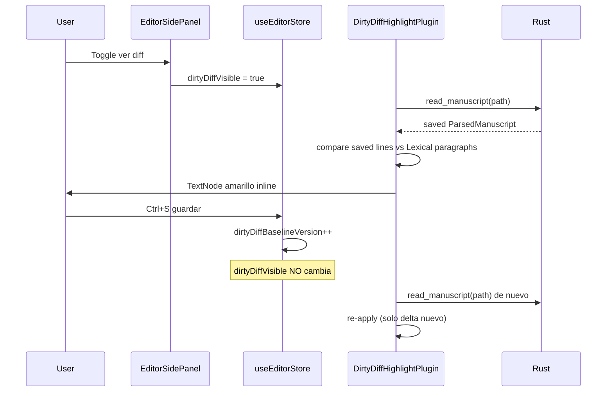

# FIX-013 — Ver diff: disco vs borrador sucio (panel herramientas)

> Plan de investigación e implementación. **Estado:** ✅ Cerrado (jun 2026) · **Esfuerzo:** Medio · **Riesgo:** Medio–Bajo  
> **Lista maestra:** [`implementation-plan.md`](../implementation-plan.md) · **Depende de:** FIX-007 ✅, FIX-005 ✅ · **Relacionado:** FIX-012 (caché tabs)  
> **QA evidencia:** `_debug/logs/session-1781310443496-13516.ndjson`

---

## 0. Convención

**Plan primero, código después.** Al implementar, actualizar §3–§4 con rutas reales si el árbol cambió.

---

## 1. Problema y objetivo

### 1.1 Problema

Tras FIX-007 el usuario recupera borradores sucios al reabrir, pero **no hay forma visual** de ver **qué cambió** respecto al último guardado en disco antes de pulsar Ctrl+S. Hay que comparar mentalmente el editor con el archivo externo o confiar en el indicador «sin guardar».

### 1.2 Objetivo

Entrada en la **cabecera del panel lateral de herramientas** (`EditorSidePanel`): **toggle** que resalta **inline en el editor Lexical** (no ventana modal) los caracteres añadidos respecto al último guardado en disco. La cabecera usa **solo iconos cuadrados** (`title` / `aria-label` i18n).

| Lado | Contenido |
|------|-----------|
| **Guardado (baseline)** | Manuscrito parseado en disco vía `read_manuscript` — alineado con párrafos Lexical |
| **Borrador (visible)** | Texto actual de cada párrafo Lexical (`serializeParagraphContent`) |

Resaltado **inline amarillo** solo en tramos **añadidos** (`diffChars`); líneas nuevas enteras en amarillo.

### 1.3 Criterios de aceptación (v1)

| # | Criterio |
|---|----------|
| O1 | Botón **toggle** visible con pestaña manuscrito; habilitado si `isDirty` **o** visor ya activo |
| O2 | Diff refleja **espacios y saltos** (FIX-005); no `trim` en la comparación |
| O3 | Pestaña activa: el plugin lee Lexical en vivo (debounce 120 ms al escribir) |
| O4 | Tras **guardar exitoso**: el **visor permanece activo** si estaba ON; solo se **re-baselinea** (deja de resaltar lo ya guardado). Si el visor está OFF, se **limpian** estilos Lexical huérfanos |
| O5 | i18n ES/EN; **`title` + `aria-label`** en cabecera; claves `diff.open` / `diff.hide` |
| O6 | Sin escribir a disco al activar el visor |
| O7 | Cabecera: iconos `size-7` — contraer · etiquetas · guardar · diff |

### 1.4 Fuera de alcance v1

| Tema | Cuándo |
|------|--------|
| Diff de **pestañas inactivas** sucias (sin activarlas) | v1.1 — selector de tab sucia |
| Entidades WB (`read_entity` + body) | FIX-013b o post-ERAII-001 |
| Diff entre **versiones Git** | Era V / módulo versiones |
| Diff **staging** panel etiquetas (RAM sin `isDirty` en cuerpo) | No — solo cambios ya marcados sucios en tab |
| Edición inline en el visor | Solo lectura |

---

## 2. Inventario del código actual (jun 2026)

| Pieza | Rol hoy |
|-------|---------|
| [`EditorSidePanel.tsx`](../../../src/modules/editor/EditorSidePanel.tsx) | Toggle diff (`GitCompare`); cabecera solo iconos |
| [`DirtyDiffHighlightPlugin.tsx`](../../../src/modules/editor/plugins/DirtyDiffHighlightPlugin.tsx) | Plugin Lexical: baseline, resaltado, refresh al guardar |
| [`lexicalDirtyDiff.ts`](../../../src/lib/editor/lexicalDirtyDiff.ts) | `TextNode.setStyle` amarillo; clear/apply por párrafo |
| [`manuscriptBodyDiff.ts`](../../../src/lib/editor/manuscriptBodyDiff.ts) | Líneas editables + rangos `add` por párrafo |
| [`lineDiff.ts`](../../../src/lib/editor/lineDiff.ts) | `diff` npm — `computeDraftAddRanges` |
| [`useEditorStore.ts`](../../../src/stores/useEditorStore.ts) | `dirtyDiffVisible`, `dirtyDiffBaselineVersion`, `toggleDirtyDiffHighlight` |
| Rust [`commands/editor.rs`](../../../src-tauri/src/commands/editor.rs) | `read_manuscript` (baseline); IPC preview opcional |

---

## 3. Diseño propuesto

**Problema de espacio (QA usuario):** con panel ~240–320px de ancho, el botón «Etiquetas» ocupa media fila y comprime «Guardar todo». Añadir un cuarto control con texto empeoraría el layout.

---

### 3.1 Cabecera del panel — rediseño compacto (decisión UX)

#### Layout expandido (v1)

Fila única `h-10`, alineación horizontal, **sin texto visible** en acciones:

```text
┌──────────────────────────────────────────┐
│ [◧]  [🏷]  [💾]  [⎇]     (espacio libre) │
│ contraer tags save diff                  │
└──────────────────────────────────────────┘
```

| # | Control | Icono (Lucide) | Visible cuando | `title` / `aria-label` (i18n) |
|---|---------|------------------|----------------|-------------------------------|
| 0 | Contraer panel | `PanelRightClose` | siempre (manuscrito tools visibles) | `panel.collapseTools` |
| 1 | Toggle etiquetas inline | `Tags` | manuscrito activo | `panel.showInlineTags` / `panel.hideInlineTags` según estado |
| 2 | Guardar todo | `Save` | manuscrito activo | `header.saving` / `header.saveAll` |
| 3 | Ver diff | `GitCompare` o `FileDiff` | manuscrito activo **y** tab activa `isDirty` | `diff.open` |

**Estilo común (D6):** `Button` `variant="outline"` `size="icon"` `className="size-7 shrink-0"` — **igual** que el botón contraer hoy (L244–252). Estado ON de etiquetas: `variant="secondary"` + borde primary (comportamiento actual).

**Eliminar en implementación:**

- Rama `compactToolbar ? … : …` con botones `flex-1` y `<span>{t("panel.tagsButton")}</span>` / `{t("header.saveAll")}` (L254–311).
- Constante `compactToolbar` puede **eliminarse** de la cabecera expandida (siempre iconos). Valorar si sigue usándose en otra parte del panel.

**Rail colapsado (`rightPanelCollapsed`):** mantener columna vertical; **añadir** icono diff bajo Guardar, mismas reglas `disabled` / `title`. Orden sugerido: expandir → etiquetas → guardar → diff → *(añadir tiempo sigue en rail actual)*.

#### Tooltips — no perder ayuda al quitar texto

| Regla | Detalle |
|-------|---------|
| Hover | Atributo nativo **`title={t(...)}`** en cada `Button` (comportamiento actual en iconos) |
| Accesibilidad | **`aria-label`** con la misma cadena que `title` cuando no hay texto visible |
| Toggle etiquetas | `title` **dinámico** mostrar/ocultar (claves existentes `panel.showInlineTags` / `panel.hideInlineTags`) |
| Guardar | `title` dinámico guardando vs guardar todo (`header.saving` / `header.saveAll`) |
| Diff deshabilitado | `title={t("diff.disabledClean")}` — explica por qué no abre |

**No** usar texto visible en cabecera; **`panel.tagsButton`** («Etiquetas» / «Tags») deja de mostrarse en UI pero puede reutilizarse como fallback de `aria-label` o deprecarse en favor de show/hide.

#### Mockup referencia

Captura usuario (jun 2026): cabecera con «Etiquetas» ancho + «Guardar todo» comprimido → sustituir por tres cuadrados + diff.

---

### 3.2 Flujo diff inline (Lexical) — v1 entregada



**Descartado en v1:** `DirtyDiffDialog` (modal). El prototipo modal se eliminó tras QA usuario (jun 2026).

### 3.2.1 Comportamiento al guardar (FIX-013b — jun 2026)

| Situación | Comportamiento |
|-----------|----------------|
| Visor **ON** + guardar OK | Toggle **sigue ON**; `read_manuscript` refresca baseline; desaparece amarillo en texto ya persistido |
| Visor **OFF** + guardar OK | `dirtyDiffBaselineVersion++` → plugin **limpia** estilos Lexical (evita amarillo huérfano) |
| Visor ON + seguir escribiendo | Debounce 120 ms re-aplica contra baseline en memoria (`savedRef`) |
| Cambiar pestaña | `dirtyDiffVisible = false` |

**Bug corregido (sesión `session-1781309819426-5124`):** al guardar se apagaba el visor y/o la baseline en `savedRef` no se actualizaba → líneas ya guardadas seguían en amarillo al reactivar.

**Bug corregido (sesión `session-1781310210910-23940`):** `saveManuscriptAtPath` **no** llamaba a `patchSavedBaseline` → `dirtyDiffBaselineVersion` no subía tras Ctrl+S; el plugin nunca emitía `obs.editor.diff.refresh`. Fix: usar `patchSavedBaseline` + `dirtyDiffSavedBaseline` (snapshot del `save_manuscript` IPC) para refrescar highlights al instante.

### 3.3 IPC Rust (nuevo)

| Comando | Entrada | Salida | Notas |
|---------|---------|--------|-------|
| `read_project_file_text` | `filePath` relativo | `string` | `fs::read_to_string` bajo raíz proyecto; solo `.md`; sin parse |
| `serialize_manuscript_preview` | Mismo payload que `save_manuscript` | `string` | Reutiliza `serialize_manuscript` **sin** escribir ni re-parsear índice |

Registrar en [`lib.rs`](../../../src-tauri/src/lib.rs) + tests Rust round-trip (payload sucio ≠ raw disk).

**Alternativa descartada:** reconstruir «disco» desde `savedBodyFingerprint` — imposible (solo hash JSON).

### 3.4 Frontend (rutas reales)

| Pieza | Descripción |
|-------|-------------|
| `src/lib/editor/lineDiff.ts` | `computeDraftAddRanges` — diff por carácter |
| `src/lib/editor/manuscriptBodyDiff.ts` | `collectEditableLines`, rangos por índice de párrafo |
| `src/lib/editor/lexicalDirtyDiff.ts` | Aplica/quita `background-color` en `TextNode` |
| `src/modules/editor/plugins/DirtyDiffHighlightPlugin.tsx` | Montado en `EditorShell.tsx` |
| `EditorSidePanel.tsx` | Toggle + `aria-pressed` cuando activo |

**Estilo resaltado:**

```text
  mismo texto     → sin estilo
  tramo añadido   → bg amarillo rgba(250,204,21,0.55) en TextNode
  línea nueva     → párrafo entero amarillo
```

Los estilos **no** se serializan a disco (`serializeParagraphContent` ignora `style`).

### 3.5 Baseline y borrador

1. **Baseline:** `read_manuscript` tras activar toggle o tras guardar (`dirtyDiffBaselineVersion`).
2. **Borrador:** párrafos Lexical en vivo (`collectLexicalParagraphLines`).
3. Toggle OFF → `clearDirtyDiffHighlights()` en el editor.

`prepareActiveManuscriptDraftForDiff` se conserva para FIX-007 / futuro IPC raw; el visor inline **no** lo usa en el camino caliente.

### 3.6 i18n — [`src/i18n/es/editor.json`](../../../src/i18n/es/editor.json) + [`en/editor.json`](../../../src/i18n/en/editor.json)

**Cabecera (existentes — solo tooltips, sin cambio de clave salvo deprecación opcional):**

| Clave | ES (ejemplo) | Uso |
|-------|--------------|-----|
| `panel.collapseTools` | Contraer menú | Botón ◧ |
| `panel.showInlineTags` | Mostrar etiquetas en el texto | `title` tags OFF |
| `panel.hideInlineTags` | Ocultar etiquetas del texto | `title` tags ON |
| `header.saveAll` | Guardar todo | `title` guardar |
| `header.saving` | Guardando… | `title` durante save batch |
| `panel.tagsButton` | Etiquetas | **Opcional** `aria-label`; ya no visible en cabecera |

**Nuevas — bloque `diff`:**

```json
"diff": {
  "open": "Ver cambios sin guardar",
  "hide": "Ocultar cambios sin guardar",
  "disabledClean": "No hay cambios sin guardar en esta pestaña"
}
```

*(Claves `title`, `close`, `loading` del prototipo modal — deprecadas, no usadas en UI.)*

**Criterio:** strings solo en i18n; prueba manual ES/EN.

### 3.7 Auditoría

| Evento | Cuándo |
|--------|--------|
| `obs.editor.diff.open` | Toggle ON → primera carga baseline |
| `obs.editor.diff.refresh` | Guardar con visor ON → baseline actualizada |

---

## 4. Decisiones cerradas

| ID | Decisión |
|----|----------|
| D1 | Baseline Lexical = **`read_manuscript`** parseado (no raw — alineación párrafos). IPC `read_project_file_text` queda para herramientas raw futuras |
| D2 | Borrador visible = **texto de párrafos Lexical**, no preview IPC en caliente |
| D9 | **Sin modal** — resaltado inline en Lexical (decisión QA jun 2026) |
| D10 | **Guardar no apaga el visor** — solo refresca baseline (`dirtyDiffBaselineVersion`) |
| D3 | Ubicación UI = **cabecera `EditorSidePanel`** (icono diff), no menú debug ni barra de pestañas |
| D4 | v1 solo **pestaña activa** manuscrito sucia |
| D5 | Dependencia npm **`diff`** (o `diff-match-patch`) — añadir justificada; sin componente pesado tipo Monaco |
| D6 | Cabecera expandida: **solo iconos `size-7`**; eliminar texto «Etiquetas» / «Guardar todo» y ramas `compactToolbar` con `flex-1` |
| D7 | Ayuda = **`title` + `aria-label`** i18n; no tooltips custom salvo que `title` nativo falle en QA WebView2 |
| D8 | Orden iconos expandido: **contraer · etiquetas · guardar todo · diff** (diff último — acción menos frecuente) |

---

## 5. Plan de implementación por fases

### Fase 0 — IPC Rust + tests

- `read_project_file_text` en `fs/` o `commands/editor.rs`
- `serialize_manuscript_preview` delegando en `serializer::serialize_manuscript`
- Tests: archivo en disco ≠ preview tras edit simulado

### Fase 1 — Utilidades TS + tests Vitest

- `lineDiff.ts` + casos: línea añadida, eliminada, solo whitespace (FIX-005)

### Fase 2 — UI cabecera + diálogo

- Refactor cabecera `EditorSidePanel` según §3.1 (iconos únicos, rail colapsado alineado)
- `DirtyDiffDialog.tsx`
- Botón diff + estado loading/error
- i18n ES/EN §3.6 en la misma fase (no dejar strings pendientes)

### Fase 3 — Integración store

- Exponer helper flush para diff (evitar duplicar lógica de `flushActiveTabToCache`)

### Fase 4 — audit + QA manual

*(i18n movido a Fase 2)*

---

## 6. Matriz de no-choque

| Tarea | Relación |
|-------|----------|
| FIX-007 | **Requerido** — borrador en caché coherente |
| FIX-008 | Independiente — puede ir antes o después |
| FIX-012 | Complementario — misma caché `tabs[path]` |
| ERAII-001 | Tras FIX-013 reduce deuda antes del refactor adaptador |
| `read_manuscript` auto-title | Motivo de D1 (raw read) |

---

## 7. Verificación manual

| # | Acción | Esperado |
|---|--------|----------|
| R1 | Manuscrito limpio | Botón diff deshabilitado (salvo visor ya ON → permite apagar) |
| R2 | Editar prosa, activar diff | Amarillo inline en caracteres nuevos |
| R3 | Añadir `\n\n` al final (FIX-005) | Nueva línea / tramo resaltado |
| R4 | Visor ON → guardar | Visor **sigue ON**; amarillo solo en delta pendiente |
| R4b | Visor OFF → escribir → guardar → activar diff | **Sin** amarillo en texto ya guardado |
| R5 | Cambiar evento/barTags en cuerpo | Diff muestra bloques `+++event` si serialización lo incluye |
| R6 | Pestaña WB activa | Cabecera manuscrito oculta / diff no montado (v1) |
| R7 | Panel ancho ~240px | Cuatro iconos caben sin solapamiento; sin texto truncado |
| R8 | Hover cada icono | Tooltip nativo con cadena ES o EN según locale |
| R9 | Etiquetas ON | Icono tags `secondary`; `title` = ocultar |
| R10 | Diff disabled, hover | `title` = `diff.disabledClean` |

### 7.1 Evidencia NDJSON — sesión QA final

**Archivo:** `_debug/logs/session-1781310443496-13516.ndjson` · **Archivo probado:** `Manuscrito/Volumen 1/Capitulo 1/escena.md`

| Paso | Evento(s) | Veredicto |
|------|-----------|-----------|
| Activar visor | `obs.editor.diff.open` · `source: read_manuscript` · `baselineVersion: 6` | ✅ |
| Guardar ×4 (visor ON) | Cada ciclo: `save.start` → `obs.rust.save_manuscript` → **`obs.editor.diff.refresh`** (`source: save_snapshot`, `baselineVersion` 7→8→9→10) → `save.end` `ok: true` | ✅ R4 |
| Visor tras guardar | **No** hay `diff.open` repetido ni apagado implícito; solo `diff.refresh` enlazado al mismo `correlationId` del save | ✅ visor permanece ON |
| FS | `obs.fs.watcher.raw` modify + `obs.editor.fs.sync` tras cada save | ✅ coherente |

**Contraste con regresión previa:** en `session-1781310210910-23940` solo aparecían `save.start`/`save.end` **sin** `diff.refresh` — baseline no se actualizaba hasta togglear el icono.

---

## 8. Orden en la lista maestra — justificación

**Posición:** **#12** — después de **FIX-009**, antes de **FIX-010**.

| Factor | Conclusión |
|--------|------------|
| Esfuerzo | **Medio** (IPC + UI + dep nueva) — no es un fix de una tarde |
| Dependencias | FIX-007 ✅; no bloquea FIX-008 |
| Valor | Alto para confianza al guardar manual; encaja filosofía §1 `manuscript-design.md` |
| Urgencia | No regresión — **puede esperar** a FIX-008/009 si priorizas explorador/timeline |
| Riesgo refactor | Mejor **antes** de ERAII-001 (menos superficie legacy) |

**No implementar ahora** junto con FIX-008: conviene cerrar explorador inline primero; FIX-013 es ortogonal y no compite por archivos.

---

## 9. Checklist de cierre

```
[x] Plan aprobado
[x] Fase 0 Rust (`read_project_file_text`, `serialize_manuscript_preview`)
[x] Fase 1 lineDiff + manuscriptBodyDiff tests
[x] Fase 2 cabecera iconos + DirtyDiffHighlightPlugin + i18n ES/EN
[x] Fase 2b inline Lexical (sin modal) + refresh al guardar
[x] Fase 3 store (`prepareActiveManuscriptDraftForDiff`, baseline version)
[x] npm test + npm run build
[x] QA R1–R10 (evidencia: session-1781310443496-13516)
[x] implementation-plan → ✅
```

---

## 11. Entrega — resumen de cambios (jun 2026)

### 11.1 UX final

| Antes (prototipo) | Después (cerrado) |
|-------------------|-------------------|
| Modal `DirtyDiffDialog` diff línea/línea | **Toggle** en cabecera panel → resaltado **amarillo inline** en Lexical |
| Guardar apagaba el visor | Guardar **mantiene** el visor; solo se re-baselinea |
| — | Amarillo huérfano si guardabas sin visor | Limpieza vía `dirtyDiffBaselineVersion` |

### 11.2 Archivos entregados

| Área | Archivos |
|------|----------|
| Rust IPC | `src-tauri/src/commands/editor.rs` — `read_project_file_text`, `serialize_manuscript_preview` |
| Diff util | `src/lib/editor/lineDiff.ts`, `manuscriptBodyDiff.ts`, `lexicalDirtyDiff.ts` + tests |
| UI | `EditorSidePanel.tsx` (toggle GitCompare), `DirtyDiffHighlightPlugin.tsx` en `EditorShell.tsx` |
| Store | `dirtyDiffVisible`, `dirtyDiffBaselineVersion`, `dirtyDiffSavedBaseline`, `toggleDirtyDiffHighlight`, `prepareActiveManuscriptDraftForDiff` |
| i18n | `diff.open`, `diff.hide`, `diff.disabledClean` (ES/EN) |
| Dep | npm `diff` |

**Eliminados:** `DirtyDiffDialog.tsx`, `manuscriptDiff.ts` (orquestación modal).

### 11.3 Iteraciones y bugs cerrados

| ID | Problema | Fix |
|----|----------|-----|
| 013a | Modal no deseado | Pivot a Lexical inline (jun 2026) |
| 013b | Guardar apagaba visor; baseline stale | `dirtyDiffBaselineVersion`; visor persiste (`session-1781309819426-5124`) |
| 013c | Ctrl+S no refrescaba highlights | `saveManuscriptAtPath` → `patchSavedBaseline` + `dirtyDiffSavedBaseline` (`session-1781310210910-23940`) |
| 013d | QA usuario «joya» | Validado NDJSON `session-1781310443496-13516` — 4 saves con `diff.refresh`/`save_snapshot` |

### 11.4 Auditoría

| Evento | Payload clave |
|--------|----------------|
| `obs.editor.diff.open` | `mode: inline`, `source: read_manuscript` |
| `obs.editor.diff.refresh` | `mode: inline`, `source: save_snapshot`, `baselineVersion`, mismo `correlationId` que el save |

---

## 10. Registro

| Fecha | Nota |
|-------|------|
| 2026-06-11 | Plan creado (idea usuario: diff disco vs sucio en menú herramientas) |
| 2026-06-11 | §3.1 cabecera compacta: 3 iconos acción + contraer; tooltips i18n |
| 2026-06-11 | Pivot UX: modal → resaltado inline Lexical (`DirtyDiffHighlightPlugin`) |
| 2026-06-11 | FIX-013b: guardar mantiene visor ON; `dirtyDiffBaselineVersion` refresca baseline; limpia estilos huérfanos si visor OFF (log `session-1781309819426-5124`) |
| 2026-06-11 | FIX-013c: `saveManuscriptAtPath` integrado con `patchSavedBaseline` + `dirtyDiffSavedBaseline` (log `session-1781310210910-23940`) |
| 2026-06-11 | **FIX-013 cerrado** — QA OK inline Lexical + refresh al guardar (log `session-1781310443496-13516`) |

---

**Última actualización:** 2026-06-11 · **Fase cerrada**
