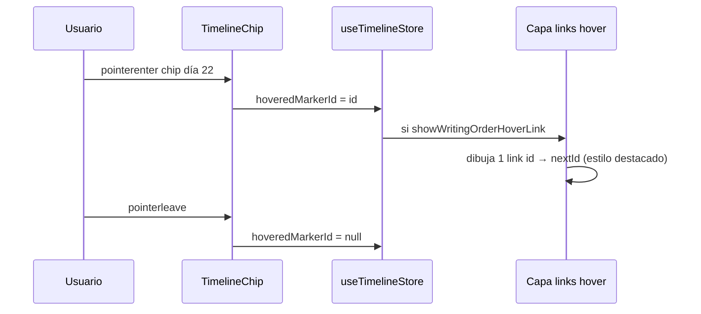

# FIX-009b — Timeline: conexión «siguiente en orden de escritura» al hover

> Plan de investigación e implementación. **Estado:** ✅ Completo — v1 absorbido por [FIX-009c](FIX-009c-timeline-writing-order-hover-neighbors.md) · **Esfuerzo:** Medio–Alto · **Riesgo:** Medio–Alto  
> **Lista maestra:** [`implementation-plan.md`](../../implementation-plan.md) Fase C · **Depende de:** FIX-009 ✅ + FIX-009a ✅  
> **Origen:** idea post-QA FIX-009 — orden **narrativo/escritura**, no cronológico

---

## 1. Problema y ejemplo

FIX-009 (y 009a) enlazan marcas del **mismo `segmentId`** en orden **cronológico** (`sortKey` → bar → inline → offset) para el modo «Mostrar conectores de evento».

En manuscrito real el lector sigue el **orden de escritura** del árbol y del texto, que puede **invertir** el tiempo:

| Orden de escritura | Día narrativo | En timeline (X) |
|--------------------|---------------|-----------------|
| 1ª escena escrita | día **22** | más a la derecha |
| 2ª (flashback en el mismo evento) | día **10** | más a la izquierda |

Al pasar el cursor sobre el chip del **día 22**, el usuario quiere ver **solo la conexión hacia la siguiente marca en orden de escritura** → el chip del **día 10**, aunque cronológicamente sea «anterior».

Además el orden global del manuscrito sigue el **árbol del explorador** con **orden manual** ([`explorerOrder`](../../../src/lib/explorer/treeOrder.ts) en [`useFileTreeStore`](../../../src/stores/useFileTreeStore.ts)), no orden alfabético de disco.

---

## 2. Objetivo

| # | Criterio |
|---|----------|
| O1 | Hover sobre chip de marca con evento → chip **resaltado** (ya existe hover en rect) + **una** línea destacada hacia la **siguiente** marca del mismo evento en **orden de escritura** |
| O2 | Orden de escritura ≠ orden cronológico; flashback soportado |
| O3 | Orden de archivos = **DFS del árbol `Manuscrito/`** respetando `explorerOrder` por carpeta |
| O4 | Dentro de archivo: segmentos `::seg::N` por índice ascendente |
| O5 | Dentro de segmento: `bar` antes que `inline`; inline por `charOffset` (orden en el cuerpo) — **ignorar `sortKey` para esta cadena** |
| O6 | Nuevo toggle panel timeline: **«Mostrar siguiente enlace al pasar el cursor»** (ON/OFF independiente de conectores globales) |
| O7 | Si no hay «siguiente» (última marca del evento en orden escritura) → solo highlight, sin línea extra |
| O8 | Compatible con FIX-009a (anclas en borde lateral) |

### Fuera de alcance v1

| Tema | Motivo |
|------|--------|
| Cadena completa visible sin hover | Modo conectores globales ya cubierto (cronológico); otro toggle futuro |
| Enlaces entre **segmentos distintos** (`seg::0` → `seg::1`) | Solo mismo `segmentId` en v1 (marcas del mismo marco evento) |
| Orden escritura entre **archivos distintos** del mismo nombre de evento | Requiere regla de identidad evento WB; no hay `segmentId` compartido cross-file |
| Mini timeline editor | Opcional fase posterior |
| Routing anti-cruce | FIX-009a opcional / backlog |

---

## 3. Auditoría — datos disponibles

| Fuente | Campo | Uso escritura |
|--------|-------|---------------|
| `TimelineEvent` | `path`, `blockIndex`, `segmentId`, `tagKind`, `charOffset`, `sortKey` | path + segment + tag |
| `timeline/project.rs` SQL | Orden bar/inline | Alineado con O5 |
| `useFileTreeStore` | `tree`, `explorerOrder` | Orden carpetas/archivos |
| `treeOrder.applyCustomOrder` | Orden manual hermanos | DFS manuscrito |
| `TimelineDisplayItem` | `segmentId`, `path`, … | Ya en FIX-009 |

**Gap:** no existe `writingOrderKey` en ítems del timeline; hay que **calcularlo** en frontend al construir ítems o al resolver hover.

---

## 4. Modelo — clave de orden de escritura

### 4.1 Índice global de paths manuscrito

```typescript
/** DFS pre-order bajo Manuscrito/, respetando explorerOrder por carpeta. */
export function buildManuscriptPathWritingIndex(
  tree: FileTreeNode[],
  explorerOrder: ExplorerOrderMap,
): Map<string, number> {
  // path → 0, 1, 2, …
}
```

Solo nodos archivo `.md` bajo `Manuscrito/` (misma convención que explorador).

### 4.2 Clave compuesta por marca

```typescript
export interface WritingOrderKey {
  pathIndex: number;
  segmentIndex: number;  // parseInt de segmentId ::seg::N
  tagRank: number;       // bar=0, inline=1
  charOffset: number;
}

export function compareWritingOrder(a: WritingOrderKey, b: WritingOrderKey): number {
  return (
    a.pathIndex - b.pathIndex ||
    a.segmentIndex - b.segmentIndex ||
    a.tagRank - b.tagRank ||
    a.charOffset - b.charOffset
  );
}
```

> **Crucial:** no usar `sortKey` en `compareWritingOrder`. Ejemplo flashback: día 22 (bar) → día 10 (inline) si el inline aparece **después** en el texto aunque sea fecha menor.

### 4.3 Cadena «siguiente» por evento

Para `segmentId` + `lane` + marcas visibles en `placed`:

1. Filtrar grupo.
2. Ordenar por `compareWritingOrder`.
3. Mapa `id → nextId` (índice i → i+1).

```typescript
export function buildWritingOrderNextLink(
  placed: PlacedTimelineItem[],
  pathIndex: Map<string, number>,
): Map<string, string | null>
```

---

## 5. UX e interacción

### 5.1 Comportamiento hover



| Capa | Estilo |
|------|--------|
| Conectores globales (FIX-009) | `--timeline-stem`, fino, todos los pares cronológicos |
| Link hover escritura | `--primary` o trazo más grueso (2px), **solo par activo** |
| Chip hover | Mantener `hover:fill-[var(--timeline-chip-hover)]` actual |

### 5.2 Toggle panel

| Store | Tipo | Default |
|-------|------|---------|
| `showWritingOrderHoverLink` | `boolean` | `true` (o `false` si satura — decidir en QA) |

i18n: `filters.writingOrderHoverLink` — «Mostrar siguiente enlace al pasar el cursor» / «Show next link on hover».

Ubicación: bajo «Mostrar conectores de evento», indent.

### 5.3 Coexistencia con conectores globales

| Conectores globales | Hover escritura | Resultado |
|--------------------|-----------------|-----------|
| ON | ON | Todas las líneas cronológicas + **una** resaltada al hover (mismo par o distinto si orden difiere) |
| ON | OFF | Solo globales |
| OFF | ON | Solo línea hover (si hay next) |
| OFF | OFF | Solo chips |

Si cronológico y escritura difieren en el **mismo par** de marcas, pueden ser **dos segmentos distintos** (diferente `fromId/toId`) — aceptable.

---

## 6. Implementación por fases

### Fase 0 — Orden escritura (puro)

- [x] `buildManuscriptPathWritingIndex` + tests (orden manual vs disco)
- [x] `parseSegmentIndex(segmentId)` + `writingOrderKeyForItem`
- [x] `buildWritingOrderNextLink` + test flashback (bar d22 → inline d10)

### Fase 1 — Store + toggle UI

- [x] `showWritingOrderHoverLink` en [`useTimelineStore`](../../../src/stores/useTimelineStore.ts)
- [x] [`TimelineFiltersSection`](../../../src/components/workspace-ui/TimelineFiltersSection.tsx) + i18n

### Fase 2 — Hover state + render

- [x] `hoveredTimelineMarkerId` en store
- [x] [`TimelineChip`](../../../src/modules/timeline/timelineGraphics.tsx): `onPointerEnter/Leave`
- [x] Capa hover con `TimelineEventLink` destacado
- [x] Anclas: `linkEdgeAnchors` (FIX-009a)

### Fase 3 — Datos árbol

- [x] Suscribir `tree` + `explorerOrder` en `TimelineHorizontal`
- [x] Recalcular vecinos cuando cambie árbol u orden DnD

### Fase 4 — QA v1

| # | Escenario | Esperado | v1 | Final (009c) |
|---|-----------|----------|-----|--------------|
| R1 | Mismo segmento: bar d22 + inline flashback d10 | Hover bar d22 → inline d10 | ✅ next | ✅ prev+next |
| R2 | Reordenar carpeta en explorador | Cambia vecinos | ✅ | ✅ |
| R3 | Toggle OFF | Sin línea hover | ✅ | ✅ |
| R4 | Última marca del evento | Hover sin línea next | ✅ | ✅ |
| R5 | Conectores globales ON + hover | Ambos visibles | ✅ | ✅ |

> Gap v1 (solo `next`, solo `segmentId`) cerrado en [FIX-009c](FIX-009c-timeline-writing-order-hover-neighbors.md).

---

## 7. Riesgos

| Riesgo | Mitigación |
|--------|------------|
| `pathIndex` desincronizado tras rename/move | Escuchar `explorerOrder` updates (FIX-008 ya mantiene map) |
| Performance muchas marcas | `nextLink` es Map O(n) por segmento; calcular en memo |
| Usuario confunde cronológico vs escritura | Labels claros en toggles; doc panel |

---

## 8. Archivos probables

| Archivo | Cambio |
|---------|--------|
| `src/modules/timeline/writingOrder.ts` | **Nuevo** — índice path + compare + nextLink |
| `src/modules/timeline/writingOrder.test.ts` | **Nuevo** |
| `src/modules/timeline/timelineModel.ts` | Opcional: cache `writingOrderKey` en item |
| `src/modules/timeline/timelineGraphics.tsx` | Hover handlers, link destacado |
| `src/modules/timeline/TimelineHorizontal.tsx` | Capa hover, hook árbol |
| `src/stores/useTimelineStore.ts` | Toggles + hover id |
| `src/components/workspace-ui/TimelineFiltersSection.tsx` | Checkbox |
| `src/i18n/*/timeline.json` | Cadenas |

---

## 9. Relación con FIX-009 / 009a

| Feature | Orden de enlaces | Cuándo visible |
|---------|------------------|----------------|
| FIX-009 conectores globales | **Cronológico** (`sortKey`…) | Toggle «conectores de evento» |
| FIX-009b hover | **Escritura** (árbol + segmento + texto) | Toggle hover + pointer sobre chip |

---

## 10. Checklist de cierre

```
[x] Fase 0 — writingOrder + tests (flashback)
[x] Fase 1 — store + panel
[x] Fase 2 — hover + render
[x] Fase 3 — árbol explorador
[x] Fase 4 — QA R1–R5 (v1)
[x] Gap v1 → FIX-009c ✅
[x] implementation-plan.md FIX-009b ✅
```

---

## 11. Registro

| Fecha | Cambio |
|-------|--------|
| 2026-06-11 | Plan redactado: idea orden escritura + flashback + árbol manual; post FIX-009 QA |
| 2026-06-11 | v1 implementado en código (solo `next`, agrupación `segmentId`) |
| 2026-06-11 | QA `session-1781321526405-27876`: falta `prev`, excluye prosa → [FIX-009c](FIX-009c-timeline-writing-order-hover-neighbors.md) |
| 2026-06-13 | Cerrado ✅: funcionalidad final en 009c (`buildWritingOrderNeighbors`); Fase C completa |

---

**Última actualización:** 2026-06-13 · **Estado:** ✅ Completo (v1 → 009c)
