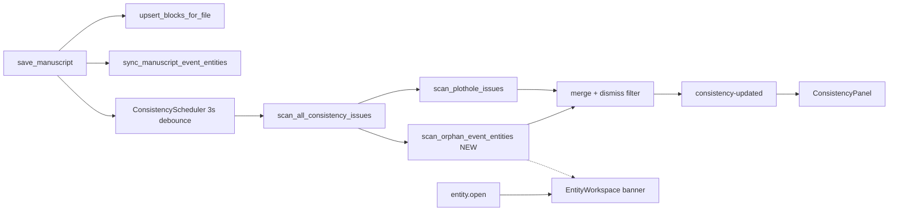

# FIX-011 — Evento WB huérfano (épica 6.B)

> **Estado:** ⏸️ **Pospuesto** — implementar **después** del rediseño módulo Worldbuilding (post-mapas, Era IV) · **Esfuerzo:** Medio (acotado) · **Riesgo:** Bajo–Medio  
> **Lista maestra:** [`implementation-plan.md`](../../../implementation-plan.md) Fase G · **Origen:** [`fix-backlog.md` §6.B](../../../fix-backlog.md)  
> **Gate:** MAP-000…012 ✅ (o suficiente) → **WB-004** Worldbuilding v2 → entonces FIX-011  
> **No confundir con:** FIX-010 (calendario obsoleto · 6.A) · FIX-010e (migración calendario v2)

> **Decisión producto (jun 2026):** El plan y la QA (`14924`) quedan listos; **no codear** hasta rediseñar WB — badge/banner/consistencia encajan mejor en el módulo nuevo que parches sobre `EntityWorkspace` actual.

---

## 0. Auditoría (jun 2026)

### 0.1 Qué es este plan (en una frase)

Cuando el usuario **borra un `+++event`** del manuscrito, la ficha en `Worldbuilding/Eventos/` **permanece en disco** (decisión D1, FIX-006.5). FIX-011 **detecta** esas fichas sin referencia y las **señala** en consistencia y en la ficha WB — sin borrarlas automáticamente.

### 0.2 Decisiones cerradas (no re-preguntar)

| ID | Decisión | Origen |
|----|----------|--------|
| **D1** | No `delete_path` al borrar chip evento | FIX-006.5 · backlog §6.B |
| **D2** | Huérfano = ficha en `Worldbuilding/Eventos/` sin `entity:` en ningún manuscrito | Este plan |
| **D3** | Ficha creada **solo** en WB (sin manuscrito) → **no** huérfana si nunca tuvo `sourcePath` | v1 simple; ver §4.2 |
| **D4** | Panel consistencia compartido con plothole; **no** esperar FIX-010e | Desacople jun 2026 |
| **D5** | Scan tras `save_manuscript` (mismo scheduler que plothole) | `checker/scheduler.rs` |

### 0.3 Estado del código vs plan

| Pieza | Hoy | Gap |
|-------|-----|-----|
| Borrado chip two-step | ✅ `EventTagChip` + `$removeEventAtSegment` | — |
| Sync manuscrito → ficha | ✅ `sync_manuscript_event_entities` | Solo dirección manuscrito → WB |
| `sourcePath` en YAML evento | ✅ `sync_event_entity_content` | Sin UI de enlace huérfano |
| `time_markers` post-borrado | ✅ `upsert_blocks_for_file` limpia marcas del archivo | No es alcance 011 |
| `scan_plothole_issues` | ✅ solo dual-location | **Sin** regla huérfano |
| `ConsistencyPanel` | ✅ lista issues | UI hardcodeada a `dualLocation` |
| `ConsistencyIssue` (TS/Rust) | Campos plothole (`character`, `rawTime`…) | **Generalizar** por `kind` |
| Explorador WB | Sin badge | v2 |
| OBS-003 borrado evento | ❌ | `eventDelete` no instrumentado |
| `obs.consistency.updated` | ✅ emite `issueCount` | Siempre `0` en escenario huérfano |

### 0.4 QA sesión real (baseline pre-implementación)

**bootId:** `1781730322955-14924` · Archivos: `_debug/action-logs/action-session-*.ndjson`, `_debug/logs/session-*.ndjson`

| Paso | Evidencia en logs |
|------|-------------------|
| Crear evento en `maoa.md` | `obs.editor.label.commit` → `create Worldbuilding/Eventos/eventoPrueba.md` |
| Guardar con evento | `obs.rust.save_manuscript`: `segmentCount: 1`, `touchedEntityPaths: ["Worldbuilding/Eventos/eventoPrueba.md"]` |
| Cerrar evento `[-]` | `obs.ui.editor.eventFrames`: `closed: true` |
| Borrar chip (inferido) | `gutter.markerCount` 4→2; `eventFrames.total` 1→0 (canal ②) |
| Guardar sin evento | `segmentCount: 0`, `touchedEntityPaths: []` |
| Consistencia | `obs.consistency.updated`: `issueCount: 0` (×7 en sesión) ❌ |
| Abrir ficha huérfana | `obs.action.entity.open` + `obs.ui.entity.workspace` sin flag `orphan` ❌ |

**Conclusión:** el bug 6.B está reproducido y documentado; el detector + UI son el único trabajo pendiente.

---

## 1. Problema

1. Usuario confirma evento en manuscrito → se crea/sync ficha `Worldbuilding/Eventos/{nombre}.md`.
2. Usuario borra el bloque `+++event` del manuscrito (FIX-006.5).
3. La ficha **sigue en disco**; no hay aviso en consistencia, explorador ni ficha WB.

**Principio épica 6:** no romper · degradar con señal · reconciliación manual del autor.

---

## 2. Objetivo v1

| # | Criterio |
|---|----------|
| O1 | Detector: fichas bajo `Worldbuilding/Eventos/*.md` sin referencia `entity` en manuscritos |
| O2 | Issue en panel **Consistencia** con mensaje i18n y enlace a manuscrito (`sourcePath` si existe) |
| O3 | Banner en `EntityWorkspace` al abrir ficha huérfana |
| O4 | Tras guardar manuscrito sin eventos, scan actualiza issues (debounce existente) |
| O5 | Dismiss por issue (reutilizar `.narralith/dismissed-consistency.json`) |
| O6 | Tests Rust del detector + build/test verdes |
| O7 | OBS: `eventDelete` en action log; opcional `obs.consistency.orphan.scan` en system log |

### Fuera de alcance v1

| Tema | Cuándo |
|------|--------|
| Badge en árbol explorador WB | v2 |
| Acción «Eliminar ficha» / «Buscar en proyecto» | v2 |
| Huérfanos personaje / ubicación / mapa (6.C…) | backlog futuro |
| Borrar ficha al borrar evento | **descartado** (D1) |
| Panel consistencia compartido con migración calendario | FIX-010e v2 |

---

## 3. Modelo de datos

### 3.1 Regla del detector (D2)

```text
referenced_entities =
  { normalize(metadata.entity)
    | block en SQLite blocks
    | file_path LIKE 'Manuscrito/%'
    | metadata.event no vacío }

orphan_event_entities =
  { path | path en entities/fs bajo Worldbuilding/Eventos/*.md
    ∧ path ∉ referenced_entities
    ∧ (v1) path tiene registro entities.category = 'event' o plantilla event }
```

Normalización: `normalize_relative`, comparación case-insensitive en Windows.

### 3.2 Fichas WB creadas a mano (D3)

| Caso | v1 |
|------|-----|
| Ficha en Eventos **nunca** referenciada en manuscrito, sin `sourcePath` | **No** marcar huérfana (evitar ruido en WB puro) |
| Ficha con `sourcePath` seteado pero sin `entity` en manuscrito | **Sí** huérfana |
| Ficha referenciada en otro manuscrito | **No** huérfana |

Implementación v1 pragmática: huérfano = path en `Worldbuilding/Eventos/` **no** en `referenced_entities` **y** (`sourcePath` no vacío en frontmatter **o** alguna vez apareció en `touchedEntityPaths` / no aplicable en scan estático → usar solo `sourcePath`).

> **Decisión v1:** `sourcePath` presente en YAML **o** path estuvo en `referenced_entities` histórico no persistido → en v1 solo **`sourcePath` no vacío** O **sin filtro sourcePath** (más simple, más falsos positivos en WB manual). **Elegido para v1:** marcar **todas** las fichas Eventos no referenciadas; documentar falso positivo WB manual como aceptable hasta 6.C.

### 3.3 `ConsistencyIssue` generalizado

Ampliar struct Rust / tipo TS (campos opcionales según `kind`):

| Campo | `dualLocation` | `orphanEvent` |
|-------|----------------|---------------|
| `kind` | `dualLocation` | `orphanEvent` |
| `messageKey` | `consistency.dualLocation` | `consistency.orphanEvent` |
| `severity` | `warning` | `warning` |
| `character`, `rawTime`, `timestamp` | requeridos | omitidos / vacíos |
| `entityPath` | — | path ficha WB |
| `sourcePath` | — | manuscrito origen (YAML) |
| `paths` | escenas conflicto | `[{ path: sourcePath }]` si hay enlace |

`ConsistencyPanel`: render por `issue.kind` (switch), no asumir plothole.

---

## 4. Arquitectura



### 4.1 Disparadores del scan

| Evento | Ya llama `request_consistency_check` |
|--------|--------------------------------------|
| `save_manuscript` | ✅ |
| Renombre / reconcile FS | ✅ |
| Abrir panel consistencia | `get_consistency_issues` → `run_now` |

Ampliar `scan_plothole_issues` → `scan_consistency_issues` que concatena reglas.

### 4.2 Señales IPC / audit existentes (reutilizar)

| Señal | Uso FIX-011 |
|-------|-------------|
| `obs.rust.save_manuscript.touchedEntityPaths` | Pre: incluye ficha; post-borrado: `[]` |
| `obs.consistency.updated.issueCount` | Post: debe ser ≥ 1 |
| `obs.ui.entity.workspace` | Ampliar payload `orphan: boolean` |

---

## 5. Plan de fases

### Fase 0 — OBS borrado evento (Bajo)

**Archivos:** `EventTagChip.tsx`, `events.ts`, opcional `EventFrameDeletePlugin.tsx`

| Evento | Cuándo | Payload |
|--------|--------|---------|
| `obs.action.editor.eventDelete.pending` | 1.er clic chip (rojo) | `segmentId` |
| `obs.action.editor.eventDelete` | 2.º clic confirmar | `segmentId`, `path` (manuscrito activo) |

No incluir nombre del evento ni cuerpo Lexical.

**Criterio salida:** secuencia legible en action-session sin inferir desde gutter.

---

### Fase 1 — Detector Rust (Medio)

**Archivos nuevos / tocados:**

| Archivo | Cambio |
|---------|--------|
| `src-tauri/src/checker/orphan_event.rs` | **Nuevo** — `scan_orphan_event_entities` |
| `src-tauri/src/checker/mod.rs` | export + tests |
| `src-tauri/src/checker/plothole.rs` o `consistency.rs` | `scan_consistency_issues` merge |
| `src-tauri/src/checker/scheduler.rs` | llamar merge |

**Algoritmo:**

1. `SELECT file_path, metadata FROM blocks WHERE file_path LIKE 'Manuscrito/%'`.
2. Parsear JSON metadata; si `event` no vacío y `entity` presente → insertar en `HashSet` (normalizado).
3. Listar entidades `Worldbuilding/Eventos/%.md` (tabla `entities` + fallback FS si hace falta).
4. Para cada path no en set → `ConsistencyIssue { kind: "orphanEvent", entityPath, sourcePath from frontmatter }`.
5. `sourcePath`: leer frontmatter vía `parse_entity_str` o columna `metadata` entities si disponible.

**Tests:**

- Manuscrito con evento → ficha referenciada → 0 huérfanos.
- Tras upsert sin bloque evento → 1 huérfano.
- Dos manuscritos referencian misma ficha → 0 huérfanos.
- Dismiss id estable (`orphanEvent:{entityPath}`).

**Criterio salida:** `cargo test` checker; `get_consistency_issues` devuelve issue tras escenario QA §8.

---

### Fase 2 — UI Consistencia (Medio)

**Archivos:**

| Archivo | Cambio |
|---------|--------|
| `src/lib/types/consistency.ts` | campos opcionales `entityPath`, `sourcePath` |
| `src/modules/consistency/ConsistencyPanel.tsx` | branch `orphanEvent` |
| `src/i18n/es/consistency.json` + `en` | `orphanEvent`, `openManuscript`, `openEntity` |
| `ConsistencyNavIcon` | sin cambio (ya AlertTriangle) |

**UX issue huérfano:**

- Título: «Evento huérfano: {nombre ficha}»
- Subtexto: «Sin referencia en manuscrito»
- Botón «Abrir manuscrito» si `sourcePath` → `requestOpenDocument` + `setMainView('editor')`
- Botón «Abrir ficha» → entity path
- Dismiss igual que plothole

---

### Fase 3 — Banner ficha WB (Bajo)

**Archivos:**

| Archivo | Cambio |
|---------|--------|
| `src/modules/worldbuilding/EntityWorkspace.tsx` | banner amber si huérfana |
| Hook o IPC ligero | `isOrphanEventEntity(path)` — reutilizar lista issues o query puntual |
| `src/i18n/es/worldbuilding.json` + `en` | `orphanEvent.banner`, `orphanEvent.openSource` |
| Render audit | `obs.ui.entity.workspace` + `orphan: true` |

**Criterio salida:** abrir `eventoPrueba.md` tras escenario §8 muestra banner + `sourcePath` clicable.

---

### Fase 4 — Documentación y cierre (Bajo)

- Actualizar [`fix-backlog.md`](../../fix-backlog.md) §6.B estado → planificado/implementado.
- [`implementation-plan.md`](../../implementation-plan.md) FIX-011 → ✅.
- [`manuscript-design.md`](../../manuscript-design.md) §3 — enlace a FIX-011 si falta.
- Entrada registro en este doc §10.

**Orden sugerido:** `Fase 1 → 2 → 3 → 0 → 4` (OBS puede ir en paralelo con 2).

---

## 6. Archivos (inventario v1)

| Área | Archivos |
|------|----------|
| Rust checker | `checker/orphan_event.rs`, `checker/mod.rs`, `scheduler.rs` |
| Rust tipos | `checker/plothole.rs` (`ConsistencyIssue` ampliado) |
| TS tipos | `lib/types/consistency.ts` |
| UI | `ConsistencyPanel.tsx`, `EntityWorkspace.tsx` |
| OBS | `action-audit/events.ts`, `EventTagChip.tsx` |
| i18n | `consistency.json`, `worldbuilding.json` (es/en) |
| Docs | este plan, `fix-backlog.md`, `implementation-plan.md` |

**No tocar:** `sync_event.rs` (sync forward OK), `EventFrameDeletePlugin` lógica borrado, FIX-010.

---

## 7. Relación con otros ítems

| ID | Relación |
|----|----------|
| FIX-006.5 | Prerrequisito ✅ — D1 huérfano, borrado chip |
| FIX-012 | `save_manuscript` en batch no cambia regla; mismo scan |
| FIX-010 / 010e | Independiente; panel consistencia **no** bloqueado por migración calendario |
| OBS-003 | QA §8; Fase 0 añade `eventDelete` |
| ERAII-001 | Compatible — detector usa `blocks` + paths, no `ParsedDocument` legacy |

---

## 8. Criterios de aceptación (épica 6.B v1)

- [ ] Borrar evento + guardar → ficha persiste en disco.
- [ ] Panel consistencia muestra ≥ 1 issue `orphanEvent`.
- [ ] Dismiss oculta issue; persiste en proyecto.
- [ ] Banner en ficha huérfana con enlace a `sourcePath` si existe.
- [ ] Re-crear `+++event` con mismo `entity:` → issue desaparece tras save + scan.
- [ ] `cargo test` + `npm test` verdes.
- [ ] Caso canónico §8 reproducible desde NDJSON.

---

## 9. QA manual — caso canónico (sesión 14924)

### Precondiciones

- Proyecto novel 1 (o similar) · OBS ④ + ① ON · `npm run tauri dev`

### Pasos

1. Abrir / crear `Manuscrito/.../maoa.md`.
2. Crear evento «eventoPrueba» (etiqueta + confirmar + guardar).
3. Verificar ficha `Worldbuilding/Eventos/eventoPrueba.md` en explorador WB.
4. Borrar chip evento (two-step) · guardar.
5. Abrir vista **Consistencia** → debe listar huérfano.
6. Abrir ficha WB → banner visible.
7. Adjuntar `action-session-{bootId}.ndjson` + nota breve.

### Post-FIX-011 — qué buscar en NDJSON

| Fase | Canal | Esperado |
|------|-------|----------|
| Crear + save | ① | `touchedEntityPaths: ["Worldbuilding/Eventos/eventoPrueba.md"]` |
| Borrar + save | ① | `segmentCount: 0`, `touchedEntityPaths: []` |
| Borrar | ④ | `obs.action.editor.eventDelete` con `segmentId` |
| Scan | ① | `obs.consistency.updated` → `issueCount: 1` |
| Abrir ficha | ② | `obs.ui.entity.workspace` → `orphan: true` |

### Plantilla agente (copiar al reportar)

```markdown
## QA FIX-011 — bootId {bootId}
- [ ] action-session-{bootId}.ndjson
- [ ] session-{bootId}.ndjson (opcional)
- Evento: … · Ficha: Worldbuilding/Eventos/….md
- Consistencia: issueCount esperado 1 → observado …
```

---

## 10. Estimación

| Fase | Esfuerzo | Riesgo |
|------|----------|--------|
| 0 OBS | Bajo | Bajo |
| 1 Detector | Medio | Medio (metadata/FS edge cases) |
| 2 Consistencia UI | Medio | Bajo |
| 3 Banner WB | Bajo | Bajo |
| 4 Docs | Bajo | — |

**Total:** ~1–2 sesiones enfocadas.

---

## 11. Registro

| Fecha | Cambio |
|-------|--------|
| 2026-06-11 | Escenario 6.B en `fix-backlog.md`; D1 huérfano en FIX-006.5 |
| 2026-06-11 | Auditoría pre-plan; sin implementación |
| 2026-06-11 | **Plan FIX-011** redactado; QA sesión `1781730322955-14924` como caso canónico |
| 2026-06-11 | **⏸️ Pospuesto** — usuario: implementar tras rediseño WB (después de mapas); plan + auditoría conservados |

---

**Épica:** [`fix-backlog.md` §6.B](../../../fix-backlog.md) · **Bloqueado por:** [WB-004](../../../implementation-plan.md) Worldbuilding v2 · **Plan vigente:** reactivar tras WB redesign
