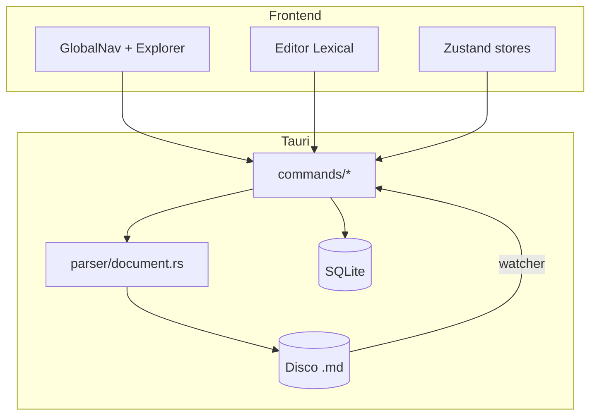
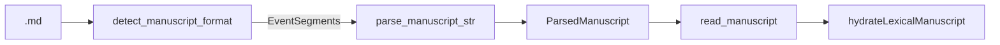
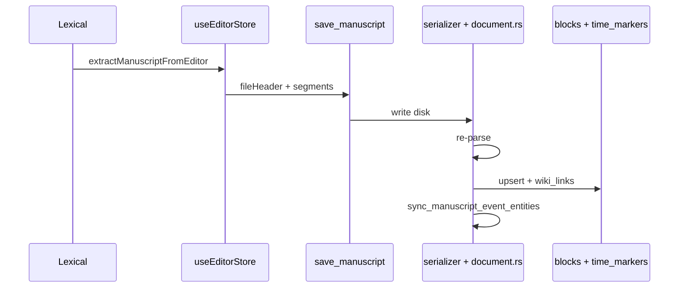

# Arquitectura — NarraLith

Mapa del repositorio al **jun 2026**. Actualizar al añadir módulos estructurales.

> **Manuscrito (detalle UX/disco):** `specs/manuscript-design.md`  
> **Requisitos:** `01-REQUIREMENTS.md` · **Stack:** `02-TECH_STACK.md`

---

## Árbol principal

```
NarraLith/
├── _debug/             # Solo tauri dev — logs auditoría OBS-001 (gitignore)
├── _docs/              # Archivo histórico (ver _docs/README.md)
├── _docs2/             # Planificación vigente
├── src/                # Frontend React + TypeScript
│   ├── components/ui/          # Shadcn
│   ├── components/workspace-ui/  # UI presentacional (calendario, paneles)
│   ├── hooks/
│   ├── i18n/
│   ├── lib/
│   │   ├── audit/              # OBS-001 — bus dev-only (stub en release)
│   │   ├── ipc.ts
│   │   ├── types/              # Contratos IPC (editor.ts, manuscript.ts, audit.ts, …)
│   │   ├── editor/             # documentSync, commitManuscriptLabel, calendar helpers
│   │   ├── calendar/           # Motor fechas ficticias (Vitest)
│   │   └── search/             # MiniSearch entidades
│   ├── modules/
│   │   ├── debug/              # OBS-001 — DebugNavMenu, AuditLogViewer (lazy, dev-only)
│   │   ├── editor/             # Lexical, plugins, sidePanel
│   │   ├── explorer/
│   │   ├── layout/             # WorkspaceShell, GlobalNav
│   │   ├── worldbuilding/
│   │   ├── timeline/
│   │   ├── calendar/
│   │   ├── maps/               # ⏸ congelado hasta Era II cerrada
│   │   ├── graph/
│   │   ├── references/
│   │   ├── versions/           # 🟡 UI sin IPC backend
│   │   └── project/
│   └── stores/                 # Zustand (useEditorStore, …)
├── src-tauri/
│   ├── src/
│   │   ├── commands/           # Handlers IPC
│   │   ├── parser/             # Manuscrito + legacy + inline_scanner
│   │   ├── entity/             # Fichas WB + sync_event
│   │   ├── db/                 # rusqlite, migrations v5
│   │   ├── fs/                 # CRUD, watcher, reconcile, maps_store
│   │   ├── wikilink/, references/, refactor/
│   │   ├── timeline/, checker/, graph/
│   │   ├── audit/              # OBS-001 — NDJSON, settings, bridge (#[cfg(debug_assertions)])
│   │   ├── git/                # init ✅; snapshot/diff no compilados
│   │   └── models/, state/, error.rs
│   └── resources/
│       ├── entity_templates/   # event.yaml, character.yaml, …
│       ├── templates/          # standard.json, blank.json
│       └── defaults/
└── package.json, vite.config.ts, …
```

`.taurignore` excluye `_docs/` y `_docs2/` del binario.

---

## Principios de arquitectura

| Regla | Implementación |
|-------|----------------|
| FS = verdad | Reconciliación watcher; conflicto → gana `.md` |
| I/O en Rust | Parseo, SQLite, CRUD disco vía IPC |
| Un DB por proyecto | `.narralith/index.db` |
| Manuscrito vs entidad | Rutas bajo `Manuscrito/` → parser eventos; `Worldbuilding/**/*.md` → `read_entity` (sin `+++event`) |
| Gate parser | `should_parse_as_manuscript` — solo `Manuscrito/**` + formato §1.4 |

---

## Flujo global



---

## Manuscrito (Era II — formato vigente)

### Formato en disco

`+++event` / `+++end-event`, `barTags`, `{{time:…}}` inline. Ver `specs/manuscript-design.md` §4.

### Pipeline lectura



### Pipeline guardado



### Frontend — editor

| Pieza | Ruta | Rol |
|-------|------|-----|
| Shell | `modules/editor/EditorShell.tsx` | Registro nodos + plugins |
| Sync | `lib/editor/documentSync.ts` | Hydrate / extract segmentos |
| Commit RAM | `lib/editor/commitManuscriptLabel.ts` | Staging → inline / barra / evento |
| Store | `stores/useEditorStore.ts` | Pestañas, IPC, callbacks Lexical |
| Panel | `EditorSidePanel` → `SideEventSection`, `SideTimeSection` (sin panel Referencias; FIX-002) |
| Nodos activos | `EventTagBarNode`, `EventFrameBottomNode`, `InlineTimeTagNode`, `WikiLinkNode` |
| Deuda | `manuscriptBlocks.ts` adaptador `ParsedDocument`; nodos legacy registrados | Ver `04-TASK` II.4 |

### IPC manuscrito (activo en UI)

| Comando | Uso |
|---------|-----|
| `read_manuscript` | Abrir escena |
| `save_manuscript` | Ctrl+S |
| `create_event_at_cursor` | Nuevo evento |
| `close_event_at_cursor` | `[-]` |
| `insert_inline_tag` | `{{time:…}}` en cursor |
| `update_event_metadata` | Barra / apertura evento |
| `ensure_event_entity` | Ficha WB al commit |

### IPC legacy (Rust; frontend no usa)

`read_document`, `save_document`, `parse_document`, `update_block_metadata` — compatibilidad y rutas no-manuscrito.

---

## Worldbuilding (fichas)

| Capa | Módulos |
|------|---------|
| Plantillas | `resources/entity_templates/*.yaml`, `template_map.json` |
| Rust | `entity/document.rs`, `metadata_index.rs`, `sync_event.rs` |
| Frontend | `modules/worldbuilding/`, pestañas `kind: entity` en editor store |

**Formato:** un frontmatter + cuerpo (sin `+++`).

**Eventos de escena:** `Worldbuilding/Eventos/` → `event.yaml`, `EntityCategory::Event`.

---

## SQLite (schema v5)

Ubicación: `{proyecto}/.narralith/index.db`. Gestor: `db/connection.rs`.

| Tabla | Rol |
|-------|-----|
| `project_meta` | Metadatos clave-valor |
| `entities` | Índice entidades (nombre, ruta, categoría, metadata JSON) |
| `blocks` | Segmentos/bloques indexados por archivo |
| `wiki_links` | Enlaces `[[ ]]` por archivo + índice de bloque/segmento |
| `backlinks` | Menciones inversas |
| `time_markers` | Marcas temporales multi-fila (`segment_id`, `tag_kind`, `char_offset`) |
| `graph_edges` | Aristas del grafo |

DDL: `db/schema.sql` + `migrations/002`–`005`.

---

## Referencias y wikilinks

| Capa | Ruta |
|------|------|
| Escaneo | `wikilink/scanner.rs` |
| Persistencia | `db/wiki_links.rs`, `db/backlinks.rs` |
| Rename global | `refactor/rename_entity.rs` |
| Lexical | `WikiLinkNode`, typeahead `[[` / `@` |
| Panel backlinks | API dormida (`get_backlinks`, etc.); UI retirada en FIX-002 |

---

## Calendario y timeline

| Capa | Ruta |
|------|------|
| Config | `.narralith/calendar.json`, `fs/calendar_config.rs` |
| Motor fechas | `src/lib/calendar/*` (BigInt) |
| Timeline global | `timeline/project.rs` → `get_timeline_events` |
| Timeline entidad | `entity/timeline.rs` |
| UI | `modules/timeline/`, mini-calendario en panel tiempo |
| Plothole | `checker/plothole.rs`, `ConsistencyScheduler` |

Marcas de tiempo del manuscrito: `barTags` + inline → `time_markers` (no solo `metadata.time` legacy).

---

## Módulos congelados (⏸)

Implementados en Era I; no prioridad hasta v0.10 cerrado.

### Mapas (`modules/maps/`, `fs/maps_store.rs`)

Leaflet `CRS.Simple`, overlays temporales, Excalidraw. IPC `maps::*` (14 comandos).

### Grafo (`modules/graph/`, `graph/indexer.rs`)

D3 canvas, `graph_edges`, rebuild bajo demanda.

### Versiones (`modules/versions/`)

UI montada; `git/snapshot.rs` y `git/diff.rs` **no** en `git/mod.rs` — IPC ausente.

---

## IPC — resumen por dominio

| Dominio | Comandos (conteo) |
|---------|-------------------|
| project | 6 |
| fs_ops | 12 |
| editor | 11 (4 legacy + 7 manuscript) |
| references | 4 |
| entity | 9 |
| calendar | 3 |
| timeline | 2 |
| consistency | 2 |
| maps | 14 |
| graph | 3 |

Registro: `src-tauri/src/lib.rs`. Tipos TS: `src/lib/types/`.

---

## i18n

| Entorno | Locale |
|---------|--------|
| DEV | `es` |
| Producción | `en` |

Namespaces: `global`, `project`, `explorer`, `editor`, `worldbuilding`, `references`, `timeline`, `calendar`, `maps`, `graph`, `settings`, `debug` (solo dev), …  
**Ausente:** `versions` (UI historial rota).

Config: `src/i18n/config.ts`.

---

## Observabilidad (OBS-001 + OBS-002)

Módulo de auditoría **solo en `tauri dev`**. Triple compuerta: `import.meta.env.DEV` + `__AUDIT_ENABLED__` (Vite) + `#[cfg(debug_assertions)]` (Rust). En release, stubs y sin comandos `audit_*`.

### OBS-001 — Registro del sistema

| Pieza | Ruta |
|-------|------|
| API frontend | `src/lib/audit/` — ring buffer RAM, `audit.info/warn/error`, correlación |
| Wrapper IPC | `src/lib/audit/auditInvoke.ts` → `src/lib/ipc.ts` |
| Bootstrap | `src/hooks/useAuditBootstrap.ts` — one-shot, listeners Tauri, persist TS→Rust |
| UI | `src/modules/debug/` — menú 🐛 encima de Historial; visor `Ctrl+Shift+L` |
| Backend | `src-tauri/src/audit/` — `settings.json`, `session-*.ndjson`, `bridge.rs` |
| Persistencia | `{repo_root}/_debug/logs/` — gitignore; **no** AppData ni carpeta de novela |

**Eventos:** prefijo `obs.*` (catálogo en [`specs/plans/OBS-001-system-audit-log.md`](specs/plans/OBS-001-system-audit-log.md) §5).

**Consumidor inmediato:** repro FIX-012 con `_debug/logs/session-*.ndjson`.

### OBS-002 — Registro de interfaz (UI render audit)

Complemento visual de OBS-001. **Tres toggles independientes** en menú debug (sistema / interfaz / interfaz detallada). Misma compuerta release.

| Pieza | Ruta |
|-------|------|
| API frontend | `src/lib/render-audit/` — dual channel `renderAudit.ui()`, buffers standard + verbose |
| Bridge editor | `src/lib/render-audit/editorRenderAuditBridge.ts` + `EditorRenderAuditPlugin` |
| Hooks | `src/lib/render-audit/hooks/` — `useUiRenderAudit()` en `WorkspaceShell`; timeline vía `useTimelineRenderAudit` |
| Bootstrap | `src/lib/render-audit/bootstrap.ts` — correlación `systemSessionPath` + `bootId` compartido |
| UI | `AuditLogViewer` — pestañas Sistema · Interfaz · Detallado |
| Backend | `src-tauri/src/audit/` — `audit_append_render_entry`, paths `render-logs/ui-session-*` y `ui-verbose-*` |
| Persistencia | `{repo_root}/_debug/render-logs/` |

**Eventos:** prefijo `obs.ui.*` (catálogo en [`specs/plans/Fase C/OBS-002-ui-render-audit-log.md`](specs/plans/Fase%20C/OBS-002-ui-render-audit-log.md) §3). **Nunca** usar `audit.info("ui", …)` — siempre `renderAudit.ui()`.

**Regla:** nuevos flujos async/FS → OBS-001; layout, chips, paneles, viewport → OBS-002.

---

## Tests

```bash
cd src-tauri && cargo test
npm test
npm run build
```

**Última actualización:** 2026-06-11
