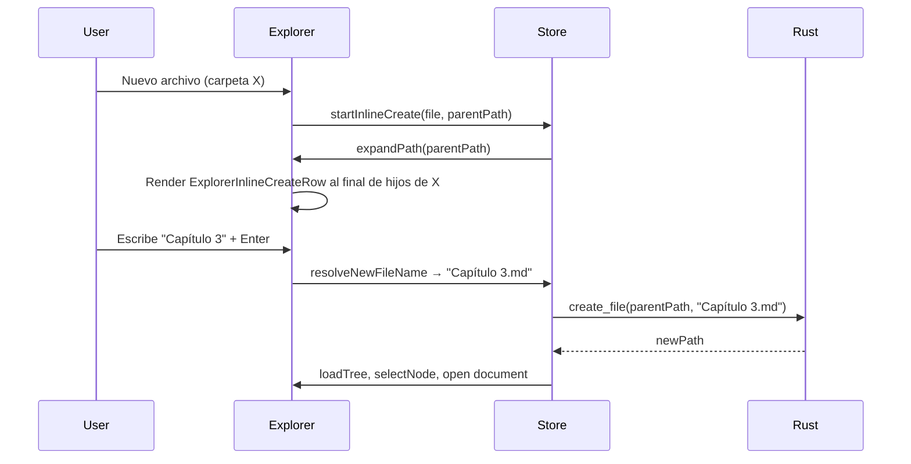

# Backlog de fixes y cambios — NarraLith

Documento de **planificación** (jun 2026). Detalle por fix.  
**Orden de ejecución global:** [`implementation-plan.md`](implementation-plan.md) (FIX-001…).

---

## Resumen

| # | Tarea | Tipo | Esfuerzo | Estado |
|---|-------|------|----------|--------|
| 1 | Deshabilitar cuadro «Información guardada» del navegador | UI / plataforma | Bajo | ✅ |
| 2 | Crear archivo/carpeta inline en el explorador (estilo VS Code) | UX explorador | Medio | Pendiente |
| 3 | Timeline: chip doble (archivo + evento) y conectores por evento | UX timeline | Medio–Alto | Pendiente |
| 4 | Quitar pestaña/panel «Referencias» del lateral del manuscrito | UX editor | Bajo | ✅ |
| 5 | Botón carpeta: abrir carpeta en el SO sin diálogo bloqueante | UX explorador | Bajo | Pendiente |
| 6 | Principio «eliminar no rompe» + indicadores de datos huérfanos/obsoletos | Arquitectura / UX | Alto (épica) | Pendiente — documento vivo |
| 7 | Rediseño marco de evento: chips unificados, fecha ISO, solo esquinas | UX manuscrito | Medio | Pendiente |
| 8 | Escritura: clic en zona vacía + guardado fiel a espacios/saltos | UX editor / persistencia | Medio | Pendiente |
| — | *(más tareas por definir)* | — | — | — |

---

## Tarea 1 — Deshabilitar autocompletado «Información guardada»

### Problema

Al escribir en campos de texto (p. ej. **Nombre del mapa** en `CreateMapDialog`), aparece un desplegable oscuro del navegador titulado **«Información guardada»** con valores usados antes («mapa 2», «mapa de mierda», etc.). El usuario no quiere verlo **en ningún campo** de la aplicación.

### Causa

No es una feature de NarraLith. Es **autofill del motor del navegador** (Chromium / WebView2 en Tauri en Windows). El proyecto no define `autocomplete` en ningún input hoy:

- [`src/components/ui/input.tsx`](../../src/components/ui/input.tsx) — `<input>` sin `autoComplete`
- ~20 pantallas usan `Input` (mapas, worldbuilding, calendario, explorador, manuscrito, etc.)
- Algunos `<form>` existen (`CreateProjectDialog`, `CreateEntityDialog`, `ExplorerDialogs`, …) tampoco desactivan autocompletado

El navegador infiere el tipo de campo por `id`, `name`, `placeholder` y historial local.

### Objetivo

Cero desplegables de autofill / información guardada en inputs de la app (diálogos, paneles, editor lateral, configuración).

### Plan de implementación (orden recomendado)

#### 1.1 Fix central en el componente `Input`

Archivo: [`src/components/ui/input.tsx`](../../src/components/ui/input.tsx)

- Añadir por defecto `autoComplete="off"` en el `<input>` base.
- Permitir override explícito vía props si algún campo lo necesitara en el futuro (poco probable).

#### 1.2 Revisar inputs fuera de `Input`

Buscar y alinear:

- [`src/components/EditableNumberInput.tsx`](../../src/components/EditableNumberInput.tsx)
- Cualquier `<input>` o `<textarea>` nativo en módulos (worldbuilding fields, calendario, explorador)
- Componentes de terceros (Excalidraw, Leaflet) — **fuera de alcance** salvo que el usuario reporte casos concretos

#### 1.3 Formularios con `<form>`

En formularios que envuelven diálogos, añadir `autoComplete="off"` al `<form>`:

- [`src/modules/project/CreateProjectDialog.tsx`](../../src/modules/project/CreateProjectDialog.tsx)
- [`src/modules/worldbuilding/CreateEntityDialog.tsx`](../../src/modules/worldbuilding/CreateEntityDialog.tsx)
- [`src/modules/explorer/ExplorerDialogs.tsx`](../../src/modules/explorer/ExplorerDialogs.tsx)
- [`src/modules/explorer/FolderDescriptionDialog.tsx`](../../src/modules/explorer/FolderDescriptionDialog.tsx)

#### 1.4 Refuerzo si Chromium ignora `off` (solo si hace falta tras probar)

Chromium a veces ignora `autocomplete="off"`. Escalada mínima, en este orden:

1. `autoComplete="one-time-code"` en campos de nombre (truco habitual en apps React).
2. Evitar `id`/`name` genéricos (`name`, `map-name`, `title`) — usar ids opacos (`narra-map-label`) sin palabras que disparen heurísticas.
3. Último recurso: atributo `readOnly` hasta `onFocus` (patrón anti-autofill agresivo).

**No** aplicar el paso 4 de entrada; probar primero 1.1 + 1.3.

#### 1.5 Shell Tauri (opcional, documentar)

Si tras 1.1–1.3 persiste en WebView2:

- Revisar si `tauri.conf` / ventana permite flags de WebView2 para autofill (limitado).
- Documentar que el usuario puede borrar «Información guardada» en Edge/Chrome para el origen `localhost` / `tauri://` — es mitigación de usuario, no fix de código.

### Archivos probables a tocar

| Archivo | Cambio |
|---------|--------|
| `src/components/ui/input.tsx` | `autoComplete="off"` por defecto |
| `src/components/EditableNumberInput.tsx` | Igual si usa `<input>` propio |
| 4 diálogos con `<form>` | `autoComplete="off"` en form |
| Búsqueda puntual `rg '<input'` en `src/` | Casos sueltos |

### Verificación manual

1. Abrir **Crear mapa** → campo nombre → no debe aparecer «Información guardada».
2. Repetir en: crear proyecto, crear entidad WB, renombrar archivo/carpeta, nombre de evento en panel manuscrito, campos de calendario.
3. Probar en **Tauri** (`npm run tauri dev`) y, si aplica, en **Vite** (`npm run dev`) — WebView2 y Chrome pueden comportarse distinto.
4. Confirmar que guardado / validación de formularios sigue igual.

### Criterio de salida

Ningún campo de texto propio de NarraLith muestra el desplegable de autofill en un recorrido por los diálogos y paneles principales.

### Riesgos

- Bajo: desactivar autofill no afecta lógica de negocio.
- Algún navegador puede seguir mostrando sugerencias pese a `off`; la escalada 1.4 cubre ese caso.

---

## Tarea 2 — Crear archivo/carpeta inline en el explorador

### Problema

Crear archivo o carpeta abre un **diálogo modal** («Nuevo archivo» / «Nueva carpeta») con campo de nombre y botones Cancelar/Crear. El usuario quiere el patrón de **VS Code / Cursor**: una fila de entrada **inline** en el árbol, en la carpeta destino, con nombre en blanco y sin ventana emergente.

Además, al crear archivos:

- Si el usuario **no escribe extensión** → el sistema añade `.md` por defecto.
- Si el usuario **escribe extensión explícita** (p. ej. `notas.txt`, `Escena.md`) → respetarla.
- En el explorador y editor, **no mostrar** la extensión `.md` (comportamiento ya parcialmente existente).

### Estado actual del código

| Pieza | Comportamiento hoy |
|-------|-------------------|
| [`ExplorerDialogs.tsx`](../../src/modules/explorer/ExplorerDialogs.tsx) | Modal `Dialog` para `createFile` y `createFolder` |
| [`useFileTreeStore.ts`](../../src/stores/useFileTreeStore.ts) | `openExplorerDialog({ type: "createFile" \| "createFolder", parentPath })` → `createFile` / `createFolder` vía IPC |
| [`ExplorerContextMenu.tsx`](../../src/modules/explorer/ExplorerContextMenu.tsx) | Menú contextual → abre diálogo |
| [`WorkspaceTopBar.tsx`](../../src/modules/layout/WorkspaceTopBar.tsx) | Botones toolbar → abre diálogo con `createParentPath` (última ruta abierta) |
| [`FileTreeItem.tsx`](../../src/modules/explorer/FileTreeItem.tsx) | Muestra nodos; `displayName()` oculta `.md` en etiquetas |
| [`pathUtils.ts`](../../src/lib/pathUtils.ts) | `displayName()` — quita sufijo `.md` |
| Rust [`crud.rs`](../../src-tauri/src/fs/crud.rs) `create_file` | Si el nombre **no termina en `.md`**, concatena `.md` (p. ej. `Escena` → `Escena.md`, pero `notas.txt` ya termina en `.md`? **No** — `notas.txt` no termina en `.md`, hoy se convertiría erróneamente en `notas.txt.md`) |

**Bug relacionado a corregir en esta tarea:** la lógica Rust actual solo comprueba sufijo `.md`, no «tiene extensión explícita». Hay que alinear frontend y backend.

**Fuera de alcance de esta tarea:** `createEntity` (sigue con `CreateEntityDialog`), renombrar/eliminar (pueden quedar en modal por ahora).

### Objetivo

1. Al pulsar «Nuevo archivo» o «Nueva carpeta» (menú contextual o toolbar), aparece una **fila editable** en el árbol, indentada como hermano en `parentPath`, con input vacío y foco.
2. **Enter** confirma; **Escape** cancela; nombre vacío → cancelar (sin crear).
3. Archivos nuevos sin extensión → `nombre.md` en disco; en árbol se muestra `nombre`.
4. Extensión manual del usuario → se respeta si el nombre es válido.

### Comportamiento UX (referencia VS Code)



- La fila inline usa el **mismo indent** y estilo de fila que [`FileTreeItem`](../../src/modules/explorer/FileTreeItem.tsx) (modo manuscrito y modo WB).
- Si la carpeta destino está colapsada → **expandirla** antes de mostrar el input.
- Hacer **scroll into view** del input al aparecer.
- Input con `autoComplete="off"` (coherente con tarea 1).

### Plan de implementación (orden recomendado)

#### 2.1 Utilidad compartida de nombre de archivo

Nuevo helper (p. ej. [`src/lib/explorer/newFileName.ts`](../../src/lib/explorer/newFileName.ts)):

```typescript
/** true si el nombre ya incluye extensión (tiene `.` y no termina en `.`). */
export function hasFileExtension(name: string): boolean

/** "Escena" → "Escena.md"; "notas.txt" → "notas.txt" */
export function resolveNewFileName(input: string): string | null
```

Regla acordada:

| Entrada usuario | Nombre en disco |
|-----------------|-----------------|
| `Escena_1` | `Escena_1.md` |
| `Escena_1.md` | `Escena_1.md` |
| `notas.txt` | `notas.txt` |
| `""` / solo espacios | `null` (cancelar) |
| `.hidden` | tratar como extensión explícita o rechazar — **definir:** sin extensión «real» → `.md`; nombres que empiezan por `.` validar con `validate_name` Rust |

Tests Vitest para `resolveNewFileName`.

#### 2.2 Alinear Rust `create_file`

Archivo: [`src-tauri/src/fs/crud.rs`](../../src-tauri/src/fs/crud.rs)

- Sustituir `ends_with(".md")` por la misma regla: **sin extensión → `.md`**; **con extensión → tal cual**.
- `validate_name` sobre el stem (sin extensión) o nombre completo según convenga.
- Test Rust: `Escena` → `.md`; `foo.txt` → `foo.txt` (no `foo.txt.md`).

#### 2.3 Estado en `useFileTreeStore`

Reemplazar apertura de diálogo para creación por estado inline:

```typescript
type InlineCreateState =
  | { kind: "file"; parentPath: string }
  | { kind: "folder"; parentPath: string }
  | null;
```

Acciones nuevas:

- `startInlineCreate(kind, parentPath)` — setea estado, `expandPath(parentPath)`, limpia errores.
- `cancelInlineCreate()` — vuelve a `null`.
- `commitInlineCreate(name)` — llama `createFile` / `createFolder`, limpia estado.

Mantener `createFile` / `createFolder` existentes; solo cambia quién los invoca.

**Tras crear archivo `.md` en manuscrito:** reutilizar flujo actual (`selectNode` + el usuario abre o auto-abrir con `requestOpenDocument` — verificar qué hace hoy el store tras `createFile`).

#### 2.4 Componente `ExplorerInlineCreateRow`

Nuevo: [`src/modules/explorer/ExplorerInlineCreateRow.tsx`](../../src/modules/explorer/ExplorerInlineCreateRow.tsx)

- Props: `kind`, `parentPath`, `depth`, `compact?` (manuscrito).
- Input inline estrecho, icono archivo/carpeta como en fila normal.
- `autoFocus`, `onKeyDown`: Enter → commit, Escape → cancel.
- `onBlur`: cancelar si vacío (comportamiento VS Code); opcional commit si hay texto — **preferir:** blur con texto = commit, blur vacío = cancel.

#### 2.5 Integración en el árbol

Renderizar `ExplorerInlineCreateRow` **al final de la lista de hijos** cuando `inlineCreate?.parentPath === node.path` (dentro de carpeta expandida).

Puntos de montaje:

- [`FileTreeItem.tsx`](../../src/modules/explorer/FileTreeItem.tsx) — tras `node.children.map`, antes de `ExplorerListEndDrop`.
- [`FileTreeRootList`](../../src/modules/explorer/FileTreeItem.tsx) — creación en raíz de vista (`Manuscrito/`, `Worldbuilding/`, etc.) cuando `parentPath` es el list parent de la vista.

#### 2.6 Cambiar disparadores (dejar de abrir modal)

| Origen | Cambio |
|--------|--------|
| `ExplorerContextMenu` — Nuevo archivo / carpeta | `startInlineCreate(...)` en lugar de `onOpenDialog({ type: "createFile" })` |
| `WorkspaceTopBar` — botones `FilePlus` / `FolderPlus` | Igual con `createParentPath` |
| `ExplorerDialogs.tsx` | Eliminar ramas `createFile` y `createFolder` del formulario modal (mantener rename, delete) |
| `ExplorerDialogState` | Quitar tipos `createFile` / `createFolder` o dejar deprecated sin uso |

#### 2.7 Vista tarjetas (`CardView`)

Hoy no hay árbol visible. Opciones (elegir en implementación):

- **A (recomendada):** al crear desde toolbar en layout tarjetas, cambiar temporalmente a lista o mostrar inline bajo la carpeta actual en una mini-lista.
- **B:** forzar layout lista al iniciar creación inline.

Documentar decisión en PR; mínimo viable: crear inline funciona en **vista lista** (manuscrito + WB lista); tarjetas no rompen (toolbar sigue usando `createParentPath`).

#### 2.8 Visualización sin extensión

Ya implementado para `.md`:

- [`displayName()`](../../src/lib/pathUtils.ts) en `FileTreeItem`, `CardView`, búsqueda.
- El input inline muestra lo que escribe el usuario **sin** añadir `.md` visualmente; el sufijo se aplica solo al confirmar.

No cambiar pestañas del editor salvo que hoy muestren `.md` — verificar `WorkspaceTopBar` tabs; si muestran extensión, alinear con `displayName` (sub-tarea menor dentro de 2.8).

#### 2.9 i18n

- Eliminar o dejar sin uso claves `createFile.title`, `createFolder.title`, etc., si el modal desaparece.
- Opcional: `aria-label` en input inline (`explorer.inlineCreate.file` / `folder`).

### Archivos probables a tocar

| Archivo | Cambio |
|---------|--------|
| `src/lib/explorer/newFileName.ts` | **Nuevo** — normalización nombre |
| `src/lib/explorer/newFileName.test.ts` | **Nuevo** — tests |
| `src/stores/useFileTreeStore.ts` | Estado `inlineCreate`, acciones start/cancel/commit |
| `src/modules/explorer/ExplorerInlineCreateRow.tsx` | **Nuevo** — fila inline |
| `src/modules/explorer/FileTreeItem.tsx` | Montar fila inline |
| `src/modules/explorer/ExplorerContextMenu.tsx` | Disparador inline |
| `src/modules/layout/WorkspaceTopBar.tsx` | Disparador inline |
| `src/modules/explorer/ExplorerDialogs.tsx` | Quitar create file/folder del modal |
| `src-tauri/src/fs/crud.rs` | Regla extensión correcta |
| `src/i18n/*/explorer.json` | Ajuste cadenas |

### Verificación manual

1. Clic derecho en carpeta → **Nuevo archivo** → input inline al final de hijos, carpeta expandida, foco en blanco.
2. Escribir `Prueba` + Enter → archivo `Prueba.md` en disco; árbol muestra `Prueba`.
3. Escribir `apuntes.txt` + Enter → `apuntes.txt` (no `apuntes.txt.md`).
4. Escape o Enter vacío → desaparece fila, nada creado.
5. Toolbar «nuevo archivo» con última ruta → misma UX inline.
6. **Nueva carpeta** — misma UX, sin añadir extensión.
7. Crear en raíz `Manuscrito/` → contenido inicial manuscrito (Rust ya lo genera).
8. Vista tarjetas WB — comportamiento acordado en 2.7.

### Criterio de salida

No queda modal para crear archivo/carpeta; la creación inline replica el flujo VS Code en vista lista; extensión `.md` por defecto sin mostrarse en el árbol.

### Riesgos y dependencias

- **Medio:** tocar árbol + DnD — la fila inline no debe interferir con drag-and-drop (`@dnd-kit`).
- **Tarea 1:** el input inline debe llevar `autoComplete="off"` (o heredarlo del `Input` base).
- **Coordinación Rust/TS:** misma regla de extensión en ambos lados.

### Notas

- **Renombrar** sigue en modal por ahora; el usuario no pidió inline rename (se puede abordar en tarea futura).
- **`createEntity`** no cambia.

---

## Tarea 3 — Timeline: marcas de evento con archivo + nombre y arcos conectores

### Problema

Un **mismo evento** en manuscrito puede tener **varias marcas de tiempo** (barTags + inline: p. ej. días 17 y 18 en `eventTest`). En el timeline horizontal cada marca se muestra **igual**, con una sola etiqueta = **nombre del archivo** (`meow`), no el nombre del evento.

El usuario quiere el diseño del boceto:

```
┌─────────────────┐
│ meow            │  ← línea superior: nombre de archivo (más pequeño, secundario)
│ eventTest       │  ← línea inferior: nombre del evento (más prominente)
└────────┬────────┘
         │ (vástago al eje)
    ─────┴───── día 17
         \
          \  conector entre marcas del mismo evento
           \
    ─────┬───── día 18
         │
```

> **Nota de diseño:** En el boceto del usuario, «gris», «rojo» y «morado» **no son colores literales** — solo indican *qué capa del dibujo* es cada cosa (archivo / evento / hilo conector). En implementación se usa el **mismo sistema de colores y chips** que el timeline ya tiene (`--timeline-chip-*`, jerarquía tipográfica), sin introducir una paleta nueva.

Además: el **conector** que une las marcas de un mismo evento debe poder **mostrarse u ocultarse** con un filtro en el panel del timeline.

### Estado actual del código

| Pieza | Comportamiento hoy |
|-------|-------------------|
| Rust [`timeline/project.rs`](../../src-tauri/src/timeline/project.rs) | Ya devuelve por marca: `path`, `title` (nombre evento desde `metadata.event` o `tm.label`), `segmentId`, `tagKind`, `charOffset` |
| [`timelineModel.ts`](../../src/modules/timeline/timelineModel.ts) `buildTimelineItems` | **Ignora** `event.title` y `segmentId`; `label = fileDisplayName(event.path)` |
| [`timelineGraphics.tsx`](../../src/modules/timeline/timelineGraphics.tsx) `TimelineChip` | Caja de una línea con `item.label` |
| [`calendarEntries.ts`](../../src/lib/calendar/calendarEntries.ts) | Calendario **sí** usa `event.title \|\| fileDisplayName` — timeline no está alineado |
| [`useTimelineStore.ts`](../../src/stores/useTimelineStore.ts) | Filtros: manuscript, events, festivals, … — **sin** toggle de arcos |
| [`TimelineFiltersSection.tsx`](../../src/components/workspace-ui/TimelineFiltersSection.tsx) | UI de filtros actuales |

**Datos ya disponibles:** marcas del mismo evento comparten `segmentId` (p. ej. `Manuscrito/meow.md::seg::0`). Eso permite agrupar y dibujar conectores sin cambios de schema SQLite.

### Objetivo

1. Cada marca de manuscrito **vinculada a evento** (`segmentId` presente) muestra chip de **dos líneas**: nombre de archivo (secundario, más pequeño) + nombre de evento (principal, más legible).
2. Marcas sucesivas del **mismo `segmentId`** se unen con un **conector visual** (entre vástagos / cajas), en orden cronológico — mismo lenguaje gráfico que el timeline actual (línea/vástago existente, variante para «pertenece al mismo evento»).
3. Nuevo filtro en panel timeline: **«Mostrar arcos de evento»** (ON por defecto o según preferencia del usuario al implementar).
4. Marcas **sin evento** (solo tiempo en cabecera/prosa, sin `segmentId`): mantener chip simple (solo nombre de archivo o etiqueta única).

### Diseño visual

**Sin paleta nueva.** Reutilizar tokens y estilo de [`timelineGraphics.tsx`](../../src/modules/timeline/timelineGraphics.tsx) (`--timeline-chip-bg`, `--timeline-chip-border`, `--timeline-chip-text`, `--primary` en highlight, etc.):

| Capa del boceto | Implementación |
|-----------------|----------------|
| Nombre de archivo (arriba) | Texto secundario: menor tamaño, color atenuado del chip actual (`muted` / `timeline-chip-text` con opacidad) |
| Nombre de evento (abajo) | Texto principal: tamaño estándar del chip, peso/color del label actual |
| Conector entre marcas | Línea coherente con vástagos existentes; puede usar `--primary` o borde del chip con opacidad — **no** un morado fijo del boceto |
| Caja | Misma familia de rect redondeado; altura mayor (`BOX_HEIGHT` + ~12–16px para segunda línea) |

### Plan de implementación (orden recomendado)

#### 3.1 Extender modelo de ítems del timeline

Archivo: [`timelineModel.ts`](../../src/modules/timeline/timelineModel.ts)

Ampliar `TimelineDisplayItem`:

```typescript
interface TimelineDisplayItem {
  // …existente
  fileLabel: string;           // displayName(path)
  eventLabel: string | null; // title del evento; null si no aplica
  segmentId: string | null;    // agrupación
  markerIndex?: number;        // ordinal dentro del segmento (0, 1, …)
}
```

En `buildTimelineItems`:

- `fileLabel = fileDisplayName(event.path)`
- `eventLabel = event.title?.trim() || null` cuando `segmentId` esté presente
- `label` (legacy): mantener para aria / minimapa — p. ej. `eventLabel ?? fileLabel`

Función nueva:

```typescript
export function buildEventSpanLinks(
  placed: PlacedTimelineItem[],
  showLinks: boolean,
): EventSpanLink[]
```

Cada link: `{ segmentId, fromId, toId, points: [{x,y},{x,y}] }` entre marcas **consecutivas** del mismo `segmentId` ordenadas por `sortKey`.

#### 3.2 Chip de dos líneas

Archivo: [`timelineGraphics.tsx`](../../src/modules/timeline/timelineGraphics.tsx)

- Refactor `TimelineChip` → soportar `eventLabel`:
  - Si `eventLabel`: dos `<text>` SVG (archivo arriba, evento abajo) o `<foreignObject>` con flex column (preferir SVG nativo por consistencia).
  - Si no: una línea como hoy.
- Actualizar `estimateLabelWidth` / `BOX_HEIGHT` para altura dual.
- Ajustar posición vertical de vástagos (`TimelineStem`) para la caja más alta.

#### 3.3 Capa SVG de conectores entre marcas

Archivo: [`TimelineHorizontal.tsx`](../../src/modules/timeline/TimelineHorizontal.tsx)

- Tras calcular `placed`, generar links con `buildEventSpanLinks`.
- Renderizar `<g className="timeline-event-links">` **debajo** de chips o entre eje y chips (z-order: eje → conectores → vástagos → chips).
- Geometría del boceto: polilínea desde borde inferior/centro de caja en día N hacia borde superior/centro de caja en día N+1 (diagonal si están en carriles distintos).
- Estilo del trazo: reutilizar variables del timeline, no color fijo del boceto.
- Si `showLinks === false`, no renderizar la capa.

#### 3.4 Filtro en store y panel

Archivos:

- [`useTimelineStore.ts`](../../src/stores/useTimelineStore.ts) — `showEventArcs: boolean` (default `true`), `setShowEventArcs` o `toggleFilter("eventArcs")` ampliando `TimelineFilterState`.
- [`TimelineFiltersSection.tsx`](../../src/components/workspace-ui/TimelineFiltersSection.tsx) — checkbox bajo filtros de manuscrito.
- [`TimelineSidePanel.tsx`](../../src/modules/timeline/TimelineSidePanel.tsx) — pasar labels i18n.
- `src/i18n/es/timeline.json` + `en` — clave `filters.eventArcs` / «Mostrar arcos de evento».

Persistencia opcional en `localStorage` (como otros toggles de layout) — decidir en implementación.

#### 3.5 Layout y colisiones

- `layoutManuscriptLanesAbove` / `spreadCollidingBoxes`: recalcular con **ancho** basado en `max(fileLabel, eventLabel)` y **altura** dual.
- Arcos del mismo evento en el **mismo día** (dos marcas mismo sortKey): usar separación X existente (`centeredXByItemId`) y conectar igualmente.

#### 3.6 Otros consumidores

| Consumidor | Acción |
|------------|--------|
| [`TimeTagMiniTimeline.tsx`](../../src/modules/editor/sidePanel/TimeTagMiniTimeline.tsx) | Chip preview: al menos `eventLabel` si existe; arcos opcionales (mini timeline puede omitir morado por espacio) |
| [`calendarEntries.ts`](../../src/lib/calendar/calendarEntries.ts) | Opcional: alinear calendario con chip dual en tarea futura; hoy ya prioriza `title` |
| Timeline vertical | Si existe vista vertical activa, repetir patrón o documentar como solo horizontal en v1 |

#### 3.7 Tests

- `timelineModel.test.ts`: `buildTimelineItems` asigna `fileLabel` + `eventLabel` con `segmentId`.
- `buildEventSpanLinks`: 2 marcas mismo segment → 1 link; 3 marcas → 2 links; segmentos distintos → 0 links entre ellos.
- `buildEventSpanLinks` con `showLinks: false` → array vacío.

### Archivos probables a tocar

| Archivo | Cambio |
|---------|--------|
| `src/modules/timeline/timelineModel.ts` | Campos nuevos, `buildEventSpanLinks` |
| `src/modules/timeline/timelineGraphics.tsx` | Chip dual, constantes altura |
| `src/modules/timeline/TimelineHorizontal.tsx` | Render arcos, layout |
| `src/stores/useTimelineStore.ts` | Filtro `eventArcs` |
| `src/components/workspace-ui/TimelineFiltersSection.tsx` | Checkbox |
| `src/i18n/*/timeline.json` | Cadenas |
| `src/styles/globals.css` | Solo si hace falta un token derivado del tema existente (opcional) |
| `src/modules/editor/sidePanel/TimeTagMiniTimeline.tsx` | Chip coherente |

### Verificación manual

1. Manuscrito con evento `eventTest` y marcas en días **17** y **18** (como captura) → ambos chips muestran `meow` (secundario) + `eventTest` (principal), mismo estilo de chip que hoy.
2. **Conector** visible entre día 17 y 18 (mismo `segmentId`).
3. Desactivar filtro «Mostrar arcos de evento» → desaparece el conector; chips siguen con doble etiqueta.
4. Marca de tiempo **sin evento** (solo inline en cabecera) → chip simple, sin arco a otro nodo.
5. Dos eventos distintos en el mismo archivo → arcos **no** cruzan segmentos (`seg::0` vs `seg::1`).
6. Zoom mes / día / horas — arcos y chips legibles sin solapamiento crítico.

### Criterio de salida

El timeline horizontal distingue visualmente archivo vs evento en marcas de manuscrito (jerarquía tipográfica dentro del estilo actual); los conectores unen marcas del mismo evento y son controlables por filtro.

### Riesgos

- **Medio–alto:** layout SVG más complejo; arcos pueden cruzar otros elementos en zoom denso.
- **Dependencia indirecta:** tarea de indexación inline (fix etiquetas tiempo ya implementado) — marcas sin evento deben seguir mostrándose como chip simple.

### Notas

- El **nombre de evento** (línea principal) es el `event` del YAML del segmento (`eventTest`), ya expuesto como `TimelineEvent.title` desde Rust.
- **No** agrupar por nombre de archivo: un archivo puede tener **varios** eventos (`seg::0`, `seg::1`, …).
- El boceto define **estructura** (dos líneas + hilo), no **colores** — los colores anotados en el dibujo eran solo para identificar cada parte.

---

## Tarea 4 — Quitar panel «Referencias» del lateral del editor (manuscrito)

### Problema

En el panel derecho del editor, junto a **«Evento y tiempo»**, aparece una segunda pestaña **«Referencias»** con:

- *Enlaces hacia «…»* (backlinks entrantes)
- *Menciones sin enlazar* (texto plano sin `[[wikilink]]`)

El usuario no lo pidió, lo encuentra confuso, estorba y quiere **eliminarlo por completo** del menú de herramientas del manuscrito.

### Origen en el código

Feature añadida en fases 3.4 / 5.4 (backlinks), montada en el panel lateral del editor:

| Archivo | Rol |
|---------|-----|
| [`EditorSidePanel.tsx`](../../src/modules/editor/EditorSidePanel.tsx) | Pestañas `tools` \| `references`; por defecto `references` si `activeTabKind === "entity"` |
| [`SideReferencesSection.tsx`](../../src/modules/editor/sidePanel/SideReferencesSection.tsx) | Wrapper del panel |
| [`BacklinksPanel.tsx`](../../src/modules/references/BacklinksPanel.tsx) | UI: backlinks + menciones sin enlazar |
| [`useReferencesData.ts`](../../src/hooks/useReferencesData.ts) | IPC `get_backlinks`, `find_unlinked_mentions` |
| `src/i18n/*/references.json` | Cadenas «Referencias», «Enlaces hacia…», etc. |
| Rust `src-tauri/src/references/`, `commands/references.rs` | Backend de backlinks (sigue usado solo por este panel hoy) |

**No confundir con:** wiki-links en el editor (`[[entidad]]`, `WikiLinkMenu`) — eso **permanece**; solo se quita el **panel lateral** de referencias.

### Objetivo

1. En manuscrito: el lateral muestra **solo** Evento + Tiempo (sin pestaña «Referencias», sin tab bar duplicada).
2. Sin regresiones en cabecera del panel (Etiquetas, Guardar todo, colapsar).
3. Comportamiento coherente al abrir entidades WB (hoy el lateral solo ofrecía «Referencias»).

### Plan de implementación

#### 4.1 Simplificar `EditorSidePanel`

Archivo: [`EditorSidePanel.tsx`](../../src/modules/editor/EditorSidePanel.tsx)

- Eliminar tipo `SidePanelTab`, estado `sideTabOverride`, `selectSideTab`, import de `SideReferencesSection` y `useTranslation("references")`.
- Eliminar bloque de pestañas (líneas ~336–358): ya no hay dos tabs.
- Mostrar directamente `SideEventSection` + `SideTimeSection` cuando `showManuscriptTools`.
- Cuando **no** es manuscrito (p. ej. pestaña entidad WB): el cuerpo del lateral queda vacío o solo cabecera — las entidades ya se editan en `EntityWorkspace` en el canvas central.

#### 4.2 Limpieza de UI huérfana (mismo PR)

| Archivo | Acción |
|---------|--------|
| `SideReferencesSection.tsx` | Eliminar |
| `BacklinksPanel.tsx` | Eliminar si no hay otros imports |
| `useReferencesData.ts` | Eliminar si no hay otros imports |
| `referenceErrors.ts` | Eliminar si solo lo usa BacklinksPanel |

Verificar que [`WikiLinkMenu.tsx`](../../src/modules/editor/WikiLinkMenu.tsx) sigue funcionando (usa i18n `references` para menú de wikilink — **mantener** namespace o mover cadenas a `editor`).

#### 4.3 Backend Rust — no borrar en esta tarea

Los comandos `get_backlinks`, `find_unlinked_mentions`, `convert_unlinked_mention` y tablas `backlinks` / `wiki_links` **permanecen** en el repo por si se reintroducen backlinks en otro sitio (p. ej. ficha de entidad WB, según `module-replan.md`). Solo deja de haber consumidor en el panel del manuscrito.

Documentar en comentario o en esta tarea: *UI retirada; API dormida*.

#### 4.4 i18n

- Eliminar claves de `panel.tabReferences` y secciones del panel si ya no se usan.
- Conservar cadenas que use `WikiLinkMenu` u otros flujos vivos.

#### 4.5 Documentación (opcional, mínima)

Actualizar [`06-ARCHITECTURE.md`](../../06-ARCHITECTURE.md) / [`module-replan.md`](module-replan.md) una línea: backlinks lateral del manuscrito **retirado** — no reescribir roadmap entero.

### Verificación manual

1. Abrir manuscrito → lateral **sin** pestaña «Referencias»; solo Evento + Tiempo + barra inferior de confirmar etiquetas.
2. Clic en entidad WB → editor central normal; lateral sin panel de referencias molesto.
3. `[[wikilink]]` en manuscrito sigue resolviendo y abriendo entidades.
4. `npm run build` sin imports rotos.

### Criterio de salida

La pestaña y el contenido «Referencias» no aparecen en el panel lateral del editor; el flujo de manuscrito queda en una sola columna de herramientas.

### Riesgos

- **Bajo:** cambio acotado a un componente shell.
- Entidades WB pierden vista rápida de backlinks en lateral — aceptado por el usuario; reubicación futura es otra tarea.

### Notas

- El botón **Etiquetas** (toggle `inlineMetadataVisible`) y **Guardar todo** no se tocan.
- Si en el futuro se quieren backlinks, el lugar natural sería la ficha de entidad en worldbuilding, no el lateral del manuscrito. El usuario diseñará esa ubicación más adelante; esta tarea solo retira el panel del manuscrito.

---

## Tarea 5 — Abrir carpeta de destino en el explorador del SO (sin bloquear)

### Problema

El botón con icono de **carpeta** en la barra del explorador (primera fila de iconos, `FolderOpen`) hoy ejecuta `handleOpenLocalMarkdown()` en [`WorkspaceTopBar.tsx`](../../src/modules/layout/WorkspaceTopBar.tsx):

```typescript
const selected = await open({
  directory: false,
  multiple: false,
  title: "NarraLith",
  filters: [{ name: "Markdown", extensions: ["md"] }],
});
```

Eso abre el **diálogo nativo de selección de archivo** (`@tauri-apps/plugin-dialog`), que **bloquea la ventana** de NarraLith hasta que el usuario elige o cancela.

El usuario quiere otro comportamiento: **abrir directamente la carpeta de destino** en el explorador del sistema operativo (Explorador de archivos en Windows, Finder en macOS, etc.) **sin modal** y sin restricciones sobre la app.

### Comportamiento deseado

1. Clic en el botón → se abre en el SO la carpeta contextual del proyecto (no un file picker).
2. La app **sigue usable** en segundo plano.
3. La carpeta debe ser la misma lógica que «última ruta» / destino de creación de archivos: [`resolveLastOpenedParentPath`](../../src/lib/explorer/explorerParentPath.ts) (carpeta del nodo seleccionado, padre del archivo activo, o raíz de vista `Manuscrito/` / `Worldbuilding/`).

Ejemplo con captura: archivo `meow` seleccionado en `Manuscrito/Volumen 1/Capitulo 1/` → abrir esa carpeta en el SO.

### Estado actual

| Pieza | Detalle |
|-------|---------|
| [`WorkspaceTopBar.tsx`](../../src/modules/layout/WorkspaceTopBar.tsx) | `handleOpenLocalMarkdown` + import `open` de dialog |
| i18n `toolbar.openLocal` | «Abrir archivo local» — ya no describe el comportamiento nuevo |
| [`@tauri-apps/plugin-opener`](../../package.json) | **Ya instalado** y registrado en `src-tauri/src/lib.rs`; **no usado** en frontend aún |
| `capabilities/default.json` | Incluye `opener:default` |

### Plan de implementación

#### 5.1 Resolver ruta absoluta de la carpeta

Helper nuevo (p. ej. [`src/lib/explorer/openProjectFolder.ts`](../../src/lib/explorer/openProjectFolder.ts)):

```typescript
export function resolveExplorerFolderAbsolutePath(
  projectRoot: string,
  relativeParent: string,
): string
```

- `projectRoot` = `activeProject.rootPath`
- `relativeParent` = resultado de `resolveLastOpenedParentPath({ tree, selectedPath, activeFilePath, activeTabKind, viewMode })`
- Unir con separador correcto del SO (Tauri/opener acepta path absoluto; normalizar `\` en Windows).

Validar que la carpeta existe; si no, crear no es necesario — fallback a `projectRoot`.

#### 5.2 Abrir en el SO sin diálogo

Reemplazar `handleOpenLocalMarkdown` por algo como `handleOpenFolderInOs()`:

```typescript
import { openPath } from "@tauri-apps/plugin-opener";

await openPath(absoluteFolderPath);
```

- **No** usar `open()` de `plugin-dialog` en este botón.
- Opcional: si hay archivo seleccionado (no carpeta), usar `revealItemInDir(absoluteFilePath)` del mismo plugin para abrir el SO **mostrando ese archivo** — decidir en implementación; el usuario pidió «carpeta de destino», así que **`openPath` sobre la carpeta** es el mínimo viable.

#### 5.3 Permisos Tauri

Verificar que `opener:default` permite `openPath` hacia rutas bajo el proyecto. Si falla en Windows, ampliar [`capabilities/default.json`](../../src-tauri/capabilities/default.json) con allowlist de paths del proyecto activo (o comando Rust que valide `path` ⊆ `project_root` y llame `opener` desde backend).

Comando Rust opcional `reveal_path_in_os(relative_path: String)` en `commands/fs_ops.rs` — validación server-side de que la ruta no escapa del proyecto.

#### 5.4 UI e i18n

- Renombrar tooltip/aria: `toolbar.openLocal` → `toolbar.openFolderInOs` (ES: «Abrir carpeta en el explorador» / EN: «Open folder in system explorer»).
- Mantener icono `FolderOpen` (sigue siendo semántico).

#### 5.5 Limpieza

- Quitar import `open` de `@tauri-apps/plugin-dialog` en `WorkspaceTopBar` si este era su único uso en ese archivo.
- Eliminar `toRelativeProjectPath` local si solo servía al file picker (o mover a util si se reutiliza).

### Verificación manual

1. Proyecto abierto, archivo `meow` en `Capitulo 1` → clic botón carpeta → Explorador de Windows abre `…/Manuscrito/Volumen 1/Capitulo 1` (o equivalente).
2. NarraLith **no** se bloquea; se puede seguir escribiendo.
3. Sin archivo seleccionado → abre carpeta raíz de vista (`Manuscrito/`).
4. Probar en Tauri (`npm run tauri dev`), no solo Vite (opener es nativo).

### Criterio de salida

El botón carpeta ya no muestra file picker; abre la carpeta contextual en el SO de forma no modal.

### Riesgos

- **Bajo:** `plugin-opener` ya está en el proyecto.
- Permisos Tauri 2 pueden requerir ajuste de capabilities en primera prueba en Windows.

### Notas

- Comportamiento anterior (elegir `.md` externo y abrirlo en el editor) se **retira** de este botón. Si hiciera falta importar archivos externos, sería otra entrada de menú en el futuro.

---

## Tarea 6 — Principio «eliminar no rompe» (épica, documento vivo)

> **NOTA transversal:** Cualquier eliminación o sustitución (calendario, evento, entidad, UI retirada, etc.) **no debe romper** la aplicación. El sistema sigue funcionando; lo afectado queda **visible como pendiente de revisión** (alerta, chip en rojo, entrada en panel de consistencia), no como crash ni pérdida silenciosa de datos.

Esta tarea es un **marco de diseño** que se irá ampliando cuando existan más funciones o surjan nuevos escenarios. Por ahora solo se documentan los casos que el usuario definió; la implementación puede ser por fases.

### Principio general

| Regla | Significado |
|-------|-------------|
| **No romper** | Sin errores fatales, sin corrupción de proyecto, sin bloquear edición/guardado |
| **Degradar con señal** | Estado inválido u huérfano = **indicador visible** + acción sugerida (actualizar, enlazar, eliminar ficha) |
| **Persistir el dato** | El texto en disco (`{{time:…}}`, `+++event`, ficha WB) **no se borra automáticamente** al eliminar el «padre» |
| **Reconciliación manual** | El autor decide corregir fechas, re-vincular eventos o limpiar fichas — el sistema informa, no impone |

Aplica también a retiradas de UI (p. ej. tarea 4): quitar un panel no debe dejar stores rotos ni IPC obligatorio sin consumidor.

---

### Escenario 6.A — Calendario sustituido: marcas de tiempo obsoletas

#### Situación

1. Proyecto usa **calendario X**; el manuscrito tiene marcas `{{time:17.1.0}}` válidas bajo X.
2. El usuario **elimina** el calendario actual y **crea otro** (meses distintos, epoch distinto, reglas distintas).
3. Las cadenas `rawTime` en disco **siguen siendo las mismas**, pero pueden ser **inválidas o ambiguas** bajo el calendario nuevo.

#### Comportamiento deseado

- La app **no crashea** ni oculta las marcas.
- Toda etiqueta que **no resuelve** correctamente contra el calendario activo se muestra en **estado de error visual** (p. ej. chip/borde rojo en manuscrito, timeline, panel tiempo) con mensaje del tipo *«Requiere actualización»*.
- Timeline/calendario: pueden seguir mostrando la marca en carril «desconocido» o excluirla del eje ordenado — **pero en el editor debe verse en rojo**, no desaparecer.

#### Estado actual (brecha)

| Pieza | Hoy |
|-------|-----|
| [`resolveTimeSortKey`](../../src/lib/calendar/engine.ts) | Devuelve `null` si la fecha no parsea con el config activo |
| [`buildTimelineItems`](../../src/modules/timeline/timelineModel.ts) | **Omite** marcas con `sortKey === null` → desaparecen del timeline sin aviso en editor |
| Chips `TimeTagChip` / barra evento | Sin estado «stale/invalid» |
| Calendario en disco | Un config por proyecto; borrar/reemplazar no deja huella en marcas (`rawTime` no referencia id de calendario) |

#### Dirección de implementación (futura, no cerrada)

1. **Clasificador** `classifyTimeTag(raw, calendar) → valid | stale | syntax_invalid` (reutilizar `parseDateString`).
2. **UI:** prop `invalid` en `TimeTagChip`, barra evento, mini-timeline; clase `text-destructive` / borde rojo (tokens existentes, no paleta nueva).
3. **Opcional v2:** al guardar calendario, snapshot `calendarRevision` en proyecto; marcas indexadas con revisión en `time_markers` — solo si hace falta distinguir «inválido» vs «válido en otro calendario».
4. **Panel lateral / consistencia:** listado de marcas obsoletas con enlace al bloque.

*Pendiente de ampliar cuando el usuario añada más reglas de calendario.*

---

### Escenario 6.B — Evento eliminado del manuscrito: ficha WB huérfana

#### Situación

1. Al confirmar un evento en manuscrito (`+++event`), se crea/sync ficha en [`Worldbuilding/Eventos/`](../../src-tauri/src/entity/sync_event.rs) (`ensure_event_entity`, `sync_manuscript_event_entities` al guardar).
2. El usuario **borra el bloque `+++event`** del manuscrito (o el archivo entero) pero la ficha `.md` en Eventos **sigue en disco**.
3. Hoy no hay aviso claro de que la ficha quedó **huérfana**.

#### Comportamiento deseado

- El sistema **no borra** la ficha automáticamente (decisión del autor).
- En **Worldbuilding → Eventos** (o en la ficha / panel de consistencia): **alerta visible** *«Evento huérfano: sin referencia en manuscrito»* con enlace al path de origen si se conoce (`sourcePath` en metadata de entidad, si existe).
- Opcional futuro: acción «Eliminar ficha» / «Buscar en proyecto».

#### Estado actual (brecha)

| Pieza | Hoy |
|-------|-----|
| [`sync_event.rs`](../../src-tauri/src/entity/sync_event.rs) | Sync al guardar manuscrito; **no** escaneo inverso «fichas sin segmento» |
| [`ConsistencyPanel`](../../src/modules/consistency/ConsistencyPanel.tsx) | Existe vista consistencia (plothole); **sin** regla evento huérfano documentada |
| Explorador WB Eventos | Lista fichas como entidades normales, sin badge huérfano |

#### Dirección de implementación (futura, no cerrada)

1. **Detector** (Rust o TS al cargar índice): fichas bajo `Worldbuilding/Eventos/` cuyo `entity` no aparece en ningún segmento `+++event` del proyecto (scan manuscritos o tabla `blocks` con `metadata.event` + `entity`).
2. **UI:** badge en árbol WB, banner en `EntityWorkspace` si `orphan: true`, entrada en [`ConsistencyPanel`](../../src/modules/consistency/ConsistencyPanel.tsx).
3. **Metadata:** asegurar que `sourcePath` / vínculo manuscrito quede en YAML de evento al sync (verificar campo en `sync_event_entity_content`).

*Pendiente de ampliar con más tipos de huérfanos (ubicación, personaje, mapa, etc.).*

---

### Escenarios futuros (placeholder)

*(El usuario irá añadiendo casos aquí.)*

| ID | Escenario | Indicador previsto |
|----|-----------|-------------------|
| 6.C | *(por definir)* | — |
| 6.D | *(por definir)* | — |

Ejemplos probables más adelante: wiki-link a entidad borrada, `entity:` en YAML apuntando a path inexistente, marca de tiempo en mes que ya no existe, evento renombrado sin sync de ficha.

---

### Relación con otras tareas del backlog

- **Tarea 4:** Retirar UI de referencias no debe romper wiki-links ni índice `backlinks` en SQLite.
- **Tarea 3:** Marcas con fecha inválida deben poder mostrarse en timeline (chip error) o listarse como obsoletas — alineado con 6.A.
- **Era II / consistencia:** [`01-REQUIREMENTS.md`](../../01-REQUIREMENTS.md) y checker Rust pueden absorber reglas de 6.x como ampliación del panel ✗ / consistencia.

### Criterio de salida (épica completa — no exigible en un solo PR)

Cada escenario documentado en 6.A, 6.B, … tiene: detector, indicador UI, prueba manual, y eliminar/sustituir el «padre» nunca impide abrir el proyecto ni guardar el manuscrito.

### Estado de esta tarea

**Solo planificación y principio** — sin implementación hasta priorización explícita. Este apartado se **actualiza** cuando el usuario aporte nuevos casos o cuando otras features (calendario, WB, consistencia) estén listas para engancharse.

---

## Tarea 7 — Rediseño visual del marco de evento (manuscrito)

### Problema

El bloque de evento actual (captura + boceto del usuario) no convence:

| Aspecto actual | Por qué molesta |
|----------------|-----------------|
| `[Evento]: eventTest` en texto plano | No coincide con el chip pill de tiempo |
| Tiempo muestra `17.1.0` (formato disco `d.m.aaaa`) | El usuario quiere **`AAAA-MM-DD / HH:00`** en UI |
| `border-t` / `border-b` en barra y pie del marco | Forman una **línea horizontal** tipo `________` — no deseada |
| Esquinas alineadas al texto, en la misma fila que chips | Poco integradas; el boceto las pone **fuera del margen** del prosa |
| Botón `🏷️+` con `ml-auto` | Queda al **extremo derecho**, lejos de las etiquetas |
| Toggle etiquetas OFF | Oculta **todo** el chrome (esquinas incluidas) vía CSS |

En el boceto, rojo/morado marcan **posición** (etiquetas vs botón +), no colores literales — mismo criterio que tarea 3.

### Objetivo (layout objetivo)

```text
  [eventTest]  [2026-01-17]  [2026-01-18 / 09:00]  [🏷️+]   ← fila de chips, ocultable con toggle
┌                                                          ┐   ← solo esquinas, siempre visibles, fuera del margen
│  prosa del evento…                                       │
│  chips inline de tiempo con mismo formato                  │
└                                                          ┘
```

Reglas:

1. **Chip de evento** = mismo componente/estilo que chip de **tiempo** (`TimeTagChip` o `ManuscriptTagChip` genérico con icono distinto).
2. **Formato visible de tiempo:** `AAAA-MM-DD`; si `calendar.hoursEnabled !== false` y la marca tiene hora → `AAAA-MM-DD / HH:00` (helper **ya existe:** [`formatTimeTagDisplay`](../../src/lib/calendar/dateTags.ts)).
3. **Sin líneas** horizontales entre esquinas (quitar `border-t`, `border-b` y el `div` relleno del pie).
4. **Esquinas** `┌ ┐ └ ┘` **siempre visibles**, aunque etiquetas OFF.
5. **Etiquetas** (evento, tiempos barra, botón +) en fila **encima** del marco, agrupadas a la izquierda; botón + **junto** a los chips, no al extremo.
6. **Esquinas** ligeramente **fuera** del margen del texto (negative margin / bleed como en explorador manuscrito).

### Cambio de spec

[`manuscript-design.md`](manuscript-design.md) §2 dice hoy **OFF: sin esquinas**. El usuario pide lo contrario: **OFF = sin chips, con esquinas**. Al implementar, actualizar §2 y §3 toggle.

**En disco** no cambia: `barTags` / `{{time:…}}` siguen en `d.m.aaaa` ([`formatTimeTag`](../../src/lib/calendar/dateTags.ts)); solo cambia **presentación** en editor.

### Estado actual del código

| Archivo | Hoy |
|---------|-----|
| [`EventTagBar.tsx`](../../src/modules/editor/components/EventTagBar.tsx) | Texto `[Evento]:`, `TimeTagChip`, `border-t`, esquinas en misma fila, `ml-auto` en botón + |
| [`EventFrameBottom.tsx`](../../src/modules/editor/components/EventFrameBottom.tsx) | `border-b` entre esquinas; **todo** oculto si `!inlineMetadataVisible` |
| [`TimeTagChip.tsx`](../../src/modules/editor/components/TimeTagChip.tsx) | Muestra `value` crudo (`17.1.0`) |
| [`InlineTimeTagNode.tsx`](../../src/modules/editor/nodes/InlineTimeTagNode.tsx) | Mismo chip; sin hora en inline (solo barTags tienen `hour` hoy) |
| [`globals.css`](../../src/styles/globals.css) `.narra-tags-off` | Oculta `.narra-event-tag-bar` y `.narra-event-frame-bottom-host` enteros |
| [`BlockSeparatorNode.ts`](../../src/modules/editor/nodes/BlockSeparatorNode.ts) | `border-t` entre bloques libres — **revisar** si el usuario también quiere quitar separadores entre prosa y evento (la queja principal es el marco del evento) |

### Plan de implementación

#### 7.1 Componente chip unificado

- Renombrar o generalizar [`TimeTagChip`](../../src/modules/editor/components/TimeTagChip.tsx) → `ManuscriptTagChip` con props: `icon`, `label`, `title`, `visible`.
- `EventTagChip`: icono evento (p. ej. `Bookmark` / `Tag`), label = nombre del evento.
- `TimeTagChip`: icono `Calendar`, label = `formatTimeTagDisplay(parseTimeTag(value), { hour, includeHour: calendar.hoursEnabled !== false })`.

Conectar `useCalendarStore` o pasar `calendar` desde padre para `hoursEnabled` y hora de `BarTag.hour`.

#### 7.2 Formato de fecha en todos los chips de tiempo

- Barra de evento: leer `barTags[].hour`.
- Inline: sin hora en disco por ahora → solo `AAAA-MM-DD` (documentar limitación o ampliar sintaxis inline en tarea futura).
- Fallback si `parseTimeTag` falla: mostrar raw + estilo error (alineado con tarea 6.A).

#### 7.3 Reestructurar layout del marco

Refactor [`EventTagBar.tsx`](../../src/modules/editor/components/EventTagBar.tsx) + [`EventFrameBottom.tsx`](../../src/modules/editor/components/EventFrameBottom.tsx):

**Fila 1 — `EventTagsRow`** (respeta `inlineMetadataVisible`):
```tsx
<div className="narra-event-tags-row flex flex-wrap items-center gap-1.5">
  <EventTagChip … />
  {timeTags.map(…)}
  <AddBarTagButton … />  {/* sin ml-auto */}
</div>
```

**Fila 2 — `EventFrameTopCorners`** (siempre visible):
```tsx
<div className="narra-event-frame-top flex … narra-event-frame-bleed">
  <span>┌</span>
  <span className="flex-1" />  {/* sin border-t */}
  <span>┐</span>
</div>
```

**Pie — `EventFrameBottom`:** solo `└` + espacio + `┘`, sin `border-b`.

Opciones Lexical:
- **A:** Un solo `EventTagBarNode` que renderiza las tres capas (más simple).
- **B:** Nodos separados para esquinas vs chips (más limpio al togglear).

CSS bleed: clase `.narra-event-frame-bleed` con `margin-inline: -0.75rem` (afinar en implementación) para sacar esquinas del margen del párrafo.

#### 7.4 CSS toggle etiquetas

En [`globals.css`](../../src/styles/globals.css):

```css
/* OFF: ocultar solo chips, NO esquinas */
.narra-tags-off .narra-event-tags-row { display: none; }
.narra-tags-off .narra-inline-time-tag-host { display: none; }
/* quitar regla que oculta .narra-event-tag-bar y .narra-event-frame-bottom-host */
```

#### 7.5 Botón añadir etiqueta

- Quitar `ml-auto` del botón `🏷️+`.
- Mismo tamaño/estilo pill que chips (borde dashed puede mantenerse para distinguir acción).

#### 7.6 Documentación y QA

- Actualizar [`manuscript-design.md`](manuscript-design.md) §2 diagrama ASCII.
- Checklist manual §7 de `manuscript-design.md` si aplica.

### Verificación manual

1. Evento con nombre + 2 tiempos en barra → tres chips mismo estilo + botón + al lado (izquierda).
2. Fechas `17.1.0` se leen como `…-01-17` (año del calendario); con horas habilitadas y `hour` en barTag → ` / HH:00`.
3. Sin líneas horizontales en marco superior/inferior.
4. Esquinas visibles con etiquetas ON y OFF; prosa alineada dentro del marco.
5. Esquinas ligeramente fuera del margen del texto respecto al boceto.
6. Guardar en disco sigue usando `d.m.aaaa` en YAML/`{{time:…}}`.

### Criterio de salida

Marco de evento coincide con el boceto: chips unificados encima, esquinas siempre, sin líneas de unión, fecha ISO en UI, botón + agrupado.

### Riesgos

- **Medio:** cambio de spec OFF (esquinas visibles) puede afectar expectativa de «solo texto plano» — es decisión explícita del usuario.
- Inline sin hora: formato solo fecha hasta extender sintaxis.

### Notas

- Colores del boceto (rojo/morado) = anotaciones de posición, no paleta nueva.
- Separador [`BlockSeparatorNode`](../../src/modules/editor/nodes/BlockSeparatorNode.ts) entre bloques libres es independiente; si tras QA sigue molestando, tratar como sub-tarea.

---

## Tarea 8 — Escritura: clic en zona vacía y guardado sin recortar espacios

### Problema

Dos comportamientos relacionados con la experiencia de escritura en el manuscrito:

**8.A — Clic bajo el contenido no enfoca el editor**

Hoy hay que hacer clic cerca del texto existente para poder escribir. Si el usuario hace clic en el espacio vacío debajo del último párrafo (área inferior del panel de scroll), no ocurre nada: el cursor no se coloca al final del documento.

**8.B — Guardado recorta espacios/saltos y a veces no marca «sucio»**

- Si el usuario deja líneas en blanco al final (`texto` + varios Enter), al guardar desaparecen esos saltos.
- Si solo añade saltos de línea vacíos (sin texto nuevo), el botón de guardado no se habilita.
- El usuario quiere que **cualquier modificación** — incluso un solo espacio `" "` — active el estado sucio y que el disco conserve el contenido tal como quedó en el editor (incluidos saltos finales).

### Causa (cadena completa)

El problema no es solo UI: hay **normalización en varias capas** que elimina whitespace «insignificante» antes de comparar o persistir.

#### 8.B.1 — Extracción Lexical → payload de guardado

Archivo: [`src/lib/editor/documentSync.ts`](../../src/lib/editor/documentSync.ts)

| Punto | Comportamiento actual | Efecto |
|-------|----------------------|--------|
| `flushFree()` L151 | `freeLines.join("\n").trim()` | Quita saltos/espacios al inicio **y** al final del segmento libre |
| `flushFree()` L152 | `if (body.length > 0)` | Segmentos solo-whitespace no se envían al guardado |
| `appendMultilineBody()` L111 | `if (!text.trim()) return` | Al hidratar, cuerpos con solo saltos no generan párrafos vacíos |
| `extractManuscriptFromEditor` eventos L174 | `eventLines.join("\n")` sin trim | Cuerpos de evento **sí** preservan saltos (asimetría) |
| Cabecera L231 | `headerLines.join("\n")` sin trim | Cabecera preserva saltos en extract |

Ejemplo: párrafos Lexical `["texto", "", ""]` → `freeLines` → `"texto\n\n"` → `.trim()` → `"texto"`.

#### 8.B.2 — Estado sucio (`markDirty`)

Archivo: [`src/stores/useEditorStore.ts`](../../src/stores/useEditorStore.ts) L478–490

`DirtyStatePlugin` dispara `markDirty` en cada cambio de texto, pero `markDirty` **sale sin marcar** si el fingerprint del extract coincide con `savedBodyFingerprint`. Como el extract ya recortó los saltos, añadir solo líneas vacías no cambia la huella → `isDirty` permanece `false`.

#### 8.B.3 — Guardado Rust

Archivo: [`src-tauri/src/commands/editor.rs`](../../src-tauri/src/commands/editor.rs) L320–323

```rust
let trimmed = body.trim().to_string();
if trimmed.is_empty() { continue; }
```

Vuelve a recortar segmentos `FreeText` aunque el frontend envíe saltos finales.

#### 8.B.4 — Parseo al abrir archivo

Archivo: [`src-tauri/src/parser/document.rs`](../../src-tauri/src/parser/document.rs) L63–66 — mismo `trim()` en `FreeText`.

Archivo: [`src-tauri/src/parser/block_splitter.rs`](../../src-tauri/src/parser/block_splitter.rs) L113 — `if !free.trim().is_empty()` descarta bloques libres solo-whitespace **antes** de parsear.

Round-trip: escribir → guardar → reabrir pierde trailing newlines en segmentos libres (y en cabecera si algún día se aplica trim ahí).

#### 8.A — Enfoque / hit target

Archivo: [`src/modules/editor/EditorShell.tsx`](../../src/modules/editor/EditorShell.tsx)

- `ContentEditable` tiene `min-h-[280px] flex-1` pero el contenedor `.scroll-panel` ([`EditorCanvas.tsx`](../../src/modules/editor/EditorCanvas.tsx)) puede ser más alto que el contenido real.
- Los clics en el vacío del scroll caen en `.scroll-panel`, no en el `contenteditable`, por lo que Lexical no recibe foco ni mueve la selección al final.

### Objetivo

1. Clic en cualquier zona vacía **debajo del último bloque** del manuscrito → foco en el editor + cursor al final del documento (último párrafo editable, o nuevo párrafo si el root está vacío).
2. Cualquier edición de texto (espacio, Enter en blanco, párrafo vacío) → `isDirty` / guardado habilitado.
3. Persistencia **byte-fiel** del cuerpo en segmentos libres, cabecera y eventos respecto al extract del editor (sin `.trim()` que borre saltos finales ni segmentos solo-whitespace que el usuario dejó a propósito).

### Plan de implementación (orden recomendado)

#### 8.1 Plugin «clic en vacío» (Lexical)

Nuevo plugin, p. ej. [`ClickToFocusPlugin.tsx`](../../src/modules/editor/plugins/ClickToFocusPlugin.tsx):

- Registrar listener en el root element de Lexical (`editor.registerRootListener`).
- Si `event.target === rootElement` (clic en padding/vacío del contenteditable, no en un hijo):
  - `editor.focus()`.
  - En `editor.update`: obtener último hijo del root que sea párrafo editable (`$isParagraphNode`); si existe → `selectEnd()`; si no → `$createParagraphNode()` + `select()`.
  - Saltar nodos decorativos (`EventTagBar`, `EventFrameBottom`) al buscar «último párrafo» — el cursor debe quedar en prosa, no dentro del marco.

Registrar en [`EditorShell.tsx`](../../src/modules/editor/EditorShell.tsx).

#### 8.2 CSS / layout — ampliar hit target

En [`EditorShell.tsx`](../../src/modules/editor/EditorShell.tsx) y/o CSS:

- `.narra-editor` y `.narra-editor-input`: `min-h-full` (o `min-h-[100%]`) para que el `contenteditable` llene el `.scroll-panel` y los clics inferiores caigan en el root de Lexical, no solo en el plugin del paso 8.1.
- Mantener `flex-1` en la cadena `EditorCanvas` → `EditorShell` → `ContentEditable`.

Complementa 8.1; no sustituye el handler (por si el clic cae fuera del contenteditable).

#### 8.3 Extracción sin recortar trailing

En [`documentSync.ts`](../../src/lib/editor/documentSync.ts):

- **`flushFree`**: reemplazar `.trim()` por preservación del join tal cual, p. ej. `freeLines.join("\n")` (valorar solo `trimStart()` si hace falta normalizar basura **inicial** entre segmentos, pero **no** tocar el final).
- Emitir segmento `freeText` si `freeLines.length > 0`, aunque el body sea solo `\n` o espacios.
- **`appendMultilineBody`**: siempre materializar líneas del `split("\n")`, incluidas líneas vacías (`appendParagraphContent` ya tolera `""` → párrafo vacío; quitar el early return por `!text.trim()` o ramificar: texto vacío → un párrafo vacío mínimo, múltiples `\n` → N párrafos).
- Revisar simetría con **eventos** y **cabecera** (ya sin trim en extract; mantener).

Tests unitarios nuevos en `documentSync` (vitest): round-trip extract de `"texto\n\n"`, solo `"\n\n"`, y `"texto "` (espacio final).

#### 8.4 Fingerprint y `markDirty`

Tras 8.3, el fingerprint debería reflejar whitespace. Verificar manualmente.

Si queda algún caso (p. ej. párrafo vacío Lexical vs. no existir párrafo): opción B — en `markDirty`, comparar huella **antes** de normalizar o usar contador de revisiones del editor para no hacer early-return cuando `OnChangePlugin` ya disparó. **Preferir arreglar extract** (8.3) antes que relajar `markDirty`.

#### 8.5 Rust: guardado y parseo fieles

| Archivo | Cambio |
|---------|--------|
| [`editor.rs`](../../src-tauri/src/commands/editor.rs) `build_manuscript_from_save` | No `trim()` en `FreeText.body`; conservar string tal cual (solo omitir segmento si body es `""` exacto y no hay intención de placeholder — ver nota abajo) |
| [`document.rs`](../../src-tauri/src/parser/document.rs) | Igual al parsear `RawManuscriptSegment::FreeText` |
| [`block_splitter.rs`](../../src-tauri/src/parser/block_splitter.rs) | Sustituir `!free.trim().is_empty()` por criterio que preserve bloques con solo `\n` (p. ej. `!free.is_empty()` o permitir whitespace-only si tiene longitud > 0) |

**Nota diseño:** un segmento `freeText` cuyo body es exactamente `""` puede seguir omitiéndose en IPC para no inflar el modelo; lo importante es **no colapsar** `"texto\n\n"`, `" \n"`, `"\n\n"` ni espacios finales en líneas con texto.

Tests Rust en `block_splitter` / `document` / `serializer`: guardar y reparsear manuscrito con trailing newlines.

#### 8.6 Serializer

[`serializer.rs`](../../src-tauri/src/parser/serializer.rs) ya concatena `seg.body` sin trim — no requiere cambio salvo que los tests de round-trip fallen por separadores `\n\n` entre segmentos (ajustar solo si QA lo exige).

### Verificación manual

1. Documento con texto al final → clic en zona roja (vacío bajo último párrafo) → cursor al final, se puede escribir de inmediato.
2. Tras última palabra, pulsar Enter 3 veces → guardado se habilita sin añadir letras.
3. Guardar y reabrir → siguen las 3 líneas vacías al final.
4. Añadir un solo espacio al final de una línea → guardado habilitado; tras guardar/reabrir el espacio permanece.
5. Dentro de un evento: mismos casos 2–4 en el cuerpo del evento (ya sin trim en extract de evento; validar Rust).
6. Documento vacío (solo párrafo inicial): clic abajo enfoca; Enter en blanco habilita guardado.

### Criterio de salida

- Hit target inferior funcional (clic + teclado).
- `isDirty` coherente con cualquier cambio visible en el árbol Lexical.
- Round-trip editor → disco → editor preserva saltos finales y espacios significativos en segmentos libres y cabecera.

### Riesgos

- **Bajo–medio:** archivos `.md` existentes con trailing whitespace «accidental» dejarán de normalizarse al abrir/guardar — comportamiento deseado por el usuario.
- **Medio:** segmentos libres solo-`\n` entre eventos podrían generar bloques «vacíos» en disco; aceptable si reflejan intención del autor.
- **Bajo:** `min-h-full` en contenteditable puede afectar altura en documentos muy largos (solo hit target, no layout de contenido).

### Archivos tocados (estimado)

- `src/modules/editor/plugins/ClickToFocusPlugin.tsx` (nuevo)
- `src/modules/editor/EditorShell.tsx`
- `src/lib/editor/documentSync.ts` (+ tests)
- `src/stores/useEditorStore.ts` (solo si 8.3 no basta)
- `src-tauri/src/commands/editor.rs`
- `src-tauri/src/parser/document.rs`
- `src-tauri/src/parser/block_splitter.rs` (+ tests)

---

## Tareas pendientes de definir

*(El usuario irá añadiendo ítems 9, 10, … o nuevos escenarios 6.C, 6.D en la épica 6.)*
