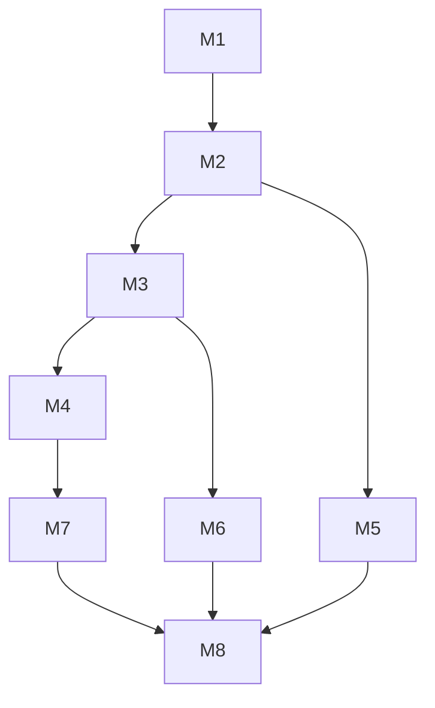

# Roadmap de ejecución — Manuscrito v2

> **Solo orden de trabajo** del refactor de manuscrito. Diseño en [`manuscript-design.md`](manuscript-design.md).  
> Sustituye `_docs/plan_roadmap.md` (archivo en `_docs/archive/manuscript-refactor/`) para implementación nueva.

**Convención:** ⬜ pendiente · 🔄 en curso · ✅ hecho

---

## Resumen de progreso

| Fase | Nombre | Estado |
|------|--------|--------|
| M1 | Parser Rust | ✅ |
| M2 | SQLite + wiki-links | ✅ |
| M3 | IPC + TS | ✅ |
| M4 | Lexical + panel | ✅ |
| M5 | WB + timeline downstream | ✅ |
| M6 | FS + referencias | ✅ |
| M7 | Estabilización editor (II.4) | ✅ |
| M8 | QA manual (II.5) | ✅ |

M1–M6 corresponden al refactor ya implementado en código. **Era II cerrada** v0.10.0 (2026-06-11). § Afinado final = optimización post-cierre.

---

## M1 — Parser Rust ✅

| Entregable | Archivos |
|------------|----------|
| Tipos `ParsedManuscript` | `parser/types.rs` |
| Split `+++event` | `block_splitter.rs`, `format.rs` |
| Inline `{{…}}` | `inline_scanner.rs` |
| Serialize round-trip | `serializer.rs`, `document.rs` |

**Tests:** `cargo test parser::` (54+)

---

## M2 — SQLite ✅

| Entregable | Archivos |
|------------|----------|
| Migración v5 multi-marca | `migrations/005_*.sql` |
| Upsert markers | `db/blocks.rs` |

**Tests:** `cargo test blocks::`

---

## M3 — IPC + TypeScript ✅

| Comando | Rol |
|---------|-----|
| `read_manuscript` / `save_manuscript` | Ciclo principal |
| `create_event_at_cursor`, `close_event_at_cursor`, `insert_inline_tag` | Edición |
| `update_event_metadata` | Barra / apertura |

Tipos: `src/lib/types/manuscript.ts`, `editor.ts`

---

## M4 — Lexical + panel ✅

| Hecho | Notas |
|-------|-------|
| `EventTagBarNode`, `InlineTimeTagNode`, plugins | Store unificado en M7 |
| `commitManuscriptLabel` | Nodos legacy desregistrados (M7) |
| Panel evento/tiempo | Lee `ParsedManuscript.segments` (M7) |

**Siguiente (código):** Era III / MAP — **después** de ordenar documentación `_docs2/`.

---

## M5 — WB + motores ✅

| Entregable | Archivos |
|------------|----------|
| `Worldbuilding/Eventos/` | scaffold, `event.yaml` |
| Sync al guardar | `entity/sync_event.rs` |
| Timeline trayectoria | `timeline/project.rs` |
| Calendario | `lib/calendar/*` |

---

## M6 — FS + referencias ✅

| Fix | ID |
|-----|-----|
| `move_path` / `delete_path` ↔ blocks | A21, A22 |
| Gate parser solo `Manuscrito/**` | A23 |
| Convert/rename preserva `+++event` | tests en `references/`, `refactor/` |

---

## M7 — Estabilización editor ✅

> Tarea detallada: `../04-TASK.md` § II.4.1 · **Plan:** [`plans/Fase E/ERAII-001-single-model-manuscript.md`](../plans/Fase%20E/ERAII-001-single-model-manuscript.md) · Cerrado 2026-06-11 · commit `a5c06f6`

1. ~~Eliminar `manuscriptToParsedDocument` del flujo activo~~
2. ~~Paneles leen `ParsedManuscript.segments`~~
3. ~~Quitar nodos legacy del registro Lexical~~
4. ~~Build + tests frontend verdes~~
5. ~~Smoke manual mínimo~~ — QA post-M7: `session-1781734162916-17440` + `session-1781734289595-24412`

**Criterio de salida:** un solo modelo en memoria; sin imports activos de `ParsedDocument` en editor manuscrito. **Cumplido.**

---

## Afinado final (optimización — post Era II)

> **Política (jun 2026):** no bloqueó cierre v0.10.0. Ejecutar cuando convenga antes de MAP o en paralelo con orden doc.

| Ítem | Notas |
|------|--------|
| **QA §7 residual** | S7-01, S7-03, S7-04 revalidar, S7-06, S7-08, S7-09, S7-12; FIX-004/005/012/013 recorrido manual |
| Borrar dead code | `BlockSeparatorNode`, `BlockMetadataNode`, `BlockMetadataChips`, `resolveBlockTime.ts` |
| Tests unitarios | `findLastAddedTimeInManuscript`, helpers `metadataForLegacyBlockIndex` |
| OBS residual | `insertTimeTag` en action log |
| Deuda menor | `legacyBlockIndexFromSegmentIndex` sin uso; alinear log `segmentCount` FE/Rust en expand |

---

## M8 — QA manual ✅

> Cerrado 2026-06-11 · **Plan:** [`plans/Fase E/ERAII-002-qa-manual-section7.md`](plans/Fase%20E/ERAII-002-qa-manual-section7.md)  
> **Criterio:** smoke QA (`5608`/`22856` + histórico M7/FIX); checklist §7 completa → § Afinado final.

Changelog: [`../05-CHANGELOG.md`](../05-CHANGELOG.md) v0.10.0 · Era II ✅ [`../03-ROADMAP.md`](../03-ROADMAP.md)

---

## Dependencias

---

## Qué no rehacer

- Parser Rust M1–M2 salvo bug demostrado en QA
- No parchear formato `+++` legacy — no hay proyectos legacy
- No abrir ubicación/mapas/Git hasta **orden doc** + decisión explícita Era III

**Última sincronización:** 2026-06-11
