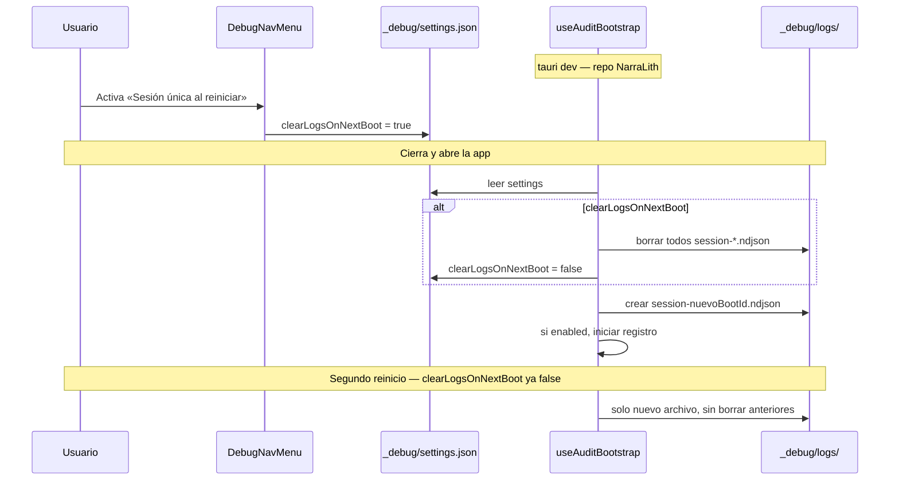

# OBS-001 — Módulo global de auditoría del sistema

> Plan de diseño e implementación. **Estado:** ✅ COMPLETO (v1) · **Fases 0–6:** ✅ · **Auditoría código:** §2.4, §12–14 (jun 2026) · **Esfuerzo:** Medio · **Riesgo:** Bajo–Medio  
> **Lista maestra:** [`implementation-plan.md`](../implementation-plan.md) Fase B · **Primer consumidor:** diagnóstico **FIX-012** (guardar / pestañas / `fs-changed`).

### Progreso de implementación (jun 2026)

| Fase | Estado | Entregables |
|------|--------|-------------|
| **0 — Esqueleto + bootstrap** | ✅ | `src/lib/audit/*`, `src-tauri/src/audit/*`, `useAuditBootstrap`, `useAuditStore`, `.gitignore` `_debug/`, tests Vitest (12), tests Rust (3), triple compuerta release |
| **1 — Capas transversales** | ✅ | `auditInvoke`, editor store, fsSync, `useEditorFsSync`, Rust `bridge.rs`, correlación save |
| **2 — Menú debug** | ✅ | `DebugNavMenu`, i18n `debug.json`, lazy en `GlobalNav` |
| **3 — Visor + resto** | ✅ | `AuditLogViewer` (filtros + copiar), stores secundarios, `Ctrl+Shift+L` |
| **4 — Huecos P0** | ✅ | `obs.fs.watcher.raw`, `obs.fs.self_save.ignore`, `touchedEntityPaths`, `reportDegraded`, sin `rootPath` absoluto en payloads |
| **5 — Tests + verificación** | ✅ | `auditInvoke` + `bridge.rs` (sin macro `audited_command`); Vitest 95; Rust audit 3; `npm run build` sin strings debug en `dist/` |
| **6 — Documentación** | ✅ | § Observabilidad en [`06-ARCHITECTURE.md`](../../06-ARCHITECTURE.md); este plan cerrado |

**Fuera de v1 (documentado, no implementar):** `session-*.meta.json`, crate `tracing`, ring buffer Rust, macro `audited_command`, instrumentación `fs_ops` CRUD individual, `useWorkspaceStore` / `useCalendarViewStore` / `usePersistManuscriptTabs`.

**Fase 0 — checklist:**

- [x] Tipos `AuditEntry`, ring buffer TS, `audit.info/warn/error` (respeta `enabled`)
- [x] `audit/stub.ts` + `audit/index.ts` + `__AUDIT_ENABLED__` en Vite
- [x] Rust `src-tauri/src/audit/` bajo `#[cfg(debug_assertions)]`; `_debug/logs/` al bootstrap
- [x] `useAuditBootstrap` idempotente; **antes** de `useFsWatcher` en `WorkspaceShell`
- [x] Comandos IPC `audit_*` registrados (dev); excluidos en release
- [x] Persistencia TS→Rust vía `audit_append_entry` + `setPersistHandler`
- [x] Tipos IPC `src/lib/types/audit.ts`
- [x] Tests Vitest: stub, disabled, truncado, correlación, persist handler
- [x] Tests Rust: NDJSON append, settings round-trip, one-shot clear
- [x] `vite.config.ts`: `watch.ignored` incluye `_debug/**`

---

## 1. Problema y objetivo

**Problema hoy:** no hay un registro estructurado, correlacionable y reutilizable de lo que hace la app. Los bugs (p. ej. FIX-012) se diagnostican con **suposiciones** y `console.error` dispersos (`[save_manuscript]`, `[Lexical]`, …). Tauri DevTools y la consola de Rust no unifican frontend ↔ backend ↔ watcher ↔ stores.

**Objetivo OBS-001:**

1. **Un solo bus de auditoría** para toda la aplicación (TS + Rust).
2. **Entradas tipadas** con timestamp, dominio, nivel, correlación y payload acotado.
3. **Buffer en memoria** consultable desde UI (panel «Registro del sistema») y exportable a archivo.
4. **Instrumentación por capas** (IPC, eventos Tauri, FS, editor, stores) sin duplicar lógica en cada fix futuro.
5. **Activación configurable** desde menú debug en **`tauri dev` only** (encender/apagar, borrar, sesión única).
6. **Persistencia** en **`NarraLith/_debug/`** (raíz de este repo); **gitignore**; ausente en build release.

**No es:**

| Expectativa incorrecta | Realidad OBS-001 |
|----------------------|------------------|
| Telemetría a la nube | Todo local; opcional export manual |
| Log del contenido del manuscrito | Payload acotado; sin cuerpos completos salvo flag explícito de debug |
| Sustituto de tests | Complemento para QA manual y post-mortem |
| Basura en novelas del autor | Solo **`_debug/`** en la **raíz del repo de desarrollo** (este monorepo); gitignore |

---

## 2. Auditoría del estado actual

### 2.1 Frontend

| Pieza | Situación |
|-------|-----------|
| [`invokeCommand`](../../../src/lib/ipc.ts) | Envuelto por `auditInvoke` en dev (cmd, duration, error key) | ✅ Fase 1 |
| Stores Zustand | Sin middleware de logging |
| [`useEditorFsSync`](../../../src/hooks/useEditorFsSync.ts) | `obs.editor.fs.sync` antes de side effects; bootstrap registra `obs.fs.changed` | ✅ Fase 1 |
| [`useFsWatcher`](../../../src/hooks/useFsWatcher.ts) | Refresca árbol; solo resumen en `notifyFsChange` |
| Errores puntuales | `console.error` en `useEditorStore`, `EditorShell` |
| Settings | [`useSettingsStore`](../../../src/stores/useSettingsStore.ts) — autoguardado, tema; **sin** flags de debug |
| Navegación lateral | [`GlobalNav.tsx`](../../../src/modules/layout/GlobalNav.tsx) — icono **`History`** (versiones) abre `VersionHistoryPanel` (**roto** / sin backend Git completo); icono **`Clock`** = timeline (vista distinta) |

### 2.2 Backend (Rust)

| Pieza | Situación |
|-------|-----------|
| ~50 comandos IPC en [`lib.rs`](../../../src-tauri/src/lib.rs) | Sin capa común de trace |
| [`emit_fs_changed`](../../../src-tauri/src/fs/reconcile.rs) | `obs.fs.reconcile.emit` + `obs.fs.reconcile.ghost` (dev) | ✅ Fase 1 |
| [`ProjectWatcher`](../../../src-tauri/src/fs/watcher.rs) | Debounce 250 ms; `obs.fs.watcher.raw` pre-debounce (nivel Debug) | ✅ |
| `mark_ghost` / `apply_changes` | `obs.fs.reconcile.ghost` en remove watcher | ✅ Fase 1 |
| Crates | **No** hay `tracing` / `log` en `Cargo.toml` hoy |

### 2.3 Eventos Tauri ya usados (candidatos a suscripción central)

| Evento | Emisor | Consumidor |
|--------|--------|------------|
| `fs-changed` | `reconcile::emit_fs_changed`, watcher | `useEditorFsSync`, `useFsWatcher` |
| `fs-changed` | `reconcile::emit_fs_changed`, watcher | `useEditorFsSync`, `useFsWatcher` |
| `consistency-updated` | [`checker/scheduler.rs`](../../../src-tauri/src/checker/scheduler.rs), [`commands/consistency.rs`](../../../src-tauri/src/commands/consistency.rs) | [`useConsistencyIssues.ts`](../../../src/hooks/useConsistencyIssues.ts) |
| `graph-index-updated` | [`graph/scheduler.rs`](../../../src-tauri/src/graph/scheduler.rs) | [`useGraphProject.ts`](../../../src/hooks/useGraphProject.ts) |
| `auto-snapshot` | *(previsto en git; emisión no verificada en handlers actuales)* | [`useAutoSnapshotIndicator.ts`](../../../src/hooks/useAutoSnapshotIndicator.ts) |

> **Centralizar suscripción:** OBS-001 debe registrar **un solo** listener por evento en `useAuditBootstrap` — no duplicar en cada hook, o el NDJSON repetirá entradas.

### 2.4 Auditoría completa del código (jun 2026)

Revisión del repo para definir **qué instrumentar**, **qué excluir** y **cómo no romper dev/release**.

> **OBS-003 (jun 2026):** las acciones de usuario orientadas a QA (`obs.action.*`) viven en [`action-logs/`](../Fase%20D/OBS-003-action-audit-log.md) — OBS-001 no las duplica ni las reemplaza; conviven en archivos distintos con el mismo `bootId`.

#### 2.4.1 Punto único IPC (frontend)

| Hallazgo | Implicación OBS-001 |
|----------|---------------------|
| **Todo** `invoke` pasa por [`invokeCommand`](../../../src/lib/ipc.ts) (único import de `@tauri-apps/api/core`) | Envolver **solo** aquí captura ~100 % del tráfico IPC sin tocar cada store |
| ~**68** comandos registrados en [`lib.rs`](../../../src-tauri/src/lib.rs) | Lista cerrada en §13.1; log = `cmd` + duración + `error.key` |
| Comandos **versiones** (`list_snapshots`, `create_snapshot`, `restore_snapshot`, `get_file_diff`) usados en UI pero **no** registrados en `lib.rs` | Registrar `obs.ipc.invoke.error` con `details: command_not_found` — explica Historial roto |
| Comandos editor `update_event_metadata`, `create_event_at_cursor`, … registrados en Rust pero **sin** `invokeCommand` en TS hoy | Eventos de evento van por **RAM** (`ManuscriptEventCommandsPlugin`) hasta `save_manuscript`; instrumentar **`save_manuscript`** + store tabs, no esos IPC huérfanos |

#### 2.4.2 Cadena FIX-012 (prioridad P0)

```text
Ctrl+S / Guardar todo
  → saveAllOpenTabs()                    [EditorCanvas, EditorSidePanel, EntityWorkspace]
  → switchTab × N + saveDocument()
  → markSelfSave(activePath)             [fsSync.ts — solo 1 ruta]
  → invoke save_manuscript               [Rust: sync_event + fs::write]
  → watcher debounce 250ms               [watcher.rs]
  → apply_changes → emit fs-changed      [reconcile.rs — kind puede ser remove]
  → useEditorFsSync                      [closeTabsRemovedFromDisk | reload | dialog]
  → useFsWatcher                         [loadTree — no cambia tab]
  → usePersistManuscriptTabs             [localStorage — no cambia tab]
  → useRestoreLastManuscriptFile         [solo al abrir proyecto vacío]
```

| Punto | Archivo | Eventos OBS mínimos |
|-------|---------|---------------------|
| Guardado batch | `useEditorStore.ts` L1174–1223 | `obs.editor.saveAll.start/end`, `correlationId`, `dirtyPaths`, `activePath` |
| Guardado activo | `useEditorStore.ts` L849–905 | `obs.editor.save.start/end`, `path` |
| markSelfSave | `fsSync.ts` | `obs.fs.self_save.mark` |
| shouldIgnoreFsReload | `fsSync.ts` + `useEditorFsSync.ts` | `obs.fs.self_save.ignore` / `hit` |
| fs-changed handler | `useEditorFsSync.ts` L27–79 | `obs.fs.changed` **antes** de side effects |
| Cierre tabs | `useEditorStore.ts` L1012–1050 | `obs.editor.tab.close`, `reason`, `nextActive` |
| switchTab / open | `useEditorStore.ts` | `obs.editor.tab.switch/open` |
| emit + ghost | `reconcile.rs` | `obs.fs.changed`, `obs.fs.reconcile.ghost` |
| save + sync WB | `document.rs`, `sync_event.rs` | `obs.rust.save_manuscript`, `touchedEntityPaths[]` |

#### 2.4.3 Stores Zustand (prioridad instrumentación)

| Store | Acciones / suscripciones a registrar | Evitar |
|-------|--------------------------------------|--------|
| **`useEditorStore`** | tabs, save, reload, remap, unsaved dialog, external reload | `markDirty` por tecla (alto volumen) |
| **`useProjectStore`** | open/close/create project | — |
| **`useFileTreeStore`** | CRUD paths, `loadTree`, `notifyFsChange`, `selectNode` | cada nodo del árbol |
| **`useWorkspaceStore`** | `mainView` | — |
| **`useCalendarViewStore`** | `guardCalendarNavigation`, discard | — |
| **`usePersistManuscriptTabs`** | persist localStorage tabs | solo resumen al cambiar activa |
| **`commitManuscriptLabel`** | commit panel etiquetas | payload: segmentIndex, no YAML |

No usar middleware global Zustand en v1 — demasiado ruido; hooks puntuales + flag `logStorePatches`.

#### 2.4.4 Hooks con listeners (orden en `WorkspaceShell`)

Orden actual ([`WorkspaceShell.tsx`](../../../src/modules/layout/WorkspaceShell.tsx)):

```text
useEntityIndexBootstrap → useAuditBootstrap → useFsWatcher → useEditorFsSync → …
```

**Requisito OBS-001:** ✅ `useAuditBootstrap()` insertado **antes** de `useFsWatcher` / `useEditorFsSync`.

| Hook | Riesgo si audit mal hecho |
|------|---------------------------|
| [`useEditorAutoSave.ts`](../../../src/hooks/useEditorAutoSave.ts) | Puede intercalarse con save manual — correlacionar por `saveStatus` |
| [`useRestoreLastManuscriptFile.ts`](../../../src/hooks/useRestoreLastManuscriptFile.ts) | Abre N tabs al inicio — puede confundir repro FIX-012; log `obs.editor.session.restore` |
| **React StrictMode** ([`main.tsx`](../../../src/main.tsx)) | Efectos dobles en dev → bootstrap debe ser **idempotente** (guard `bootstrappedRef` / single session file) |

#### 2.4.5 Rust — side effects silenciosos

| Módulo | Instrumentar |
|--------|--------------|
| [`reconcile.rs`](../../../src-tauri/src/fs/reconcile.rs) | `apply_changes`, `emit_fs_changed`, `mark_ghost` |
| [`watcher.rs`](../../../src-tauri/src/fs/watcher.rs) | eventos raw pre-debounce (nivel `debug` en settings) |
| [`document.rs`](../../../src-tauri/src/parser/document.rs) | `save_manuscript_and_persist`, `write_manuscript_and_persist` |
| [`sync_event.rs`](../../../src-tauri/src/entity/sync_event.rs) | paths WB tocados, rename entity |
| [`fs_ops.rs`](../../../src-tauri/src/commands/fs_ops.rs) | CRUD + `emit_fs_changed` explícito |
| [`checker/scheduler.rs`](../../../src-tauri/src/checker/scheduler.rs) | `consistency-updated` |
| [`graph/scheduler.rs`](../../../src-tauri/src/graph/scheduler.rs) | rebuild async |

**No añadir** crate `tracing` a dependencias **release** — módulo `audit` entero bajo `#[cfg(debug_assertions)]` en `lib.rs` (`mod audit;` condicional).

#### 2.4.6 Payloads prohibidos o acotados (§13.3)

Comandos con respuesta grande o sensible — **nunca** volcar body en NDJSON:

`read_manuscript`, `save_manuscript`, `save_entity`, `read_entity`, `get_map_*`, `save_map_*`, `save_map_canvas_png_cmd`, `get_graph_data_cmd`, `list_dir_tree`, `parse_manuscript`, `read_document`.

Log permitido: `cmd`, keys de args, `durationMs`, `error.key`, contadores (`segmentCount`, `path` relativo al **proyecto abierto**, no `_debug`).

#### 2.4.7 Entorno dev vs release (hallazgos build)

| Pieza | Estado actual | Acción OBS-001 |
|-------|---------------|----------------|
| [`vite.config.ts`](../../../vite.config.ts) | `__AUDIT_ENABLED__`; watch ignora `src-tauri` y `_debug` | ✅ Hecho |
| [`tauri.conf.json`](../../../src-tauri/tauri.conf.json) | `beforeBuildCommand: npm run build` → `import.meta.env.PROD` | Correcto para tree-shake UI debug |
| [`src-tauri/.taurignore`](../../../src-tauri/.taurignore) | Excluye `_docs2/` del bundle | `_debug/` no entra al binario (está en repo root, no en resources) |
| Rust release profile | `debug_assertions = false` por defecto | Módulo `audit` no compilado ✓ |
| **`CARGO_MANIFEST_DIR/../_debug`** | Ruta **compile-time** al clone donde se compiló | Válido para `tauri dev` en la misma máquina; **inútil** si audit no compila en release — coherente con D3 |

#### 2.4.8 Riesgos de «romper» la app al instrumentar

| Riesgo | Mitigación obligatoria |
|--------|------------------------|
| Recursión IPC (`audit_append` → `auditInvoke`) | Comandos `audit_*` llaman Rust **directo**; excluidos del wrapper |
| `audit.*` lanza | try/catch interno; nunca propagar |
| Log sincrónico bloquea UI | Append Rust en disco **async** / buffered; TS ring buffer |
| Doble listener `fs-changed` | Solo `useAuditBootstrap` escribe `obs.fs.changed` |
| Instrumentar `markDirty` | **Prohibido** en v1 |
| StrictMode doble bootstrap | Idempotente + un `session-*.ndjson` por `bootId` |
| Escritura `_debug` falla (permisos) | Degradar a RAM-only + `obs.system.warn`; no crash |
| Import estático de `modules/debug` en release | **Dynamic import** en `GlobalNav` guardado por `import.meta.env.DEV` |

---

## 3. Diseño propuesto

### 3.1 Nombre y ubicación en el repo

**Módulo:** `audit` (observabilidad transversal).

```text
src/lib/audit/           # API TS, tipos, buffer, escritura disco
src/stores/useAuditStore.ts
src/hooks/useAuditBootstrap.ts
src/modules/debug/       # menú debug GlobalNav + visor opcional
  DebugNavMenu.tsx
  AuditLogViewer.tsx     # lista en vivo (sub-panel o drawer)

src-tauri/src/audit/     # log Rust, bridge Tauri, FS carpeta debug
```

Convención ID de evento: **`obs.<dominio>.<acción>`** (ej. `obs.fs.changed`, `obs.editor.tab.close`).

### 3.2 Modelo de entrada (`AuditEntry`)

```typescript
interface AuditEntry {
  id: string;              // uuid corto
  ts: number;              // Date.now() / ms desde boot
  level: "trace" | "debug" | "info" | "warn" | "error";
  domain: AuditDomain;
  event: string;           // obs.fs.changed
  message?: string;        // human-readable corto
  correlationId?: string;  // une save batch + fs events
  payload?: Record<string, unknown>;  // acotado, serializable
  source: "frontend" | "backend";
  durationMs?: number;     // IPC / operación
}
```

**Dominios (`AuditDomain`):** `ipc` · `fs` · `editor` · `store` · `project` · `explorer` · `watcher` · `entity` · `system`.

**Límites de payload:**

- Rutas: relativas al proyecto (`Manuscrito/foo.md`), nunca absolutas en export por defecto.
- Máx. ~2 KB por entrada; truncar strings largos.
- **Prohibido** por defecto: cuerpo de manuscrito, YAML completo, contenido de entidad.

### 3.3 API pública (frontend)

```typescript
// src/lib/audit/auditLog.ts
audit.info("editor", "obs.editor.save.start", { path, isDirty });
audit.warn("fs", "obs.fs.tab.close", { paths, activePath, reason: "fs-remove" });
audit.withCorrelation("save-batch-abc", () => { ... });

// Wrapper IPC (sustituye o envuelve invokeCommand)
auditInvoke<T>(cmd, args): Promise<T>
```

**Reglas:**

- `audit.*` nunca lanza; fallos internos → `console.debug` silencioso.
- En **build release** (`import.meta.env.PROD`): módulo **ausente** — ver §3.11 (sin UI, sin IPC audit, sin carpeta).
- En **dev** y audit apagado: no-op total — no buffer, no disco.

### 3.4 Backend Rust

**Opción recomendada:** crate `tracing` + subscriber que:

1. Escribe a buffer en memoria (mutex, ring buffer 2–5k entradas).
2. Emite evento Tauri `audit-log` con entrada serializada (batch cada N ms o inmediato en `warn`/`error`).

**Puntos de instrumentación (fase 2):**

| Punto | Eventos |
|-------|---------|
| `apply_changes` / `emit_fs_changed` | kind, paths, fromPath |
| `normalize_debounced` (watcher) | path, exists, inferred kind |
| `save_manuscript_and_persist` | rel path, touched entity paths, duración |
| `mark_ghost` | path, trigger |
| Macro o wrapper `#[tauri::command]` | cmd name, ok/err, duration |

**Comandos IPC (carpeta debug):**

| Comando | Uso |
|---------|-----|
| `audit_get_config` | Lee `_debug/settings.json` + estado runtime |
| `audit_set_enabled { enabled }` | Enciende/apaga registro (TS + Rust) |
| `audit_clear_logs` | Borra `_debug/logs/*` + vacía buffer Rust |
| `audit_append_entry` | Entrada TS/Rust → NDJSON (**no** pasa por `auditInvoke`) |
| `audit_get_log_path` | Ruta activa `session-*.ndjson` (opener SO) |

### 3.5 Correlación (clave para FIX-012)

Cada operación de usuario que dispara cascada debe compartir **`correlationId`**:

```text
Usuario Ctrl+S
  correlationId = save-173…
  obs.editor.saveAll.start     { dirtyPaths, activePath }
  obs.ipc.save_manuscript      { path: eventoTest }
  obs.fs.changed               { kind: modify, paths: [...] }   ← watcher
  obs.fs.changed               { kind: remove, paths: [meow] }  ← sospechoso
  obs.editor.tab.close         { path: meow, reason: fs-remove }
  obs.editor.saveAll.end       { activePath: skanlnsklnals }
```

Sin correlación, el buffer es ruido; **Fase 1** incluye generar ID en `saveAllOpenTabs` / `saveDocument` aunque el fix aún no exista.

### 3.6 Almacenamiento en disco (`_debug/` en el repo de desarrollo)

**Decisión D2 — ubicación:** la carpeta debug vive en la **raíz del entorno de desarrollo** (este repositorio NarraLith), **no** en AppData, **no** en la novela abierta (`Manuscrito/…`).

| Criterio | AppData | Novela `.narralith/debug/` | **`NarraLith/_debug/`** ✅ |
|----------|---------|----------------------------|----------------------------|
| Acceso al depurar | Ruta oculta del SO | Mezcla datos del autor | Abres el repo en Cursor y listo |
| Basura fuera del repo | Sí | Dentro de la obra | Solo en **tu** clone de dev; gitignore |
| Contamina proyecto de escritura | No | Sí (aunque ignorado) | **No** — la novela no se toca |
| Watcher del proyecto abierto | — | Riesgo si no ignorado | **Cero** — `_debug/` está fuera del `project_root` de la novela |

**Ruta fija (solo `tauri dev` / build debug):**

```text
NarraLith/                    ← raíz del repo (junto a package.json)
  _debug/
    settings.json               # preferencias OBS-001 del entorno dev
    logs/
      session-<bootId>.ndjson
      session-<bootId>.meta.json
```

Resolución en Rust: `canonicalize(CARGO_MANIFEST_DIR/../_debug)` — el manifiesto Cargo está en `src-tauri/`, el padre es la raíz del repo.

**Build release instalado:** no se crea `_debug/` ni se compilan comandos `audit_*` (§3.11).

**Formato:** NDJSON, append por sesión de app.

**Escritura:**

- Solo si `cfg!(debug_assertions)` / modo dev.
- Append al `session-<bootId>.ndjson` activo.
- Buffer RAM en TS para el visor.
- **Nunca** escribir en la carpeta de la novela abierta ni en `Manuscrito/`.

**Git:** [`_debug/`](../../../.gitignore) en `.gitignore` raíz — no sube al remoto.

**Ring buffer RAM:** 2 000 entradas TS; si audit apagado → no crece ni flush.

### 3.7 Menú debug en `GlobalNav` (**solo build dev**)

**Visibilidad:** el botón y el menú se renderizan **únicamente** si `import.meta.env.DEV === true`. En el `.exe` / instalador release **no aparecen** (tree-shake del chunk `modules/debug/*`). Ver §3.11.

**Ubicación (dev):** barra lateral [`GlobalNav.tsx`](../../../src/modules/layout/GlobalNav.tsx), bloque inferior (`mt-auto`), **inmediatamente encima** del botón **Historial** (`History`).

```text
┌─────────────┐
│  … timeline │
│  map        │
│  graph      │
├─────────────┤  ← mt-auto
│  🐛 Debug   │  ← NUEVO: abre menú (Popover / DropdownMenu)
│  History    │  ← historial versiones (existente)
│  Settings   │
└─────────────┘
```

**Componente:** `DebugNavMenu.tsx` — icono sugerido `Bug` o `ScrollText` (lucide), tamaño `size-9` igual que el resto; `aria-label` i18n `debug.menuTitle`.

**Interacción:** clic abre **menú de opciones debug** (no cambia `mainView`). Usar `@/components/ui` DropdownMenu o Popover anclado al botón.

#### Opciones del menú (v1)

| # | Control | Comportamiento |
|---|---------|----------------|
| 1 | **Registro del sistema** (toggle) | Enciende/apaga `audit.enabled`. **Apagado:** no-op. Estado en `_debug/settings.json`. |
| 2 | **Eliminar registros** | Confirmación → borra `_debug/logs/*`, vacía buffers. |
| 3 | **Sesión única al reiniciar** | One-shot §3.8. |
| — | *Separador* | |
| 4 | **Ver registro** (opcional v1) | Drawer `AuditLogViewer`. |
| 5 | **Abrir carpeta debug** | Opener SO sobre `{repo_root}/_debug/logs/`. |

Estados visuales del toggle (1): indicador ON/OFF en el ítem del menú; icono debug con punto verde/gris opcional.

**i18n:** namespace `debug.json` (es/en): `menuTitle`, `loggingEnabled`, `loggingDisabled`, `clearLogs`, `clearLogsConfirm`, `singleSessionNextBoot`, `singleSessionHint`, `viewLog`, `openFolder`.

### 3.8 Preferencias persistidas (`_debug/settings.json`)

```typescript
interface AuditDebugSettings {
  /** Default: true en dev (tauri dev). Ignorado en release — módulo no existe. */
  enabled: boolean;
  /** One-shot: al próximo bootstrap borrar logs y poner esto a false. Default: false. */
  clearLogsOnNextBoot: boolean;
  level: AuditLevel;
  logIpcArgs: boolean;
  logStorePatches: boolean;
  maxBufferSize: number;
}
```

#### Flujo «sesión única al reiniciar» (one-shot)

Requisito del usuario: al activar la opción, **la próxima vez que inicie la app** se borran los registros para garantizar un log de **una sola sesión**; tras esa limpieza la opción **se desactiva sola**; un segundo reinicio **no** vuelve a borrar.

```text
Usuario marca «Sesión única al reiniciar»
  → clearLogsOnNextBoot = true  (guardado en settings.json)

Usuario cierra y abre la app (bootstrap OBS-001, ANTES de registrar eventos):
  1. Leer settings.json
  2. Si clearLogsOnNextBoot === true:
       - audit_clear_logs (borrar _debug/logs/*)
       - clearLogsOnNextBoot = false
       - persistir settings.json
  3. Crear nuevo session-<bootId>.ndjson
  4. Si enabled === true → empezar a registrar solo esta sesión

Segundo reinicio (clearLogsOnNextBoot ya false):
  → NO borrar; nuevo archivo session-<nuevoBootId>.ndjson (varios archivos = historial de sesiones)
  → O política documentada: un solo .ndjson activo + archivar anteriores (ver decisión abajo)
```

**Decisión de producto D1 — archivos tras varios arranques:**

| Modo | Comportamiento |
|------|----------------|
| **Default** | Cada arranque = nuevo `session-<bootId>.ndjson`; limpieza manual o one-shot borra **todos** en `logs/`. |
| **Tras one-shot** | Usuario tiene exactamente **un** archivo de la sesión actual hasta que borre manualmente o reactive one-shot. |

**Implementación one-shot:** borrar **toda** la carpeta `logs/` al arranque condicionado; no depender de borrar solo el archivo previo.

**Store:** [`useAuditStore`](../../../src/stores/useAuditStore.ts); [`useAuditBootstrap`](../../../src/hooks/useAuditBootstrap.ts) en [`WorkspaceShell`](../../../src/modules/layout/WorkspaceShell.tsx) — solo montado en dev; arranque de app → asegurar `_debug/` → one-shot → nuevo `session-*.ndjson`.

### 3.11 Build release — sin debug en el binario (decisión D3)

**Filosofía del producto** ([`01-REQUIREMENTS.md`](../../01-REQUIREMENTS.md)): offline-first, soberanía de datos del **autor**, opt-in, herramienta de escritura — no un IDE con telemetría ni panel de ingeniería.

**Recomendación:** **no incluir** menú debug ni registro en la versión compilada para usuarios finales.

| Motivo | Detalle |
|--------|---------|
| No «soltar» arquitectura | El NDJSON expone nombres IPC, dominios internos, rutas — mapa del código sin fuente |
| UX del autor | El botón 🐛 confunde y rompe la promesa de app limpia |
| Datos del autor | Aunque el log iría en `_debug/` del repo dev, un build mal configurado podría escribir fuera de intención |
| Mantenimiento | Un solo camino: depurar con `tauri dev` + `_debug/` en el clone |

**Implementación prevista — triple compuerta (D3 reforzada):**

| Capa | Dev (`tauri dev`) | Release (`tauri build`) |
|------|-------------------|-------------------------|
| Compuerta 1 | `import.meta.env.DEV` | `false` → ramas muertas eliminadas por Vite |
| Compuerta 2 | `__AUDIT_ENABLED__` en `vite.config.ts` | `false` en production build |
| Compuerta 3 Rust | `#[cfg(debug_assertions)] mod audit;` | Módulo **ausente** del binario |
| UI `DebugNavMenu` | `lazy(() => import('@/modules/debug/...'))` dentro de `if (import.meta.env.DEV)` | Chunk **no generado** |
| API TS | `@/lib/audit/index.ts` reexporta implementación | `@/lib/audit/stub.ts` — funciones vacías (mismo API) |
| `invokeCommand` | Delega a `auditInvoke` si `__AUDIT_ENABLED__` | Llama `invoke` directo |
| Comandos `audit_*` en `lib.rs` | Registrados vía `generate_handler![..., audit::commands...]` condicional | **Omitidos** del macro |
| Carpeta `_debug/` | `{CARGO_MANIFEST_DIR}/../_debug` | No se crea ni se referencia |

**Futuro (opcional, no v1):** export diagnóstico anónimo bajo demanda en Ajustes (sin menú debug permanente) — solo si hay beta testers; no necesario ahora.

**Vite** ([`vite.config.ts`](../../../vite.config.ts)):

```typescript
define: {
  __AUDIT_ENABLED__: JSON.stringify(process.env.NODE_ENV === "development"),
},
server: {
  watch: {
    ignored: ["**/src-tauri/**", "**/_debug/**"],
  },
},
```

Alias condicional (opcional): `@/lib/audit` → `audit/index.ts` vs `audit/stub.ts` según `mode`.

**Tauri** ([`lib.rs`](../../../src-tauri/src/lib.rs)):

```rust
#[cfg(debug_assertions)]
mod audit;

// generate_handler![ ..., #[cfg(debug_assertions)] audit::commands... ]
```

**Verificación post-build (añadir a Fase 5 / CI manual):**

| Check | Comando / criterio |
|-------|-------------------|
| Bundle sin UI debug | `rg -i "DebugNavMenu|debug\\.menuTitle" dist/` → 0 coincidencias |
| Bundle sin eventos obs | `rg "obs\\.editor\\.save" dist/assets/*.js` → 0 (stub no incluye strings) |
| Binario release sin `audit_` | `strings target/release/narralith.exe \| rg audit_` → 0 (Windows) |
| `npm run build` | Exit 0 sin import de módulos debug |
| Smoke release | Abrir `.exe` → GlobalNav **sin** botón 🐛; `invoke('audit_get_config')` falla |

**Tauri:** no registrar comandos `audit_*` en release.

---

### 3.9 Visor de registro (complemento al menú, dev-only)

Acceso desde «Ver registro» o atajo `Ctrl+Shift+L`. No en Ajustes del build release.

| Función | Detalle |
|---------|---------|
| Lista en vivo | Tail del NDJSON de sesión + buffer RAM |
| Filtros | texto libre + nivel mínimo (`trace`…`error`) | ✅ |
| Detalle | Payload JSON inline en cada fila | ✅ |
| Copiar | Entradas visibles (filtradas) como NDJSON | ✅ |

### 3.10 Configuración runtime (resumen)

| Flag | Efecto cuando OFF |
|------|-------------------|
| `enabled` | Sin entradas, sin append disco, Rust subscriber idle |
| `clearLogsOnNextBoot` | Solo lectura en menú; se escribe `true` al marcar; auto `false` tras ejecutar |

Defaults: `enabled: true` al arrancar con `tauri dev` (usuario puede apagar desde menú).

---

## 4. Plan de instrumentación por fases

### Fase 0 — Esqueleto + carpeta debug + bootstrap ✅

- [x] Tipos `AuditEntry`, ring buffer TS, `audit.info/warn/error` (respeta `enabled`).
- [x] **`audit/stub.ts`** + **`audit/index.ts`** — mismo contrato; alias Vite en prod.
- [x] Rust: `src-tauri/src/audit/` solo `#[cfg(debug_assertions)]`; crear `_debug/logs/` al init.
- [x] **`useAuditBootstrap`:** idempotente (StrictMode); one-shot; **antes** de `useFsWatcher`.
- [x] Gating triple §3.11.
- [x] IPC audit excluido de `auditInvoke` wrapper (comandos directos en `lib/audit/ipc.ts`).
- [x] Tests Vitest: stub en prod mode, one-shot, no-op disabled, truncado payload.

### Fase 1 — Capas transversales (80 % del valor) ✅

| Capa | Acción | Estado |
|------|--------|--------|
| **IPC** | `auditInvoke` envuelve [`invokeCommand`](../../../src/lib/ipc.ts): cmd, args keys (no values sensibles), duration, error key | ✅ |
| **Tauri events** | Bootstrap único: `fs-changed`, `consistency-updated`, `graph-index-updated` | ✅ |
| **Editor store** | `openDocument`, `switchTab`, `saveDocument`, `saveAllOpenTabs`, `closeTabsRemovedFromDisk`, `reloadDocumentFromDisk` | ✅ |
| **FS sync** | `obs.editor.fs.sync` en [`useEditorFsSync`](../../../src/hooks/useEditorFsSync.ts); `markSelfSave` / `hit` en [`fsSync.ts`](../../../src/lib/editor/fsSync.ts) | ✅ |
| **Rust** | [`audit/bridge.rs`](../../../src-tauri/src/audit/bridge.rs): `emit_fs_changed`, `mark_ghost`, `save_manuscript` | ✅ |
| **Correlación** | `beginCorrelation()` / `endCorrelation()` + `withCorrelationAsync` en guardado | ✅ |

**Fase 1 — checklist:**

- [x] `auditInvoke` + exclusión `audit_*` y `list_dir_tree` (§13.3)
- [x] Eventos editor P0 FIX-012: save, saveAll, tabs, reload, fs.sync, tab.close (fs-remove)
- [x] `obs.fs.self_save.mark` / `obs.fs.self_save.hit`
- [x] Rust: `obs.rust.save_manuscript`, `obs.fs.reconcile.emit`, `obs.fs.reconcile.ghost`
- [x] Tests Vitest: correlación anidada, `buildAuditIpcPayload` (10 tests audit; 93 suite)

### Fase 2 — Menú debug en `GlobalNav` ✅

- [x] `DebugNavMenu.tsx` encima de icono **Historial** (`History`).
- [x] Toggle encender/apagar → `audit_set_enabled` vía `useAuditStore`.
- [x] «Eliminar registros» → confirm + `audit_clear_logs`.
- [x] «Sesión única al reiniciar» → `clearLogsOnNextBoot` en settings (one-shot §3.8).
- [x] i18n `debug.json` (es/en) registrado en [`i18n/config.ts`](../../../src/i18n/config.ts).
- [x] «Abrir carpeta debug» → `@tauri-apps/plugin-opener` sobre `_debug/logs/`.
- [x] Lazy import + `__AUDIT_ENABLED__` — ausente en `dist/` release.

**Pendiente Fase 3:** ~~«Ver registro» → `AuditLogViewer`~~ ✅

### Fase 3 — Visor + instrumentación restante ✅

- [x] `AuditLogViewer` (drawer lateral) desde menú debug + `useSyncExternalStore` / `audit.subscribe`.
- [x] Stores secundarios: `useProjectStore` (open/close), `useFileTreeStore` (loadTree, notifyFsChange).
- [x] Editor auxiliar: `useRestoreLastManuscriptFile`, unsaved/reload dialogs, `commitManuscriptLabel`.
- [x] Atajo `Ctrl+Shift+L` (`useAuditLogShortcut` en `WorkspaceShell`).
- [x] `markSelfSave` / `hit` ya instrumentados en Fase 1 (`fsSync.ts`).

### Fase 4 — Huecos P0 (cerrados en v1) ✅

- [x] `obs.fs.watcher.raw` en [`watcher.rs`](../../../src-tauri/src/fs/watcher.rs) + [`bridge.rs`](../../../src-tauri/src/audit/bridge.rs).
- [x] `obs.fs.self_save.ignore` en [`useEditorFsSync`](../../../src/hooks/useEditorFsSync.ts).
- [x] `touchedEntityPaths` en `obs.rust.save_manuscript` ([`commands/editor.rs`](../../../src-tauri/src/commands/editor.rs)).
- [x] `obs.system.audit.degraded` vía `reportDegraded()` si falla persistencia.
- [x] Sin `rootPath` absoluto del OS en `obs.project.open`.

> Instrumentación adicional de hooks editor / FS ya cubierta en Fase 1; no se duplicó.

### Fase 5 — Tests + verificación release ✅

- [x] Wrapper IPC: [`auditInvoke`](../../../src/lib/audit/auditInvoke.ts) en [`ipc.ts`](../../../src/lib/ipc.ts) — **no** macro `audited_command` (aceptado v1).
- [x] Rust bridge: [`bridge.rs`](../../../src-tauri/src/audit/bridge.rs) para FS + save.
- [x] Tests Rust: append NDJSON, settings round-trip, one-shot clear (`storage.rs`).
- [x] Tests Vitest: stub, disabled, truncado, correlación, persist, `reportDegraded`, subscribe (12 tests audit; **95** suite).
- [x] `npm run build`: `dist/` sin `DebugNavMenu` ni strings `obs.editor.*`.

### Fase 6 — Documentación ✅

- [x] [`06-ARCHITECTURE.md`](../../06-ARCHITECTURE.md): sección Observabilidad.
- [x] Regla en planes futuros: «añadir entradas `obs.*` si introduce flujo async/FS» (catálogo §5).
- [ ] FIX-012 Fase 0: reproducir R8 con export adjunto — **tarea FIX-012**, no bloquea cierre OBS-001.

---

## 5. Catálogo inicial de eventos (v1)

Mínimo viable para diagnóstico FIX-012 y reutilización general:

| Event | Dominio | Cuándo |
|-------|---------|--------|
| `obs.editor.session.restore` | editor | `useRestoreLastManuscriptFile` |
| `obs.editor.unsaved.dialog` | editor | `showUnsavedDialog` / discard |
| `obs.editor.reload.dialog` | editor | `requestExternalReload` |
| `obs.editor.label.commit` | editor | `commitManuscriptLabel` |
| `obs.project.open` / `close` | project | `useProjectStore` |
| `obs.ipc.invoke.start` / `end` / `error` | ipc | Wrapper `invokeCommand` |
| `obs.fs.changed` | fs | `useAuditBootstrap` listener (único) |
| `obs.fs.watcher.raw` | watcher | Rust pre-debounce |
| `obs.fs.reconcile.ghost` | fs | `mark_ghost` |
| `obs.fs.self_save.mark` / `ignore` | fs | `fsSync.ts` |
| `obs.editor.tab.open` / `switch` / `close` | editor | `useEditorStore` |
| `obs.editor.save.start` / `end` / `saveAll.*` | editor | save + batch |
| `obs.editor.reload` | editor | reload from disk |
| `obs.rust.save_manuscript` | ipc | Rust post-sync_event |
| `obs.explorer.tree.load` | explorer | `loadTree` finished |
| `obs.explorer.fs.notify` | explorer | `notifyFsChange` summary |
| `obs.consistency.updated` | system | event payload issue count |
| `obs.graph.index.updated` | system | graph rebuild |
| `obs.system.audit.degraded` | system | fallo escritura `_debug/` |

Nuevos fixes añaden filas aquí; **no** inventan APIs paralelas.

---

## 6. FIX-012 — protocolo de diagnóstico con OBS-001

Tras Fase 1 de OBS-001:

1. Activar auditoría (dev).
2. Reproducir escenario §1.1 de [`FIX-012-save-tab-navigation.md`](FIX-012-save-tab-navigation.md).
3. Exportar NDJSON y buscar en orden temporal:
   - ¿Hay `obs.fs.changed` con `kind: remove` sobre `meow` / `eventoTest` **después** de `obs.editor.save.*`?
   - ¿`obs.editor.tab.close` con `reason: fs-remove`?
   - ¿`obs.fs.reconcile.ghost` para esas rutas?
   - ¿Mismo `correlationId` en toda la cadena?
4. Con evidencia, implementar FIX-012 Fase 3 (guard batch) **sin suposiciones**.

---

## 7. Criterios de aceptación OBS-001

1. Botón debug en `GlobalNav` (**solo dev**) encima de Historial; **ausente en release**. ✅ Fase 2
2. Con registro **apagado**, no hay entradas en RAM ni en `_debug/logs/`. ✅ (API + toggle)
3. «Eliminar registros» vacía `_debug/logs/` y buffer. ✅ Fase 2
4. «Sesión única al reiniciar»: one-shot §3.8. ✅ Fase 2
5. Archivo `session-*.ndjson` bajo `{repo_root}/_debug/logs/` mientras registro ON y `tauri dev`.
6. **Release build:** sin botón debug, sin comandos `audit_*`, sin carpeta `_debug`.
7. Instrumentación ≥5 puntos cuando dev + enabled. ✅ Fase 1–3
8. Tests Vitest + `npm run build` OK; verificación §3.11 (sin strings debug en `dist/`). ✅ (95 tests)
9. Con registro ON, repro FIX-012 no altera comportamiento funcional (misma lógica; solo observación).
10. Fallo de escritura en `_debug/` no impide guardar manuscrito ni abrir proyecto.

---

## 8. Riesgos y mitigaciones

| Riesgo | Mitigación |
|--------|------------|
| Log enorme / RAM | Ring buffer + nivel mínimo configurable |
| Datos sensibles en payload | Allowlist de keys; redact paths absolutos |
| Doble registro TS+Rust | Misma forma `AuditEntry`; source field |
| Performance IPC | Args logging off por defecto; solo cmd + duration |
| Archivos debug crecen sin límite | Borrar manual; one-shot; documentar tamaño en menú (opcional: contador líneas) |
| One-shot borra por error dos veces | Flag `clearLogsOnNextBoot` solo true entre toggle usuario y **un** bootstrap |
| Confundir Clock (timeline) con History | UI e i18n: menú debug **encima de Historial de versiones**, no del reloj |
| StrictMode doble sesión | `bootId` + bootstrap idempotente §2.4.4 |
| HMR loop escribiendo `_debug` | `vite.config` ignore `_debug/**` §2.4.7 |
| Leak debug en release | Triple compuerta + checks §3.11 |
| IPC versiones inexistentes | Log error; no crashear audit wrapper |
| Instrumentación cambia timing | Audit nunca `await` en hot path salvo batch async |

---

## 9. Orden respecto a otras tareas

```text
OBS-001 v1  ✅  (módulo cerrado — no reabrir salvo bug crítico del propio audit)
  → FIX-012 repro con `NarraLith/_debug/logs/session-*.ndjson` (tarea FIX-012)
```

**No bloquea** FIX-007 ni FIX-008, pero **desbloquea** FIX-012 con certeza.

---

## 10. Referencias

| Pieza | Ruta |
|-------|------|
| IPC actual | `src/lib/ipc.ts` |
| Raíz repo dev | `CARGO_MANIFEST_DIR/../` → `_debug/` |
| FS sync editor | `src/hooks/useEditorFsSync.ts` |
| Editor store | `src/stores/useEditorStore.ts` |
| Watcher | `src-tauri/src/fs/watcher.rs` |
| Reconcile + ghost | `src-tauri/src/fs/reconcile.rs` |
| GlobalNav | `src/modules/layout/GlobalNav.tsx` |
| Menú debug (plan) | `src/modules/debug/DebugNavMenu.tsx` |
| Bootstrap one-shot | `src/hooks/useAuditBootstrap.ts` |
| Caso uso inmediato | `plans/FIX-012-save-tab-navigation.md` |
| Acciones usuario (OBS-003) | [`plans/Fase D/OBS-003-action-audit-log.md`](../Fase%20D/OBS-003-action-audit-log.md) |
| Estado UI (OBS-002) | [`plans/Fase C/OBS-002-ui-render-audit-log.md`](../Fase%20C/OBS-002-ui-render-audit-log.md) |

---

## 11. Diagrama bootstrap (sesión única)



---

## 12. Inventario IPC registrado (`lib.rs`, 68 comandos)

Referencia para el wrapper `auditInvoke` — agrupado por dominio; todos loguean **solo** nombre + duración salvo §13.3.

| Grupo | Comandos |
|-------|----------|
| **project** | `create_project`, `open_project`, `close_project`, `get_active_project`, `list_recent_projects`, `remove_recent_project` |
| **fs / explorer** | `list_dir_tree`, `get_taxonomy_colors`, `create_folder`, `create_file`, `rename_path`, `move_path`, `delete_path`, `read_explorer_order`, `save_explorer_order`, `get_folder_meta`, `set_folder_description`, `count_entities_in_tree`, `open_project_root_in_os` |
| **editor legacy** | `read_document`, `parse_document`, `save_document`, `update_block_metadata` |
| **manuscrito** | `read_manuscript`, `parse_manuscript`, **`save_manuscript`**, `update_event_metadata`, `create_event_at_cursor`, `close_event_at_cursor`, `insert_inline_tag` |
| **entity** | `list_entity_templates`, `get_entity_template`, `resolve_template_for_path`, `read_entity`, **`save_entity`**, `create_entity`, `ensure_event_entity`, `get_entity_timeline`, `get_location_inhabitants` |
| **references** | `list_entities_for_search`, `get_backlinks`, `find_unlinked_mentions`, `convert_unlinked_mention` |
| **calendar / timeline** | `get_calendar_config`, `set_calendar_config`, `reset_calendar_config`, `get_timeline_events`, `get_last_added_time` |
| **consistency** | `get_consistency_issues`, `dismiss_consistency_issue` |
| **maps** | `list_project_maps`, `get_map_data_cmd`, `save_map_data_cmd`, `create_map_cmd`, `create_blank_map_cmd`, `import_map_image_cmd`, `import_overlay_image_cmd`, `read_project_image_cmd`, `get_map_state_at_cmd`, `get_map_sketch_cmd`, `save_map_sketch_cmd`, `get_map_drawing_cmd`, `save_map_drawing_cmd`, `save_map_canvas_png_cmd` |
| **graph** | `get_graph_data_cmd`, `rebuild_graph_index_cmd`, `rebuild_graph_index_async_cmd` |

### 12.1 IPC invocado en UI pero **no** registrado (errores esperados)

| Comando | Consumidor |
|---------|------------|
| `list_snapshots` | [`VersionHistoryPanel.tsx`](../../../src/modules/versions/VersionHistoryPanel.tsx) |
| `restore_snapshot` | idem |
| `create_snapshot` | [`SaveSnapshotDialog.tsx`](../../../src/modules/versions/SaveSnapshotDialog.tsx) |
| `get_file_diff` | [`DiffViewer.tsx`](../../../src/modules/versions/DiffViewer.tsx) |

Rust implementa helpers en [`git/snapshot.rs`](../../../src-tauri/src/git/snapshot.rs) — falta capa `commands` + registro en `lib.rs` (fuera OBS-001; útil para `obs.ipc.invoke.error`).

### 12.2 Archivos TS que llaman `invokeCommand` (puntos de re-export)

`useEditorStore`, `useProjectStore`, `useFileTreeStore`, `useCalendarStore`, `useCalendarViewStore`, `useProjectTimelineStore`, `useEntitySearchStore`, `useGraphProject`, `useMapProject`, `useFolderCardData`, `useLocationInhabitants`, `useConsistencyIssues`, `ensureEventEntity`, módulos maps/versions/explorer/worldbuilding, `WorkspaceTopBar`, `useMapImageUrl` — **ninguno** requiere parche individual si el wrapper vive en [`ipc.ts`](../../../src/lib/ipc.ts).

---

## 13. Payloads y frecuencia (reglas de implementación)

### 13.1 Rutas en log

- Manuscrito/WB: rutas **relativas al proyecto abierto** (`Manuscrito/foo.md`).
- `_debug/`: solo en eventos `obs.system.*`; nunca mezclar con paths de novela.
- Redactar `rootPath` absoluto del OS en payloads exportados.

### 13.2 Comandos — payload máximo permitido

| Comando | Log |
|---------|-----|
| `save_manuscript` / `save_entity` | `{ path, segmentCount \| fieldCount }` |
| `read_*` | `{ path }` |
| `list_dir_tree` | `{ filterMode, nodeCount }` — **no** árbol |
| `save_map_canvas_png_cmd` | `{ mapId, pngBytes: number }` — **no** base64 |
| `get_graph_data_cmd` | `{ nodeCount, edgeCount }` |
| Resto | keys de args + `durationMs` |

### 13.3 Alta frecuencia — no registrar en v1

| Fuente | Motivo |
|--------|--------|
| `markDirty` / `DirtyStatePlugin` | Cada tecla |
| `useEditorStore.subscribe` genérico | Idem |
| `list_dir_tree` durante refresh storm | Cientos de ms por fs-changed |
| Lexical `onError` | Mantener `console.error`; duplicar solo `obs.error` sin stack completo |

### 13.4 i18n y registro

Añadir `debug.json` (es/en) en [`i18n/config.ts`](../../../src/i18n/config.ts) namespace `debug` — solo importado desde `modules/debug/*` (chunk dev). ✅ Fase 2

---

## 14. Checklist «no romper nada» pre-merge OBS-001

- [x] `audit.*` nunca lanza; tests de regresión store/editor existentes verdes (95 tests).
- [ ] `save_manuscript` / guardado manual: misma latencia ±10 % con audit ON — **smoke manual** (opcional antes de FIX-012).
- [x] `npm run build` + grep `dist/` sin `DebugNavMenu`, `obs.editor`.
- [ ] `tauri build` + smoke: sin botón debug; app abre proyecto y guarda — **smoke manual release**.
- [x] StrictMode: `bootstrapPromise` singleton + guard `bootstrapped` en store → un solo IPC bootstrap por arranque lógico.
- [ ] Escribir 1000 entradas `obs.ipc.*` no congela UI — **smoke manual** (ring buffer + append async).
- [x] `_debug/` en `.gitignore`; `git status` limpio tras sesión de debug.
- [ ] FIX-012 repro con export NDJSON — **tarea FIX-012** (consumidor del módulo).
