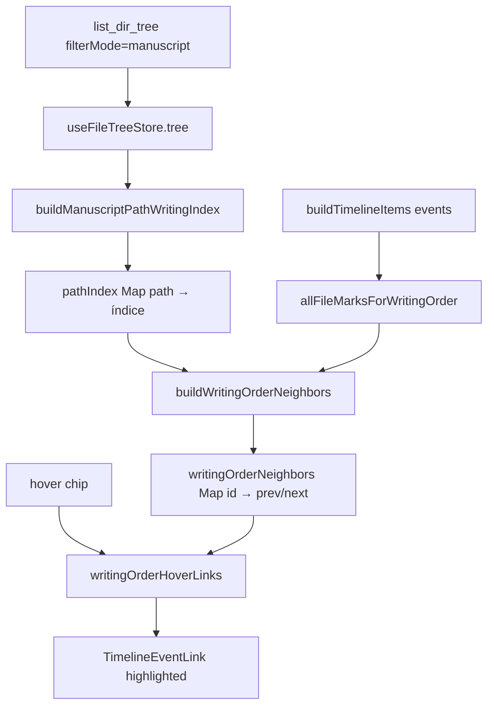

# FIX-009d — Auditoría: enlace erróneo archivo D → eventoTest

**Fecha:** 2026-06-11  
**Síntoma:** Al pasar el cursor sobre `eventoTest / evento1` (día 15), aparece un conector de lectura desde `archivo D` (día 27). La cadena A→B→C→D parece correcta, pero `evento1` recibe como `prev` la última marca de `linetest`.  
**Log analizado:** `_debug/logs/session-1781323873949-29056.ndjson`

---

## 1. Resumen ejecutivo

| Pregunta | Respuesta |
|----------|-----------|
| ¿Es un bug de dibujo/SVG? | **No.** Las líneas de hover son `TimelineEventLink` con datos de `writingOrderNeighbors`. |
| ¿El log ayuda a depurarlo? | **No.** No hay eventos `obs.timeline.*`; solo tabs del editor y bootstrap de auditoría. |
| ¿Por qué siguió fallando tras FIX-009c? | El fix anterior corrigió el merge alfabético, pero **`pathIndex` seguía vacío** en runtime porque el árbol del store no tiene nodo raíz `Manuscrito`. |
| Causa raíz | Desajuste entre forma del árbol (`list_dir_tree` en vista `manuscript`) y supuesto de `buildManuscriptPathWritingIndexFromTreeOnly` (buscaba `path === "Manuscrito"`). |
| Fix | Recorrer hijos top-level con path `Manuscrito/...` cuando no existe el nodo contenedor. |

---

## 2. Evidencia del log de sesión

Archivo: `session-1781323873949-29056.ndjson` (21 eventos).

Contenido relevante:

- Bootstrap de auditoría (`obs.system.audit.bootstrap`).
- Apertura/restauración de tabs del editor con rutas reales del proyecto.
- `obs.consistency.updated` sin issues.

**Rutas del manuscrito inferidas del log (orden de apertura de tabs):**

```
Manuscrito/Volumen 1/Capitulo 1/eventoTest.md
Manuscrito/carpeta en raíz/timeline test.md
Manuscrito/carpeta en raíz/saknjslakd/dndsknlsd.md
Manuscrito/linetest/archivo A.md … archivo D.md
```

**Lo que el log no registra:**

- Hover sobre chips de timeline (`hoveredTimelineMarkerId`).
- `pathIndex` calculado ni vecinos `{ prevId, nextId }`.
- Render de `writingOrderHoverLinks` / `eventLinks`.

Conclusión: el log actual **no es observable** para bugs de conectores de lectura. Ver §6.

---

## 3. Anatomía del síntoma en UI

Con ambos toggles activos:

- **Mostrar conectores de evento** → `buildEventSpanLinks`: solo enlaces intra-segmento (`segmentId` + `lane` iguales). No explica D→eventoTest entre archivos distintos.
- **Mostrar enlaces de lectura al pasar el cursor** → `writingOrderHoverLinks`: hasta 2 líneas (`prev`, `next`) según `buildWritingOrderNeighbors`.

En la captura, `eventoTest / evento1` está resaltado (hover). La línea larga desde `archivo D` encaja con:

```typescript
// prevId de evento1 === id de la última marca de archivo D
links.push({ fromItem: prev, toItem: hovered });
```

Es decir, la cadena global de escritura termina en `… → archivo D → evento1`, cuando debería ser `… → evento1 → … → archivo D` (sin `next` en D).

---

## 4. Cadena de datos (pipeline)



Punto de fallo histórico: **F** (`pathIndex` vacío o mal ordenado).

---

## 5. Causa raíz detallada

### 5.1 Forma del árbol en runtime

Backend (`src-tauri/src/fs/tree.rs`), vista `manuscript`:

```rust
TreeFilterMode::Manuscript => {
    read_children(project_root, &sub, "Manuscrito", &taxonomy)
}
```

Devuelve **hijos directos** con paths `Manuscrito/Volumen 1`, `Manuscrito/carpeta en raíz`, `Manuscrito/linetest`, **sin** nodo `{ path: "Manuscrito", children: [...] }`.

El store aplica `applyCustomOrder` con clave `"Manuscrito"` sobre ese array top-level — coherente con el explorador.

### 5.2 Supuesto roto en writingOrder.ts (pre-FIX-009d)

```typescript
const manuscriptRoot = tree.find(
  (node) => normalizePath(node.path) === MANUSCRIPT_ROOT,
);
if (manuscriptRoot?.children?.length) {
  walkFiles(manuscriptRoot.children, MANUSCRIPT_ROOT);
}
// Si no hay nodo "Manuscrito" → walkFiles NUNCA se ejecuta → pathIndex = {}
```

### 5.3 Consecuencia: índice vacío + fallback lexicográfico

Cuando `pathIndex.get(path)` devuelve `undefined`:

```typescript
pathIndex.get(path) ?? Number.MAX_SAFE_INTEGER
```

Todos los archivos comparten índice `MAX_SAFE_INTEGER`. El desempate es `localeCompare` en la ruta completa:

| Comparación | Resultado JS (`localeCompare`) |
|-------------|-------------------------------|
| `Manuscrito/carpeta…` vs `Manuscrito/linetest…` | carpeta **antes** |
| `Manuscrito/linetest…` vs `Manuscrito/Volumen…` | linetest **antes** (minúscula `l` < mayúscula `V`) |
| `Manuscrito/Volumen…/eventoTest` | **al final** |

Orden de archivos en cadena:

```
timeline test → sad → archivo A → B → C → D → eventoTest
```

Por eso `evento1.prevId` apunta a la última marca de `archivo D`.

### 5.4 Por qué el fix anterior (inyección virtual) no bastó

FIX-009c reemplazó merge alfabético por inyección en árbol virtual + DFS. Pero:

1. `findNodeInTree` **sí** encuentra archivos en el top-level filtrado → no se inyectan.
2. `walkFiles` seguía sin ejecutarse → índice vacío.
3. Los tests usaban árbol con nodo `Manuscrito` explícito → **no reproducían producción**.

---

## 6. Brecha de observabilidad

| Capa | Instrumentado | Gap |
|------|---------------|-----|
| Editor tabs | `obs.editor.tab.open` | OK |
| Explorador | `obs.explorer.tree.load` | OK (conteo nodos, no paths) |
| Timeline hover / orden escritura | — | **Sin eventos** |
| Consistencia FS | `obs.consistency.updated` | No cubre layout timeline |

**Recomendación (futuro):** evento debug `obs.timeline.writingOrder.index` con `{ pathIndexSize, hoveredId, prevId, nextId, treeShape: "filtered"|"wrapped" }` detrás de flag de auditoría.

---

## 7. Fix aplicado (FIX-009d)

En `writingOrder.ts`:

1. **`manuscriptTopLevelNodes(tree)`** — si no hay nodo `Manuscrito`, usa nodos cuyo path empieza por `Manuscrito/`.
2. **`manuscriptChildrenContainer(tree)`** — misma lógica para inyección de rutas virtuales.
3. **`buildManuscriptPathWritingIndexFromTreeOnly`** — llama `walkFiles(manuscriptTopLevelNodes(tree), "Manuscrito")`.

Tests nuevos:

- Árbol filtrado sin wrapper + `explorerOrder` → `eventoTest < timeline test < archivo D`.
- Regresión vecinos: hover lógico de `archivo D` sin `next` hacia `eventoTest`.

---

## 8. Comportamiento esperado tras el fix

Orden de escritura (según `explorerOrder` del proyecto):

```
eventoTest (evento1, EVENTO 2)
→ timeline test (+ inline)
→ dndsknlsd (sad)
→ archivo A → B → C → D
```

Hover:

| Chip | prev | next |
|------|------|------|
| evento1 | null o marca anterior en eventoTest | EVENTO 2 o siguiente archivo |
| archivo A | última marca de timeline test | archivo B |
| archivo D | archivo C | **null** |

---

## 9. Verificación manual

1. Recargar app (o reabrir timeline) para que `loadTree` repueble el store.
2. Activar «Mostrar enlaces de lectura al pasar el cursor».
3. Hover en **archivo D** → solo flecha hacia C (sin línea a eventoTest).
4. Hover en **evento1** → flecha hacia adelante (A o EVENTO 2), **no** desde D.

---

## 10. Archivos tocados

| Archivo | Cambio |
|---------|--------|
| `src/modules/timeline/writingOrder.ts` | Soporte árbol filtrado manuscript |
| `src/modules/timeline/writingOrder.test.ts` | Test árbol filtrado + regresión |
| `_docs2/specs/plans/Fase C/FIX-009d-audit-writing-order-path-index.md` | Este documento |

---

## 11. Lecciones

1. **Tests deben usar la misma forma de árbol que el backend** (vista filtrada vs árbol completo).
2. **`localeCompare` en rutas no sustituye orden del explorador** — solo era fallback cuando el índice fallaba.
3. **Los logs de sesión no sustituyen telemetría de feature** para bugs puramente visuales/de layout.
