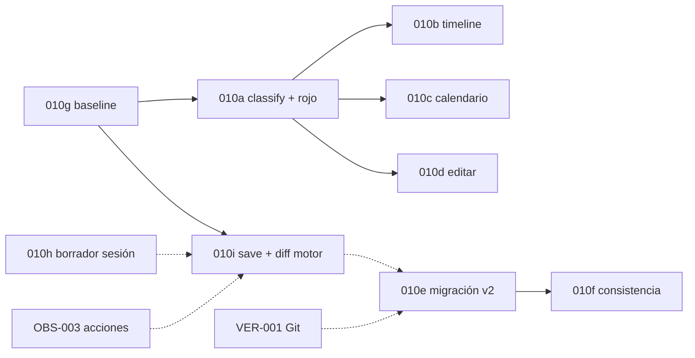

# FIX-010 — Épica 6.A: marcas de tiempo obsoletas (índice)

> **Estado épica:** ✅ **v1 cerrada** (jun 2026) · **Esfuerzo total:** Alto (acotado) · **Riesgo:** Medio · **v2:** [010e](FIX-010e-migration-wizard.md) pospuesto  
> **Lista maestra:** [`implementation-plan.md`](../../implementation-plan.md) Fase D · **Origen:** [`fix-backlog.md` §6.A](../../fix-backlog.md)  
> **No confundir con:** FIX-011 (evento WB huérfano · 6.B)

Este documento es el **índice** de la épica. El detalle de implementación vive en sub-planes **FIX-010a … 010i** (patrón FIX-009 / FIX-009a).

---

## 1. Problema (resumen)

1. Calendario **X** + marcas `{{time:17.1.0}}` válidas bajo X.
2. Usuario **sustituye** calendario (reset, blank, editar meses/días).
3. `rawTime` en disco/SQLite **no cambia** → puede quedar inválido u obsoleto bajo el calendario activo.

**Reglas de producto:** no crash · no ocultar marcas · chip **rojo** + tooltip · timeline **sin mover** posición X (solo rojo) · no borrar `rawTime` automáticamente.

---

## 2. Decisiones cerradas (D1–D6)

| ID | Decisión |
|----|----------|
| **D1** | Timeline: misma posición X; solo estilo rojo |
| **D2** | Sin carril «invalid» separado |
| **D3** | Editar marcas existentes (inline + barTags) |
| **D4** | Mes insertado jun–jul: ene–jun normal; `absoluteDay` ≠ baseline → rojo |
| **D5** | Migración A/B/C al cambiar calendario (confirmación explícita) |
| **D6** | Sin reescritura masiva silenciosa |

Detalle escenario mes insertado: [FIX-010a §3](FIX-010a-classify-red-chips.md#3-escenario-canónico--mes-insertado).

---

## 3. Sub-planes y dependencias



| ID | Plan | Alcance | Fase |
|----|------|---------|------|
| **010g** | [FIX-010g-calendar-baseline.md](FIX-010g-calendar-baseline.md) | `.narralith/calendar-baseline.json` · `structure_stale` tras reinicio | v1 · ✅ |
| **010a** | [FIX-010a-classify-red-chips.md](FIX-010a-classify-red-chips.md) | `classifyTimeTag` · chips rojos editor · i18n | v1 · ✅ |
| **010b** | [FIX-010b-timeline-stale-display.md](FIX-010b-timeline-stale-display.md) | Timeline visible · `displaySortKey` · SVG rojo | v1 · ✅ |
| **010c** | [FIX-010c-calendar-entries.md](FIX-010c-calendar-entries.md) | Vista calendario + mini-timeline · recarga post-reset | v1 · ✅ |
| **010d** | [FIX-010d-edit-time-tags.md](FIX-010d-edit-time-tags.md) | Clic chip → `TimeTagDialog` edit · §12 reset baseline | v1 · ✅ |
| **010h** | [FIX-010h-calendar-draft-persist.md](FIX-010h-calendar-draft-persist.md) | Borrador en sesión + diálogos unsaved | v1 · ✅ cerrado |
| **OBS-003** | [OBS-003-action-audit-log.md](OBS-003-action-audit-log.md) | Registro acciones UI (QA sin narrar pasos) | ✅ v1 · **010i desbloqueado** |
| **010i** | [FIX-010i-calendar-structural-diff.md](FIX-010i-calendar-structural-diff.md) | Motor diff + `reconcileBaseline` en save · UI diff **cancelada** | v1 · ✅ |
| **010e** | [FIX-010e-migration-wizard.md](FIX-010e-migration-wizard.md) | Asistente migración modos A/B/C + vista previa | v2 · **pospuesto** |
| **010f** | *(incluido en 010e)* | Panel consistencia fechas · re-ejecutar migración | v2 |
| **VER-001** | [`implementation-plan.md`](../../implementation-plan.md) | Historial Git roto · diff `calendar.json` | Era IV |

**Orden de implementación sugerido:** `010g → 010a → 010b → 010c → 010d → 010h → **OBS-003** → 010i → 010e`

**v1 sin 010e:** guardar calendario con diff estructural **no bloquea** el save; si `affectsTimeMarkers`, baseline **no avanza** ([010i](FIX-010i-calendar-structural-diff.md)) → marcas en **rojo** hasta edición manual ([010d](FIX-010d-edit-time-tags.md)) o wizard v2 ([010e](FIX-010e-migration-wizard.md), pospuesto).

> **Limitación v1 cerrada:** sin panel diff ni wizard. El usuario no ve lista pre-guardado de cambios estructurales; sí ve chips rojos tras guardar. Migración masiva A/B/C queda para v2.

---

## 4. Auditoría — pipeline (condensada)

```text
{{time:d.m.y}} → time_markers.raw_time + CalendarConfig
       → parseTimeTag (syntax) → TimeTagChip hoy: solo syntax ❌
       → parseDateString → sortKey null → agregadores DROP ❌
```

| Agregador | Problema |
|-----------|----------|
| `timelineModel.ts` | `if (sortKey === null) continue` |
| `calendarEntries.ts` | idem |
| `calendarMarkers.ts` / `lastProjectTime.ts` | skip null |

Auditoría completa (persistencia, stores, OBS): ver commit inicial jun 2026 o sub-planes por superficie.

**QA sesión:** `_debug/render-logs/ui-session-1781327199555-25692.ndjson` — reset/restaurar calendario sin crash; `markerCount: 9` estable; rojo no verificable en NDJSON.

---

## 5. Criterios de aceptación (épica)

### v1 (010g + 010a–d + 010h + 010i save) — ✅ cumplido

- Marcas inválidas/obsoletas **en rojo** en editor, timeline y calendario.
- Timeline: **misma posición X**; solo estilo destructive.
- `structure_stale` **persiste tras reinicio** (010g).
- Diálogo unsaved al navegar con calendario sucio (010h).
- Guardar con diff estructural que afecta marcas: `reconcileBaseline: false` (010i motor).
- Edición inline + barTag (010d).
- Tests + build verdes; guardado no borra obsoletos sin acción del usuario.

### v2 (010e + 010f)

- Asistente migración A/B/C con vista previa al guardar calendario.
- Panel consistencia + re-ejecutar migración.

Checklists QA por sub-plan; plantilla común:

| # | Acción | Plan |
|---|--------|------|
| R1–R2 | Reset blank → rojo | 010a |
| R3, R3b | Timeline posición + mes insertado | 010b, 010a |
| R4 | Calendario mensual | 010c |
| R4b–R4c | Editar chips | 010d |
| R4d | Editar calendario (quitar mes) → guardar → marcas **rojas**, no reposición silenciosa | 010i · QA `9020` |
| R8 | Reinicio → stale persiste | 010g |
| R9 | Diálogo unsaved calendario (sesión) | 010h |
| ~~R10~~ | ~~Toggle diff~~ | Cancelado (010i UI) |

---

## 6. Relación épica 6

| ID | Tema |
|----|------|
| **FIX-010** | Calendario sustituido → fechas obsoletas (**6.A**) |
| **FIX-011** | Evento borrado → WB huérfano (**6.B**); panel consistencia compartido en v2 |

---

## 7. Registro

| Fecha | Cambio |
|-------|--------|
| 2026-06-13 | Plan monolítico inicial + QA NDJSON |
| 2026-06-11 | D1–D6, baseline, migración, persistencia |
| 2026-06-11 | **Split** en índice + FIX-010a … 010i |
| 2026-06-11 | **010g, 010a** implementados · QA editor OK (usuario) |
| 2026-06-11 | **010b** implementado + hotfix congelamiento (`MAX_ABS_DAY`, `markerPlacement`) |
| 2026-06-11 | **010b** cerrado · QA sesión `8852`: timeline 9 marcas rojas, calendario sin freeze |
| 2026-06-11 | **010c** implementado + hotfix `eventSortKey` (crash pantalla blanca) |
| 2026-06-11 | **010c** cerrado · QA sesión `2156`: calendario año 15, 5 marcas obsoletas, grid rojo |
| 2026-06-11 | **010d §12** implementado · QA `5836`: baseline alineado tras reset plantilla |
| 2026-06-11 | **010d §13** · QA `19672`: editar calendario (quitar abril) reposiciona marcas en mayo mismo día · limitación v1 documentada |
| 2026-06-11 | **010d cerrado** · QA §8 D3 automatizado + build verde |
| 2026-06-11 | **010h ✅ cerrado** — dirty sesión + diálogos en shell |
| 2026-06-11 | **OBS-003 ✅** — registro acciones (commit `b77fa09`) |
| 2026-06-11 | **010i ✅ parcial** — `calendarStructuralDiff` + `reconcileBaseline` en `saveDraft`; UI diff cancelada |
| 2026-06-11 | **FIX-010 v1 ✅ cerrada** — 010e pospuesto v2 |

---

**Última actualización:** 2026-06-11 · **Épica v1 cerrada.** **v2 (opcional):** [010e](FIX-010e-migration-wizard.md) migración A/B/C · **Siguiente Fase D:** [FIX-011](FIX-011-*) o backlog §6.C
